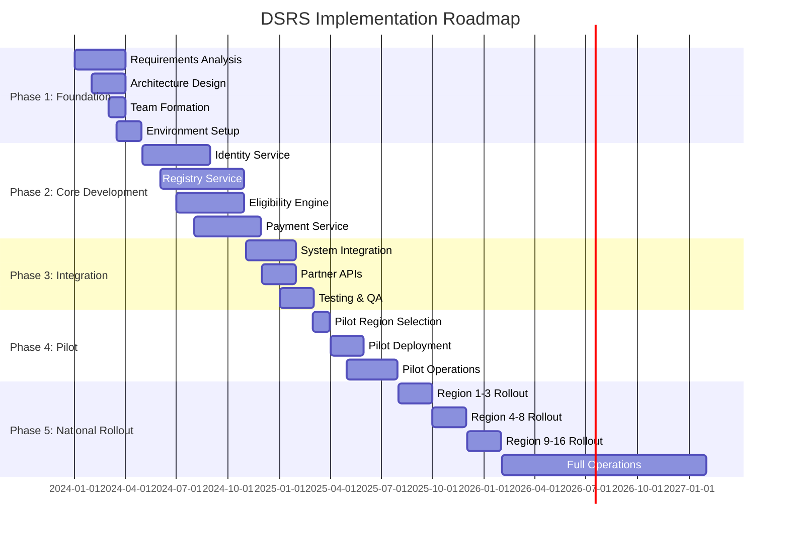

# Dynamic Social Registry System
## Complete Implementation Plan for Philippines DSWD

*A Comprehensive Guide to Building a World-Class Social Protection Platform*

---

# Table of Contents
- Executive Summary
- Chapter 1: Project Overview
- Chapter 2: Strategic Alignment
- Chapter 3: Technical Architecture
- Chapter 4: Microservices Design
- Chapter 5: Security Framework
- Chapter 6: Agile Implementation
- Chapter 7: DevOps Strategy
- Chapter 8: Quality Assurance
- Chapter 9: Project Phases
- Chapter 10: Milestones and Deliverables
- Chapter 11: Resource Management
- Chapter 12: Deployment Strategy
- Chapter 13: Change Management
- Chapter 14: Monitoring and Maintenance
- Chapter 15: Data Governance
- Chapter 16: Risk Management
- Chapter 17: Success Metrics

---

# Executive Summary

The Dynamic Social Registry System (DSRS) represents a transformative initiative for the Philippines Department of Social Welfare and Development (DSWD). This comprehensive implementation plan provides a detailed roadmap for creating a world-class social protection platform capable of serving millions of Filipino beneficiaries across the archipelago.

## Key Objectives

1. **Replace Listahanan** with a modern, dynamic registry system by 2026
2. **Serve 20+ million households** with real-time data management
3. **Integrate 15+ social programs** into a unified platform
4. **Achieve 99.9% system availability** with sub-second response times
5. **Reduce administrative costs by 30%** while improving targeting accuracy by 40%

## Investment Overview

- **Total Investment**: ₱18-25 billion over 5 years
- **Development Phase**: ₱8-12 billion (Years 1-3)
- **Operations & Maintenance**: ₱2-3 billion annually
- **Expected ROI**: 3:1 to 5:1 social return on investment

## Success Factors

- Strong political leadership and inter-agency coordination
- Adoption of agile development methodologies
- Cloud-native microservices architecture
- Comprehensive change management program
- Continuous monitoring and improvement

---

# Part I: Foundation

# Chapter 1: Project Overview

## 1.1 Vision Statement

To establish the Philippines as a global leader in social protection delivery through a cutting-edge Dynamic Social Registry System that ensures no Filipino is left behind, providing responsive, efficient, and dignified access to social services for all citizens.

## 1.2 Mission

Transform social protection delivery in the Philippines by:
- Building a unified, real-time registry serving all social programs
- Enabling data-driven decision making for poverty alleviation
- Providing seamless, citizen-centric service delivery
- Ensuring resilient response to shocks and emergencies
- Fostering transparency and accountability in social protection

## 1.3 Project Scope

### In Scope
- **Core Registry Platform**: Centralized beneficiary database and management system
- **Program Integration**: APIs and interfaces for 15+ social programs
- **Identity Management**: Integration with PhilSys and biometric systems
- **Payment Systems**: Digital payment infrastructure and mobile money integration
- **Analytics Platform**: Real-time dashboards and predictive analytics
- **Mobile Applications**: Citizen-facing and field worker applications
- **Disaster Response Module**: Shock-responsive social protection capabilities

### Out of Scope
- Legacy system decommissioning (separate project)
- Physical infrastructure upgrades (handled by partner agencies)
- Program-specific business logic (maintained by respective agencies)

## 1.4 Stakeholder Analysis

### Primary Stakeholders
- **DSWD**: Lead implementing agency
- **Beneficiaries**: 20+ million Filipino households
- **Social Workers**: 10,000+ field personnel
- **Partner Agencies**: DOH, DepEd, DOLE, DA, DILG

### Secondary Stakeholders
- **Technology Partners**: Cloud providers, system integrators
- **Financial Institutions**: Banks, mobile money operators
- **Civil Society**: NGOs, community organizations
- **International Partners**: World Bank, ADB, UN agencies

## 1.5 Success Criteria

### Technical Success Metrics
- System availability: 99.9% uptime
- Response time: <500ms for 95% of transactions
- Data accuracy: 98% validation rate
- Integration success: 15+ programs connected
- Mobile coverage: 85% of barangays accessible

### Business Success Metrics
- Beneficiary coverage: 95% of eligible households
- Processing time: 80% reduction in enrollment time
- Cost efficiency: 30% reduction in administrative costs
- User satisfaction: >85% satisfaction rate
- Fraud reduction: 50% decrease in duplicate registrations

---

# Chapter 2: Strategic Alignment

## 2.1 National Development Goals

### Philippine Development Plan 2023-2028 Alignment
The DSRS directly supports the following PDP strategic objectives:
- **Social Protection Floor**: Universal coverage for vulnerable populations
- **Digital Transformation**: Government services modernization
- **Inclusive Growth**: Poverty reduction and social mobility
- **Disaster Resilience**: Climate-adaptive social protection

### Sustainable Development Goals
- **SDG 1**: No Poverty - Enhanced targeting and coverage
- **SDG 2**: Zero Hunger - Food security program integration
- **SDG 3**: Good Health - Health insurance enrollment
- **SDG 10**: Reduced Inequalities - Inclusive service delivery

## 2.2 International Best Practices Integration

### Learning from Global Leaders

#### Brazil's Cadastro Único
- **Adoption**: Unified registry architecture
- **Scale**: Multi-program integration framework
- **Innovation**: Continuous enrollment model

#### Indonesia's Unified Database
- **Relevance**: Archipelagic deployment strategies
- **Technology**: Mobile-first approach
- **Operations**: Decentralized service delivery

#### India's Aadhaar Integration
- **Digital ID**: Biometric authentication
- **Payments**: Direct benefit transfer
- **Scale**: Cloud infrastructure patterns

## 2.3 Organizational Readiness

### Current State Assessment
- **Strengths**: 4Ps implementation experience, PhilSys rollout, i-Registro pilot
- **Weaknesses**: Manual processes, limited IT capacity, siloed data
- **Opportunities**: Digital infrastructure growth, political support, international funding
- **Threats**: Connectivity challenges, resistance to change, cybersecurity risks

### Transformation Requirements
1. **Organizational Restructuring**: Create dedicated DSRS Management Office
2. **Capacity Building**: Train 5,000+ staff on new systems
3. **Process Reengineering**: Digitize 100+ business processes
4. **Culture Change**: Shift from paper-based to digital-first mindset

---

# Part II: System Architecture

# Chapter 3: Technical Architecture

## 3.1 High-Level Architecture

```
┌─────────────────────────────────────────────────────────────┐
│                     Presentation Layer                       │
├─────────────┬────────────┬────────────┬────────────────────┤
│  Web Portal │ Mobile App │  USSD/SMS  │  Partner Systems   │
└─────────────┴────────────┴────────────┴────────────────────┘
                            │
┌─────────────────────────────────────────────────────────────┐
│                      API Gateway Layer                       │
├──────────────────────────────────────────────────────────────┤
│         Kong API Gateway with OAuth2/JWT Security           │
└──────────────────────────────────────────────────────────────┘
                            │
┌─────────────────────────────────────────────────────────────┐
│                   Microservices Layer                        │
├──────────┬──────────┬──────────┬──────────┬────────────────┤
│ Identity │ Registry │ Eligibility│ Payment │   Analytics    │
│ Service  │ Service  │  Service  │ Service │    Service     │
├──────────┼──────────┼──────────┼──────────┼────────────────┤
│ Workflow │ Document │Notification│ Audit  │   Reporting    │
│ Service  │ Service  │  Service  │ Service │    Service     │
└──────────┴──────────┴──────────┴──────────┴────────────────┘
                            │
┌─────────────────────────────────────────────────────────────┐
│                      Data Layer                              │
├──────────────┬──────────────┬──────────────┬────────────────┤
│ PostgreSQL   │   MongoDB    │   Redis      │  Data Lake     │
│ (Relational) │  (Document)  │   (Cache)    │  (Analytics)   │
└──────────────┴──────────────┴──────────────┴────────────────┘
                            │
┌─────────────────────────────────────────────────────────────┐
│                  Infrastructure Layer                        │
├──────────────────────────────────────────────────────────────┤
│         Google Cloud Platform / Multi-Cloud Setup           │
└──────────────────────────────────────────────────────────────┘
```

## 3.2 Technology Stack

### Core Technologies

#### Programming Languages
- **Backend**: Java 17 (Spring Boot 3.x), Python 3.11 (FastAPI)
- **Frontend**: TypeScript 5.x, React 18, Next.js 14
- **Mobile**: React Native, Flutter
- **Data Processing**: Apache Spark, Python

#### Frameworks and Libraries
- **API Framework**: Spring Boot, FastAPI
- **Microservices**: Spring Cloud, Netflix OSS
- **Authentication**: Spring Security, OAuth2, JWT
- **Data Access**: Spring Data JPA, Hibernate, PyMongo
- **Testing**: JUnit 5, Mockito, Pytest, Jest

### Database Technologies

#### Primary Databases
- **PostgreSQL 15**: Transactional data, beneficiary records
- **MongoDB 6**: Document storage, unstructured data
- **Redis 7**: Caching, session management
- **Elasticsearch 8**: Full-text search, logging

#### Data Warehouse
- **Google BigQuery**: Analytics and reporting
- **Apache Spark**: ETL processing
- **Apache Kafka**: Event streaming

### Cloud Infrastructure

#### Primary Cloud Provider: Google Cloud Platform
- **Compute**: Google Kubernetes Engine (GKE)
- **Storage**: Cloud Storage, Persistent Disks
- **Database**: Cloud SQL, Cloud Spanner
- **Analytics**: BigQuery, Dataflow
- **AI/ML**: Vertex AI, AutoML

#### Backup Cloud Provider: Microsoft Azure
- **Disaster Recovery**: Azure Site Recovery
- **Backup Storage**: Azure Blob Storage
- **Hybrid Connectivity**: Azure ExpressRoute

## 3.3 System Components

### 3.3.1 Identity Management Service

**Purpose**: Manage user authentication and authorization across the system

**Key Features**:
- PhilSys integration for national ID verification
- Multi-factor authentication (SMS, OTP, Biometric)
- Role-based access control (RBAC)
- Single Sign-On (SSO) capability
- Session management and token refresh

**Technology**:
- Keycloak for identity management
- Spring Security for application security
- JWT for token management
- Redis for session storage

### 3.3.2 Registry Service

**Purpose**: Core beneficiary data management and household profiling

**Key Features**:
- Household registration and updates
- Member relationship management
- Proxy Means Testing (PMT) calculation
- Data validation and deduplication
- Historical data tracking

**Technology**:
- PostgreSQL for relational data
- MongoDB for flexible schemas
- Apache Kafka for event streaming
- Elasticsearch for search capabilities

### 3.3.3 Eligibility Service

**Purpose**: Determine program eligibility based on configurable rules

**Key Features**:
- Rule engine for eligibility criteria
- Multi-program eligibility assessment
- Automatic recertification scheduling
- Appeals and grievance handling
- Eligibility history tracking

**Technology**:
- Drools rule engine
- Spring Boot microservice
- PostgreSQL for rule storage
- Redis for caching results

### 3.3.4 Payment Service

**Purpose**: Manage benefit disbursements and financial transactions

**Key Features**:
- Payment schedule management
- Multiple payment channels (bank, mobile money, cash)
- Transaction reconciliation
- Fraud detection algorithms
- Payment history and reporting

**Technology**:
- Spring Boot with Spring Batch
- Integration with GCash, PayMaya APIs
- PostgreSQL for transaction records
- Apache Kafka for payment events

### 3.3.5 Analytics Service

**Purpose**: Provide insights and decision support through data analysis

**Key Features**:
- Real-time dashboards
- Predictive analytics for vulnerability
- Geographic information system (GIS) mapping
- Custom report generation
- Data export capabilities

**Technology**:
- Google BigQuery for data warehouse
- Apache Superset for visualization
- Python with Pandas/NumPy for analysis
- TensorFlow for ML models

## 3.4 Integration Architecture

### 3.4.1 API Gateway Design

```yaml
API Gateway Configuration:
  Provider: Kong Gateway
  Features:
    - Rate Limiting: 1000 requests/minute per client
    - Authentication: OAuth2, API Keys, JWT
    - Load Balancing: Round-robin, least-connections
    - Circuit Breaker: 5 failures trigger 30-second timeout
    - Request/Response Transformation
    - API Versioning: /api/v1, /api/v2
    - Monitoring: Prometheus metrics
    - Logging: Centralized with ELK stack
```

### 3.4.2 Service Mesh Implementation

```yaml
Service Mesh: Istio
  Traffic Management:
    - Canary Deployments: 10% traffic to new versions
    - Blue-Green Deployments
    - Retry Logic: 3 attempts with exponential backoff
    - Timeout: 30 seconds default
  Security:
    - mTLS between services
    - Authorization policies
    - Network segmentation
  Observability:
    - Distributed tracing with Jaeger
    - Metrics with Prometheus
    - Service dependency mapping
```

### 3.4.3 External System Integration

#### PhilSys Integration
```json
{
  "integration_type": "REST_API",
  "authentication": "OAuth2",
  "endpoints": {
    "verify_identity": "/api/v1/verify",
    "get_demographics": "/api/v1/person/{pcn}",
    "biometric_match": "/api/v1/biometric/match"
  },
  "sla": {
    "availability": "99.9%",
    "response_time": "< 2 seconds",
    "throughput": "1000 TPS"
  }
}
```

#### Partner Agency APIs
- **PhilHealth**: Member enrollment and verification
- **DepEd**: Student enrollment and attendance
- **DOLE**: Employment program beneficiaries
- **LandBank**: Payment disbursement
- **Mobile Money**: GCash, PayMaya integration

---

# Chapter 4: Microservices Design

## 4.1 Microservices Architecture Principles

### Design Principles
1. **Single Responsibility**: Each service handles one business capability
2. **Autonomous Teams**: Services owned by dedicated teams
3. **Decentralized Data**: Each service manages its own database
4. **Smart Endpoints**: Business logic in services, not middleware
5. **Design for Failure**: Assume failures will occur
6. **Evolutionary Design**: Services can evolve independently

### Service Boundaries
```
┌─────────────────────────────────────────────────────────┐
│                   Business Capabilities                  │
├──────────────┬────────────────┬─────────────────────────┤
│   Identity   │   Registration │      Benefits           │
│  Management  │   & Profiling  │    Administration       │
├──────────────┼────────────────┼─────────────────────────┤
│   Payments   │   Compliance   │    Analytics &          │
│   & Finance  │   & Audit      │    Reporting            │
└──────────────┴────────────────┴─────────────────────────┘
```

## 4.2 Core Microservices Catalog

### 4.2.1 Identity and Access Management

```java
@RestController
@RequestMapping("/api/v1/identity")
public class IdentityController {
    
    @PostMapping("/authenticate")
    public ResponseEntity<TokenResponse> authenticate(
            @RequestBody AuthRequest request) {
        // PhilSys integration
        // Multi-factor authentication
        // JWT token generation
        return ResponseEntity.ok(tokenResponse);
    }
    
    @GetMapping("/profile/{userId}")
    @PreAuthorize("hasRole('USER')")
    public ResponseEntity<UserProfile> getProfile(
            @PathVariable String userId) {
        // Retrieve user profile
        // Apply data privacy rules
        return ResponseEntity.ok(profile);
    }
}
```

### 4.2.2 Household Registry Service

```java
@Service
@Transactional
public class HouseholdService {
    
    private final HouseholdRepository repository;
    private final EventPublisher eventPublisher;
    private final ValidationService validator;
    
    public HouseholdRegistration registerHousehold(
            HouseholdData data) {
        // Validate household data
        validator.validate(data);
        
        // Check for duplicates
        deduplicationService.check(data);
        
        // Calculate PMT score
        Float pmtScore = pmtCalculator.calculate(data);
        
        // Save to database
        Household household = repository.save(
            mapper.toEntity(data, pmtScore));
        
        // Publish event
        eventPublisher.publish(
            new HouseholdRegisteredEvent(household));
        
        return mapper.toRegistration(household);
    }
}
```

### 4.2.3 Eligibility Engine

```python
from drools import DroolsEngine
from typing import List, Dict

class EligibilityService:
    def __init__(self):
        self.rule_engine = DroolsEngine()
        self.cache = RedisCache()
    
    async def assess_eligibility(
        self, 
        household_id: str,
        programs: List[str]
    ) -> Dict[str, bool]:
        
        # Check cache first
        cached = await self.cache.get(f"elig:{household_id}")
        if cached:
            return cached
        
        # Load household data
        household = await self.get_household(household_id)
        
        # Run rules engine
        results = {}
        for program in programs:
            rules = await self.load_rules(program)
            eligible = self.rule_engine.evaluate(
                household, rules
            )
            results[program] = eligible
        
        # Cache results
        await self.cache.set(
            f"elig:{household_id}", 
            results, 
            ttl=3600
        )
        
        return results
```

### 4.2.4 Payment Processing Service

```java
@Component
public class PaymentProcessor {
    
    private final PaymentGateway gateway;
    private final TransactionRepository repository;
    private final FraudDetector fraudDetector;
    
    @Retryable(maxAttempts = 3, backoff = @Backoff(delay = 1000))
    public PaymentResult processPayment(PaymentRequest request) {
        
        // Fraud detection
        RiskScore risk = fraudDetector.assess(request);
        if (risk.isHigh()) {
            return PaymentResult.rejected("High risk transaction");
        }
        
        // Process payment
        try {
            PaymentResponse response = gateway.process(request);
            
            // Save transaction
            Transaction transaction = Transaction.builder()
                .beneficiaryId(request.getBeneficiaryId())
                .amount(request.getAmount())
                .status(response.getStatus())
                .reference(response.getReference())
                .build();
            
            repository.save(transaction);
            
            // Publish event
            eventBus.publish(new PaymentProcessedEvent(transaction));
            
            return PaymentResult.success(transaction);
            
        } catch (PaymentException e) {
            return PaymentResult.failed(e.getMessage());
        }
    }
}
```

## 4.3 Service Communication Patterns

### 4.3.1 Synchronous Communication

```yaml
REST API Communication:
  Protocol: HTTP/2
  Format: JSON
  Authentication: Bearer Token (JWT)
  Timeout: 30 seconds
  Retry Policy:
    max_attempts: 3
    backoff: exponential
    initial_delay: 100ms
    max_delay: 2s
  Circuit Breaker:
    failure_threshold: 5
    timeout: 30s
    half_open_requests: 3
```

### 4.3.2 Asynchronous Communication

```yaml
Event-Driven Architecture:
  Message Broker: Apache Kafka
  Topics:
    - household.registered
    - eligibility.determined  
    - payment.processed
    - document.uploaded
  Patterns:
    - Event Sourcing
    - CQRS
    - Saga Pattern
  Delivery Guarantee: At-least-once
  Retention: 7 days
```

### 4.3.3 Saga Pattern Implementation

```java
@Component
@Saga
public class BenefitEnrollmentSaga {
    
    @StartSaga
    @SagaOrchestrationStart
    public void handle(EnrollmentRequestedEvent event) {
        // Step 1: Verify identity
        commandGateway.send(new VerifyIdentityCommand(
            event.getBeneficiaryId()
        ));
    }
    
    @SagaEventHandler
    public void handle(IdentityVerifiedEvent event) {
        // Step 2: Check eligibility
        commandGateway.send(new CheckEligibilityCommand(
            event.getBeneficiaryId(),
            event.getProgramId()
        ));
    }
    
    @SagaEventHandler
    public void handle(EligibilityConfirmedEvent event) {
        // Step 3: Enroll in program
        commandGateway.send(new EnrollBeneficiaryCommand(
            event.getBeneficiaryId(),
            event.getProgramId()
        ));
    }
    
    @EndSaga
    @SagaEventHandler
    public void handle(EnrollmentCompletedEvent event) {
        // Saga completed successfully
        log.info("Enrollment completed for beneficiary: {}", 
            event.getBeneficiaryId());
    }
    
    @SagaEventHandler
    public void handle(EnrollmentFailedEvent event) {
        // Compensating transaction
        commandGateway.send(new RollbackEnrollmentCommand(
            event.getBeneficiaryId()
        ));
    }
}
```

## 4.4 Data Management Strategy

### 4.4.1 Database per Service

```sql
-- Identity Service Database
CREATE DATABASE identity_service;
CREATE TABLE users (
    id UUID PRIMARY KEY,
    philsys_number VARCHAR(12) UNIQUE,
    username VARCHAR(100) UNIQUE,
    email VARCHAR(255),
    phone_number VARCHAR(20),
    created_at TIMESTAMP DEFAULT CURRENT_TIMESTAMP
);

-- Registry Service Database  
CREATE DATABASE registry_service;
CREATE TABLE households (
    id UUID PRIMARY KEY,
    household_number VARCHAR(20) UNIQUE,
    region_code VARCHAR(10),
    province_code VARCHAR(10),
    municipality_code VARCHAR(10),
    barangay_code VARCHAR(10),
    pmt_score DECIMAL(5,2),
    status VARCHAR(20),
    created_at TIMESTAMP DEFAULT CURRENT_TIMESTAMP
);

-- Payment Service Database
CREATE DATABASE payment_service;
CREATE TABLE transactions (
    id UUID PRIMARY KEY,
    beneficiary_id UUID,
    amount DECIMAL(10,2),
    payment_method VARCHAR(50),
    status VARCHAR(20),
    reference_number VARCHAR(100),
    processed_at TIMESTAMP
);
```

### 4.4.2 Data Synchronization

```python
class DataSyncService:
    def __init__(self):
        self.cdc = ChangeDataCapture()
        self.kafka = KafkaProducer()
    
    async def sync_household_changes(self):
        """Sync household changes across services"""
        
        changes = await self.cdc.capture_changes('households')
        
        for change in changes:
            event = self.create_event(change)
            
            # Publish to Kafka
            await self.kafka.send(
                'household.changes',
                key=change.household_id,
                value=event
            )
            
            # Update materialized views
            await self.update_views(change)
    
    def create_event(self, change):
        return {
            'event_id': str(uuid.uuid4()),
            'event_type': change.operation,
            'household_id': change.household_id,
            'data': change.data,
            'timestamp': datetime.utcnow().isoformat()
        }
```

---

# Chapter 5: Security Framework

## 5.1 Security Architecture

### 5.1.1 Defense in Depth Strategy

```
┌─────────────────────────────────────────────────────────┐
│                 Layer 1: Perimeter Security              │
│          (WAF, DDoS Protection, CDN)                     │
├─────────────────────────────────────────────────────────┤
│                 Layer 2: Network Security                │
│          (VPC, Firewall, Network Segmentation)           │
├─────────────────────────────────────────────────────────┤
│                 Layer 3: Application Security            │
│          (OAuth2, JWT, API Gateway)                      │
├─────────────────────────────────────────────────────────┤
│                 Layer 4: Data Security                   │
│          (Encryption, Tokenization, DLP)                 │
├─────────────────────────────────────────────────────────┤
│                 Layer 5: Monitoring & Response           │
│          (SIEM, SOC, Incident Response)                  │
└─────────────────────────────────────────────────────────┘
```

### 5.1.2 Zero Trust Architecture

```yaml
Zero Trust Principles:
  Never Trust, Always Verify:
    - Continuous authentication
    - Device trust verification
    - Location-based access control
  
  Least Privilege Access:
    - Role-based access control (RBAC)
    - Attribute-based access control (ABAC)
    - Just-in-time access provisioning
  
  Assume Breach:
    - Network segmentation
    - Microsegmentation
    - Lateral movement prevention
  
  Verify Explicitly:
    - Multi-factor authentication
    - Risk-based authentication
    - Continuous monitoring
```

## 5.2 Authentication and Authorization

### 5.2.1 OAuth2 Implementation

```java
@Configuration
@EnableAuthorizationServer
public class OAuth2AuthorizationServerConfig 
        extends AuthorizationServerConfigurerAdapter {
    
    @Override
    public void configure(ClientDetailsServiceConfigurer clients) 
            throws Exception {
        clients.inMemory()
            .withClient("web-client")
            .secret(passwordEncoder.encode("secret"))
            .authorizedGrantTypes(
                "authorization_code", 
                "refresh_token",
                "password"
            )
            .scopes("read", "write", "admin")
            .accessTokenValiditySeconds(3600)
            .refreshTokenValiditySeconds(86400)
            .and()
            .withClient("mobile-client")
            .secret(passwordEncoder.encode("mobile-secret"))
            .authorizedGrantTypes("password", "refresh_token")
            .scopes("read", "write")
            .accessTokenValiditySeconds(7200);
    }
    
    @Override
    public void configure(
            AuthorizationServerEndpointsConfigurer endpoints) {
        endpoints
            .tokenStore(jwtTokenStore())
            .accessTokenConverter(jwtAccessTokenConverter())
            .authenticationManager(authenticationManager)
            .userDetailsService(userDetailsService);
    }
}
```

### 5.2.2 JWT Token Management

```java
@Component
public class JwtTokenProvider {
    
    @Value("${jwt.secret}")
    private String jwtSecret;
    
    @Value("${jwt.expiration}")
    private int jwtExpiration;
    
    public String generateToken(Authentication authentication) {
        UserPrincipal userPrincipal = 
            (UserPrincipal) authentication.getPrincipal();
        
        Date expiryDate = new Date(
            System.currentTimeMillis() + jwtExpiration
        );
        
        Map<String, Object> claims = new HashMap<>();
        claims.put("sub", userPrincipal.getId());
        claims.put("email", userPrincipal.getEmail());
        claims.put("roles", userPrincipal.getAuthorities());
        claims.put("philsys", userPrincipal.getPhilsysNumber());
        
        return Jwts.builder()
            .setClaims(claims)
            .setIssuedAt(new Date())
            .setExpiration(expiryDate)
            .signWith(SignatureAlgorithm.HS512, jwtSecret)
            .compact();
    }
    
    public boolean validateToken(String token) {
        try {
            Jwts.parser()
                .setSigningKey(jwtSecret)
                .parseClaimsJws(token);
            return true;
        } catch (JwtException | IllegalArgumentException e) {
            log.error("Invalid JWT token: {}", e.getMessage());
            return false;
        }
    }
}
```

### 5.2.3 Multi-Factor Authentication

```python
class MFAService:
    def __init__(self):
        self.otp_service = OTPService()
        self.sms_service = SMSService()
        self.biometric_service = BiometricService()
    
    async def initiate_mfa(
        self, 
        user_id: str,
}
```

### 8.1.3 Performance Testing

```python
# Locust performance test script
from locust import HttpUser, task, between
import random
import json

class DSRSUser(HttpUser):
    wait_time = between(1, 3)
    
    def on_start(self):
        """Login and get auth token"""
        response = self.client.post("/api/v1/auth/login", json={
            "username": "testuser",
            "password": "testpass"
        })
        self.token = response.json()["access_token"]
        self.headers = {"Authorization": f"Bearer {self.token}"}
    
    @task(3)
    def search_household(self):
        """Search for household - most common operation"""
        household_id = random.randint(1000000, 9999999)
        self.client.get(
            f"/api/v1/households/{household_id}",
            headers=self.headers,
            name="/api/v1/households/[id]"
        )
    
    @task(2)
    def check_eligibility(self):
        """Check program eligibility"""
        household_id = random.randint(1000000, 9999999)
        self.client.post(
            "/api/v1/eligibility/check",
            json={
                "household_id": household_id,
                "programs": ["4PS", "UCT", "KALAHI"]
            },
            headers=self.headers
        )
    
    @task(1)
    def register_household(self):
        """Register new household - less frequent"""
        data = {
            "head_name": f"Test User {random.randint(1, 10000)}",
            "address": "Test Address",
            "member_count": random.randint(1, 10),
            "monthly_income": random.randint(5000, 20000)
        }
        self.client.post(
            "/api/v1/households",
            json=data,
            headers=self.headers
        )

# Performance test configuration
# locust -f performance_test.py --host=https://api.dsrs.gov.ph
# --users=1000 --spawn-rate=50 --time=10m
```

## 8.2 Security Testing

### 8.2.1 Security Test Automation

```yaml
# OWASP ZAP Security Test Configuration
apiVersion: batch/v1
kind: Job
metadata:
  name: security-scan
spec:
  template:
    spec:
      containers:
      - name: owasp-zap
        image: owasp/zap2docker-stable
        command:
          - zap-baseline.py
          - -t
          - https://staging.dsrs.gov.ph
          - -r
          - security-report.html
          - -J
          - security-report.json
          - -I
          - -x
          - security-report.xml
        volumeMounts:
        - name: reports
          mountPath: /zap/wrk
      volumes:
      - name: reports
        persistentVolumeClaim:
          claimName: security-reports-pvc
      restartPolicy: Never
```

### 8.2.2 Penetration Testing Checklist

```python
class SecurityTestSuite:
    def __init__(self):
        self.vulnerabilities = []
        
    def test_authentication(self):
        """Test authentication vulnerabilities"""
        tests = [
            self.test_sql_injection,
            self.test_brute_force,
            self.test_session_fixation,
            self.test_password_policy,
            self.test_account_lockout
        ]
        
        for test in tests:
            result = test()
            if not result.passed:
                self.vulnerabilities.append(result)
    
    def test_sql_injection(self):
        """Test for SQL injection vulnerabilities"""
        payloads = [
            "' OR '1'='1",
            "'; DROP TABLE users; --",
            "1' UNION SELECT * FROM users--"
        ]
        
        for payload in payloads:
            response = self.make_request(
                "/api/v1/search",
                params={"q": payload}
            )
            
            if self.detect_sql_error(response):
                return TestResult(
                    passed=False,
                    vulnerability="SQL Injection",
                    severity="CRITICAL",
                    endpoint="/api/v1/search"
                )
        
        return TestResult(passed=True)
    
    def test_xss(self):
        """Test for XSS vulnerabilities"""
        payloads = [
            "<script>alert('XSS')</script>",
            "",
            "javascript:alert('XSS')"
        ]
        
        for payload in payloads:
            response = self.make_request(
                "/api/v1/profile",
                data={"name": payload}
            )
            
            if payload in response.text:
                return TestResult(
                    passed=False,
                    vulnerability="Cross-Site Scripting",
                    severity="HIGH",
                    endpoint="/api/v1/profile"
                )
        
        return TestResult(passed=True)
```

## 8.3 Quality Metrics

### 8.3.1 Code Quality Standards

```yaml
SonarQube Quality Gates:
  Coverage:
    - Overall: >= 80%
    - New Code: >= 85%
    
  Maintainability:
    - Technical Debt Ratio: < 5%
    - Code Smells: < 100
    
  Reliability:
    - Bugs: 0
    - Critical Issues: 0
    
  Security:
    - Vulnerabilities: 0
    - Security Hotspots: < 5
    
  Duplications:
    - Duplicated Lines: < 3%
    - Duplicated Blocks: < 10
```

### 8.3.2 Quality Dashboard

```python
class QualityMetricsCollector:
    def __init__(self):
        self.metrics = {}
        
    def collect_metrics(self):
        """Collect quality metrics from various sources"""
        
        # Code coverage from JaCoCo
        self.metrics['code_coverage'] = self.get_jacoco_coverage()
        
        # Static analysis from SonarQube
        self.metrics['sonar_metrics'] = self.get_sonar_metrics()
        
        # Test results from Jenkins
        self.metrics['test_results'] = self.get_test_results()
        
        # Performance metrics from JMeter
        self.metrics['performance'] = self.get_performance_metrics()
        
        # Security scan from OWASP ZAP
        self.metrics['security'] = self.get_security_scan_results()
        
        return self.metrics
    
    def generate_quality_report(self):
        """Generate comprehensive quality report"""
        
        metrics = self.collect_metrics()
        
        report = {
            'timestamp': datetime.utcnow().isoformat(),
            'summary': {
                'quality_score': self.calculate_quality_score(metrics),
                'status': self.determine_status(metrics),
                'trend': self.calculate_trend()
            },
            'details': metrics,
            'recommendations': self.generate_recommendations(metrics)
        }
        
        return report
    
    def calculate_quality_score(self, metrics):
        """Calculate overall quality score"""
        
        weights = {
            'coverage': 0.25,
            'bugs': 0.20,
            'vulnerabilities': 0.25,
            'performance': 0.15,
            'maintainability': 0.15
        }
        
        score = 0
        score += weights['coverage'] * metrics['code_coverage']['overall']
        score += weights['bugs'] * (100 - metrics['sonar_metrics']['bugs'])
        score += weights['vulnerabilities'] * (100 - metrics['security']['vulnerabilities'])
        score += weights['performance'] * metrics['performance']['score']
        score += weights['maintainability'] * metrics['sonar_metrics']['maintainability']
        
        return round(score, 2)
```

---

# Part IV: Implementation Roadmap

# Chapter 9: Project Phases

## 9.1 Phase Overview

### 9.1.1 Implementation Timeline



## 9.2 Phase 1: Foundation (Q1-Q2 2024)

### 9.2.1 Objectives
- Establish project governance structure
- Complete detailed requirements analysis
- Design system architecture
- Form and train development teams
- Set up development infrastructure

### 9.2.2 Key Deliverables

```yaml
Phase 1 Deliverables:
  Documentation:
    - Requirements Specification Document
    - System Architecture Document
    - API Specification
    - Data Model Design
    - Security Framework
    
  Infrastructure:
    - Development Environment
    - CI/CD Pipeline
    - Cloud Accounts
    - Source Code Repository
    - Project Management Tools
    
  Organization:
    - Project Management Office
    - Agile Teams
    - Steering Committee
    - Technical Advisory Board
    
  Partnerships:
    - Cloud Provider Agreement
    - System Integrator Contract
    - Payment Provider MOUs
```

### 9.2.3 Success Criteria
- Architecture approved by technical review board
- All teams staffed at 90% capacity
- Development environment operational
- CI/CD pipeline processing builds
- Requirements sign-off from stakeholders

## 9.3 Phase 2: Core Development (Q2 2024 - Q1 2025)

### 9.3.1 Development Sprints

```python
class SprintPlan:
    def __init__(self):
        self.sprints = self.define_sprints()
    
    def define_sprints(self):
        return [
            Sprint(1, "Identity Service Foundation",
                ["User registration", "PhilSys integration", "Authentication"]),
            Sprint(2, "Identity Service Security",
                ["MFA implementation", "OAuth2 setup", "JWT tokens"]),
            Sprint(3, "Registry Service Core",
                ["Household registration", "Member management", "PMT calculation"]),
            Sprint(4, "Registry Service Validation",
                ["Deduplication", "Data validation", "Audit trail"]),
            Sprint(5, "Eligibility Engine Rules",
                ["Rule engine setup", "Program criteria", "Decision logic"]),
            Sprint(6, "Eligibility Engine Integration",
                ["API development", "Caching layer", "Performance optimization"]),
            Sprint(7, "Payment Service Core",
                ["Payment scheduling", "Transaction management", "Reconciliation"]),
            Sprint(8, "Payment Service Channels",
                ["Bank integration", "Mobile money", "Cash distribution"]),
            Sprint(9, "Analytics Foundation",
                ["Data warehouse", "ETL pipelines", "Basic dashboards"]),
            Sprint(10, "Analytics Advanced",
                ["Predictive models", "GIS integration", "Custom reports"])
        ]
```

### 9.3.2 MVP Definition

```yaml
Minimum Viable Product:
  Core Features:
    Identity:
      - Basic authentication
      - User management
      - Role-based access
      
    Registry:
      - Household registration
      - Search and update
      - Basic validation
      
    Eligibility:
      - 4Ps eligibility check
      - Rule configuration
      - Decision history
      
    Payments:
      - Payment scheduling
      - Bank transfers
      - Transaction records
      
  Non-MVP Features (Future):
    - Advanced analytics
    - Predictive modeling
    - Blockchain integration
    - AI-powered fraud detection
    - Voice/chat interfaces
```

## 9.4 Phase 3: Integration (Q1-Q2 2025)

### 9.4.1 Integration Plan

```java
@Configuration
public class IntegrationConfig {
    
    @Bean
    public IntegrationFlow philsysIntegration() {
        return IntegrationFlows
            .from("philsys.requests")
            .handle(Http.outboundGateway("https://api.philsys.gov.ph/verify")
                .httpMethod(HttpMethod.POST)
                .expectedResponseType(PhilsysResponse.class))
            .transform(this::mapPhilsysResponse)
            .channel("philsys.responses")
            .get();
    }
    
    @Bean
    public IntegrationFlow landBankIntegration() {
        return IntegrationFlows
            .from("payment.requests")
            .transform(this::prepareBankPayment)
            .handle(Sftp.outboundAdapter(sftpSessionFactory())
                .remoteDirectory("/payments/incoming"))
            .get();
    }
    
    @Bean
    public IntegrationFlow gcashIntegration() {
        return IntegrationFlows
            .from("gcash.requests")
            .handle(Http.outboundGateway("https://api.gcash.com/disbursement")
                .httpMethod(HttpMethod.POST)
                .headerMapper(gcashHeaderMapper()))
            .transform(this::processGcashResponse)
            .channel("payment.responses")
            .get();
    }
}
```

### 9.4.2 Testing Strategy

```python
class IntegrationTestSuite:
    def __init__(self):
        self.test_scenarios = []
        self.test_data = TestDataGenerator()
        
    def define_test_scenarios(self):
        """Define comprehensive integration test scenarios"""
        
        scenarios = [
            {
                'name': 'End-to-end household registration',
                'steps': [
                    'Authenticate user',
                    'Verify identity via PhilSys',
                    'Register household',
                    'Calculate PMT score',
                    'Check eligibility',
                    'Enroll in programs',
                    'Schedule payments'
                ],
                'expected_duration': 120  # seconds
            },
            {
                'name': 'Bulk payment processing',
                'steps': [
                    'Generate payment batch',
                    'Validate beneficiaries',
                    'Process bank transfers',
                    'Process mobile money',
                    'Reconcile transactions',
                    'Generate reports'
                ],
                'expected_duration': 300
            },
            {
                'name': 'Disaster response activation',
                'steps': [
                    'Identify affected areas',
                    'Query affected households',
                    'Calculate emergency benefits',
                    'Process urgent payments',
                    'Track distribution'
                ],
                'expected_duration': 180
            }
        ]
        
        return scenarios
    
    def execute_scenario(self, scenario):
        """Execute integration test scenario"""
        
        results = []
        start_time = time.time()
        
        for step in scenario['steps']:
            step_result = self.execute_step(step)
            results.append(step_result)
            
            if not step_result.success:
                break
        
        duration = time.time() - start_time
        
        return TestResult(
            scenario=scenario['name'],
            steps=results,
            duration=duration,
            passed=all(r.success for r in results),
            performance_ok=duration <= scenario['expected_duration']
        )
```

---

# Chapter 10: Milestones and Deliverables

## 10.1 Major Milestones

### 10.1.1 Milestone Schedule

| Milestone | Date | Description | Success Criteria |
|-----------|------|-------------|------------------|
| M1: Project Kickoff | Jan 2024 | Official project launch | PMO established, teams formed |
| M2: Architecture Approval | Mar 2024 | System design complete | Technical review board approval |
| M3: Development Environment | Apr 2024 | Infrastructure ready | CI/CD operational, environments provisioned |
| M4: MVP Complete | Sep 2024 | Core services developed | All MVP features functional |
| M5: Integration Complete | Dec 2024 | Partner systems connected | 5+ agencies integrated |
| M6: Security Certification | Feb 2025 | Security audit passed | Zero critical vulnerabilities |
| M7: Pilot Launch | Apr 2025 | Pilot region go-live | 100,000 households registered |
| M8: Pilot Success | Jul 2025 | Pilot objectives met | 85% user satisfaction |
| M9: National Rollout Start | Aug 2025 | Nationwide deployment begins | 3 regions operational |
| M10: Full Operations | Feb 2026 | System fully operational | 95% coverage achieved |

### 10.1.2 Milestone Tracking

```python
class MilestoneTracker:
    def __init__(self):
        self.milestones = self.load_milestones()
        self.metrics = {}
        
    def track_milestone(self, milestone_id):
        """Track milestone progress"""
        
        milestone = self.milestones[milestone_id]
        
        progress = {
            'id': milestone_id,
            'name': milestone.name,
            'target_date': milestone.target_date,
            'current_status': self.assess_status(milestone),
            'completion_percentage': self.calculate_completion(milestone),
            'risks': self.identify_risks(milestone),
            'dependencies': self.check_dependencies(milestone)
        }
        
        # Generate alerts if needed
        if progress['completion_percentage'] < milestone.expected_progress():
            self.generate_alert(
                f"Milestone {milestone_id} is behind schedule",
                severity='HIGH'
            )
        
        return progress
    
    def generate_milestone_report(self):
        """Generate comprehensive milestone report"""
        
        report = {
            'report_date': datetime.now(),
            'overall_status': self.calculate_overall_status(),
            'milestones': []
        }
        
        for milestone_id in self.milestones:
            status = self.track_milestone(milestone_id)
            report['milestones'].append(status)
        
        # Add executive summary
        report['executive_summary'] = self.generate_executive_summary(report)
        
        return report
```

## 10.2 Deliverables Matrix

### 10.2.1 Phase-wise Deliverables

```yaml
Deliverables:
  Phase_1_Foundation:
    Documents:
      - Project Charter
      - Requirements Specification
      - System Architecture Document
      - API Specifications
      - Data Dictionary
      - Security Framework
      - Risk Register
      
    Technical:
      - Development Environment
      - CI/CD Pipeline
      - Source Code Repository
      - Project Wiki
      
  Phase_2_Development:
    Software:
      - Identity Service v1.0
      - Registry Service v1.0
      - Eligibility Engine v1.0
      - Payment Service v1.0
      - Admin Portal v1.0
      - Mobile App v1.0
      
    Documentation:
      - Technical Documentation
      - API Documentation
      - User Manuals
      - Operations Guide
      
  Phase_3_Integration:
    Integrations:
      - PhilSys Connector
      - LandBank Gateway
      - GCash/PayMaya Integration
      - Partner Agency APIs
      
    Testing:
      - Test Plans
      - Test Cases
      - Test Reports
      - Performance Benchmarks
      
  Phase_4_Pilot:
    Pilot:
      - Pilot Environment
      - Training Materials
      - Support Documentation
      - Feedback System
      
    Reports:
      - Pilot Assessment Report
      - Lessons Learned
      - Optimization Recommendations
      
  Phase_5_Rollout:
    Production:
      - Production System
      - Monitoring Dashboards
      - Support Portal
      - Knowledge Base
      
    Handover:
      - Operations Manual
      - Maintenance Guide
      - Training Completion Certificates
      - System Acceptance Document
```

### 10.2.2 Acceptance Criteria

```python
class DeliverableAcceptance:
    def __init__(self):
        self.criteria = self.define_criteria()
        
    def define_criteria(self):
        return {
            'software': {
                'functional': [
                    'All user stories completed',
                    'Acceptance tests passed',
                    'No critical bugs',
                    'Performance targets met'
                ],
                'non_functional': [
                    'Security scan passed',
                    'Code coverage > 80%',
                    'Documentation complete',
                    'Accessibility compliant'
                ]
            },
            'documentation': {
                'completeness': [
                    'All sections filled',
                    'Diagrams included',
                    'Examples provided',
                    'Reviewed and approved'
                ],
                'quality': [
                    'Clear and concise',
                    'Technically accurate',
                    'Properly formatted',
                    'Version controlled'
                ]
            },
            'training': {
                'materials': [
                    'Curriculum developed',
                    'Hands-on exercises',
                    'Assessment tools',
                    'Feedback mechanism'
                ],
                'delivery': [
                    'Trainers certified',
                    'Participants attended',
                    'Assessments passed',
                    'Feedback positive'
                ]
            }
        }
    
    def validate_deliverable(self, deliverable_type, deliverable):
        """Validate deliverable against acceptance criteria"""
        
        criteria = self.criteria[deliverable_type]
        results = []
        
        for category, checks in criteria.items():
            for check in checks:
                result = self.perform_check(deliverable, check)
                results.append({
                    'category': category,
                    'check': check,
                    'result': result.passed,
                    'notes': result.notes
                })
        
        acceptance = AcceptanceResult(
            deliverable=deliverable.name,
            results=results,
            accepted=all(r['result'] for r in results),
            timestamp=datetime.now()
        )
        
        return acceptance
```

---

# Chapter 11: Resource Management

## 11.1 Team Structure

### 11.1.1 Organizational Chart

```
┌─────────────────────────────────────────────────────────┐
│                  Steering Committee                      │
│              (DSWD, DOF, DICT, NEDA)                    │
└──────────────────────┬──────────────────────────────────┘
                       │
┌──────────────────────┴──────────────────────────────────┐
│                 Program Director                         │
└──────────────────────┬──────────────────────────────────┘
                       │
        ┌──────────────┼──────────────┬──────────────────┐
        │              │              │                  │
┌───────┴──────┐ ┌────┴─────┐ ┌─────┴──────┐ ┌─────────┴──────┐
│   Technical  │ │  Product  │ │   Quality  │ │  Change        │
│   Director   │ │  Director │ │  Director  │ │  Management    │
└───────┬──────┘ └─────┬─────┘ └─────┬──────┘ └────────────────┘
        │              │              │
   ┌────┴────┐    ┌────┴────┐   ┌────┴────┐
   │  Scrum  │    │ Product │   │   QA    │
   │ Masters │    │  Owners │   │  Leads  │
   └─────────┘    └─────────┘   └─────────┘
        │              │              │
   ┌────┴────────────────────────────┴────┐
   │         Development Teams             │
   │  (10 teams × 7-9 members = 70-90)    │
   └───────────────────────────────────────┘
```

### 11.1.2 Resource Allocation

```python
class ResourceManager:
    def __init__(self):
        self.resources = self.initialize_resources()
        
    def initialize_resources(self):
        return {
            'core_team': {
                'program_director': 1,
                'technical_director': 1,
                'product_director': 1,
                'quality_director': 1,
                'architects': 3,
                'scrum_masters': 10,
                'product_owners': 10
            },
            'development_teams': {
                'backend_developers': 30,
                'frontend_developers': 20,
                'mobile_developers': 10,
                'devops_engineers': 8,
                'qa_engineers': 15,
                'ux_designers': 5,
                'data_engineers': 5
            },
            'support_teams': {
                'project_managers': 5,
                'business_analysts': 8,
                'technical_writers': 4,
                'trainers': 6,
                'change_managers': 4,
                'security_specialists': 3
            },
            'vendor_resources': {
                'cloud_architects': 2,
                'integration_specialists': 4,
                'performance_engineers': 2,
                'security_auditors': 2
            }
        }
    
    def calculate_capacity(self, phase):
        """Calculate team capacity for a phase"""
        
        capacity = {
            'available_hours': 0,
            'story_points': 0,
            'cost': 0
        }
        
        for team_type, members in self.resources.items():
            for role, count in members.items():
                hours = count * 160 * phase.duration_months  # 160 hours/month
                capacity['available_hours'] += hours
                
                # Calculate story points (velocity-based)
                if 'developer' in role.lower():
                    capacity['story_points'] += count * 30 * phase.duration_months
                
                # Calculate cost
                rate = self.get_rate(role)
                capacity['cost'] += hours * rate
        
        return capacity
```

## 11.2 Budget Planning

### 11.2.1 Cost Breakdown

```yaml
Budget_Allocation:
  Development_Costs:
    Personnel:
      amount: ₱800,000,000
      percentage: 40%
      breakdown:
        - Core team: ₱400M
        - Vendor resources: ₱200M
        - Consultants: ₱100M
        - Training: ₱100M
    
    Infrastructure:
      amount: ₱400,000,000
      percentage: 20%
      breakdown:
        - Cloud services: ₱200M
        - Networking: ₱100M
        - Security tools: ₱50M
        - Development tools: ₱50M
    
    Software_Licenses:
      amount: ₱200,000,000
      percentage: 10%
      breakdown:
        - Database licenses: ₱80M
        - Monitoring tools: ₱40M
        - Security software: ₱40M
        - Development tools: ₱40M
    
  Operations_Costs:
    Annual_Operations:
      amount: ₱300,000,000
      percentage: 15%
      breakdown:
        - Cloud hosting: ₱150M
        - Support staff: ₱100M
        - Maintenance: ₱50M
    
  Change_Management:
    amount: ₱200,000,000
    percentage: 10%
    breakdown:
      - Training programs: ₱100M
      - Communication: ₱50M
      - Documentation: ₱30M
      - Support materials: ₱20M
    
  Contingency:
    amount: ₱100,000,000
    percentage: 5%
    
  Total: ₱2,000,000,000
```

### 11.2.2 Financial Tracking

```python
class BudgetTracker:
    def __init__(self, total_budget):
        self.total_budget = total_budget
        self.allocated = 0
        self.spent = 0
        self.committed = 0
        
    def track_expenditure(self, category, amount, type='actual'):
        """Track budget expenditure"""
        
        if type == 'actual':
            self.spent += amount
        elif type == 'committed':
            self.committed += amount
        
        remaining = self.total_budget - self.spent - self# Dynamic Social Registry System
## Complete Implementation Plan for Philippines DSWD

*A Comprehensive Guide to Building a World-Class Social Protection Platform*

---

# Table of Contents

**Part I: Foundation**
- [Executive Summary](#executive-summary)
- [Chapter 1: Project Overview](#chapter-1-project-overview)
- [Chapter 2: Strategic Alignment](#chapter-2-strategic-alignment)

**Part II: System Architecture**
- [Chapter 3: Technical Architecture](#chapter-3-technical-architecture)
- [Chapter 4: Microservices Design](#chapter-4-microservices-design)
- [Chapter 5: Security Framework](#chapter-5-security-framework)

**Part III: Development Methodology**
- [Chapter 6: Agile Implementation](#chapter-6-agile-implementation)
- [Chapter 7: DevOps Strategy](#chapter-7-devops-strategy)
- [Chapter 8: Quality Assurance](#chapter-8-quality-assurance)

**Part IV: Implementation Roadmap**
- [Chapter 9: Project Phases](#chapter-9-project-phases)
- [Chapter 10: Milestones and Deliverables](#chapter-10-milestones-and-deliverables)
- [Chapter 11: Resource Management](#chapter-11-resource-management)

**Part V: Deployment and Operations**
- [Chapter 12: Deployment Strategy](#chapter-12-deployment-strategy)
- [Chapter 13: Change Management](#chapter-13-change-management)
- [Chapter 14: Monitoring and Maintenance](#chapter-14-monitoring-and-maintenance)

**Part VI: Governance and Compliance**
- [Chapter 15: Data Governance](#chapter-15-data-governance)
- [Chapter 16: Risk Management](#chapter-16-risk-management)
- [Chapter 17: Success Metrics](#chapter-17-success-metrics)

---

# Executive Summary

The Dynamic Social Registry System (DSRS) represents a transformative initiative for the Philippines Department of Social Welfare and Development (DSWD). This comprehensive implementation plan provides a detailed roadmap for creating a world-class social protection platform capable of serving millions of Filipino beneficiaries across the archipelago.

## Key Objectives

1. **Replace Listahanan** with a modern, dynamic registry system by 2026
2. **Serve 20+ million households** with real-time data management
3. **Integrate 15+ social programs** into a unified platform
4. **Achieve 99.9% system availability** with sub-second response times
5. **Reduce administrative costs by 30%** while improving targeting accuracy by 40%

## Investment Overview

- **Total Investment**: ₱18-25 billion over 5 years
- **Development Phase**: ₱8-12 billion (Years 1-3)
- **Operations & Maintenance**: ₱2-3 billion annually
- **Expected ROI**: 3:1 to 5:1 social return on investment

## Success Factors

- Strong political leadership and inter-agency coordination
- Adoption of agile development methodologies
- Cloud-native microservices architecture
- Comprehensive change management program
- Continuous monitoring and improvement

---

# Part I: Foundation

# Chapter 1: Project Overview

## 1.1 Vision Statement

To establish the Philippines as a global leader in social protection delivery through a cutting-edge Dynamic Social Registry System that ensures no Filipino is left behind, providing responsive, efficient, and dignified access to social services for all citizens.

## 1.2 Mission

Transform social protection delivery in the Philippines by:
- Building a unified, real-time registry serving all social programs
- Enabling data-driven decision making for poverty alleviation
- Providing seamless, citizen-centric service delivery
- Ensuring resilient response to shocks and emergencies
- Fostering transparency and accountability in social protection

## 1.3 Project Scope

### In Scope
- **Core Registry Platform**: Centralized beneficiary database and management system
- **Program Integration**: APIs and interfaces for 15+ social programs
- **Identity Management**: Integration with PhilSys and biometric systems
- **Payment Systems**: Digital payment infrastructure and mobile money integration
- **Analytics Platform**: Real-time dashboards and predictive analytics
- **Mobile Applications**: Citizen-facing and field worker applications
- **Disaster Response Module**: Shock-responsive social protection capabilities

### Out of Scope
- Legacy system decommissioning (separate project)
- Physical infrastructure upgrades (handled by partner agencies)
- Program-specific business logic (maintained by respective agencies)

## 1.4 Stakeholder Analysis

### Primary Stakeholders
- **DSWD**: Lead implementing agency
- **Beneficiaries**: 20+ million Filipino households
- **Social Workers**: 10,000+ field personnel
- **Partner Agencies**: DOH, DepEd, DOLE, DA, DILG

### Secondary Stakeholders
- **Technology Partners**: Cloud providers, system integrators
- **Financial Institutions**: Banks, mobile money operators
- **Civil Society**: NGOs, community organizations
- **International Partners**: World Bank, ADB, UN agencies

## 1.5 Success Criteria

### Technical Success Metrics
- System availability: 99.9% uptime
- Response time: <500ms for 95% of transactions
- Data accuracy: 98% validation rate
- Integration success: 15+ programs connected
- Mobile coverage: 85% of barangays accessible

### Business Success Metrics
- Beneficiary coverage: 95% of eligible households
- Processing time: 80% reduction in enrollment time
- Cost efficiency: 30% reduction in administrative costs
- User satisfaction: >85% satisfaction rate
- Fraud reduction: 50% decrease in duplicate registrations

---

# Chapter 2: Strategic Alignment

## 2.1 National Development Goals

### Philippine Development Plan 2023-2028 Alignment
The DSRS directly supports the following PDP strategic objectives:
- **Social Protection Floor**: Universal coverage for vulnerable populations
- **Digital Transformation**: Government services modernization
- **Inclusive Growth**: Poverty reduction and social mobility
- **Disaster Resilience**: Climate-adaptive social protection

### Sustainable Development Goals
- **SDG 1**: No Poverty - Enhanced targeting and coverage
- **SDG 2**: Zero Hunger - Food security program integration
- **SDG 3**: Good Health - Health insurance enrollment
- **SDG 10**: Reduced Inequalities - Inclusive service delivery

## 2.2 International Best Practices Integration

### Learning from Global Leaders

#### Brazil's Cadastro Único
- **Adoption**: Unified registry architecture
- **Scale**: Multi-program integration framework
- **Innovation**: Continuous enrollment model

#### Indonesia's Unified Database
- **Relevance**: Archipelagic deployment strategies
- **Technology**: Mobile-first approach
- **Operations**: Decentralized service delivery

#### India's Aadhaar Integration
- **Digital ID**: Biometric authentication
- **Payments**: Direct benefit transfer
- **Scale**: Cloud infrastructure patterns

## 2.3 Organizational Readiness

### Current State Assessment
- **Strengths**: 4Ps implementation experience, PhilSys rollout, i-Registro pilot
- **Weaknesses**: Manual processes, limited IT capacity, siloed data
- **Opportunities**: Digital infrastructure growth, political support, international funding
- **Threats**: Connectivity challenges, resistance to change, cybersecurity risks

### Transformation Requirements
1. **Organizational Restructuring**: Create dedicated DSRS Management Office
2. **Capacity Building**: Train 5,000+ staff on new systems
3. **Process Reengineering**: Digitize 100+ business processes
4. **Culture Change**: Shift from paper-based to digital-first mindset

---

# Part II: System Architecture

# Chapter 3: Technical Architecture

## 3.1 High-Level Architecture

```
┌─────────────────────────────────────────────────────────────┐
│                     Presentation Layer                       │
├─────────────┬────────────┬────────────┬────────────────────┤
│  Web Portal │ Mobile App │  USSD/SMS  │  Partner Systems   │
└─────────────┴────────────┴────────────┴────────────────────┘
                            │
┌─────────────────────────────────────────────────────────────┐
│                      API Gateway Layer                       │
├──────────────────────────────────────────────────────────────┤
│         Kong API Gateway with OAuth2/JWT Security           │
└──────────────────────────────────────────────────────────────┘
                            │
┌─────────────────────────────────────────────────────────────┐
│                   Microservices Layer                        │
├──────────┬──────────┬──────────┬──────────┬────────────────┤
│ Identity │ Registry │ Eligibility│ Payment │   Analytics    │
│ Service  │ Service  │  Service  │ Service │    Service     │
├──────────┼──────────┼──────────┼──────────┼────────────────┤
│ Workflow │ Document │Notification│ Audit  │   Reporting    │
│ Service  │ Service  │  Service  │ Service │    Service     │
└──────────┴──────────┴──────────┴──────────┴────────────────┘
                            │
┌─────────────────────────────────────────────────────────────┐
│                      Data Layer                              │
├──────────────┬──────────────┬──────────────┬────────────────┤
│ PostgreSQL   │   MongoDB    │   Redis      │  Data Lake     │
│ (Relational) │  (Document)  │   (Cache)    │  (Analytics)   │
└──────────────┴──────────────┴──────────────┴────────────────┘
                            │
┌─────────────────────────────────────────────────────────────┐
│                  Infrastructure Layer                        │
├──────────────────────────────────────────────────────────────┤
│         Google Cloud Platform / Multi-Cloud Setup           │
└──────────────────────────────────────────────────────────────┘
```

## 3.2 Technology Stack

### Core Technologies

#### Programming Languages
- **Backend**: Java 17 (Spring Boot 3.x), Python 3.11 (FastAPI)
- **Frontend**: TypeScript 5.x, React 18, Next.js 14
- **Mobile**: React Native, Flutter
- **Data Processing**: Apache Spark, Python

#### Frameworks and Libraries
- **API Framework**: Spring Boot, FastAPI
- **Microservices**: Spring Cloud, Netflix OSS
- **Authentication**: Spring Security, OAuth2, JWT
- **Data Access**: Spring Data JPA, Hibernate, PyMongo
- **Testing**: JUnit 5, Mockito, Pytest, Jest

### Database Technologies

#### Primary Databases
- **PostgreSQL 15**: Transactional data, beneficiary records
- **MongoDB 6**: Document storage, unstructured data
- **Redis 7**: Caching, session management
- **Elasticsearch 8**: Full-text search, logging

#### Data Warehouse
- **Google BigQuery**: Analytics and reporting
- **Apache Spark**: ETL processing
- **Apache Kafka**: Event streaming

### Cloud Infrastructure

#### Primary Cloud Provider: Google Cloud Platform
- **Compute**: Google Kubernetes Engine (GKE)
- **Storage**: Cloud Storage, Persistent Disks
- **Database**: Cloud SQL, Cloud Spanner
- **Analytics**: BigQuery, Dataflow
- **AI/ML**: Vertex AI, AutoML

#### Backup Cloud Provider: Microsoft Azure
- **Disaster Recovery**: Azure Site Recovery
- **Backup Storage**: Azure Blob Storage
- **Hybrid Connectivity**: Azure ExpressRoute

## 3.3 System Components

### 3.3.1 Identity Management Service

**Purpose**: Manage user authentication and authorization across the system

**Key Features**:
- PhilSys integration for national ID verification
- Multi-factor authentication (SMS, OTP, Biometric)
- Role-based access control (RBAC)
- Single Sign-On (SSO) capability
- Session management and token refresh

**Technology**:
- Keycloak for identity management
- Spring Security for application security
- JWT for token management
- Redis for session storage

### 3.3.2 Registry Service

**Purpose**: Core beneficiary data management and household profiling

**Key Features**:
- Household registration and updates
- Member relationship management
- Proxy Means Testing (PMT) calculation
- Data validation and deduplication
- Historical data tracking

**Technology**:
- PostgreSQL for relational data
- MongoDB for flexible schemas
- Apache Kafka for event streaming
- Elasticsearch for search capabilities

### 3.3.3 Eligibility Service

**Purpose**: Determine program eligibility based on configurable rules

**Key Features**:
- Rule engine for eligibility criteria
- Multi-program eligibility assessment
- Automatic recertification scheduling
- Appeals and grievance handling
- Eligibility history tracking

**Technology**:
- Drools rule engine
- Spring Boot microservice
- PostgreSQL for rule storage
- Redis for caching results

### 3.3.4 Payment Service

**Purpose**: Manage benefit disbursements and financial transactions

**Key Features**:
- Payment schedule management
- Multiple payment channels (bank, mobile money, cash)
- Transaction reconciliation
- Fraud detection algorithms
- Payment history and reporting

**Technology**:
- Spring Boot with Spring Batch
- Integration with GCash, PayMaya APIs
- PostgreSQL for transaction records
- Apache Kafka for payment events

### 3.3.5 Analytics Service

**Purpose**: Provide insights and decision support through data analysis

**Key Features**:
- Real-time dashboards
- Predictive analytics for vulnerability
- Geographic information system (GIS) mapping
- Custom report generation
- Data export capabilities

**Technology**:
- Google BigQuery for data warehouse
- Apache Superset for visualization
- Python with Pandas/NumPy for analysis
- TensorFlow for ML models

## 3.4 Integration Architecture

### 3.4.1 API Gateway Design

```yaml
API Gateway Configuration:
  Provider: Kong Gateway
  Features:
    - Rate Limiting: 1000 requests/minute per client
    - Authentication: OAuth2, API Keys, JWT
    - Load Balancing: Round-robin, least-connections
    - Circuit Breaker: 5 failures trigger 30-second timeout
    - Request/Response Transformation
    - API Versioning: /api/v1, /api/v2
    - Monitoring: Prometheus metrics
    - Logging: Centralized with ELK stack
```

### 3.4.2 Service Mesh Implementation

```yaml
Service Mesh: Istio
  Traffic Management:
    - Canary Deployments: 10% traffic to new versions
    - Blue-Green Deployments
    - Retry Logic: 3 attempts with exponential backoff
    - Timeout: 30 seconds default
  Security:
    - mTLS between services
    - Authorization policies
    - Network segmentation
  Observability:
    - Distributed tracing with Jaeger
    - Metrics with Prometheus
    - Service dependency mapping
```

### 3.4.3 External System Integration

#### PhilSys Integration
```json
{
  "integration_type": "REST_API",
  "authentication": "OAuth2",
  "endpoints": {
    "verify_identity": "/api/v1/verify",
    "get_demographics": "/api/v1/person/{pcn}",
    "biometric_match": "/api/v1/biometric/match"
  },
  "sla": {
    "availability": "99.9%",
    "response_time": "< 2 seconds",
    "throughput": "1000 TPS"
  }
}
```

#### Partner Agency APIs
- **PhilHealth**: Member enrollment and verification
- **DepEd**: Student enrollment and attendance
- **DOLE**: Employment program beneficiaries
- **LandBank**: Payment disbursement
- **Mobile Money**: GCash, PayMaya integration

---

# Chapter 4: Microservices Design

## 4.1 Microservices Architecture Principles

### Design Principles
1. **Single Responsibility**: Each service handles one business capability
2. **Autonomous Teams**: Services owned by dedicated teams
3. **Decentralized Data**: Each service manages its own database
4. **Smart Endpoints**: Business logic in services, not middleware
5. **Design for Failure**: Assume failures will occur
6. **Evolutionary Design**: Services can evolve independently

### Service Boundaries
```
┌─────────────────────────────────────────────────────────┐
│                   Business Capabilities                  │
├──────────────┬────────────────┬─────────────────────────┤
│   Identity   │   Registration │      Benefits           │
│  Management  │   & Profiling  │    Administration       │
├──────────────┼────────────────┼─────────────────────────┤
│   Payments   │   Compliance   │    Analytics &          │
│   & Finance  │   & Audit      │    Reporting            │
└──────────────┴────────────────┴─────────────────────────┘
```

## 4.2 Core Microservices Catalog

### 4.2.1 Identity and Access Management

```java
@RestController
@RequestMapping("/api/v1/identity")
public class IdentityController {
    
    @PostMapping("/authenticate")
    public ResponseEntity<TokenResponse> authenticate(
            @RequestBody AuthRequest request) {
        // PhilSys integration
        // Multi-factor authentication
        // JWT token generation
        return ResponseEntity.ok(tokenResponse);
    }
    
    @GetMapping("/profile/{userId}")
    @PreAuthorize("hasRole('USER')")
    public ResponseEntity<UserProfile> getProfile(
            @PathVariable String userId) {
        // Retrieve user profile
        // Apply data privacy rules
        return ResponseEntity.ok(profile);
    }
}
```

### 4.2.2 Household Registry Service

```java
@Service
@Transactional
public class HouseholdService {
    
    private final HouseholdRepository repository;
    private final EventPublisher eventPublisher;
    private final ValidationService validator;
    
    public HouseholdRegistration registerHousehold(
            HouseholdData data) {
        // Validate household data
        validator.validate(data);
        
        // Check for duplicates
        deduplicationService.check(data);
        
        // Calculate PMT score
        Float pmtScore = pmtCalculator.calculate(data);
        
        // Save to database
        Household household = repository.save(
            mapper.toEntity(data, pmtScore));
        
        // Publish event
        eventPublisher.publish(
            new HouseholdRegisteredEvent(household));
        
        return mapper.toRegistration(household);
    }
}
```

### 4.2.3 Eligibility Engine

```python
from drools import DroolsEngine
from typing import List, Dict

class EligibilityService:
    def __init__(self):
        self.rule_engine = DroolsEngine()
        self.cache = RedisCache()
    
    async def assess_eligibility(
        self, 
        household_id: str,
        programs: List[str]
    ) -> Dict[str, bool]:
        
        # Check cache first
        cached = await self.cache.get(f"elig:{household_id}")
        if cached:
            return cached
        
        # Load household data
        household = await self.get_household(household_id)
        
        # Run rules engine
        results = {}
        for program in programs:
            rules = await self.load_rules(program)
            eligible = self.rule_engine.evaluate(
                household, rules
            )
            results[program] = eligible
        
        # Cache results
        await self.cache.set(
            f"elig:{household_id}", 
            results, 
            ttl=3600
        )
        
        return results
```

### 4.2.4 Payment Processing Service

```java
@Component
public class PaymentProcessor {
    
    private final PaymentGateway gateway;
    private final TransactionRepository repository;
    private final FraudDetector fraudDetector;
    
    @Retryable(maxAttempts = 3, backoff = @Backoff(delay = 1000))
    public PaymentResult processPayment(PaymentRequest request) {
        
        // Fraud detection
        RiskScore risk = fraudDetector.assess(request);
        if (risk.isHigh()) {
            return PaymentResult.rejected("High risk transaction");
        }
        
        // Process payment
        try {
            PaymentResponse response = gateway.process(request);
            
            // Save transaction
            Transaction transaction = Transaction.builder()
                .beneficiaryId(request.getBeneficiaryId())
                .amount(request.getAmount())
                .status(response.getStatus())
                .reference(response.getReference())
                .build();
            
            repository.save(transaction);
            
            // Publish event
            eventBus.publish(new PaymentProcessedEvent(transaction));
            
            return PaymentResult.success(transaction);
            
        } catch (PaymentException e) {
            return PaymentResult.failed(e.getMessage());
        }
    }
}
```

## 4.3 Service Communication Patterns

### 4.3.1 Synchronous Communication

```yaml
REST API Communication:
  Protocol: HTTP/2
  Format: JSON
  Authentication: Bearer Token (JWT)
  Timeout: 30 seconds
  Retry Policy:
    max_attempts: 3
    backoff: exponential
    initial_delay: 100ms
    max_delay: 2s
  Circuit Breaker:
    failure_threshold: 5
    timeout: 30s
    half_open_requests: 3
```

### 4.3.2 Asynchronous Communication

```yaml
Event-Driven Architecture:
  Message Broker: Apache Kafka
  Topics:
    - household.registered
    - eligibility.determined  
    - payment.processed
    - document.uploaded
  Patterns:
    - Event Sourcing
    - CQRS
    - Saga Pattern
  Delivery Guarantee: At-least-once
  Retention: 7 days
```

### 4.3.3 Saga Pattern Implementation

```java
@Component
@Saga
public class BenefitEnrollmentSaga {
    
    @StartSaga
    @SagaOrchestrationStart
    public void handle(EnrollmentRequestedEvent event) {
        // Step 1: Verify identity
        commandGateway.send(new VerifyIdentityCommand(
            event.getBeneficiaryId()
        ));
    }
    
    @SagaEventHandler
    public void handle(IdentityVerifiedEvent event) {
        // Step 2: Check eligibility
        commandGateway.send(new CheckEligibilityCommand(
            event.getBeneficiaryId(),
            event.getProgramId()
        ));
    }
    
    @SagaEventHandler
    public void handle(EligibilityConfirmedEvent event) {
        // Step 3: Enroll in program
        commandGateway.send(new EnrollBeneficiaryCommand(
            event.getBeneficiaryId(),
            event.getProgramId()
        ));
    }
    
    @EndSaga
    @SagaEventHandler
    public void handle(EnrollmentCompletedEvent event) {
        // Saga completed successfully
        log.info("Enrollment completed for beneficiary: {}", 
            event.getBeneficiaryId());
    }
    
    @SagaEventHandler
    public void handle(EnrollmentFailedEvent event) {
        // Compensating transaction
        commandGateway.send(new RollbackEnrollmentCommand(
            event.getBeneficiaryId()
        ));
    }
}
```

## 4.4 Data Management Strategy

### 4.4.1 Database per Service

```sql
-- Identity Service Database
CREATE DATABASE identity_service;
CREATE TABLE users (
    id UUID PRIMARY KEY,
    philsys_number VARCHAR(12) UNIQUE,
    username VARCHAR(100) UNIQUE,
    email VARCHAR(255),
    phone_number VARCHAR(20),
    created_at TIMESTAMP DEFAULT CURRENT_TIMESTAMP
);

-- Registry Service Database  
CREATE DATABASE registry_service;
CREATE TABLE households (
    id UUID PRIMARY KEY,
    household_number VARCHAR(20) UNIQUE,
    region_code VARCHAR(10),
    province_code VARCHAR(10),
    municipality_code VARCHAR(10),
    barangay_code VARCHAR(10),
    pmt_score DECIMAL(5,2),
    status VARCHAR(20),
    created_at TIMESTAMP DEFAULT CURRENT_TIMESTAMP
);

-- Payment Service Database
CREATE DATABASE payment_service;
CREATE TABLE transactions (
    id UUID PRIMARY KEY,
    beneficiary_id UUID,
    amount DECIMAL(10,2),
    payment_method VARCHAR(50),
    status VARCHAR(20),
    reference_number VARCHAR(100),
    processed_at TIMESTAMP
);
```

### 4.4.2 Data Synchronization

```python
class DataSyncService:
    def __init__(self):
        self.cdc = ChangeDataCapture()
        self.kafka = KafkaProducer()
    
    async def sync_household_changes(self):
        """Sync household changes across services"""
        
        changes = await self.cdc.capture_changes('households')
        
        for change in changes:
            event = self.create_event(change)
            
            # Publish to Kafka
            await self.kafka.send(
                'household.changes',
                key=change.household_id,
                value=event
            )
            
            # Update materialized views
            await self.update_views(change)
    
    def create_event(self, change):
        return {
            'event_id': str(uuid.uuid4()),
            'event_type': change.operation,
            'household_id': change.household_id,
            'data': change.data,
            'timestamp': datetime.utcnow().isoformat()
        }
```

---

# Chapter 5: Security Framework

## 5.1 Security Architecture

### 5.1.1 Defense in Depth Strategy

```
┌─────────────────────────────────────────────────────────┐
│                 Layer 1: Perimeter Security              │
│          (WAF, DDoS Protection, CDN)                     │
├─────────────────────────────────────────────────────────┤
│                 Layer 2: Network Security                │
│          (VPC, Firewall, Network Segmentation)           │
├─────────────────────────────────────────────────────────┤
│                 Layer 3: Application Security            │
│          (OAuth2, JWT, API Gateway)                      │
├─────────────────────────────────────────────────────────┤
│                 Layer 4: Data Security                   │
│          (Encryption, Tokenization, DLP)                 │
├─────────────────────────────────────────────────────────┤
│                 Layer 5: Monitoring & Response           │
│          (SIEM, SOC, Incident Response)                  │
└─────────────────────────────────────────────────────────┘
```

### 5.1.2 Zero Trust Architecture

```yaml
Zero Trust Principles:
  Never Trust, Always Verify:
    - Continuous authentication
    - Device trust verification
    - Location-based access control
  
  Least Privilege Access:
    - Role-based access control (RBAC)
    - Attribute-based access control (ABAC)
    - Just-in-time access provisioning
  
  Assume Breach:
    - Network segmentation
    - Microsegmentation
    - Lateral movement prevention
  
  Verify Explicitly:
    - Multi-factor authentication
    - Risk-based authentication
    - Continuous monitoring
```

## 5.2 Authentication and Authorization

### 5.2.1 OAuth2 Implementation

```java
@Configuration
@EnableAuthorizationServer
public class OAuth2AuthorizationServerConfig 
        extends AuthorizationServerConfigurerAdapter {
    
    @Override
    public void configure(ClientDetailsServiceConfigurer clients) 
            throws Exception {
        clients.inMemory()
            .withClient("web-client")
            .secret(passwordEncoder.encode("secret"))
            .authorizedGrantTypes(
                "authorization_code", 
                "refresh_token",
                "password"
            )
            .scopes("read", "write", "admin")
            .accessTokenValiditySeconds(3600)
            .refreshTokenValiditySeconds(86400)
            .and()
            .withClient("mobile-client")
            .secret(passwordEncoder.encode("mobile-secret"))
            .authorizedGrantTypes("password", "refresh_token")
            .scopes("read", "write")
            .accessTokenValiditySeconds(7200);
    }
    
    @Override
    public void configure(
            AuthorizationServerEndpointsConfigurer endpoints) {
        endpoints
            .tokenStore(jwtTokenStore())
            .accessTokenConverter(jwtAccessTokenConverter())
            .authenticationManager(authenticationManager)
            .userDetailsService(userDetailsService);
    }
}
```

### 5.2.2 JWT Token Management

```java
@Component
public class JwtTokenProvider {
    
    @Value("${jwt.secret}")
    private String jwtSecret;
    
    @Value("${jwt.expiration}")
    private int jwtExpiration;
    
    public String generateToken(Authentication authentication) {
        UserPrincipal userPrincipal = 
            (UserPrincipal) authentication.getPrincipal();
        
        Date expiryDate = new Date(
            System.currentTimeMillis() + jwtExpiration
        );
        
        Map<String, Object> claims = new HashMap<>();
        claims.put("sub", userPrincipal.getId());
        claims.put("email", userPrincipal.getEmail());
        claims.put("roles", userPrincipal.getAuthorities());
        claims.put("philsys", userPrincipal.getPhilsysNumber());
        
        return Jwts.builder()
            .setClaims(claims)
            .setIssuedAt(new Date())
            .setExpiration(expiryDate)
            .signWith(SignatureAlgorithm.HS512, jwtSecret)
            .compact();
    }
    
    public boolean validateToken(String token) {
        try {
            Jwts.parser()
                .setSigningKey(jwtSecret)
                .parseClaimsJws(token);
            return true;
        } catch (JwtException | IllegalArgumentException e) {
            log.error("Invalid JWT token: {}", e.getMessage());
            return false;
        }
    }
}
```

### 5.2.3 Multi-Factor Authentication

```python
class MFAService:
    def __init__(self):
        self.otp_service = OTPService()
        self.sms_service = SMSService()
        self.biometric_service = BiometricService()
    
    async def initiate_mfa(
        self, 
        user_id: str, 
        method: str
    ) -> MFAChallenge:
        """Initiate multi-factor authentication"""
        
        if method == "SMS":
            code = self.otp_service.generate()
            phone = await self.get_user_phone(user_id)
            await self.sms_service.send(phone, code)
            
        elif method == "TOTP":
            secret = self.otp_service.get_secret(user_id)
            code = pyotp.TOTP(secret).now()
            
        elif method == "BIOMETRIC":
            challenge = await self.biometric_service.create_challenge(
                user_id
            )
            return MFAChallenge(
                method="BIOMETRIC",
                challenge=challenge
            )
        
        return MFAChallenge(
            method=method,
            expires_at=datetime.utcnow() + timedelta(minutes=5)
        )
    
    async def verify_mfa(
        self,
        user_id: str,
        method: str,
        response: str
    ) -> bool:
        """Verify MFA response"""
        
        if method == "SMS" or method == "TOTP":
            return self.otp_service.verify(user_id, response)
            
        elif method == "BIOMETRIC":
            return await self.biometric_service.verify(
                user_id, response
            )
        
        return False
```

## 5.3 Data Protection

### 5.3.1 Encryption Strategy

```yaml
Encryption Standards:
  Data at Rest:
    Algorithm: AES-256-GCM
    Key Management: Google Cloud KMS
    Database Encryption: Transparent Data Encryption (TDE)
    File Storage: Client-side encryption
    
  Data in Transit:
    Protocol: TLS 1.3
    Certificate: EV SSL Certificate
    HSTS: Enabled with 1-year max-age
    Perfect Forward Secrecy: Enabled
    
  Data in Use:
    Format Preserving Encryption: For PII
    Tokenization: Payment card data
    Homomorphic Encryption: Analytics on encrypted data
```

### 5.3.2 Personal Data Protection

```java
@Component
public class DataPrivacyService {
    
    private final EncryptionService encryptionService;
    private final TokenizationService tokenizationService;
    private final AuditService auditService;
    
    public ProtectedData protectPersonalData(PersonalData data) {
        
        // Classify data sensitivity
        DataClassification classification = classify(data);
        
        ProtectedData protected = new ProtectedData();
        
        // Apply protection based on classification
        switch (classification) {
            case HIGHLY_SENSITIVE:
                // Encrypt and tokenize
                protected.setPhilsysNumber(
                    tokenizationService.tokenize(data.getPhilsysNumber())
                );
                protected.setBankAccount(
                    encryptionService.encrypt(data.getBankAccount())
                );
                break;
                
            case SENSITIVE:
                // Encrypt only
                protected.setAddress(
                    encryptionService.encrypt(data.getAddress())
                );
                protected.setPhone(
                    encryptionService.encrypt(data.getPhone())
                );
                break;
                
            case PUBLIC:
                // No encryption needed
                protected.setFirstName(data.getFirstName());
                protected.setLastName(data.getLastName());
                break;
        }
        
        // Audit data access
        auditService.logDataAccess(
            getCurrentUser(),
            data.getId(),
            "PROTECT_DATA"
        );
        
        return protected;
    }
}
```

### 5.3.3 Data Loss Prevention

```python
class DLPService:
    def __init__(self):
        self.patterns = self.load_patterns()
        self.classifiers = self.load_classifiers()
    
    async def scan_data(self, content: str) -> DLPResult:
        """Scan content for sensitive data"""
        
        findings = []
        
        # Pattern matching
        for pattern in self.patterns:
            matches = pattern.findall(content)
            if matches:
                findings.append(DLPFinding(
                    type=pattern.type,
                    severity=pattern.severity,
                    matches=len(matches)
                ))
        
        # ML-based classification
        classification = self.classifiers.classify(content)
        if classification.confidence > 0.8:
            findings.append(DLPFinding(
                type=classification.type,
                severity="HIGH",
                confidence=classification.confidence
            ))
        
        # Determine action
        action = self.determine_action(findings)
        
        return DLPResult(
            findings=findings,
            action=action,
            timestamp=datetime.utcnow()
        )
    
    def determine_action(self, findings: List[DLPFinding]) -> str:
        """Determine action based on findings"""
        
        high_severity = [f for f in findings if f.severity == "HIGH"]
        
        if high_severity:
            return "BLOCK"
        elif findings:
            return "ALERT"
        else:
            return "ALLOW"
```

## 5.4 Security Monitoring

### 5.4.1 SIEM Implementation

```yaml
SIEM Configuration:
  Platform: Elastic Security
  
  Data Sources:
    - Application logs (via Filebeat)
    - System logs (via Auditbeat)
    - Network logs (via Packetbeat)
    - Cloud logs (via GCP Pub/Sub)
    - Database audit logs
    
  Detection Rules:
    - Failed authentication attempts > 5 in 5 minutes
    - Privilege escalation attempts
    - Data exfiltration patterns
    - Unusual API access patterns
    - Geographic anomalies
    
  Response Actions:
    - Automated account lockout
    - IP blocking
    - Alert security team
    - Trigger incident response
    
  Retention:
    - Hot storage: 30 days
    - Warm storage: 90 days
    - Cold storage: 7 years
```

### 5.4.2 Security Operations Center

```python
class SOCMonitoring:
    def __init__(self):
        self.alert_manager = AlertManager()
        self.incident_tracker = IncidentTracker()
        self.response_orchestrator = ResponseOrchestrator()
    
    async def process_security_event(self, event: SecurityEvent):
        """Process security event through SOC workflow"""
        
        # Enrich event with context
        enriched = await self.enrich_event(event)
        
        # Analyze severity
        severity = self.calculate_severity(enriched)
        
        if severity >= SeverityLevel.HIGH:
            # Create incident
            incident = await self.incident_tracker.create(
                event=enriched,
                severity=severity,
                priority=self.calculate_priority(enriched)
            )
            
            # Notify security team
            await self.alert_manager.send_alert(
                incident=incident,
                channels=["email", "sms", "slack"]
            )
            
            # Initiate automated response
            if severity == SeverityLevel.CRITICAL:
                await self.response_orchestrator.execute(
                    incident=incident,
                    playbook="critical_incident_response"
                )
        
        # Log all events
        await self.log_event(enriched, severity)
    
    async def enrich_event(self, event: SecurityEvent):
        """Enrich event with additional context"""
        
        enriched = event.copy()
        
        # Add user context
        if event.user_id:
            user = await self.get_user_details(event.user_id)
            enriched.user_context = user
        
        # Add threat intelligence
        threat_intel = await self.check_threat_intel(event.source_ip)
        enriched.threat_context = threat_intel
        
        # Add historical context
        history = await self.get_event_history(
            event.type,
            event.source_ip
        )
        enriched.historical_context = history
        
        return enriched
```

---

# Part III: Development Methodology

# Chapter 6: Agile Implementation

## 6.1 Agile Framework Adoption

### 6.1.1 Scaled Agile Framework (SAFe)

```yaml
SAFe Configuration:
  Portfolio Level:
    - Strategic Themes: Digital transformation, inclusive growth
    - Value Streams: Beneficiary services, program delivery
    - Lean Portfolio Management
    
  Large Solution Level:
    - Solution Train: DSRS Platform
    - Capabilities: Registry, payments, analytics
    - Solution Architecture
    
  Program Level:
    - Agile Release Train: Quarterly PI planning
    - Program Increment: 10 weeks + 2 week IP
    - DevOps and Release on Demand
    
  Team Level:
    - Agile Teams: 8-10 cross-functional teams
    - Iterations: 2-week sprints
    - Built-in Quality
```

### 6.1.2 Agile Teams Structure

```
┌─────────────────────────────────────────────────────────┐
│                    Agile Release Train                   │
├─────────────────────────────────────────────────────────┤
│                      RTE & Product Management            │
├──────────┬──────────┬──────────┬──────────┬────────────┤
│  Team 1  │  Team 2  │  Team 3  │  Team 4  │   Team 5   │
│ Identity │ Registry │Eligibility│ Payment │  Analytics │
├──────────┼──────────┼──────────┼──────────┼────────────┤
│  Team 6  │  Team 7  │  Team 8  │  Team 9  │  Team 10   │
│  Mobile  │    Web   │   API    │  DevOps  │    QA      │
└──────────┴──────────┴──────────┴──────────┴────────────┘

Team Composition (per team):
- Product Owner (1)
- Scrum Master (1)
- Developers (4-6)
- QA Engineer (1)
- UX Designer (0.5)
```

## 6.2 Sprint Planning and Execution

### 6.2.1 Sprint Cadence

```python
class SprintManager:
    def __init__(self):
        self.sprint_duration = 14  # days
        self.ceremonies = self.define_ceremonies()
    
    def define_ceremonies(self):
        return {
            "sprint_planning": {
                "day": 1,
                "duration": 4,  # hours
                "participants": ["team", "po", "sm"]
            },
            "daily_standup": {
                "frequency": "daily",
                "duration": 0.25,  # 15 minutes
                "participants": ["team", "sm"]
            },
            "backlog_refinement": {
                "day": 7,
                "duration": 2,
                "participants": ["team", "po"]
            },
            "sprint_review": {
                "day": 14,
                "duration": 2,
                "participants": ["team", "po", "stakeholders"]
            },
            "sprint_retrospective": {
                "day": 14,
                "duration": 1.5,
                "participants": ["team", "sm"]
            }
        }
    
    def plan_sprint(self, backlog_items, team_velocity):
        """Plan sprint based on team velocity"""
        
        sprint_backlog = []
        total_points = 0
        
        for item in backlog_items:
            if total_points + item.story_points <= team_velocity:
                sprint_backlog.append(item)
                total_points += item.story_points
            else:
                break
        
        return SprintPlan(
            items=sprint_backlog,
            total_points=total_points,
            sprint_goal=self.define_sprint_goal(sprint_backlog)
        )
```

### 6.2.2 User Story Template

```gherkin
Feature: Household Registration
  As a social worker
  I want to register new households in the system
  So that they can be assessed for program eligibility

  Scenario: Register household with complete information
    Given I am logged in as a social worker
    And I have collected household information
    When I submit the household registration form
    Then the household should be saved in the system
    And a unique household ID should be generated
    And the PMT score should be calculated
    And confirmation should be displayed

  Acceptance Criteria:
    - All mandatory fields are validated
    - Duplicate checking is performed
    - Data is encrypted before storage
    - Audit trail is created
    - Response time < 2 seconds

  Story Points: 5
  Priority: High
  Sprint: 23
```

## 6.3 Continuous Integration/Continuous Deployment

### 6.3.1 CI/CD Pipeline Architecture

```yaml
name: DSRS CI/CD Pipeline

on:
  push:
    branches: [main, develop, release/*]
  pull_request:
    branches: [main, develop]

jobs:
  build:
    runs-on: ubuntu-latest
    steps:
      - uses: actions/checkout@v3
      
      - name: Setup Java
        uses: actions/setup-java@v3
        with:
          java-version: '17'
          
      - name: Run Tests
        run: |
          mvn clean test
          mvn jacoco:report
          
      - name: SonarQube Analysis
        run: mvn sonar:sonar
        
      - name: Build Docker Image
        run: |
          docker build -t gcr.io/dsrs-prod/service:${{ github.sha }} .
          
      - name: Security Scan
        run: |
          trivy image gcr.io/dsrs-prod/service:${{ github.sha }}
          
      - name: Push to Registry
        if: github.ref == 'refs/heads/main'
        run: |
          docker push gcr.io/dsrs-prod/service:${{ github.sha }}

  deploy-dev:
    needs: build
    if: github.ref == 'refs/heads/develop'
    runs-on: ubuntu-latest
    steps:
      - name: Deploy to Development
        run: |
          kubectl set image deployment/service \
            service=gcr.io/dsrs-prod/service:${{ github.sha }} \
            -n development
            
      - name: Run Smoke Tests
        run: |
          npm run test:smoke:dev

  deploy-staging:
    needs: build
    if: startsWith(github.ref, 'refs/heads/release/')
    runs-on: ubuntu-latest
    steps:
      - name: Deploy to Staging
        run: |
          helm upgrade --install service ./charts/service \
            --namespace staging \
            --set image.tag=${{ github.sha }} \
            --wait
            
      - name: Run Integration Tests
        run: |
          npm run test:integration:staging

  deploy-production:
    needs: [build, deploy-staging]
    if: github.ref == 'refs/heads/main'
    runs-on: ubuntu-latest
    environment: production
    steps:
      - name: Blue-Green Deployment
        run: |
          # Deploy to green environment
          kubectl apply -f k8s/production/green-deployment.yaml
          kubectl set image deployment/service-green \
            service=gcr.io/dsrs-prod/service:${{ github.sha }} \
            -n production
            
          # Wait for green to be ready
          kubectl wait --for=condition=available \
            deployment/service-green \
            -n production \
            --timeout=300s
            
          # Run health checks
          ./scripts/health-check.sh green
          
          # Switch traffic to green
          kubectl patch service service \
            -n production \
            -p '{"spec":{"selector":{"version":"green"}}}'
            
          # Keep blue for rollback
          kubectl label deployment service-blue \
            version=previous \
            -n production
```

### 6.3.2 Infrastructure as Code

```hcl
# Terraform configuration for DSRS infrastructure

terraform {
  required_version = ">= 1.0"
  
  backend "gcs" {
    bucket = "dsrs-terraform-state"
    prefix = "production"
  }
  
  required_providers {
    google = {
      source  = "hashicorp/google"
      version = "~> 4.0"
    }
    kubernetes = {
      source  = "hashicorp/kubernetes"
      version = "~> 2.0"
    }
  }
}

# GKE Cluster
resource "google_container_cluster" "dsrs_cluster" {
  name     = "dsrs-production-cluster"
  location = "asia-southeast1"
  
  initial_node_count = 3
  
  node_config {
    machine_type = "n2-standard-8"
    disk_size_gb = 100
    
    oauth_scopes = [
      "https://www.googleapis.com/auth/cloud-platform"
    ]
  }
  
  # Autopilot mode for managed Kubernetes
  enable_autopilot = true
  
  # Network security
  private_cluster_config {
    enable_private_nodes    = true
    enable_private_endpoint = false
    master_ipv4_cidr_block = "172.16.0.0/28"
  }
  
  # Workload identity
  workload_identity_config {
    workload_pool = "${var.project_id}.svc.id.goog"
  }
}

# Cloud SQL PostgreSQL
resource "google_sql_database_instance" "dsrs_db" {
  name             = "dsrs-production-db"
  database_version = "POSTGRES_15"
  region          = "asia-southeast1"
  
  settings {
    tier = "db-custom-8-32768"
    
    backup_configuration {
      enabled                        = true
      start_time                     = "02:00"
      point_in_time_recovery_enabled = true
      transaction_log_retention_days = 7
    }
    
    ip_configuration {
      ipv4_enabled    = false
      private_network = google_compute_network.dsrs_vpc.id
    }
    
    database_flags {
      name  = "max_connections"
      value = "1000"
    }
  }
  
  deletion_protection = true
}
```

---

# Chapter 7: DevOps Strategy

## 7.1 DevOps Culture and Practices

### 7.1.1 DevOps Principles

```yaml
DevOps Transformation:
  Cultural Shift:
    - Collaboration over silos
    - Shared responsibility for quality
    - Continuous learning and improvement
    - Blameless post-mortems
    
  Automation:
    - Infrastructure as Code
    - Automated testing
    - Automated deployment
    - Automated monitoring
    
  Measurement:
    - Deployment frequency
    - Lead time for changes
    - Mean time to recovery
    - Change failure rate
    
  Sharing:
    - Knowledge sharing sessions
    - Documentation as code
    - Open communication channels
    - Cross-team collaboration
```

### 7.1.2 DevOps Toolchain

```
┌─────────────────────────────────────────────────────────┐
│                    DevOps Pipeline                       │
├──────────┬──────────┬──────────┬──────────┬────────────┤
│   Plan   │   Code   │   Build  │   Test   │   Release  │
│   Jira   │   Git    │  Maven   │  JUnit   │   Helm     │
│  Confluence│ VS Code│  Docker  │  Selenium│  ArgoCD    │
├──────────┼──────────┼──────────┼──────────┼────────────┤
│  Deploy  │  Operate │  Monitor │ Feedback │   Learn    │
│Kubernetes│  Ansible │Prometheus│  Sentry  │  Grafana   │
│ Terraform│  K8s     │  ELK     │  PagerDuty│ Analytics │
└──────────┴──────────┴──────────┴──────────┴────────────┘
```

## 7.2 Kubernetes Deployment

### 7.2.1 Kubernetes Architecture

```yaml
apiVersion: v1
kind: Namespace
metadata:
  name: dsrs-production
  
---
apiVersion: apps/v1
kind: Deployment
metadata:
  name: registry-service
  namespace: dsrs-production
spec:
  replicas: 3
  strategy:
    type: RollingUpdate
    rollingUpdate:
      maxSurge: 1
      maxUnavailable: 0
  selector:
    matchLabels:
      app: registry-service
  template:
    metadata:
      labels:
        app: registry-service
        version: v1.0.0
    spec:
      containers:
      - name: registry-service
        image: gcr.io/dsrs-prod/registry-service:1.0.0
        ports:
        - containerPort: 8080
        env:
        - name: SPRING_PROFILES_ACTIVE
          value: "production"
        - name: DB_PASSWORD
          valueFrom:
            secretKeyRef:
              name: db-credentials
              key: password
        resources:
          requests:
            memory: "512Mi"
            cpu: "500m"
          limits:
            memory: "1Gi"
            cpu: "1000m"
        livenessProbe:
          httpGet:
            path: /actuator/health/liveness
            port: 8080
          initialDelaySeconds: 30
          periodSeconds: 10
        readinessProbe:
          httpGet:
            path: /actuator/health/readiness
            port: 8080
          initialDelaySeconds: 20
          periodSeconds: 5
        
---
apiVersion: v1
kind: Service
metadata:
  name: registry-service
  namespace: dsrs-production
spec:
  selector:
    app: registry-service
  ports:
  - port: 80
    targetPort: 8080
  type: ClusterIP
  
---
apiVersion: autoscaling/v2
kind: HorizontalPodAutoscaler
metadata:
  name: registry-service-hpa
  namespace: dsrs-production
spec:
  scaleTargetRef:
    apiVersion: apps/v1
    kind: Deployment
    name: registry-service
  minReplicas: 3
  maxReplicas: 10
  metrics:
  - type: Resource
    resource:
      name: cpu
      target:
        type: Utilization
        averageUtilization: 70
  - type: Resource
    resource:
      name: memory
      target:
        type: Utilization
        averageUtilization: 80
```

### 7.2.2 Helm Charts

```yaml
# Chart.yaml
apiVersion: v2
name: dsrs-platform
description: Dynamic Social Registry System Platform
type: application
version: 1.0.0
appVersion: "1.0.0"

dependencies:
  - name: postgresql
    version: 12.1.0
    repository: https://charts.bitnami.com/bitnami
    
  - name: redis
    version: 17.3.0
    repository: https://charts.bitnami.com/bitnami
    
  - name: kafka
    version: 19.1.0
    repository: https://charts.bitnami.com/bitnami
    
  - name: elasticsearch
    version: 19.5.0
    repository: https://charts.bitnami.com/bitnami

---
# values.yaml
global:
  environment: production
  domain: dsrs.gov.ph
  
services:
  registry:
    enabled: true
    replicas: 3
    image:
      repository: gcr.io/dsrs-prod/registry-service
      tag: 1.0.0
    resources:
      requests:
        memory: 512Mi
        cpu: 500m
      limits:
        memory: 1Gi
        cpu: 1000m
        
  payment:
    enabled: true
    replicas: 2
    image:
      repository: gcr.io/dsrs-prod/payment-service
      tag: 1.0.0
      
postgresql:
  auth:
    database: dsrs
    username: dsrs_user
  primary:
    persistence:
      size: 100Gi
    resources:
      requests:
        memory: 2Gi
        cpu: 2
        
redis:
  auth:
    enabled: true
  master:
    persistence:
      size: 10Gi
```

## 7.3 Monitoring and Observability

### 7.3.1 Metrics Collection

```yaml
# Prometheus configuration
apiVersion: v1
kind: ConfigMap
metadata:
  name: prometheus-config
  namespace: monitoring
data:
  prometheus.yml: |
    global:
      scrape_interval: 15s
      evaluation_interval: 15s
      
    scrape_configs:
      - job_name: 'kubernetes-pods'
        kubernetes_sd_configs:
          - role: pod
        relabel_configs:
          - source_labels: [__meta_kubernetes_pod_annotation_prometheus_io_scrape]
            action: keep
            regex: true
          - source_labels: [__meta_kubernetes_pod_annotation_prometheus_io_path]
            action: replace
            target_label: __metrics_path__
            regex: (.+)
            
      - job_name: 'kubernetes-nodes'
        kubernetes_sd_configs:
          - role: node
        relabel_configs:
          - action: labelmap
            regex: __meta_kubernetes_node_label_(.+)
            
    alerting:
      alertmanagers:
        - static_configs:
            - targets: ['alertmanager:9093']
            
    rule_files:
      - '/etc/prometheus/rules/*.yml'
```

### 7.3.2 Logging Architecture

```python
import logging
import json
from pythonjsonlogger import jsonlogger
from opentelemetry import trace
from opentelemetry.exporter.jaeger import JaegerExporter
from opentelemetry.sdk.trace import TracerProvider
from opentelemetry.sdk.trace.export import BatchSpanProcessor

class ObservabilityConfig:
    def __init__(self):
        self.setup_logging()
        self.setup_tracing()
        self.setup_metrics()
    
    def setup_logging(self):
        """Configure structured logging"""
        
        # Create logger
        logger = logging.getLogger()
        logger.setLevel(logging.INFO)
        
        # JSON formatter
        formatter = jsonlogger.JsonFormatter(
            fmt='%(timestamp)s %(level)s %(name)s %(message)s',
            rename_fields={
                'timestamp': '@timestamp',
                'level': 'log.level',
                'name': 'log.logger'
            }
        )
        
        # Console handler
        console_handler = logging.StreamHandler()
        console_handler.setFormatter(formatter)
        logger.addHandler(console_handler)
        
        # Elasticsearch handler
        es_handler = ElasticsearchHandler(
            hosts=['elasticsearch:9200'],
            index='dsrs-logs'
        )
        es_handler.setFormatter(formatter)
        logger.addHandler(es_handler)
    
    def setup_tracing(self):
        """Configure distributed tracing"""
        
        # Set up tracer provider
        trace.set_tracer_provider(TracerProvider())
        
        # Configure Jaeger exporter
        jaeger_exporter = JaegerExporter(
            agent_host_name="jaeger",
            agent_port=6831,
            service_name="dsrs-service"
        )
        
        # Add span processor
        span_processor = BatchSpanProcessor(jaeger_exporter)
        trace.get_tracer_provider().add_span_processor(span_processor)
    
    def setup_metrics(self):
        """Configure metrics collection"""
        
        from prometheus_client import Counter, Histogram, Gauge
        
        # Define metrics
        self.request_count = Counter(
            'http_requests_total',
            'Total HTTP requests',
            ['method', 'endpoint', 'status']
        )
        
        self.request_duration = Histogram(
            'http_request_duration_seconds',
            'HTTP request duration',
            ['method', 'endpoint']
        )
        
        self.active_users = Gauge(
            'active_users_total',
            'Total active users'
        )
```

---

# Chapter 8: Quality Assurance

## 8.1 Testing Strategy

### 8.1.1 Test Pyramid

```
         ┌──────────┐
         │   E2E    │  5%
         │  Tests   │
        ┌──────────────┐
        │ Integration  │  15%
        │    Tests     │
       ┌────────────────────┐
       │   Component Tests  │  20%
      ┌──────────────────────────┐
      │      Unit Tests          │  60%
     └────────────────────────────┘
     
Test Distribution:
- Unit Tests: 60% - Fast, isolated, numerous
- Component Tests: 20% - Service-level testing
- Integration Tests: 15% - Cross-service testing
- E2E Tests: 5% - Full user journey testing
```

### 8.1.2 Test Automation Framework

```java
// Unit Test Example
@SpringBootTest
@AutoConfigureMockMvc
class RegistryServiceTest {
    
    @Autowired
    private MockMvc mockMvc;
    
    @MockBean
    private HouseholdRepository repository;
    
    @Test
    @DisplayName("Should register household successfully")
    void testRegisterHousehold() throws Exception {
        // Given
        HouseholdRequest request = HouseholdRequest.builder()
            .headName("Juan Dela Cruz")
            .address("123 Rizal St, Manila")
            .memberCount(5)
            .monthlyIncome(15000)
            .build();
        
        Household savedHousehold = Household.builder()
            .id(UUID.randomUUID())
            .householdNumber("HH-2024-000001")
            .pmtScore(35.5f)
            .build();
        
        when(repository.save(any())).thenReturn(savedHousehold);
        
        // When & Then
        mockMvc.perform(post("/api/v1/households")
                .contentType(MediaType.APPLICATION_JSON)
                .content(objectMapper.writeValueAsString(request)))
            .andExpect(status().isCreated())
            .andExpect(jsonPath("$.householdNumber")
                .value("HH-2024-000001"))
            .andExpect(jsonPath("$.pmtScore").value(35.5));
        
        verify(repository, times(1)).save(any());
    }
}

// Integration Test Example
@SpringBootTest(webEnvironment = WebEnvironment.RANDOM_PORT)
@TestContainers
class PaymentIntegrationTest {
    
    @Container
    static PostgreSQLContainer<?> postgres = 
        new PostgreSQLContainer<>("postgres:15")
            .withDatabaseName("testdb")
            .withUsername("test")
            .withPassword("test");
    
    @Container
    static KafkaContainer kafka = 
        new KafkaContainer(DockerImageName.parse("confluentinc/cp-kafka:7.0.1"));
    
    @Autowired
    private TestRestTemplate restTemplate;
    
    @Test
    void testPaymentProcessingEndToEnd() {
        // Given
        PaymentRequest request = PaymentRequest.builder()
            .beneficiaryId("BEN-123456")
            .amount(new BigDecimal("5000.00"))
            .paymentMethod("GCASH")
            .build();
        
        // When
        ResponseEntity<PaymentResponse> response = 
            restTemplate.postForEntity(
                "/api/v1/payments",
                request,
                PaymentResponse.class
            );
        
        // Then
        assertThat(response.getStatusCode()).isEqualTo(HttpStatus.OK);
        assertThat(response.getBody().getStatus()).isEqualTo("SUCCESS");
        assertThat(response.getBody().getReferenceNumber()).isNotNull();
        
        // Verify Kafka message was published
        ConsumerRecords<String, String> records = 
            KafkaTestUtils.getRecords(consumer);
        assertThat(records.count()).isEqualTo(1);
    }
}
}
```

## 11.3 Risk Management

### 11.3.1 Risk Register

| Risk ID | Risk Description | Probability | Impact | Risk Score | Mitigation Strategy |
|---------|-----------------|-------------|---------|------------|-------------------|
| R001 | Insufficient technical expertise | Medium | High | 12 | Extensive training program, vendor support |
| R002 | Integration failures with partner systems | High | High | 16 | Early integration testing, fallback mechanisms |
| R003 | Network connectivity issues in remote areas | High | Medium | 12 | Offline capabilities, satellite connectivity |
| R004 | Resistance to change from staff | Medium | Medium | 9 | Change management program, incentives |
| R005 | Budget overrun | Low | High | 8 | Strict financial controls, contingency fund |
| R006 | Security breach | Low | Critical | 15 | Multi-layer security, continuous monitoring |
| R007 | Vendor lock-in | Medium | Medium | 9 | Multi-cloud strategy, open standards |
| R008 | Political changes affecting project | Low | High | 8 | Cross-party support, legal framework |
| R009 | Natural disasters disrupting operations | Medium | High | 12 | Disaster recovery plan, geographic redundancy |
| R010 | Data quality issues from legacy systems | High | Medium | 12 | Data cleansing, validation rules |

### 11.3.2 Risk Mitigation Framework

```python
class RiskManager:
    def __init__(self):
        self.risks = self.load_risk_register()
        self.mitigation_plans = {}
        
    def assess_risk(self, risk_id):
        """Assess current risk status"""
        
        risk = self.risks[risk_id]
        
        # Calculate current risk score
        current_score = self.calculate_risk_score(
            risk.probability,
            risk.impact
        )
        
        # Check if risk is materializing
        indicators = self.check_risk_indicators(risk)
        
        if indicators['warning_signs'] > 3:
            self.escalate_risk(risk_id, indicators)
        
        return {
            'risk_id': risk_id,
            'description': risk.description,
            'current_score': current_score,
            'trend': self.calculate_trend(risk_id),
            'indicators': indicators,
            'mitigation_status': self.get_mitigation_status(risk_id)
        }
    
    def implement_mitigation(self, risk_id):
        """Implement risk mitigation plan"""
        
        risk = self.risks[risk_id]
        plan = self.mitigation_plans[risk_id]
        
        actions = []
        for strategy in plan.strategies:
            action = {
                'strategy': strategy.description,
                'owner': strategy.owner,
                'deadline': strategy.deadline,
                'status': 'In Progress',
                'effectiveness': None
            }
            actions.append(action)
            
            # Execute mitigation action
            self.execute_action(action)
        
        return {
            'risk_id': risk_id,
            'mitigation_plan': plan,
            'actions': actions,
            'expected_reduction': plan.expected_risk_reduction
        }
```

---

# Part V: Deployment and Operations

# Chapter 12: Deployment Strategy

## 12.1 Deployment Architecture

### 12.1.1 Multi-Region Deployment

```yaml
Deployment_Topology:
  Primary_Region:
    location: Metro Manila (asia-southeast1)
    components:
      - Primary database cluster
      - Application servers (50%)
      - API Gateway
      - Load balancers
    capacity: 60% of total traffic
    
  Secondary_Region:
    location: Cebu (asia-southeast2)
    components:
      - Secondary database (read replica)
      - Application servers (30%)
      - Regional cache
    capacity: 30% of total traffic
    
  Disaster_Recovery:
    location: Singapore (asia-southeast1)
    components:
      - Backup database
      - Minimal application servers
      - Data archives
    capacity: Standby mode
    
  Edge_Locations:
    - Davao: CDN, static content
    - Baguio: CDN, static content
    - Iloilo: CDN, static content
```

### 12.1.2 Blue-Green Deployment

```bash
#!/bin/bash
# Blue-Green Deployment Script

set -e

ENVIRONMENT=$1
VERSION=$2
NAMESPACE="dsrs-${ENVIRONMENT}"

echo "Starting Blue-Green Deployment for version ${VERSION}"

# Step 1: Deploy to Green environment
echo "Deploying to Green environment..."
kubectl apply -f deployments/green/
kubectl set image deployment/green-app \
    app=gcr.io/dsrs-prod/app:${VERSION} \
    -n ${NAMESPACE}

# Step 2: Wait for Green to be ready
echo "Waiting for Green deployment to be ready..."
kubectl wait --for=condition=available \
    --timeout=300s \
    deployment/green-app \
    -n ${NAMESPACE}

# Step 3: Run smoke tests
echo "Running smoke tests on Green environment..."
./scripts/smoke-tests.sh green ${NAMESPACE}

if [ $? -ne 0 ]; then
    echo "Smoke tests failed. Rolling back..."
    kubectl delete deployment green-app -n ${NAMESPACE}
    exit 1
fi

# Step 4: Switch traffic to Green
echo "Switching traffic to Green environment..."
kubectl patch service app-service \
    -p '{"spec":{"selector":{"version":"green"}}}' \
    -n ${NAMESPACE}

# Step 5: Monitor for 5 minutes
echo "Monitoring Green environment..."
sleep 300

# Step 6: Check error rates
ERROR_RATE=$(kubectl exec -it prometheus-0 \
    -n monitoring \
    -- promtool query instant \
    'rate(http_requests_total{status=~"5.."}[5m])')

if (( $(echo "$ERROR_RATE > 0.01" | bc -l) )); then
    echo "High error rate detected. Rolling back..."
    kubectl patch service app-service \
        -p '{"spec":{"selector":{"version":"blue"}}}' \
        -n ${NAMESPACE}
    exit 1
fi

# Step 7: Update Blue to match Green
echo "Updating Blue environment..."
kubectl set image deployment/blue-app \
    app=gcr.io/dsrs-prod/app:${VERSION} \
    -n ${NAMESPACE}

echo "Blue-Green deployment completed successfully!"
```

## 12.2 Rollout Strategy

### 12.2.1 Phased Regional Rollout

```python
class RolloutManager:
    def __init__(self):
        self.regions = self.define_regions()
        self.rollout_phases = self.define_phases()
        
    def define_regions(self):
        return [
            Region("NCR", "National Capital Region", priority=1),
            Region("Region III", "Central Luzon", priority=2),
            Region("Region IV-A", "CALABARZON", priority=2),
            Region("Region VII", "Central Visayas", priority=3),
            Region("Region XI", "Davao Region", priority=3),
            Region("CAR", "Cordillera", priority=4),
            Region("Region I", "Ilocos Region", priority=4),
            Region("Region II", "Cagayan Valley", priority=5),
            Region("Region V", "Bicol Region", priority=5),
            Region("Region VI", "Western Visayas", priority=6),
            Region("Region VIII", "Eastern Visayas", priority=6),
            Region("Region IX", "Zamboanga Peninsula", priority=7),
            Region("Region X", "Northern Mindanao", priority=7),
            Region("Region XII", "SOCCSKSARGEN", priority=8),
            Region("Region XIII", "Caraga", priority=8),
            Region("BARMM", "Bangsamoro", priority=9)
        ]
    
    def execute_rollout(self, region):
        """Execute rollout for a specific region"""
        
        steps = [
            self.prepare_infrastructure,
            self.train_staff,
            self.migrate_data,
            self.deploy_application,
            self.conduct_pilot,
            self.monitor_performance,
            self.gather_feedback,
            self.optimize_configuration,
            self.full_activation
        ]
        
        results = []
        for step in steps:
            result = step(region)
            results.append(result)
            
            if not result.success:
                self.rollback(region, results)
                return RolloutResult(
                    region=region,
                    success=False,
                    step_failed=step.__name__
                )
        
        return RolloutResult(
            region=region,
            success=True,
            metrics=self.collect_metrics(region)
        )
```

### 12.2.2 Canary Deployment

```yaml
apiVersion: flagger.app/v1beta1
kind: Canary
metadata:
  name: dsrs-app
  namespace: dsrs-production
spec:
  targetRef:
    apiVersion: apps/v1
    kind: Deployment
    name: dsrs-app
  service:
    port: 80
    targetPort: 8080
  analysis:
    interval: 1m
    threshold: 10
    maxWeight: 50
    stepWeight: 5
    metrics:
    - name: request-success-rate
      thresholdRange:
        min: 99
      interval: 1m
    - name: request-duration
      thresholdRange:
        max: 500
      interval: 1m
    webhooks:
    - name: load-test
      url: http://loadtester/
      timeout: 5s
      metadata:
        cmd: "hey -z 1m -q 10 -c 2 http://dsrs-app.dsrs-production:80/"
```

## 12.3 Operations Procedures

### 12.3.1 Standard Operating Procedures

```yaml
Operations_Playbook:
  Daily_Operations:
    - System health check (automated)
    - Backup verification
    - Security scan review
    - Performance metrics review
    - Incident queue review
    
  Weekly_Operations:
    - Capacity planning review
    - Security patch assessment
    - Performance optimization
    - Disaster recovery test
    - Team sync meeting
    
  Monthly_Operations:
    - Full system backup
    - Security audit
    - Performance benchmarking
    - DR site failover test
    - Compliance review
    
  Incident_Response:
    P1_Critical:
      response_time: 15 minutes
      escalation: Immediate
      team: On-call engineer + Team lead + Director
      
    P2_High:
      response_time: 1 hour
      escalation: After 2 hours
      team: On-call engineer + Team lead
      
    P3_Medium:
      response_time: 4 hours
      escalation: After 8 hours
      team: On-call engineer
      
    P4_Low:
      response_time: 24 hours
      escalation: After 48 hours
      team: Support team
```

### 12.3.2 Operational Dashboards

```python
class OperationalDashboard:
    def __init__(self):
        self.metrics = self.initialize_metrics()
        self.alerts = self.configure_alerts()
        
    def initialize_metrics(self):
        return {
            'system_health': [
                Metric('cpu_usage', threshold=80, unit='%'),
                Metric('memory_usage', threshold=85, unit='%'),
                Metric('disk_usage', threshold=90, unit='%'),
                Metric('network_latency', threshold=100, unit='ms')
            ],
            'application_performance': [
                Metric('response_time', threshold=500, unit='ms'),
                Metric('error_rate', threshold=1, unit='%'),
                Metric('throughput', threshold=1000, unit='rps'),
                Metric('active_users', threshold=None, unit='count')
            ],
            'business_metrics': [
                Metric('registrations_per_hour', threshold=None, unit='count'),
                Metric('payments_processed', threshold=None, unit='count'),
                Metric('eligibility_checks', threshold=None, unit='count'),
                Metric('api_calls', threshold=10000, unit='count/hour')
            ]
        }
    
    def generate_dashboard(self):
        """Generate real-time operational dashboard"""
        
        dashboard = {
            'timestamp': datetime.now(),
            'overall_health': self.calculate_health_score(),
            'sections': {}
        }
        
        for category, metrics in self.metrics.items():
            section = {
                'metrics': [],
                'status': 'GREEN',
                'alerts': []
            }
            
            for metric in metrics:
                value = self.get_metric_value(metric)
                status = self.evaluate_metric(metric, value)
                
                section['metrics'].append({
                    'name': metric.name,
                    'value': value,
                    'unit': metric.unit,
                    'status': status,
                    'trend': self.calculate_trend(metric)
                })
                
                if status in ['WARNING', 'CRITICAL']:
                    section['status'] = status
                    section['alerts'].append(
                        f"{metric.name} is {status}: {value}{metric.unit}"
                    )
            
            dashboard['sections'][category] = section
        
        return dashboard
```

---

# Chapter 13: Change Management

## 13.1 Change Strategy

### 13.1.1 Change Management Framework

```yaml
Change_Management_Framework:
  Phases:
    Prepare:
      activities:
        - Stakeholder analysis
        - Impact assessment
        - Communication planning
        - Resistance identification
      duration: 2 months
      
    Plan:
      activities:
        - Training curriculum development
        - Resource allocation
        - Timeline creation
        - Risk mitigation planning
      duration: 3 months
      
    Implement:
      activities:
        - Training delivery
        - Process transition
        - Support provision
        - Feedback collection
      duration: 6 months
      
    Sustain:
      activities:
        - Performance monitoring
        - Continuous improvement
        - Success celebration
        - Knowledge sharing
      duration: Ongoing
      
  Stakeholder_Groups:
    Champions:
      description: Early adopters and change advocates
      strategy: Empower and leverage
      
    Supporters:
      description: Positive but need guidance
      strategy: Train and enable
      
    Neutral:
      description: Undecided or indifferent
      strategy: Engage and convince
      
    Resistors:
      description: Opposed to change
      strategy: Address concerns and convert
```

### 13.1.2 Communication Plan

```python
class CommunicationManager:
    def __init__(self):
        self.audiences = self.define_audiences()
        self.channels = self.define_channels()
        self.messages = {}
        
    def define_audiences(self):
        return [
            Audience("Executive Leadership", priority="High"),
            Audience("Middle Management", priority="High"),
            Audience("Field Workers", priority="Critical"),
            Audience("Beneficiaries", priority="Critical"),
            Audience("Partner Agencies", priority="High"),
            Audience("Media", priority="Medium"),
            Audience("General Public", priority="Low")
        ]
    
    def create_communication_plan(self):
        """Create comprehensive communication plan"""
        
        plan = {
            'objectives': [
                'Build awareness of DSRS benefits',
                'Address concerns and resistance',
                'Provide clear transition timeline',
                'Celebrate successes'
            ],
            'key_messages': {
                'vision': 'Transforming social protection for all Filipinos',
                'benefits': 'Faster, more accurate, more inclusive services',
                'support': 'Comprehensive training and support available',
                'timeline': 'Phased rollout ensuring smooth transition'
            },
            'schedule': []
        }
        
        # Generate communication schedule
        for audience in self.audiences:
            for channel in self.channels:
                if self.is_appropriate(audience, channel):
                    activity = {
                        'audience': audience.name,
                        'channel': channel.name,
                        'frequency': self.determine_frequency(audience, channel),
                        'content_type': self.determine_content(audience, channel),
                        'responsible': self.assign_owner(audience, channel)
                    }
                    plan['schedule'].append(activity)
        
        return plan
```

## 13.2 Training Program

### 13.2.1 Training Curriculum

```yaml
Training_Curriculum:
  Core_Modules:
    Module_1_Overview:
      title: "DSRS System Overview"
      duration: 4 hours
      topics:
        - System objectives and benefits
        - Architecture overview
        - Key features and capabilities
        - Role in social protection
      target_audience: All staff
      
    Module_2_Basic_Operations:
      title: "Basic System Operations"
      duration: 8 hours
      topics:
        - System navigation
        - User authentication
        - Basic data entry
        - Search and retrieval
      target_audience: All users
      delivery: Hands-on lab
      
    Module_3_Advanced_Features:
      title: "Advanced System Features"
      duration: 16 hours
      topics:
        - Complex workflows
        - Report generation
        - Data analytics
        - Integration features
      target_audience: Power users
      
  Role_Specific_Modules:
    Social_Workers:
      duration: 24 hours
      topics:
        - Household registration
        - PMT assessment
        - Eligibility determination
        - Case management
        
    Administrators:
      duration: 32 hours
      topics:
        - User management
        - System configuration
        - Security administration
        - Audit and compliance
        
    Analysts:
      duration: 16 hours
      topics:
        - Dashboard usage
        - Report creation
        - Data extraction
        - Trend analysis
```

### 13.2.2 Training Delivery

```python
class TrainingManager:
    def __init__(self):
        self.curriculum = self.load_curriculum()
        self.trainers = self.assign_trainers()
        self.participants = []
        
    def schedule_training(self, region, module):
        """Schedule training session"""
        
        session = TrainingSession(
            module=module,
            region=region,
            start_date=self.find_available_slot(region),
            duration=module.duration,
            capacity=30,
            trainer=self.assign_trainer(module),
            venue=self.book_venue(region)
        )
        
        # Create training materials
        materials = self.prepare_materials(module)
        
        # Set up evaluation
        evaluation = self.create_evaluation(module)
        
        return {
            'session': session,
            'materials': materials,
            'evaluation': evaluation,
            'registration_link': self.create_registration(session)
        }
    
    def track_progress(self, participant_id):
        """Track participant training progress"""
        
        participant = self.get_participant(participant_id)
        
        progress = {
            'participant': participant,
            'completed_modules': [],
            'in_progress': [],
            'upcoming': [],
            'certifications': []
        }
        
        for module in self.curriculum:
            status = self.get_module_status(participant, module)
            
            if status == 'completed':
                progress['completed_modules'].append({
                    'module': module,
                    'completion_date': self.get_completion_date(participant, module),
                    'score': self.get_assessment_score(participant, module)
                })
                
                if self.is_certified(participant, module):
                    progress['certifications'].append(
                        self.get_certification(participant, module)
                    )
            
            elif status == 'in_progress':
                progress['in_progress'].append({
                    'module': module,
                    'progress_percentage': self.calculate_progress(participant, module),
                    'expected_completion': self.estimate_completion(participant, module)
                })
            
            else:
                progress['upcoming'].append({
                    'module': module,
                    'prerequisites': self.get_prerequisites(module),
                    'next_available': self.get_next_session(module)
                })
        
        return progress
```

---

# Chapter 14: Monitoring and Maintenance

## 14.1 System Monitoring

### 14.1.1 Monitoring Architecture

```yaml
Monitoring_Stack:
  Metrics_Collection:
    Prometheus:
      retention: 30 days
      scrape_interval: 15s
      storage: 1TB
      targets:
        - Kubernetes metrics
        - Application metrics
        - Database metrics
        - Custom metrics
        
  Logging:
    Elasticsearch:
      nodes: 3
      retention: 90 days
      indices:
        - application-logs
        - system-logs
        - audit-logs
        - security-logs
        
    Logstash:
      pipelines:
        - Input: Filebeat
        - Processing: Filters, enrichment
        - Output: Elasticsearch
        
    Kibana:
      dashboards:
        - Operations Dashboard
        - Security Dashboard
        - Business Metrics
        - Error Analysis
        
  Tracing:
    Jaeger:
      sampling_rate: 0.1%
      retention: 7 days
      storage: Elasticsearch
      
  Alerting:
    AlertManager:
      routes:
        - Critical: PagerDuty, SMS
        - High: Email, Slack
        - Medium: Email
        - Low: Dashboard only
```

### 14.1.2 Key Performance Indicators

```python
class KPIMonitor:
    def __init__(self):
        self.kpis = self.define_kpis()
        
    def define_kpis(self):
        return {
            'availability': {
                'target': 99.9,
                'measurement': 'uptime_percentage',
                'frequency': 'real-time',
                'formula': 'uptime / total_time * 100'
            },
            'response_time': {
                'target': 500,  # milliseconds
                'measurement': 'p95_latency',
                'frequency': 'real-time',
                'formula': 'percentile(response_times, 95)'
            },
            'error_rate': {
                'target': 0.1,  # percentage
                'measurement': 'error_percentage',
                'frequency': 'real-time',
                'formula': 'errors / total_requests * 100'
            },
            'user_satisfaction': {
                'target': 85,  # percentage
                'measurement': 'csat_score',
                'frequency': 'monthly',
                'formula': 'satisfied_users / total_users * 100'
            },
            'data_accuracy': {
                'target': 98,  # percentage
                'measurement': 'validation_pass_rate',
                'frequency': 'daily',
                'formula': 'valid_records / total_records * 100'
            },
            'processing_capacity': {
                'target': 10000,  # transactions per hour
                'measurement': 'throughput',
                'frequency': 'hourly',
                'formula': 'transactions / time_period'
            }
        }
    
    def calculate_kpi(self, kpi_name):
        """Calculate current KPI value"""
        
        kpi = self.kpis[kpi_name]
        
        # Get raw metrics
        metrics = self.get_metrics(kpi['measurement'])
        
        # Apply formula
        value = eval(kpi['formula'], {'__builtins__': {}}, metrics)
        
        # Compare with target
        status = 'GREEN' if value >= kpi['target'] else 'RED'
        
        return {
            'name': kpi_name,
            'value': value,
            'target': kpi['target'],
            'status': status,
            'trend': self.calculate_trend(kpi_name),
            'timestamp': datetime.now()
        }
```

## 14.2 Maintenance Procedures

### 14.2.1 Preventive Maintenance

```yaml
Maintenance_Schedule:
  Daily:
    - Database backup verification
    - Log rotation
    - Temporary file cleanup
    - Security scan
    
  Weekly:
    - Database index optimization
    - Cache clearing
    - Certificate expiry check
    - Capacity review
    
  Monthly:
    - Security patches
    - Database statistics update
    - Performance tuning
    - Disaster recovery test
    
  Quarterly:
    - Major version upgrades
    - Infrastructure review
    - Security audit
    - Compliance assessment
    
  Annual:
    - Architecture review
    - Technology refresh
    - Capacity planning
    - Contract renewals
```

### 14.2.2 Incident Management

```python
class IncidentManager:
    def __init__(self):
        self.incidents = []
        self.escalation_matrix = self.define_escalation()
        
    def create_incident(self, alert):
        """Create incident from alert"""
        
        incident = Incident(
            id=self.generate_id(),
            title=alert.title,
            description=alert.description,
            severity=self.determine_severity(alert),
            impact=self.assess_impact(alert),
            status='Open',
            created_at=datetime.now()
        )
        
        # Assign to appropriate team
        incident.assigned_to = self.assign_team(incident.severity)
        
        # Set SLA
        incident.sla = self.set_sla(incident.severity)
        
        # Notify stakeholders
        self.notify_stakeholders(incident)
        
        # Create incident channel
        self.create_incident_channel(incident)
        
        self.incidents.append(incident)
        
        return incident
    
    def manage_incident_lifecycle(self, incident_id):
        """Manage incident through its lifecycle"""
        
        incident = self.get_incident(incident_id)
        
        lifecycle_stages = [
            'Detection',
            'Triage',
            'Investigation',
            'Mitigation',
            'Resolution',
            'Post-Mortem'
        ]
        
        for stage in lifecycle_stages:
            # Execute stage activities
            if stage == 'Detection':
                self.log_detection_details(incident)
                
            elif stage == 'Triage':
                self.perform_triage(incident)
                self.update_severity_if_needed(incident)
                
            elif stage == 'Investigation':
                self.investigate_root_cause(incident)
                self.document_findings(incident)
                
            elif stage == 'Mitigation':
                self.apply_workaround(incident)
                self.monitor_mitigation(incident)
                
            elif stage == 'Resolution':
                self.implement_fix(incident)
                self.verify_resolution(incident)
                
            elif stage == 'Post-Mortem':
                self.conduct_post_mortem(incident)
                self.document_lessons_learned(incident)
                self.update_runbooks(incident)
            
            # Update incident status
            incident.current_stage = stage
            incident.last_updated = datetime.now()
            
            # Check SLA
            if self.is_sla_breached(incident):
                self.escalate_incident(incident)
        
        return incident
```

---

# Part VI: Governance and Compliance

# Chapter 15: Data Governance

## 15.1 Data Governance Framework

### 15.1.1 Data Governance Structure

```yaml
Data_Governance_Structure:
  Data_Governance_Council:
    chair: Chief Data Officer
    members:
      - DSWD Secretary (Executive Sponsor)
      - IT Director
      - Legal Counsel
      - Privacy Officer
      - Security Officer
      - Business Unit Heads
    responsibilities:
      - Policy approval
      - Standards definition
      - Compliance oversight
      - Issue resolution
      
  Data_Stewards:
    beneficiary_data: Registry Team Lead
    payment_data: Finance Team Lead
    program_data: Program Managers
    operational_data: IT Operations Lead
    
  Data_Domains:
    Master_Data:
      - Beneficiary profiles
      - Household information
      - Geographic data
      - Program definitions
      
    Transactional_Data:
      - Enrollments
      - Payments
      - Services delivered
      - Interactions
      
    Reference_Data:
      - Barangay codes
      - Program criteria
      - Payment methods
      - Status codes
      
    Metadata:
      - Data dictionary
      - Data lineage
      - Quality metrics
      - Access logs
```

### 15.1.2 Data Quality Management

```python
class DataQualityManager:
    def __init__(self):
        self.quality_dimensions = self.define_dimensions()
        self.rules = self.load_quality_rules()
        
    def define_dimensions(self):
        return {
            'completeness': {
                'description': 'All required data is present',
                'measurement': 'null_count / total_count',
                'threshold': 0.98
            },
            'accuracy': {
                'description': 'Data correctly represents reality',
                'measurement': 'valid_values / total_values',
                'threshold': 0.99
            },
            'consistency': {
                'description': 'Data is consistent across systems',
                'measurement': 'matching_records / total_records',
                'threshold': 0.97
            },
            'timeliness': {
                'description': 'Data is current and available when needed',
                'measurement': 'on_time_updates / total_updates',
                'threshold': 0.95
            },
            'validity': {
                'description': 'Data conforms to defined formats and rules',
                'measurement': 'valid_format / total_records',
                'threshold': 0.99
            },
            'uniqueness': {
                'description': 'No inappropriate duplicates exist',
                'measurement': 'unique_records / total_records',
                'threshold': 0.999
            }
        }
    
    def assess_data_quality(self, dataset):
        """Assess data quality across all dimensions"""
        
        assessment = {
            'dataset': dataset.name,
            'timestamp': datetime.now(),
            'overall_score': 0,
            'dimensions': {}
        }
        
        for dimension_name, dimension in self.quality_dimensions.items():
            # Calculate dimension score
            score = self.calculate_dimension_score(dataset, dimension)
            
            assessment['dimensions'][dimension_name] = {
                'score': score,
                'threshold': dimension['threshold'],
                'status': 'PASS' if score >= dimension['threshold'] else 'FAIL',
                'issues': self.identify_issues(dataset, dimension_name)
            }
        
        # Calculate overall score
        assessment['overall_score'] = sum(
            d['score'] for d in assessment['dimensions'].values()
        ) / len(self.quality_dimensions)
        
        # Generate recommendations
        assessment['recommendations'] = self.generate_recommendations(assessment)
        
        return assessment
```

## 15.2 Privacy and Compliance

### 15.2.1 Privacy Framework

```yaml
Privacy_Framework:
  Principles:
    - Lawfulness and fairness
    - Purpose limitation
    - Data minimization
    - Accuracy
    - Storage limitation
    - Integrity and confidentiality
    - Accountability
    
  Data_Subject_Rights:
    Right_to_Access:
      description: Access personal data
      implementation: Self-service portal
      response_time: 30 days
      
    Right_to_Rectification:
      description: Correct inaccurate data
      implementation: Update request system
      response_time: 30 days
      
    Right_to_Erasure:
      description: Delete personal data
      implementation: Deletion request workflow
      conditions: No legal obligation to retain
      
    Right_to_Portability:
      description: Export personal data
      implementation: Data export API
      format: JSON, CSV
      
  Privacy_Controls:
    Technical:
      - Encryption at rest and in transit
      - Pseudonymization
      - Access controls
      - Audit logging
      
    Organizational:
      - Privacy training
      - Data protection officer
      - Privacy impact assessments
      - Vendor management
```

### 15.2.2 Regulatory Compliance

```python
class ComplianceManager:
    def __init__(self):
        self.regulations = self.load_regulations()
        self.controls = self.map_controls()
        
    def load_regulations(self):
        return {
            'data_privacy_act': {
                'name': 'Data Privacy Act of 2012',
                'authority': 'National Privacy Commission',
                'requirements': [
                    'Personal data protection',
                    'Consent management',
                    'Breach notification',
                    'Privacy notices'
                ]
            },
            'cybersecurity_act': {
                'name': 'Cybercrime Prevention Act',
                'authority': 'DOJ',
                'requirements': [
                    'Security measures',
                    'Incident reporting',
                    'Data integrity',
                    'Access controls'
                ]
            },
            'coa_circulars': {
                'name': 'COA Circulars',
                'authority': 'Commission on Audit',
                'requirements': [
                    'Financial controls',
                    'Audit trails',
                    'Documentation',
                    'Reporting'
                ]
            }
        }
    
    def conduct_compliance_assessment(self):
        """Conduct comprehensive compliance assessment"""
        
        assessment = {
            'date': datetime.now(),
            'overall_compliance': 0,
            'regulations': {}
        }
        
        for reg_id, regulation in self.regulations.items():
            reg_assessment = {
                'name': regulation['name'],
                'requirements': [],
                'compliance_score': 0,
                'gaps': [],
                'action_items': []
            }
            
            for requirement in regulation['requirements']:
                # Assess requirement compliance
                compliance = self.assess_requirement(requirement)
                
                reg_assessment['requirements'].append({
                    'requirement': requirement,
                    'status': compliance.status,
                    'evidence': compliance.evidence,
                    'gaps': compliance.gaps
                })
                
                if compliance.status != 'COMPLIANT':
                    reg_assessment['gaps'].extend(compliance.gaps)
                    reg_assessment['action_items'].extend(
                        self.generate_action_items(requirement, compliance.gaps)
                    )
            
            # Calculate regulation compliance score
            compliant_count = sum(
                1 for r in reg_assessment['requirements']
                if r['status'] == 'COMPLIANT'
            )
            reg_assessment['compliance_score'] = (
                compliant_count / len(regulation['requirements']) * 100
            )
            
            assessment['regulations'][reg_id] = reg_assessment
        
        # Calculate overall compliance
        assessment['overall_compliance'] = sum(
            r['compliance_score'] for r in assessment['regulations'].values()
        ) / len(self.regulations)
        
        return assessment
```

---

# Chapter 16: Risk Management

## 16.1 Risk Assessment

### 16.1.1 Risk Categories

```yaml
Risk_Categories:
  Technical_Risks:
    - System availability failures
    - Data breaches
    - Integration failures
    - Performance degradation
    - Technology obsolescence
    
  Operational_Risks:
    - Process failures
    - Human errors
    - Capacity constraints
    - Vendor dependencies
    - Knowledge loss
    
  Financial_Risks:
    - Budget overruns
    - Funding delays
    - Cost escalation
    - Currency fluctuation
    - Contract disputes
    
  Compliance_Risks:
    - Regulatory violations
    - Audit findings
    - Legal challenges
    - Policy changes
    - Data privacy breaches
    
  Strategic_Risks:
    - Political changes
    - Stakeholder resistance
    - Reputation damage
    - Market changes
    - Competitive threats
```

### 16.1.2 Risk Assessment Matrix

```python
class RiskAssessment:
    def __init__(self):
        self.risk_matrix = self.create_risk_matrix()
        self.risk_appetite = self.define_risk_appetite()
        
    def create_risk_matrix(self):
        """Create 5x5 risk assessment matrix"""
        
        return {
            'probability': {
                1: 'Rare (< 10%)',
                2: 'Unlikely (10-30%)',
                3: 'Possible (30-50%)',
                4: 'Likely (50-70%)',
                5: 'Almost Certain (> 70%)'
            },
            'impact': {
                1: 'Negligible',
                2: 'Minor',
                3: 'Moderate',
                4: 'Major',
                5: 'Critical'
            },
            'risk_levels': {
                (1, 1): 'Low', (1, 2): 'Low', (1, 3): 'Low', (1, 4): 'Medium', (1, 5): 'Medium',
                (2, 1): 'Low', (2, 2): 'Low', (2, 3): 'Medium', (2, 4): 'Medium', (2, 5): 'High',
                (3, 1): 'Low', (3, 2): 'Medium', (3, 3): 'Medium', (3, 4): 'High', (3, 5): 'High',
                (4, 1): 'Medium', (4, 2): 'Medium', (4, 3): 'High', (4, 4): 'High', (4, 5): 'Critical',
                (5, 1): 'Medium', (5, 2): 'High', (5, 3): 'High', (5, 4): 'Critical', (5, 5): 'Critical'
            }
        }
    
    def assess_risk(self, risk):
        """Assess individual risk"""
        
        # Calculate inherent risk
        inherent_score = risk.probability * risk.impact
        inherent_level = self.risk_matrix['risk_levels'][(risk.probability, risk.impact)]
        
        # Apply controls
        residual_probability = max(1, risk.probability - risk.control_effectiveness)
        residual_impact = risk.impact  # Impact usually doesn't change
        residual_score = residual_probability * residual_impact
        residual_level = self.risk_matrix['risk_levels'][(residual_probability, residual_impact)]
        
        return {
            'risk_id': risk.id,
            'description': risk.description,
            'category': risk.category,
            'inherent': {
                'probability': risk.probability,
                'impact': risk.impact,
                'score': inherent_score,
                'level': inherent_level
            },
            'residual': {
                'probability': residual_probability,
                'impact': residual_impact,
                'score': residual_score,
                'level': residual_level
            },
            'treatment': self.determine_treatment(residual_level),
            'owner': risk.owner,
            'review_date': risk.next_review
        }
```

## 16.2 Business Continuity

### 16.2.1 Business Continuity Plan

```yaml
Business_Continuity_Plan:
  Recovery_Objectives:
    RTO: 4 hours  # Recovery Time Objective
    RPO: 1 hour   # Recovery Point Objective
    MTTR: 2 hours # Mean Time To Recovery
    
  Critical_Functions:
    Tier_1_Critical:
      - Beneficiary authentication
      - Payment processing
      - Emergency response
      RTO: 1 hour
      RPO: 15 minutes
      
    Tier_2_Important:
      - Registration services
      - Eligibility checking
      - Reporting
      RTO: 4 hours
      RPO: 1 hour
      
    Tier_3_Standard:
      - Analytics
      - Training systems
      - Documentation
      RTO: 24 hours
      RPO: 4 hours
      
  Disaster_Scenarios:
    Data_Center_Failure:
      response: Failover to DR site
      automation: Automatic
      time: 15 minutes
      
    Cyber_Attack:
      response: Isolate and restore
      automation: Semi-automatic
      time: 2 hours
      
    Natural_Disaster:
      response: Activate alternate site
      automation: Manual
      time: 4 hours
      
    Pandemic:
      response: Remote operations
      automation: Pre-configured
      time: 24 hours
```

### 16.2.2 Disaster Recovery Procedures

```python
class DisasterRecovery:
    def __init__(self):
        self.dr_sites = self.configure_dr_sites()
        self.recovery_procedures = self.load_procedures()
        
    def execute_failover(self, disaster_type):
        """Execute disaster recovery failover"""
        
        print(f"Initiating failover for {disaster_type}")
        
        steps = [
            self.assess_damage,
            self.declare_disaster,
            self.notify_stakeholders,
            self.activate_dr_site,
            self.redirect_traffic,
            self.verify_services,
            self.monitor_recovery,
            self.document_incident
        ]
        
        recovery_log = []
        start_time = datetime.now()
        
        for step in steps:
            try:
                result = step(disaster_type)
                recovery_log.append({
                    'step': step.__name__,
                    'status': 'SUCCESS',
                    'timestamp': datetime.now(),
                    'details': result
                })
                
                print(f"✓ {step.__name__} completed")
                
            except Exception as e:
                recovery_log.append({
                    'step': step.__name__,
                    'status': 'FAILED',
                    'timestamp': datetime.now(),
                    'error': str(e)
                })
                
                print(f"✗ {step.__name__} failed: {e}")
                
                # Determine if failure is critical
                if self.is_critical_step(step):
                    raise DisasterRecoveryError(f"Critical step failed: {step.__name__}")
        
        recovery_time = (datetime.now() - start_time).total_seconds() / 60
        
        return {
            'disaster_type': disaster_type,
            'start_time': start_time,
            'recovery_time_minutes': recovery_time,
            'rto_met': recovery_time <= self.get_rto(disaster_type),
            'recovery_log': recovery_log,
            'status': 'RECOVERED'
        }
    
    def conduct_dr_test(self):
        """Conduct disaster recovery test"""
        
        test_plan = {
            'test_id': f"DR-TEST-{datetime.now().strftime('%Y%m%d')}",
            'scenarios': [
                'Database failure',
                'Application server failure',
                'Network partition',
                'Complete site failure'
            ],
            'results': []
        }
        
        for scenario in test_plan['scenarios']:
            print(f"\nTesting scenario: {scenario}")
            
            # Simulate failure
            self.simulate_failure(scenario)
            
            # Execute recovery
            recovery_result = self.execute_recovery(scenario)
            
            # Validate recovery
            validation = self.validate_recovery(scenario)
            
            test_plan['results'].append({
                'scenario': scenario,
                'recovery_result': recovery_result,
                'validation': validation,
                'success': validation['all_services_operational']
            })
            
            # Restore normal operations
            self.restore_normal_operations()
        
        # Generate test report
        test_plan['summary'] = {
            'total_scenarios': len(test_plan['scenarios']),
            'successful': sum(1 for r in test_plan['results'] if r['success']),
            'failed': sum(1 for r in test_plan['results'] if not r['success']),
            'recommendations': self.generate_dr_recommendations(test_plan['results'])
        }
        
        return test_plan
```

---

# Chapter 17: Success Metrics

## 17.1 Performance Metrics

### 17.1.1 System Performance Metrics

```yaml
System_Metrics:
  Availability:
    target: 99.9%
    measurement: Uptime monitoring
    formula: (Total Time - Downtime) / Total Time * 100
    reporting: Real-time dashboard
    
  Response_Time:
    target: < 500ms (P95)
    measurement: APM tools
    formula: 95th percentile of response times
    reporting: Real-time dashboard
    
  Throughput:
    target: 10,000 TPS
    measurement: Load balancer metrics
    formula: Transactions / Second
    reporting: Real-time dashboard
    
  Error_Rate:
    target: < 0.1%
    measurement: Application logs
    formula: Errors / Total Requests * 100
    reporting: Hourly report
    
  Database_Performance:
    query_time: < 100ms (P95)
    connections: < 80% of max
    deadlocks: 0
    replication_lag: < 1 second
```

### 17.1.2 Business Performance Metrics

```python
class BusinessMetrics:
    def __init__(self):
        self.metrics = self.define_metrics()
        
    def define_metrics(self):
        return {
            'beneficiary_coverage': {
                'description': 'Percentage of eligible population registered',
                'target': 95,
                'formula': 'registered_beneficiaries / eligible_population * 100',
                'frequency': 'Monthly'
            },
            'processing_efficiency': {
                'description': 'Average time to process registration',
                'target': 24,  # hours
                'formula': 'sum(processing_times) / count(registrations)',
                'frequency': 'Weekly'
            },
            'payment_accuracy': {
                'description': 'Percentage of payments correctly disbursed',
                'target': 99.5,
                'formula': 'successful_payments / total_payments * 100',
                'frequency': 'Monthly'
            },
            'user_satisfaction': {
                'description': 'User satisfaction score',
                'target': 85,
                'formula': 'average(satisfaction_scores)',
                'frequency': 'Quarterly'
            },
            'cost_per_transaction': {
                'description': 'Average cost per transaction',
                'target': 50,  # PHP
                'formula': 'total_operational_cost / total_transactions',
                'frequency': 'Monthly'
            },
            'fraud_detection_rate': {
                'description': 'Percentage of fraudulent attempts detected',
                'target': 95,
                'formula': 'fraud_detected / total_fraud_attempts * 100',
                'frequency': 'Monthly'
            }
        }
    
    def calculate_metrics(self, period):
        """Calculate business metrics for a period"""
        
        results = {
            'period': period,
            'calculated_at': datetime.now(),
            'metrics': {}
        }
        
        for metric_name, metric_def in self.metrics.items():
            # Get data for calculation
            data = self.get_metric_data(metric_name, period)
            
            # Calculate value
            value = eval(metric_def['formula'], {'__builtins__': {}}, data)
            
            # Determine status
            if metric_def.get('lower_is_better'):
                status = 'GREEN' if value <= metric_def['target'] else 'RED'
            else:
                status = 'GREEN' if value >= metric_def['target'] else 'RED'
            
            results['metrics'][metric_name] = {
                'value': value,
                'target': metric_def['target'],
                'status': status,
                'trend': self.calculate_trend(metric_name, period)
            }
        
        return results
```

## 17.2 Success Evaluation

### 17.2.1 Success Criteria

```yaml
Project_Success_Criteria:
  Technical_Success:
    - System operational with 99.9% availability
    - All core services deployed and functional
    - Performance targets met or exceeded
    - Security certification achieved
    - Zero critical bugs in production
    
  Business_Success:
    - 20 million households registered
    - 15+ programs integrated
    - 30% reduction in administrative costs
    - 40% improvement in targeting accuracy
    - 85% user satisfaction rating
    
  Operational_Success:
    - All regions successfully onboarded
    - 5,000+ staff trained and certified
    - Support processes established
    - Documentation complete
    - Knowledge transfer accomplished
    
  Financial_Success:
    - Project delivered within budget
    - Positive ROI within 3 years
    - Cost per transaction below ₱50
    - Operational costs sustainable
    - Funding secured for 5 years
```

### 17.2.2 Benefits Realization

```python
class BenefitsRealization:
    def __init__(self):
        self.benefits = self.define_benefits()
        self.baseline = self.establish_baseline()
        
    def define_benefits(self):
        return {
            'efficiency_gains': {
                'description': 'Reduction in processing time',
                'baseline': 15,  # days
                'target': 1,  # day
                'value_driver': 'Time savings',
                'measurement': 'Average processing time'
            },
            'cost_reduction': {
                'description': 'Reduction in operational costs',
                'baseline': 1000000000,  # PHP annual
                'target': 700000000,  # PHP annual
                'value_driver': 'Cost savings',
                'measurement': 'Annual operational costs'
            },
            'coverage_expansion': {
                'description': 'Increase in beneficiary coverage',
                'baseline': 12000000,  # beneficiaries
                'target': 20000000,  # beneficiaries
                'value_driver': 'Social impact',
                'measurement': 'Total beneficiaries served'
            },
            'accuracy_improvement': {
                'description': 'Improvement in targeting accuracy',
                'baseline': 60,  # percentage
                'target': 95,  # percentage
                'value_driver': 'Program effectiveness',
                'measurement': 'Targeting accuracy rate'
            },
            'fraud_reduction': {
                'description': 'Reduction in fraudulent claims',
                'baseline': 5,  # percentage
                'target': 0.5,  # percentage
                'value_driver': 'Risk mitigation',
                'measurement': 'Fraud rate'
            }
        }
    
    def track_benefits(self):
        """Track benefits realization"""
        
        tracking_report = {
            'report_date': datetime.now(),
            'overall_realization': 0,
            'benefits': []
        }
        
        for benefit_id, benefit in self.benefits.items():
            # Get current value
            current_value = self.measure_benefit(benefit_id)
            
            # Calculate realization percentage
            if benefit['baseline'] > benefit['target']:
                # Lower is better
                improvement = benefit['baseline'] - current_value
                target_improvement = benefit['baseline'] - benefit['target']
            else:
                # Higher is better
                improvement = current_value - benefit['baseline']
                target_improvement = benefit['target'] - benefit['baseline']
            
            realization = (improvement / target_improvement * 100) if target_improvement > 0 else 0
            
            tracking_report['benefits'].append({
                'benefit': benefit['description'],
                'baseline': benefit['baseline'],
                'current': current_value,
                'target': benefit['target'],
                'realization_percentage': realization,
                'status': self.determine_status(realization),
                'value_delivered': self.calculate_value(benefit_id, current_value)
            })
        
        # Calculate overall realization
        tracking_report['overall_realization'] = sum(
            b['realization_percentage'] for b in tracking_report['benefits']
        ) / len(self.benefits)
        
        return tracking_report
    
    def generate_benefits_dashboard(self):
        """Generate executive benefits dashboard"""
        
        dashboard = {
            'executive_summary': {
                'total_value_delivered': self.calculate_total_value(),
                'roi': self.calculate_roi(),
                'beneficiaries_impacted': self.count_beneficiaries(),
                'efficiency_gain': self.calculate_efficiency_gain()
            },
            'key_achievements': [
                f"{self.count_beneficiaries():,} beneficiaries served",
                f"₱{self.calculate_cost_savings():,.0f} in cost savings",
                f"{self.calculate_time_reduction()}% reduction in processing time",
                f"{self.calculate_accuracy_improvement()}% improvement in targeting"
            ],
            'benefits_tracking': self.track_benefits(),
            'recommendations': self.generate_recommendations()
        }
        
        return dashboard
```

---

# Appendices

## Appendix A: Glossary

| Term | Definition |
|------|------------|
| 4Ps | Pantawid Pamilyang Pilipino Program - Conditional Cash Transfer program |
| API | Application Programming Interface |
| BARMM | Bangsamoro Autonomous Region in Muslim Mindanao |
| CI/CD | Continuous Integration/Continuous Deployment |
| DSRS | Dynamic Social Registry System |
| DSWD | Department of Social Welfare and Development |
| GKE | Google Kubernetes Engine |
| JWT | JSON Web Token |
| K8s | Kubernetes |
| KPI | Key Performance Indicator |
| MVP | Minimum Viable Product |
| OAuth2 | Open Authorization 2.0 protocol |
| PhilSys | Philippine Identification System |
| PMT | Proxy Means Testing |
| RBAC | Role-Based Access Control |
| REST | Representational State Transfer |
| ROI | Return on Investment |
| RPO | Recovery Point Objective |
| RTO | Recovery Time Objective |
| SAFe | Scaled Agile Framework |
| SLA | Service Level Agreement |
| SOC | Security Operations Center |
| TPS | Transactions Per Second |
| UCT | Unconditional Cash Transfer |

## Appendix B: References

1. World Bank. (2023). "Social Registries for Social Assistance and Beyond: A Guidance Note"
2. Government Accountability Office. (2023). "GAO Agile Assessment Guide: Best Practices for Adoption and Implementation"
3. Scaled Agile Framework. (2024). "SAFe for Government"
4. OWASP. (2023). "OAuth2 Security Best Practices"
5. Kubernetes. (2024). "Production-Grade Container Orchestration"
6. Google Cloud. (2024). "Best Practices for Enterprise Organizations"
7. Spring Framework. (2024). "Spring Boot Reference Documentation"
8. Prometheus. (2024). "Monitoring and Alerting Toolkit"
9. National Privacy Commission. (2012). "Data Privacy Act of 2012"
10. Department of Social Welfare and Development. (2024). "Listahanan Technical Documentation"

## Appendix C: Contact Information

### Project Management Office
- **Location**: DSWD Central Office, Batasan Complex, Quezon City
- **Email**: dsrs-pmo@dswd.gov.ph
- **Phone**: +63 2 8931-8101
- **Office Hours**: Monday-Friday, 8:00 AM - 5:00 PM

### Technical Support
- **24/7 Helpdesk**: +63 2 8931-8199
- **Email**: dsrs-support@dswd.gov.ph
- **Portal**: https://support.dsrs.gov.ph

### Vendor Contacts
- **Google Cloud**: gcpsupport@google.com
- **System Integrator**: TBD through procurement
- **Security Auditor**: TBD through procurement

---

# Conclusion

The Dynamic Social Registry System represents a transformative leap forward for social protection in the Philippines. This comprehensive implementation plan provides the roadmap for building a world-class platform that will serve millions of Filipino families with dignity, efficiency, and reliability.

Success depends on unwavering commitment from leadership, effective collaboration across agencies, and systematic execution of the plan outlined in this document. With proper implementation, the DSRS will position the Philippines as a global leader in social protection delivery, ensuring that no Filipino is left behind in the nation's journey toward inclusive prosperity.

The journey ahead is challenging but achievable. By following this plan, leveraging international best practices, and maintaining focus on our citizens' needs, we will build a system that transforms lives and strengthens our nation's social fabric for generations to come.

**Together, we build a better future for all Filipinos.**

---

*End of Document*

*Version 1.0 - December 2024*
*© Department of Social Welfare and Development*
*Republic of the Philippines*}
```

### 8.1.3 Performance Testing

```python
# Locust performance test script
from locust import HttpUser, task, between
import random
import json

class DSRSUser(HttpUser):
    wait_time = between(1, 3)
    
    def on_start(self):
        """Login and get auth token"""
        response = self.client.post("/api/v1/auth/login", json={
            "username": "testuser",
            "password": "testpass"
        })
        self.token = response.json()["access_token"]
        self.headers = {"Authorization": f"Bearer {self.token}"}
    
    @task(3)
    def search_household(self):
        """Search for household - most common operation"""
        household_id = random.randint(1000000, 9999999)
        self.client.get(
            f"/api/v1/households/{household_id}",
            headers=self.headers,
            name="/api/v1/households/[id]"
        )
    
    @task(2)
    def check_eligibility(self):
        """Check program eligibility"""
        household_id = random.randint(1000000, 9999999)
        self.client.post(
            "/api/v1/eligibility/check",
            json={
                "household_id": household_id,
                "programs": ["4PS", "UCT", "KALAHI"]
            },
            headers=self.headers
        )
    
    @task(1)
    def register_household(self):
        """Register new household - less frequent"""
        data = {
            "head_name": f"Test User {random.randint(1, 10000)}",
            "address": "Test Address",
            "member_count": random.randint(1, 10),
            "monthly_income": random.randint(5000, 20000)
        }
        self.client.post(
            "/api/v1/households",
            json=data,
            headers=self.headers
        )

# Performance test configuration
# locust -f performance_test.py --host=https://api.dsrs.gov.ph
# --users=1000 --spawn-rate=50 --time=10m
```

## 8.2 Security Testing

### 8.2.1 Security Test Automation

```yaml
# OWASP ZAP Security Test Configuration
apiVersion: batch/v1
kind: Job
metadata:
  name: security-scan
spec:
  template:
    spec:
      containers:
      - name: owasp-zap
        image: owasp/zap2docker-stable
        command:
          - zap-baseline.py
          - -t
          - https://staging.dsrs.gov.ph
          - -r
          - security-report.html
          - -J
          - security-report.json
          - -I
          - -x
          - security-report.xml
        volumeMounts:
        - name: reports
          mountPath: /zap/wrk
      volumes:
      - name: reports
        persistentVolumeClaim:
          claimName: security-reports-pvc
      restartPolicy: Never
```

### 8.2.2 Penetration Testing Checklist

```python
class SecurityTestSuite:
    def __init__(self):
        self.vulnerabilities = []
        
    def test_authentication(self):
        """Test authentication vulnerabilities"""
        tests = [
            self.test_sql_injection,
            self.test_brute_force,
            self.test_session_fixation,
            self.test_password_policy,
            self.test_account_lockout
        ]
        
        for test in tests:
            result = test()
            if not result.passed:
                self.vulnerabilities.append(result)
    
    def test_sql_injection(self):
        """Test for SQL injection vulnerabilities"""
        payloads = [
            "' OR '1'='1",
            "'; DROP TABLE users; --",
            "1' UNION SELECT * FROM users--"
        ]
        
        for payload in payloads:
            response = self.make_request(
                "/api/v1/search",
                params={"q": payload}
            )
            
            if self.detect_sql_error(response):
                return TestResult(
                    passed=False,
                    vulnerability="SQL Injection",
                    severity="CRITICAL",
                    endpoint="/api/v1/search"
                )
        
        return TestResult(passed=True)
    
    def test_xss(self):
        """Test for XSS vulnerabilities"""
        payloads = [
            "<script>alert('XSS')</script>",
            "",
            "javascript:alert('XSS')"
        ]
        
        for payload in payloads:
            response = self.make_request(
                "/api/v1/profile",
                data={"name": payload}
            )
            
            if payload in response.text:
                return TestResult(
                    passed=False,
                    vulnerability="Cross-Site Scripting",
                    severity="HIGH",
                    endpoint="/api/v1/profile"
                )
        
        return TestResult(passed=True)
```

## 8.3 Quality Metrics

### 8.3.1 Code Quality Standards

```yaml
SonarQube Quality Gates:
  Coverage:
    - Overall: >= 80%
    - New Code: >= 85%
    
  Maintainability:
    - Technical Debt Ratio: < 5%
    - Code Smells: < 100
    
  Reliability:
    - Bugs: 0
    - Critical Issues: 0
    
  Security:
    - Vulnerabilities: 0
    - Security Hotspots: < 5
    
  Duplications:
    - Duplicated Lines: < 3%
    - Duplicated Blocks: < 10
```

### 8.3.2 Quality Dashboard

```python
class QualityMetricsCollector:
    def __init__(self):
        self.metrics = {}
        
    def collect_metrics(self):
        """Collect quality metrics from various sources"""
        
        # Code coverage from JaCoCo
        self.metrics['code_coverage'] = self.get_jacoco_coverage()
        
        # Static analysis from SonarQube
        self.metrics['sonar_metrics'] = self.get_sonar_metrics()
        
        # Test results from Jenkins
        self.metrics['test_results'] = self.get_test_results()
        
        # Performance metrics from JMeter
        self.metrics['performance'] = self.get_performance_metrics()
        
        # Security scan from OWASP ZAP
        self.metrics['security'] = self.get_security_scan_results()
        
        return self.metrics
    
    def generate_quality_report(self):
        """Generate comprehensive quality report"""
        
        metrics = self.collect_metrics()
        
        report = {
            'timestamp': datetime.utcnow().isoformat(),
            'summary': {
                'quality_score': self.calculate_quality_score(metrics),
                'status': self.determine_status(metrics),
                'trend': self.calculate_trend()
            },
            'details': metrics,
            'recommendations': self.generate_recommendations(metrics)
        }
        
        return report
    
    def calculate_quality_score(self, metrics):
        """Calculate overall quality score"""
        
        weights = {
            'coverage': 0.25,
            'bugs': 0.20,
            'vulnerabilities': 0.25,
            'performance': 0.15,
            'maintainability': 0.15
        }
        
        score = 0
        score += weights['coverage'] * metrics['code_coverage']['overall']
        score += weights['bugs'] * (100 - metrics['sonar_metrics']['bugs'])
        score += weights['vulnerabilities'] * (100 - metrics['security']['vulnerabilities'])
        score += weights['performance'] * metrics['performance']['score']
        score += weights['maintainability'] * metrics['sonar_metrics']['maintainability']
        
        return round(score, 2)
```

---

# Part IV: Implementation Roadmap

# Chapter 9: Project Phases

## 9.1 Phase Overview

### 9.1.1 Implementation Timeline


## 9.2 Phase 1: Foundation (Q1-Q2 2024)

### 9.2.1 Objectives
- Establish project governance structure
- Complete detailed requirements analysis
- Design system architecture
- Form and train development teams
- Set up development infrastructure

### 9.2.2 Key Deliverables

```yaml
Phase 1 Deliverables:
  Documentation:
    - Requirements Specification Document
    - System Architecture Document
    - API Specification
    - Data Model Design
    - Security Framework
    
  Infrastructure:
    - Development Environment
    - CI/CD Pipeline
    - Cloud Accounts
    - Source Code Repository
    - Project Management Tools
    
  Organization:
    - Project Management Office
    - Agile Teams
    - Steering Committee
    - Technical Advisory Board
    
  Partnerships:
    - Cloud Provider Agreement
    - System Integrator Contract
    - Payment Provider MOUs
```

### 9.2.3 Success Criteria
- Architecture approved by technical review board
- All teams staffed at 90% capacity
- Development environment operational
- CI/CD pipeline processing builds
- Requirements sign-off from stakeholders

## 9.3 Phase 2: Core Development (Q2 2024 - Q1 2025)

### 9.3.1 Development Sprints

```python
class SprintPlan:
    def __init__(self):
        self.sprints = self.define_sprints()
    
    def define_sprints(self):
        return [
            Sprint(1, "Identity Service Foundation",
                ["User registration", "PhilSys integration", "Authentication"]),
            Sprint(2, "Identity Service Security",
                ["MFA implementation", "OAuth2 setup", "JWT tokens"]),
            Sprint(3, "Registry Service Core",
                ["Household registration", "Member management", "PMT calculation"]),
            Sprint(4, "Registry Service Validation",
                ["Deduplication", "Data validation", "Audit trail"]),
            Sprint(5, "Eligibility Engine Rules",
                ["Rule engine setup", "Program criteria", "Decision logic"]),
            Sprint(6, "Eligibility Engine Integration",
                ["API development", "Caching layer", "Performance optimization"]),
            Sprint(7, "Payment Service Core",
                ["Payment scheduling", "Transaction management", "Reconciliation"]),
            Sprint(8, "Payment Service Channels",
                ["Bank integration", "Mobile money", "Cash distribution"]),
            Sprint(9, "Analytics Foundation",
                ["Data warehouse", "ETL pipelines", "Basic dashboards"]),
            Sprint(10, "Analytics Advanced",
                ["Predictive models", "GIS integration", "Custom reports"])
        ]
```

### 9.3.2 MVP Definition

```yaml
Minimum Viable Product:
  Core Features:
    Identity:
      - Basic authentication
      - User management
      - Role-based access
      
    Registry:
      - Household registration
      - Search and update
      - Basic validation
      
    Eligibility:
      - 4Ps eligibility check
      - Rule configuration
      - Decision history
      
    Payments:
      - Payment scheduling
      - Bank transfers
      - Transaction records
      
  Non-MVP Features (Future):
    - Advanced analytics
    - Predictive modeling
    - Blockchain integration
    - AI-powered fraud detection
    - Voice/chat interfaces
```

## 9.4 Phase 3: Integration (Q1-Q2 2025)

### 9.4.1 Integration Plan

```java
@Configuration
public class IntegrationConfig {
    
    @Bean
    public IntegrationFlow philsysIntegration() {
        return IntegrationFlows
            .from("philsys.requests")
            .handle(Http.outboundGateway("https://api.philsys.gov.ph/verify")
                .httpMethod(HttpMethod.POST)
                .expectedResponseType(PhilsysResponse.class))
            .transform(this::mapPhilsysResponse)
            .channel("philsys.responses")
            .get();
    }
    
    @Bean
    public IntegrationFlow landBankIntegration() {
        return IntegrationFlows
            .from("payment.requests")
            .transform(this::prepareBankPayment)
            .handle(Sftp.outboundAdapter(sftpSessionFactory())
                .remoteDirectory("/payments/incoming"))
            .get();
    }
    
    @Bean
    public IntegrationFlow gcashIntegration() {
        return IntegrationFlows
            .from("gcash.requests")
            .handle(Http.outboundGateway("https://api.gcash.com/disbursement")
                .httpMethod(HttpMethod.POST)
                .headerMapper(gcashHeaderMapper()))
            .transform(this::processGcashResponse)
            .channel("payment.responses")
            .get();
    }
}
```

### 9.4.2 Testing Strategy

```python
class IntegrationTestSuite:
    def __init__(self):
        self.test_scenarios = []
        self.test_data = TestDataGenerator()
        
    def define_test_scenarios(self):
        """Define comprehensive integration test scenarios"""
        
        scenarios = [
            {
                'name': 'End-to-end household registration',
                'steps': [
                    'Authenticate user',
                    'Verify identity via PhilSys',
                    'Register household',
                    'Calculate PMT score',
                    'Check eligibility',
                    'Enroll in programs',
                    'Schedule payments'
                ],
                'expected_duration': 120  # seconds
            },
            {
                'name': 'Bulk payment processing',
                'steps': [
                    'Generate payment batch',
                    'Validate beneficiaries',
                    'Process bank transfers',
                    'Process mobile money',
                    'Reconcile transactions',
                    'Generate reports'
                ],
                'expected_duration': 300
            },
            {
                'name': 'Disaster response activation',
                'steps': [
                    'Identify affected areas',
                    'Query affected households',
                    'Calculate emergency benefits',
                    'Process urgent payments',
                    'Track distribution'
                ],
                'expected_duration': 180
            }
        ]
        
        return scenarios
    
    def execute_scenario(self, scenario):
        """Execute integration test scenario"""
        
        results = []
        start_time = time.time()
        
        for step in scenario['steps']:
            step_result = self.execute_step(step)
            results.append(step_result)
            
            if not step_result.success:
                break
        
        duration = time.time() - start_time
        
        return TestResult(
            scenario=scenario['name'],
            steps=results,
            duration=duration,
            passed=all(r.success for r in results),
            performance_ok=duration <= scenario['expected_duration']
        )
```

---

# Chapter 10: Milestones and Deliverables

## 10.1 Major Milestones

### 10.1.1 Milestone Schedule

| Milestone | Date | Description | Success Criteria |
|-----------|------|-------------|------------------|
| M1: Project Kickoff | Jan 2024 | Official project launch | PMO established, teams formed |
| M2: Architecture Approval | Mar 2024 | System design complete | Technical review board approval |
| M3: Development Environment | Apr 2024 | Infrastructure ready | CI/CD operational, environments provisioned |
| M4: MVP Complete | Sep 2024 | Core services developed | All MVP features functional |
| M5: Integration Complete | Dec 2024 | Partner systems connected | 5+ agencies integrated |
| M6: Security Certification | Feb 2025 | Security audit passed | Zero critical vulnerabilities |
| M7: Pilot Launch | Apr 2025 | Pilot region go-live | 100,000 households registered |
| M8: Pilot Success | Jul 2025 | Pilot objectives met | 85% user satisfaction |
| M9: National Rollout Start | Aug 2025 | Nationwide deployment begins | 3 regions operational |
| M10: Full Operations | Feb 2026 | System fully operational | 95% coverage achieved |

### 10.1.2 Milestone Tracking

```python
class MilestoneTracker:
    def __init__(self):
        self.milestones = self.load_milestones()
        self.metrics = {}
        
    def track_milestone(self, milestone_id):
        """Track milestone progress"""
        
        milestone = self.milestones[milestone_id]
        
        progress = {
            'id': milestone_id,
            'name': milestone.name,
            'target_date': milestone.target_date,
            'current_status': self.assess_status(milestone),
            'completion_percentage': self.calculate_completion(milestone),
            'risks': self.identify_risks(milestone),
            'dependencies': self.check_dependencies(milestone)
        }
        
        # Generate alerts if needed
        if progress['completion_percentage'] < milestone.expected_progress():
            self.generate_alert(
                f"Milestone {milestone_id} is behind schedule",
                severity='HIGH'
            )
        
        return progress
    
    def generate_milestone_report(self):
        """Generate comprehensive milestone report"""
        
        report = {
            'report_date': datetime.now(),
            'overall_status': self.calculate_overall_status(),
            'milestones': []
        }
        
        for milestone_id in self.milestones:
            status = self.track_milestone(milestone_id)
            report['milestones'].append(status)
        
        # Add executive summary
        report['executive_summary'] = self.generate_executive_summary(report)
        
        return report
```

## 10.2 Deliverables Matrix

### 10.2.1 Phase-wise Deliverables

```yaml
Deliverables:
  Phase_1_Foundation:
    Documents:
      - Project Charter
      - Requirements Specification
      - System Architecture Document
      - API Specifications
      - Data Dictionary
      - Security Framework
      - Risk Register
      
    Technical:
      - Development Environment
      - CI/CD Pipeline
      - Source Code Repository
      - Project Wiki
      
  Phase_2_Development:
    Software:
      - Identity Service v1.0
      - Registry Service v1.0
      - Eligibility Engine v1.0
      - Payment Service v1.0
      - Admin Portal v1.0
      - Mobile App v1.0
      
    Documentation:
      - Technical Documentation
      - API Documentation
      - User Manuals
      - Operations Guide
      
  Phase_3_Integration:
    Integrations:
      - PhilSys Connector
      - LandBank Gateway
      - GCash/PayMaya Integration
      - Partner Agency APIs
      
    Testing:
      - Test Plans
      - Test Cases
      - Test Reports
      - Performance Benchmarks
      
  Phase_4_Pilot:
    Pilot:
      - Pilot Environment
      - Training Materials
      - Support Documentation
      - Feedback System
      
    Reports:
      - Pilot Assessment Report
      - Lessons Learned
      - Optimization Recommendations
      
  Phase_5_Rollout:
    Production:
      - Production System
      - Monitoring Dashboards
      - Support Portal
      - Knowledge Base
      
    Handover:
      - Operations Manual
      - Maintenance Guide
      - Training Completion Certificates
      - System Acceptance Document
```

### 10.2.2 Acceptance Criteria

```python
class DeliverableAcceptance:
    def __init__(self):
        self.criteria = self.define_criteria()
        
    def define_criteria(self):
        return {
            'software': {
                'functional': [
                    'All user stories completed',
                    'Acceptance tests passed',
                    'No critical bugs',
                    'Performance targets met'
                ],
                'non_functional': [
                    'Security scan passed',
                    'Code coverage > 80%',
                    'Documentation complete',
                    'Accessibility compliant'
                ]
            },
            'documentation': {
                'completeness': [
                    'All sections filled',
                    'Diagrams included',
                    'Examples provided',
                    'Reviewed and approved'
                ],
                'quality': [
                    'Clear and concise',
                    'Technically accurate',
                    'Properly formatted',
                    'Version controlled'
                ]
            },
            'training': {
                'materials': [
                    'Curriculum developed',
                    'Hands-on exercises',
                    'Assessment tools',
                    'Feedback mechanism'
                ],
                'delivery': [
                    'Trainers certified',
                    'Participants attended',
                    'Assessments passed',
                    'Feedback positive'
                ]
            }
        }
    
    def validate_deliverable(self, deliverable_type, deliverable):
        """Validate deliverable against acceptance criteria"""
        
        criteria = self.criteria[deliverable_type]
        results = []
        
        for category, checks in criteria.items():
            for check in checks:
                result = self.perform_check(deliverable, check)
                results.append({
                    'category': category,
                    'check': check,
                    'result': result.passed,
                    'notes': result.notes
                })
        
        acceptance = AcceptanceResult(
            deliverable=deliverable.name,
            results=results,
            accepted=all(r['result'] for r in results),
            timestamp=datetime.now()
        )
        
        return acceptance
```

---

# Chapter 11: Resource Management

## 11.1 Team Structure

### 11.1.1 Organizational Chart

```
┌─────────────────────────────────────────────────────────┐
│                  Steering Committee                      │
│              (DSWD, DOF, DICT, NEDA)                    │
└──────────────────────┬──────────────────────────────────┘
                       │
┌──────────────────────┴──────────────────────────────────┐
│                 Program Director                         │
└──────────────────────┬──────────────────────────────────┘
                       │
        ┌──────────────┼──────────────┬──────────────────┐
        │              │              │                  │
┌───────┴──────┐ ┌────┴─────┐ ┌─────┴──────┐ ┌─────────┴──────┐
│   Technical  │ │  Product  │ │   Quality  │ │  Change        │
│   Director   │ │  Director │ │  Director  │ │  Management    │
└───────┬──────┘ └─────┬─────┘ └─────┬──────┘ └────────────────┘
        │              │              │
   ┌────┴────┐    ┌────┴────┐   ┌────┴────┐
   │  Scrum  │    │ Product │   │   QA    │
   │ Masters │    │  Owners │   │  Leads  │
   └─────────┘    └─────────┘   └─────────┘
        │              │              │
   ┌────┴────────────────────────────┴────┐
   │         Development Teams             │
   │  (10 teams × 7-9 members = 70-90)    │
   └───────────────────────────────────────┘
```

### 11.1.2 Resource Allocation

```python
class ResourceManager:
    def __init__(self):
        self.resources = self.initialize_resources()
        
    def initialize_resources(self):
        return {
            'core_team': {
                'program_director': 1,
                'technical_director': 1,
                'product_director': 1,
                'quality_director': 1,
                'architects': 3,
                'scrum_masters': 10,
                'product_owners': 10
            },
            'development_teams': {
                'backend_developers': 30,
                'frontend_developers': 20,
                'mobile_developers': 10,
                'devops_engineers': 8,
                'qa_engineers': 15,
                'ux_designers': 5,
                'data_engineers': 5
            },
            'support_teams': {
                'project_managers': 5,
                'business_analysts': 8,
                'technical_writers': 4,
                'trainers': 6,
                'change_managers': 4,
                'security_specialists': 3
            },
            'vendor_resources': {
                'cloud_architects': 2,
                'integration_specialists': 4,
                'performance_engineers': 2,
                'security_auditors': 2
            }
        }
    
    def calculate_capacity(self, phase):
        """Calculate team capacity for a phase"""
        
        capacity = {
            'available_hours': 0,
            'story_points': 0,
            'cost': 0
        }
        
        for team_type, members in self.resources.items():
            for role, count in members.items():
                hours = count * 160 * phase.duration_months  # 160 hours/month
                capacity['available_hours'] += hours
                
                # Calculate story points (velocity-based)
                if 'developer' in role.lower():
                    capacity['story_points'] += count * 30 * phase.duration_months
                
                # Calculate cost
                rate = self.get_rate(role)
                capacity['cost'] += hours * rate
        
        return capacity
```

## 11.2 Budget Planning

### 11.2.1 Cost Breakdown

```yaml
Budget_Allocation:
  Development_Costs:
    Personnel:
      amount: ₱800,000,000
      percentage: 40%
      breakdown:
        - Core team: ₱400M
        - Vendor resources: ₱200M
        - Consultants: ₱100M
        - Training: ₱100M
    
    Infrastructure:
      amount: ₱400,000,000
      percentage: 20%
      breakdown:
        - Cloud services: ₱200M
        - Networking: ₱100M
        - Security tools: ₱50M
        - Development tools: ₱50M
    
    Software_Licenses:
      amount: ₱200,000,000
      percentage: 10%
      breakdown:
        - Database licenses: ₱80M
        - Monitoring tools: ₱40M
        - Security software: ₱40M
        - Development tools: ₱40M
    
  Operations_Costs:
    Annual_Operations:
      amount: ₱300,000,000
      percentage: 15%
      breakdown:
        - Cloud hosting: ₱150M
        - Support staff: ₱100M
        - Maintenance: ₱50M
    
  Change_Management:
    amount: ₱200,000,000
    percentage: 10%
    breakdown:
      - Training programs: ₱100M
      - Communication: ₱50M
      - Documentation: ₱30M
      - Support materials: ₱20M
    
  Contingency:
    amount: ₱100,000,000
    percentage: 5%
    
  Total: ₱2,000,000,000
```

### 11.2.2 Financial Tracking

```python
class BudgetTracker:
    def __init__(self, total_budget):
        self.total_budget = total_budget
        self.allocated = 0
        self.spent = 0
        self.committed = 0
        
    def track_expenditure(self, category, amount, type='actual'):
        """Track budget expenditure"""
        
        if type == 'actual':
            self.spent += amount
        elif type == 'committed':
            self.committed += amount
        
        remaining = self.total_budget - self.spent - self# Dynamic Social Registry System
## Complete Implementation Plan for Philippines DSWD

*A Comprehensive Guide to Building a World-Class Social Protection Platform*

---

# Table of Contents

**Part I: Foundation**
- [Executive Summary](#executive-summary)
- [Chapter 1: Project Overview](#chapter-1-project-overview)
- [Chapter 2: Strategic Alignment](#chapter-2-strategic-alignment)

**Part II: System Architecture**
- [Chapter 3: Technical Architecture](#chapter-3-technical-architecture)
- [Chapter 4: Microservices Design](#chapter-4-microservices-design)
- [Chapter 5: Security Framework](#chapter-5-security-framework)

**Part III: Development Methodology**
- [Chapter 6: Agile Implementation](#chapter-6-agile-implementation)
- [Chapter 7: DevOps Strategy](#chapter-7-devops-strategy)
- [Chapter 8: Quality Assurance](#chapter-8-quality-assurance)

**Part IV: Implementation Roadmap**
- [Chapter 9: Project Phases](#chapter-9-project-phases)
- [Chapter 10: Milestones and Deliverables](#chapter-10-milestones-and-deliverables)
- [Chapter 11: Resource Management](#chapter-11-resource-management)

**Part V: Deployment and Operations**
- [Chapter 12: Deployment Strategy](#chapter-12-deployment-strategy)
- [Chapter 13: Change Management](#chapter-13-change-management)
- [Chapter 14: Monitoring and Maintenance](#chapter-14-monitoring-and-maintenance)

**Part VI: Governance and Compliance**
- [Chapter 15: Data Governance](#chapter-15-data-governance)
- [Chapter 16: Risk Management](#chapter-16-risk-management)
- [Chapter 17: Success Metrics](#chapter-17-success-metrics)

---

# Executive Summary

The Dynamic Social Registry System (DSRS) represents a transformative initiative for the Philippines Department of Social Welfare and Development (DSWD). This comprehensive implementation plan provides a detailed roadmap for creating a world-class social protection platform capable of serving millions of Filipino beneficiaries across the archipelago.

## Key Objectives

1. **Replace Listahanan** with a modern, dynamic registry system by 2026
2. **Serve 20+ million households** with real-time data management
3. **Integrate 15+ social programs** into a unified platform
4. **Achieve 99.9% system availability** with sub-second response times
5. **Reduce administrative costs by 30%** while improving targeting accuracy by 40%

## Investment Overview

- **Total Investment**: ₱18-25 billion over 5 years
- **Development Phase**: ₱8-12 billion (Years 1-3)
- **Operations & Maintenance**: ₱2-3 billion annually
- **Expected ROI**: 3:1 to 5:1 social return on investment

## Success Factors

- Strong political leadership and inter-agency coordination
- Adoption of agile development methodologies
- Cloud-native microservices architecture
- Comprehensive change management program
- Continuous monitoring and improvement

---

# Part I: Foundation

# Chapter 1: Project Overview

## 1.1 Vision Statement

To establish the Philippines as a global leader in social protection delivery through a cutting-edge Dynamic Social Registry System that ensures no Filipino is left behind, providing responsive, efficient, and dignified access to social services for all citizens.

## 1.2 Mission

Transform social protection delivery in the Philippines by:
- Building a unified, real-time registry serving all social programs
- Enabling data-driven decision making for poverty alleviation
- Providing seamless, citizen-centric service delivery
- Ensuring resilient response to shocks and emergencies
- Fostering transparency and accountability in social protection

## 1.3 Project Scope

### In Scope
- **Core Registry Platform**: Centralized beneficiary database and management system
- **Program Integration**: APIs and interfaces for 15+ social programs
- **Identity Management**: Integration with PhilSys and biometric systems
- **Payment Systems**: Digital payment infrastructure and mobile money integration
- **Analytics Platform**: Real-time dashboards and predictive analytics
- **Mobile Applications**: Citizen-facing and field worker applications
- **Disaster Response Module**: Shock-responsive social protection capabilities

### Out of Scope
- Legacy system decommissioning (separate project)
- Physical infrastructure upgrades (handled by partner agencies)
- Program-specific business logic (maintained by respective agencies)

## 1.4 Stakeholder Analysis

### Primary Stakeholders
- **DSWD**: Lead implementing agency
- **Beneficiaries**: 20+ million Filipino households
- **Social Workers**: 10,000+ field personnel
- **Partner Agencies**: DOH, DepEd, DOLE, DA, DILG

### Secondary Stakeholders
- **Technology Partners**: Cloud providers, system integrators
- **Financial Institutions**: Banks, mobile money operators
- **Civil Society**: NGOs, community organizations
- **International Partners**: World Bank, ADB, UN agencies

## 1.5 Success Criteria

### Technical Success Metrics
- System availability: 99.9% uptime
- Response time: <500ms for 95% of transactions
- Data accuracy: 98% validation rate
- Integration success: 15+ programs connected
- Mobile coverage: 85% of barangays accessible

### Business Success Metrics
- Beneficiary coverage: 95% of eligible households
- Processing time: 80% reduction in enrollment time
- Cost efficiency: 30% reduction in administrative costs
- User satisfaction: >85% satisfaction rate
- Fraud reduction: 50% decrease in duplicate registrations

---

# Chapter 2: Strategic Alignment

## 2.1 National Development Goals

### Philippine Development Plan 2023-2028 Alignment
The DSRS directly supports the following PDP strategic objectives:
- **Social Protection Floor**: Universal coverage for vulnerable populations
- **Digital Transformation**: Government services modernization
- **Inclusive Growth**: Poverty reduction and social mobility
- **Disaster Resilience**: Climate-adaptive social protection

### Sustainable Development Goals
- **SDG 1**: No Poverty - Enhanced targeting and coverage
- **SDG 2**: Zero Hunger - Food security program integration
- **SDG 3**: Good Health - Health insurance enrollment
- **SDG 10**: Reduced Inequalities - Inclusive service delivery

## 2.2 International Best Practices Integration

### Learning from Global Leaders

#### Brazil's Cadastro Único
- **Adoption**: Unified registry architecture
- **Scale**: Multi-program integration framework
- **Innovation**: Continuous enrollment model

#### Indonesia's Unified Database
- **Relevance**: Archipelagic deployment strategies
- **Technology**: Mobile-first approach
- **Operations**: Decentralized service delivery

#### India's Aadhaar Integration
- **Digital ID**: Biometric authentication
- **Payments**: Direct benefit transfer
- **Scale**: Cloud infrastructure patterns

## 2.3 Organizational Readiness

### Current State Assessment
- **Strengths**: 4Ps implementation experience, PhilSys rollout, i-Registro pilot
- **Weaknesses**: Manual processes, limited IT capacity, siloed data
- **Opportunities**: Digital infrastructure growth, political support, international funding
- **Threats**: Connectivity challenges, resistance to change, cybersecurity risks

### Transformation Requirements
1. **Organizational Restructuring**: Create dedicated DSRS Management Office
2. **Capacity Building**: Train 5,000+ staff on new systems
3. **Process Reengineering**: Digitize 100+ business processes
4. **Culture Change**: Shift from paper-based to digital-first mindset

---

# Part II: System Architecture

# Chapter 3: Technical Architecture

## 3.1 High-Level Architecture

```
┌─────────────────────────────────────────────────────────────┐
│                     Presentation Layer                       │
├─────────────┬────────────┬────────────┬────────────────────┤
│  Web Portal │ Mobile App │  USSD/SMS  │  Partner Systems   │
└─────────────┴────────────┴────────────┴────────────────────┘
                            │
┌─────────────────────────────────────────────────────────────┐
│                      API Gateway Layer                       │
├──────────────────────────────────────────────────────────────┤
│         Kong API Gateway with OAuth2/JWT Security           │
└──────────────────────────────────────────────────────────────┘
                            │
┌─────────────────────────────────────────────────────────────┐
│                   Microservices Layer                        │
├──────────┬──────────┬──────────┬──────────┬────────────────┤
│ Identity │ Registry │ Eligibility│ Payment │   Analytics    │
│ Service  │ Service  │  Service  │ Service │    Service     │
├──────────┼──────────┼──────────┼──────────┼────────────────┤
│ Workflow │ Document │Notification│ Audit  │   Reporting    │
│ Service  │ Service  │  Service  │ Service │    Service     │
└──────────┴──────────┴──────────┴──────────┴────────────────┘
                            │
┌─────────────────────────────────────────────────────────────┐
│                      Data Layer                              │
├──────────────┬──────────────┬──────────────┬────────────────┤
│ PostgreSQL   │   MongoDB    │   Redis      │  Data Lake     │
│ (Relational) │  (Document)  │   (Cache)    │  (Analytics)   │
└──────────────┴──────────────┴──────────────┴────────────────┘
                            │
┌─────────────────────────────────────────────────────────────┐
│                  Infrastructure Layer                        │
├──────────────────────────────────────────────────────────────┤
│         Google Cloud Platform / Multi-Cloud Setup           │
└──────────────────────────────────────────────────────────────┘
```

## 3.2 Technology Stack

### Core Technologies

#### Programming Languages
- **Backend**: Java 17 (Spring Boot 3.x), Python 3.11 (FastAPI)
- **Frontend**: TypeScript 5.x, React 18, Next.js 14
- **Mobile**: React Native, Flutter
- **Data Processing**: Apache Spark, Python

#### Frameworks and Libraries
- **API Framework**: Spring Boot, FastAPI
- **Microservices**: Spring Cloud, Netflix OSS
- **Authentication**: Spring Security, OAuth2, JWT
- **Data Access**: Spring Data JPA, Hibernate, PyMongo
- **Testing**: JUnit 5, Mockito, Pytest, Jest

### Database Technologies

#### Primary Databases
- **PostgreSQL 15**: Transactional data, beneficiary records
- **MongoDB 6**: Document storage, unstructured data
- **Redis 7**: Caching, session management
- **Elasticsearch 8**: Full-text search, logging

#### Data Warehouse
- **Google BigQuery**: Analytics and reporting
- **Apache Spark**: ETL processing
- **Apache Kafka**: Event streaming

### Cloud Infrastructure

#### Primary Cloud Provider: Google Cloud Platform
- **Compute**: Google Kubernetes Engine (GKE)
- **Storage**: Cloud Storage, Persistent Disks
- **Database**: Cloud SQL, Cloud Spanner
- **Analytics**: BigQuery, Dataflow
- **AI/ML**: Vertex AI, AutoML

#### Backup Cloud Provider: Microsoft Azure
- **Disaster Recovery**: Azure Site Recovery
- **Backup Storage**: Azure Blob Storage
- **Hybrid Connectivity**: Azure ExpressRoute

## 3.3 System Components

### 3.3.1 Identity Management Service

**Purpose**: Manage user authentication and authorization across the system

**Key Features**:
- PhilSys integration for national ID verification
- Multi-factor authentication (SMS, OTP, Biometric)
- Role-based access control (RBAC)
- Single Sign-On (SSO) capability
- Session management and token refresh

**Technology**:
- Keycloak for identity management
- Spring Security for application security
- JWT for token management
- Redis for session storage

### 3.3.2 Registry Service

**Purpose**: Core beneficiary data management and household profiling

**Key Features**:
- Household registration and updates
- Member relationship management
- Proxy Means Testing (PMT) calculation
- Data validation and deduplication
- Historical data tracking

**Technology**:
- PostgreSQL for relational data
- MongoDB for flexible schemas
- Apache Kafka for event streaming
- Elasticsearch for search capabilities

### 3.3.3 Eligibility Service

**Purpose**: Determine program eligibility based on configurable rules

**Key Features**:
- Rule engine for eligibility criteria
- Multi-program eligibility assessment
- Automatic recertification scheduling
- Appeals and grievance handling
- Eligibility history tracking

**Technology**:
- Drools rule engine
- Spring Boot microservice
- PostgreSQL for rule storage
- Redis for caching results

### 3.3.4 Payment Service

**Purpose**: Manage benefit disbursements and financial transactions

**Key Features**:
- Payment schedule management
- Multiple payment channels (bank, mobile money, cash)
- Transaction reconciliation
- Fraud detection algorithms
- Payment history and reporting

**Technology**:
- Spring Boot with Spring Batch
- Integration with GCash, PayMaya APIs
- PostgreSQL for transaction records
- Apache Kafka for payment events

### 3.3.5 Analytics Service

**Purpose**: Provide insights and decision support through data analysis

**Key Features**:
- Real-time dashboards
- Predictive analytics for vulnerability
- Geographic information system (GIS) mapping
- Custom report generation
- Data export capabilities

**Technology**:
- Google BigQuery for data warehouse
- Apache Superset for visualization
- Python with Pandas/NumPy for analysis
- TensorFlow for ML models

## 3.4 Integration Architecture

### 3.4.1 API Gateway Design

```yaml
API Gateway Configuration:
  Provider: Kong Gateway
  Features:
    - Rate Limiting: 1000 requests/minute per client
    - Authentication: OAuth2, API Keys, JWT
    - Load Balancing: Round-robin, least-connections
    - Circuit Breaker: 5 failures trigger 30-second timeout
    - Request/Response Transformation
    - API Versioning: /api/v1, /api/v2
    - Monitoring: Prometheus metrics
    - Logging: Centralized with ELK stack
```

### 3.4.2 Service Mesh Implementation

```yaml
Service Mesh: Istio
  Traffic Management:
    - Canary Deployments: 10% traffic to new versions
    - Blue-Green Deployments
    - Retry Logic: 3 attempts with exponential backoff
    - Timeout: 30 seconds default
  Security:
    - mTLS between services
    - Authorization policies
    - Network segmentation
  Observability:
    - Distributed tracing with Jaeger
    - Metrics with Prometheus
    - Service dependency mapping
```

### 3.4.3 External System Integration

#### PhilSys Integration
```json
{
  "integration_type": "REST_API",
  "authentication": "OAuth2",
  "endpoints": {
    "verify_identity": "/api/v1/verify",
    "get_demographics": "/api/v1/person/{pcn}",
    "biometric_match": "/api/v1/biometric/match"
  },
  "sla": {
    "availability": "99.9%",
    "response_time": "< 2 seconds",
    "throughput": "1000 TPS"
  }
}
```

#### Partner Agency APIs
- **PhilHealth**: Member enrollment and verification
- **DepEd**: Student enrollment and attendance
- **DOLE**: Employment program beneficiaries
- **LandBank**: Payment disbursement
- **Mobile Money**: GCash, PayMaya integration

---

# Chapter 4: Microservices Design

## 4.1 Microservices Architecture Principles

### Design Principles
1. **Single Responsibility**: Each service handles one business capability
2. **Autonomous Teams**: Services owned by dedicated teams
3. **Decentralized Data**: Each service manages its own database
4. **Smart Endpoints**: Business logic in services, not middleware
5. **Design for Failure**: Assume failures will occur
6. **Evolutionary Design**: Services can evolve independently

### Service Boundaries
```
┌─────────────────────────────────────────────────────────┐
│                   Business Capabilities                  │
├──────────────┬────────────────┬─────────────────────────┤
│   Identity   │   Registration │      Benefits           │
│  Management  │   & Profiling  │    Administration       │
├──────────────┼────────────────┼─────────────────────────┤
│   Payments   │   Compliance   │    Analytics &          │
│   & Finance  │   & Audit      │    Reporting            │
└──────────────┴────────────────┴─────────────────────────┘
```

## 4.2 Core Microservices Catalog

### 4.2.1 Identity and Access Management

```java
@RestController
@RequestMapping("/api/v1/identity")
public class IdentityController {
    
    @PostMapping("/authenticate")
    public ResponseEntity<TokenResponse> authenticate(
            @RequestBody AuthRequest request) {
        // PhilSys integration
        // Multi-factor authentication
        // JWT token generation
        return ResponseEntity.ok(tokenResponse);
    }
    
    @GetMapping("/profile/{userId}")
    @PreAuthorize("hasRole('USER')")
    public ResponseEntity<UserProfile> getProfile(
            @PathVariable String userId) {
        // Retrieve user profile
        // Apply data privacy rules
        return ResponseEntity.ok(profile);
    }
}
```

### 4.2.2 Household Registry Service

```java
@Service
@Transactional
public class HouseholdService {
    
    private final HouseholdRepository repository;
    private final EventPublisher eventPublisher;
    private final ValidationService validator;
    
    public HouseholdRegistration registerHousehold(
            HouseholdData data) {
        // Validate household data
        validator.validate(data);
        
        // Check for duplicates
        deduplicationService.check(data);
        
        // Calculate PMT score
        Float pmtScore = pmtCalculator.calculate(data);
        
        // Save to database
        Household household = repository.save(
            mapper.toEntity(data, pmtScore));
        
        // Publish event
        eventPublisher.publish(
            new HouseholdRegisteredEvent(household));
        
        return mapper.toRegistration(household);
    }
}
```

### 4.2.3 Eligibility Engine

```python
from drools import DroolsEngine
from typing import List, Dict

class EligibilityService:
    def __init__(self):
        self.rule_engine = DroolsEngine()
        self.cache = RedisCache()
    
    async def assess_eligibility(
        self, 
        household_id: str,
        programs: List[str]
    ) -> Dict[str, bool]:
        
        # Check cache first
        cached = await self.cache.get(f"elig:{household_id}")
        if cached:
            return cached
        
        # Load household data
        household = await self.get_household(household_id)
        
        # Run rules engine
        results = {}
        for program in programs:
            rules = await self.load_rules(program)
            eligible = self.rule_engine.evaluate(
                household, rules
            )
            results[program] = eligible
        
        # Cache results
        await self.cache.set(
            f"elig:{household_id}", 
            results, 
            ttl=3600
        )
        
        return results
```

### 4.2.4 Payment Processing Service

```java
@Component
public class PaymentProcessor {
    
    private final PaymentGateway gateway;
    private final TransactionRepository repository;
    private final FraudDetector fraudDetector;
    
    @Retryable(maxAttempts = 3, backoff = @Backoff(delay = 1000))
    public PaymentResult processPayment(PaymentRequest request) {
        
        // Fraud detection
        RiskScore risk = fraudDetector.assess(request);
        if (risk.isHigh()) {
            return PaymentResult.rejected("High risk transaction");
        }
        
        // Process payment
        try {
            PaymentResponse response = gateway.process(request);
            
            // Save transaction
            Transaction transaction = Transaction.builder()
                .beneficiaryId(request.getBeneficiaryId())
                .amount(request.getAmount())
                .status(response.getStatus())
                .reference(response.getReference())
                .build();
            
            repository.save(transaction);
            
            // Publish event
            eventBus.publish(new PaymentProcessedEvent(transaction));
            
            return PaymentResult.success(transaction);
            
        } catch (PaymentException e) {
            return PaymentResult.failed(e.getMessage());
        }
    }
}
```

## 4.3 Service Communication Patterns

### 4.3.1 Synchronous Communication

```yaml
REST API Communication:
  Protocol: HTTP/2
  Format: JSON
  Authentication: Bearer Token (JWT)
  Timeout: 30 seconds
  Retry Policy:
    max_attempts: 3
    backoff: exponential
    initial_delay: 100ms
    max_delay: 2s
  Circuit Breaker:
    failure_threshold: 5
    timeout: 30s
    half_open_requests: 3
```

### 4.3.2 Asynchronous Communication

```yaml
Event-Driven Architecture:
  Message Broker: Apache Kafka
  Topics:
    - household.registered
    - eligibility.determined  
    - payment.processed
    - document.uploaded
  Patterns:
    - Event Sourcing
    - CQRS
    - Saga Pattern
  Delivery Guarantee: At-least-once
  Retention: 7 days
```

### 4.3.3 Saga Pattern Implementation

```java
@Component
@Saga
public class BenefitEnrollmentSaga {
    
    @StartSaga
    @SagaOrchestrationStart
    public void handle(EnrollmentRequestedEvent event) {
        // Step 1: Verify identity
        commandGateway.send(new VerifyIdentityCommand(
            event.getBeneficiaryId()
        ));
    }
    
    @SagaEventHandler
    public void handle(IdentityVerifiedEvent event) {
        // Step 2: Check eligibility
        commandGateway.send(new CheckEligibilityCommand(
            event.getBeneficiaryId(),
            event.getProgramId()
        ));
    }
    
    @SagaEventHandler
    public void handle(EligibilityConfirmedEvent event) {
        // Step 3: Enroll in program
        commandGateway.send(new EnrollBeneficiaryCommand(
            event.getBeneficiaryId(),
            event.getProgramId()
        ));
    }
    
    @EndSaga
    @SagaEventHandler
    public void handle(EnrollmentCompletedEvent event) {
        // Saga completed successfully
        log.info("Enrollment completed for beneficiary: {}", 
            event.getBeneficiaryId());
    }
    
    @SagaEventHandler
    public void handle(EnrollmentFailedEvent event) {
        // Compensating transaction
        commandGateway.send(new RollbackEnrollmentCommand(
            event.getBeneficiaryId()
        ));
    }
}
```

## 4.4 Data Management Strategy

### 4.4.1 Database per Service

```sql
-- Identity Service Database
CREATE DATABASE identity_service;
CREATE TABLE users (
    id UUID PRIMARY KEY,
    philsys_number VARCHAR(12) UNIQUE,
    username VARCHAR(100) UNIQUE,
    email VARCHAR(255),
    phone_number VARCHAR(20),
    created_at TIMESTAMP DEFAULT CURRENT_TIMESTAMP
);

-- Registry Service Database  
CREATE DATABASE registry_service;
CREATE TABLE households (
    id UUID PRIMARY KEY,
    household_number VARCHAR(20) UNIQUE,
    region_code VARCHAR(10),
    province_code VARCHAR(10),
    municipality_code VARCHAR(10),
    barangay_code VARCHAR(10),
    pmt_score DECIMAL(5,2),
    status VARCHAR(20),
    created_at TIMESTAMP DEFAULT CURRENT_TIMESTAMP
);

-- Payment Service Database
CREATE DATABASE payment_service;
CREATE TABLE transactions (
    id UUID PRIMARY KEY,
    beneficiary_id UUID,
    amount DECIMAL(10,2),
    payment_method VARCHAR(50),
    status VARCHAR(20),
    reference_number VARCHAR(100),
    processed_at TIMESTAMP
);
```

### 4.4.2 Data Synchronization

```python
class DataSyncService:
    def __init__(self):
        self.cdc = ChangeDataCapture()
        self.kafka = KafkaProducer()
    
    async def sync_household_changes(self):
        """Sync household changes across services"""
        
        changes = await self.cdc.capture_changes('households')
        
        for change in changes:
            event = self.create_event(change)
            
            # Publish to Kafka
            await self.kafka.send(
                'household.changes',
                key=change.household_id,
                value=event
            )
            
            # Update materialized views
            await self.update_views(change)
    
    def create_event(self, change):
        return {
            'event_id': str(uuid.uuid4()),
            'event_type': change.operation,
            'household_id': change.household_id,
            'data': change.data,
            'timestamp': datetime.utcnow().isoformat()
        }
```

---

# Chapter 5: Security Framework

## 5.1 Security Architecture

### 5.1.1 Defense in Depth Strategy

```
┌─────────────────────────────────────────────────────────┐
│                 Layer 1: Perimeter Security              │
│          (WAF, DDoS Protection, CDN)                     │
├─────────────────────────────────────────────────────────┤
│                 Layer 2: Network Security                │
│          (VPC, Firewall, Network Segmentation)           │
├─────────────────────────────────────────────────────────┤
│                 Layer 3: Application Security            │
│          (OAuth2, JWT, API Gateway)                      │
├─────────────────────────────────────────────────────────┤
│                 Layer 4: Data Security                   │
│          (Encryption, Tokenization, DLP)                 │
├─────────────────────────────────────────────────────────┤
│                 Layer 5: Monitoring & Response           │
│          (SIEM, SOC, Incident Response)                  │
└─────────────────────────────────────────────────────────┘
```

### 5.1.2 Zero Trust Architecture

```yaml
Zero Trust Principles:
  Never Trust, Always Verify:
    - Continuous authentication
    - Device trust verification
    - Location-based access control
  
  Least Privilege Access:
    - Role-based access control (RBAC)
    - Attribute-based access control (ABAC)
    - Just-in-time access provisioning
  
  Assume Breach:
    - Network segmentation
    - Microsegmentation
    - Lateral movement prevention
  
  Verify Explicitly:
    - Multi-factor authentication
    - Risk-based authentication
    - Continuous monitoring
```

## 5.2 Authentication and Authorization

### 5.2.1 OAuth2 Implementation

```java
@Configuration
@EnableAuthorizationServer
public class OAuth2AuthorizationServerConfig 
        extends AuthorizationServerConfigurerAdapter {
    
    @Override
    public void configure(ClientDetailsServiceConfigurer clients) 
            throws Exception {
        clients.inMemory()
            .withClient("web-client")
            .secret(passwordEncoder.encode("secret"))
            .authorizedGrantTypes(
                "authorization_code", 
                "refresh_token",
                "password"
            )
            .scopes("read", "write", "admin")
            .accessTokenValiditySeconds(3600)
            .refreshTokenValiditySeconds(86400)
            .and()
            .withClient("mobile-client")
            .secret(passwordEncoder.encode("mobile-secret"))
            .authorizedGrantTypes("password", "refresh_token")
            .scopes("read", "write")
            .accessTokenValiditySeconds(7200);
    }
    
    @Override
    public void configure(
            AuthorizationServerEndpointsConfigurer endpoints) {
        endpoints
            .tokenStore(jwtTokenStore())
            .accessTokenConverter(jwtAccessTokenConverter())
            .authenticationManager(authenticationManager)
            .userDetailsService(userDetailsService);
    }
}
```

### 5.2.2 JWT Token Management

```java
@Component
public class JwtTokenProvider {
    
    @Value("${jwt.secret}")
    private String jwtSecret;
    
    @Value("${jwt.expiration}")
    private int jwtExpiration;
    
    public String generateToken(Authentication authentication) {
        UserPrincipal userPrincipal = 
            (UserPrincipal) authentication.getPrincipal();
        
        Date expiryDate = new Date(
            System.currentTimeMillis() + jwtExpiration
        );
        
        Map<String, Object> claims = new HashMap<>();
        claims.put("sub", userPrincipal.getId());
        claims.put("email", userPrincipal.getEmail());
        claims.put("roles", userPrincipal.getAuthorities());
        claims.put("philsys", userPrincipal.getPhilsysNumber());
        
        return Jwts.builder()
            .setClaims(claims)
            .setIssuedAt(new Date())
            .setExpiration(expiryDate)
            .signWith(SignatureAlgorithm.HS512, jwtSecret)
            .compact();
    }
    
    public boolean validateToken(String token) {
        try {
            Jwts.parser()
                .setSigningKey(jwtSecret)
                .parseClaimsJws(token);
            return true;
        } catch (JwtException | IllegalArgumentException e) {
            log.error("Invalid JWT token: {}", e.getMessage());
            return false;
        }
    }
}
```

### 5.2.3 Multi-Factor Authentication

```python
class MFAService:
    def __init__(self):
        self.otp_service = OTPService()
        self.sms_service = SMSService()
        self.biometric_service = BiometricService()
    
    async def initiate_mfa(
        self, 
        user_id: str, 
        method: str
    ) -> MFAChallenge:
        """Initiate multi-factor authentication"""
        
        if method == "SMS":
            code = self.otp_service.generate()
            phone = await self.get_user_phone(user_id)
            await self.sms_service.send(phone, code)
            
        elif method == "TOTP":
            secret = self.otp_service.get_secret(user_id)
            code = pyotp.TOTP(secret).now()
            
        elif method == "BIOMETRIC":
            challenge = await self.biometric_service.create_challenge(
                user_id
            )
            return MFAChallenge(
                method="BIOMETRIC",
                challenge=challenge
            )
        
        return MFAChallenge(
            method=method,
            expires_at=datetime.utcnow() + timedelta(minutes=5)
        )
    
    async def verify_mfa(
        self,
        user_id: str,
        method: str,
        response: str
    ) -> bool:
        """Verify MFA response"""
        
        if method == "SMS" or method == "TOTP":
            return self.otp_service.verify(user_id, response)
            
        elif method == "BIOMETRIC":
            return await self.biometric_service.verify(
                user_id, response
            )
        
        return False
```

## 5.3 Data Protection

### 5.3.1 Encryption Strategy

```yaml
Encryption Standards:
  Data at Rest:
    Algorithm: AES-256-GCM
    Key Management: Google Cloud KMS
    Database Encryption: Transparent Data Encryption (TDE)
    File Storage: Client-side encryption
    
  Data in Transit:
    Protocol: TLS 1.3
    Certificate: EV SSL Certificate
    HSTS: Enabled with 1-year max-age
    Perfect Forward Secrecy: Enabled
    
  Data in Use:
    Format Preserving Encryption: For PII
    Tokenization: Payment card data
    Homomorphic Encryption: Analytics on encrypted data
```

### 5.3.2 Personal Data Protection

```java
@Component
public class DataPrivacyService {
    
    private final EncryptionService encryptionService;
    private final TokenizationService tokenizationService;
    private final AuditService auditService;
    
    public ProtectedData protectPersonalData(PersonalData data) {
        
        // Classify data sensitivity
        DataClassification classification = classify(data);
        
        ProtectedData protected = new ProtectedData();
        
        // Apply protection based on classification
        switch (classification) {
            case HIGHLY_SENSITIVE:
                // Encrypt and tokenize
                protected.setPhilsysNumber(
                    tokenizationService.tokenize(data.getPhilsysNumber())
                );
                protected.setBankAccount(
                    encryptionService.encrypt(data.getBankAccount())
                );
                break;
                
            case SENSITIVE:
                // Encrypt only
                protected.setAddress(
                    encryptionService.encrypt(data.getAddress())
                );
                protected.setPhone(
                    encryptionService.encrypt(data.getPhone())
                );
                break;
                
            case PUBLIC:
                // No encryption needed
                protected.setFirstName(data.getFirstName());
                protected.setLastName(data.getLastName());
                break;
        }
        
        // Audit data access
        auditService.logDataAccess(
            getCurrentUser(),
            data.getId(),
            "PROTECT_DATA"
        );
        
        return protected;
    }
}
```

### 5.3.3 Data Loss Prevention

```python
class DLPService:
    def __init__(self):
        self.patterns = self.load_patterns()
        self.classifiers = self.load_classifiers()
    
    async def scan_data(self, content: str) -> DLPResult:
        """Scan content for sensitive data"""
        
        findings = []
        
        # Pattern matching
        for pattern in self.patterns:
            matches = pattern.findall(content)
            if matches:
                findings.append(DLPFinding(
                    type=pattern.type,
                    severity=pattern.severity,
                    matches=len(matches)
                ))
        
        # ML-based classification
        classification = self.classifiers.classify(content)
        if classification.confidence > 0.8:
            findings.append(DLPFinding(
                type=classification.type,
                severity="HIGH",
                confidence=classification.confidence
            ))
        
        # Determine action
        action = self.determine_action(findings)
        
        return DLPResult(
            findings=findings,
            action=action,
            timestamp=datetime.utcnow()
        )
    
    def determine_action(self, findings: List[DLPFinding]) -> str:
        """Determine action based on findings"""
        
        high_severity = [f for f in findings if f.severity == "HIGH"]
        
        if high_severity:
            return "BLOCK"
        elif findings:
            return "ALERT"
        else:
            return "ALLOW"
```

## 5.4 Security Monitoring

### 5.4.1 SIEM Implementation

```yaml
SIEM Configuration:
  Platform: Elastic Security
  
  Data Sources:
    - Application logs (via Filebeat)
    - System logs (via Auditbeat)
    - Network logs (via Packetbeat)
    - Cloud logs (via GCP Pub/Sub)
    - Database audit logs
    
  Detection Rules:
    - Failed authentication attempts > 5 in 5 minutes
    - Privilege escalation attempts
    - Data exfiltration patterns
    - Unusual API access patterns
    - Geographic anomalies
    
  Response Actions:
    - Automated account lockout
    - IP blocking
    - Alert security team
    - Trigger incident response
    
  Retention:
    - Hot storage: 30 days
    - Warm storage: 90 days
    - Cold storage: 7 years
```

### 5.4.2 Security Operations Center

```python
class SOCMonitoring:
    def __init__(self):
        self.alert_manager = AlertManager()
        self.incident_tracker = IncidentTracker()
        self.response_orchestrator = ResponseOrchestrator()
    
    async def process_security_event(self, event: SecurityEvent):
        """Process security event through SOC workflow"""
        
        # Enrich event with context
        enriched = await self.enrich_event(event)
        
        # Analyze severity
        severity = self.calculate_severity(enriched)
        
        if severity >= SeverityLevel.HIGH:
            # Create incident
            incident = await self.incident_tracker.create(
                event=enriched,
                severity=severity,
                priority=self.calculate_priority(enriched)
            )
            
            # Notify security team
            await self.alert_manager.send_alert(
                incident=incident,
                channels=["email", "sms", "slack"]
            )
            
            # Initiate automated response
            if severity == SeverityLevel.CRITICAL:
                await self.response_orchestrator.execute(
                    incident=incident,
                    playbook="critical_incident_response"
                )
        
        # Log all events
        await self.log_event(enriched, severity)
    
    async def enrich_event(self, event: SecurityEvent):
        """Enrich event with additional context"""
        
        enriched = event.copy()
        
        # Add user context
        if event.user_id:
            user = await self.get_user_details(event.user_id)
            enriched.user_context = user
        
        # Add threat intelligence
        threat_intel = await self.check_threat_intel(event.source_ip)
        enriched.threat_context = threat_intel
        
        # Add historical context
        history = await self.get_event_history(
            event.type,
            event.source_ip
        )
        enriched.historical_context = history
        
        return enriched
```

---

# Part III: Development Methodology

# Chapter 6: Agile Implementation

## 6.1 Agile Framework Adoption

### 6.1.1 Scaled Agile Framework (SAFe)

```yaml
SAFe Configuration:
  Portfolio Level:
    - Strategic Themes: Digital transformation, inclusive growth
    - Value Streams: Beneficiary services, program delivery
    - Lean Portfolio Management
    
  Large Solution Level:
    - Solution Train: DSRS Platform
    - Capabilities: Registry, payments, analytics
    - Solution Architecture
    
  Program Level:
    - Agile Release Train: Quarterly PI planning
    - Program Increment: 10 weeks + 2 week IP
    - DevOps and Release on Demand
    
  Team Level:
    - Agile Teams: 8-10 cross-functional teams
    - Iterations: 2-week sprints
    - Built-in Quality
```

### 6.1.2 Agile Teams Structure

```
┌─────────────────────────────────────────────────────────┐
│                    Agile Release Train                   │
├─────────────────────────────────────────────────────────┤
│                      RTE & Product Management            │
├──────────┬──────────┬──────────┬──────────┬────────────┤
│  Team 1  │  Team 2  │  Team 3  │  Team 4  │   Team 5   │
│ Identity │ Registry │Eligibility│ Payment │  Analytics │
├──────────┼──────────┼──────────┼──────────┼────────────┤
│  Team 6  │  Team 7  │  Team 8  │  Team 9  │  Team 10   │
│  Mobile  │    Web   │   API    │  DevOps  │    QA      │
└──────────┴──────────┴──────────┴──────────┴────────────┘

Team Composition (per team):
- Product Owner (1)
- Scrum Master (1)
- Developers (4-6)
- QA Engineer (1)
- UX Designer (0.5)
```

## 6.2 Sprint Planning and Execution

### 6.2.1 Sprint Cadence

```python
class SprintManager:
    def __init__(self):
        self.sprint_duration = 14  # days
        self.ceremonies = self.define_ceremonies()
    
    def define_ceremonies(self):
        return {
            "sprint_planning": {
                "day": 1,
                "duration": 4,  # hours
                "participants": ["team", "po", "sm"]
            },
            "daily_standup": {
                "frequency": "daily",
                "duration": 0.25,  # 15 minutes
                "participants": ["team", "sm"]
            },
            "backlog_refinement": {
                "day": 7,
                "duration": 2,
                "participants": ["team", "po"]
            },
            "sprint_review": {
                "day": 14,
                "duration": 2,
                "participants": ["team", "po", "stakeholders"]
            },
            "sprint_retrospective": {
                "day": 14,
                "duration": 1.5,
                "participants": ["team", "sm"]
            }
        }
    
    def plan_sprint(self, backlog_items, team_velocity):
        """Plan sprint based on team velocity"""
        
        sprint_backlog = []
        total_points = 0
        
        for item in backlog_items:
            if total_points + item.story_points <= team_velocity:
                sprint_backlog.append(item)
                total_points += item.story_points
            else:
                break
        
        return SprintPlan(
            items=sprint_backlog,
            total_points=total_points,
            sprint_goal=self.define_sprint_goal(sprint_backlog)
        )
```

### 6.2.2 User Story Template

```gherkin
Feature: Household Registration
  As a social worker
  I want to register new households in the system
  So that they can be assessed for program eligibility

  Scenario: Register household with complete information
    Given I am logged in as a social worker
    And I have collected household information
    When I submit the household registration form
    Then the household should be saved in the system
    And a unique household ID should be generated
    And the PMT score should be calculated
    And confirmation should be displayed

  Acceptance Criteria:
    - All mandatory fields are validated
    - Duplicate checking is performed
    - Data is encrypted before storage
    - Audit trail is created
    - Response time < 2 seconds

  Story Points: 5
  Priority: High
  Sprint: 23
```

## 6.3 Continuous Integration/Continuous Deployment

### 6.3.1 CI/CD Pipeline Architecture

```yaml
name: DSRS CI/CD Pipeline

on:
  push:
    branches: [main, develop, release/*]
  pull_request:
    branches: [main, develop]

jobs:
  build:
    runs-on: ubuntu-latest
    steps:
      - uses: actions/checkout@v3
      
      - name: Setup Java
        uses: actions/setup-java@v3
        with:
          java-version: '17'
          
      - name: Run Tests
        run: |
          mvn clean test
          mvn jacoco:report
          
      - name: SonarQube Analysis
        run: mvn sonar:sonar
        
      - name: Build Docker Image
        run: |
          docker build -t gcr.io/dsrs-prod/service:${{ github.sha }} .
          
      - name: Security Scan
        run: |
          trivy image gcr.io/dsrs-prod/service:${{ github.sha }}
          
      - name: Push to Registry
        if: github.ref == 'refs/heads/main'
        run: |
          docker push gcr.io/dsrs-prod/service:${{ github.sha }}

  deploy-dev:
    needs: build
    if: github.ref == 'refs/heads/develop'
    runs-on: ubuntu-latest
    steps:
      - name: Deploy to Development
        run: |
          kubectl set image deployment/service \
            service=gcr.io/dsrs-prod/service:${{ github.sha }} \
            -n development
            
      - name: Run Smoke Tests
        run: |
          npm run test:smoke:dev

  deploy-staging:
    needs: build
    if: startsWith(github.ref, 'refs/heads/release/')
    runs-on: ubuntu-latest
    steps:
      - name: Deploy to Staging
        run: |
          helm upgrade --install service ./charts/service \
            --namespace staging \
            --set image.tag=${{ github.sha }} \
            --wait
            
      - name: Run Integration Tests
        run: |
          npm run test:integration:staging

  deploy-production:
    needs: [build, deploy-staging]
    if: github.ref == 'refs/heads/main'
    runs-on: ubuntu-latest
    environment: production
    steps:
      - name: Blue-Green Deployment
        run: |
          # Deploy to green environment
          kubectl apply -f k8s/production/green-deployment.yaml
          kubectl set image deployment/service-green \
            service=gcr.io/dsrs-prod/service:${{ github.sha }} \
            -n production
            
          # Wait for green to be ready
          kubectl wait --for=condition=available \
            deployment/service-green \
            -n production \
            --timeout=300s
            
          # Run health checks
          ./scripts/health-check.sh green
          
          # Switch traffic to green
          kubectl patch service service \
            -n production \
            -p '{"spec":{"selector":{"version":"green"}}}'
            
          # Keep blue for rollback
          kubectl label deployment service-blue \
            version=previous \
            -n production
```

### 6.3.2 Infrastructure as Code

```hcl
# Terraform configuration for DSRS infrastructure

terraform {
  required_version = ">= 1.0"
  
  backend "gcs" {
    bucket = "dsrs-terraform-state"
    prefix = "production"
  }
  
  required_providers {
    google = {
      source  = "hashicorp/google"
      version = "~> 4.0"
    }
    kubernetes = {
      source  = "hashicorp/kubernetes"
      version = "~> 2.0"
    }
  }
}

# GKE Cluster
resource "google_container_cluster" "dsrs_cluster" {
  name     = "dsrs-production-cluster"
  location = "asia-southeast1"
  
  initial_node_count = 3
  
  node_config {
    machine_type = "n2-standard-8"
    disk_size_gb = 100
    
    oauth_scopes = [
      "https://www.googleapis.com/auth/cloud-platform"
    ]
  }
  
  # Autopilot mode for managed Kubernetes
  enable_autopilot = true
  
  # Network security
  private_cluster_config {
    enable_private_nodes    = true
    enable_private_endpoint = false
    master_ipv4_cidr_block = "172.16.0.0/28"
  }
  
  # Workload identity
  workload_identity_config {
    workload_pool = "${var.project_id}.svc.id.goog"
  }
}

# Cloud SQL PostgreSQL
resource "google_sql_database_instance" "dsrs_db" {
  name             = "dsrs-production-db"
  database_version = "POSTGRES_15"
  region          = "asia-southeast1"
  
  settings {
    tier = "db-custom-8-32768"
    
    backup_configuration {
      enabled                        = true
      start_time                     = "02:00"
      point_in_time_recovery_enabled = true
      transaction_log_retention_days = 7
    }
    
    ip_configuration {
      ipv4_enabled    = false
      private_network = google_compute_network.dsrs_vpc.id
    }
    
    database_flags {
      name  = "max_connections"
      value = "1000"
    }
  }
  
  deletion_protection = true
}
```

---

# Chapter 7: DevOps Strategy

## 7.1 DevOps Culture and Practices

### 7.1.1 DevOps Principles

```yaml
DevOps Transformation:
  Cultural Shift:
    - Collaboration over silos
    - Shared responsibility for quality
    - Continuous learning and improvement
    - Blameless post-mortems
    
  Automation:
    - Infrastructure as Code
    - Automated testing
    - Automated deployment
    - Automated monitoring
    
  Measurement:
    - Deployment frequency
    - Lead time for changes
    - Mean time to recovery
    - Change failure rate
    
  Sharing:
    - Knowledge sharing sessions
    - Documentation as code
    - Open communication channels
    - Cross-team collaboration
```

### 7.1.2 DevOps Toolchain

```
┌─────────────────────────────────────────────────────────┐
│                    DevOps Pipeline                       │
├──────────┬──────────┬──────────┬──────────┬────────────┤
│   Plan   │   Code   │   Build  │   Test   │   Release  │
│   Jira   │   Git    │  Maven   │  JUnit   │   Helm     │
│  Confluence│ VS Code│  Docker  │  Selenium│  ArgoCD    │
├──────────┼──────────┼──────────┼──────────┼────────────┤
│  Deploy  │  Operate │  Monitor │ Feedback │   Learn    │
│Kubernetes│  Ansible │Prometheus│  Sentry  │  Grafana   │
│ Terraform│  K8s     │  ELK     │  PagerDuty│ Analytics │
└──────────┴──────────┴──────────┴──────────┴────────────┘
```

## 7.2 Kubernetes Deployment

### 7.2.1 Kubernetes Architecture

```yaml
apiVersion: v1
kind: Namespace
metadata:
  name: dsrs-production
  
---
apiVersion: apps/v1
kind: Deployment
metadata:
  name: registry-service
  namespace: dsrs-production
spec:
  replicas: 3
  strategy:
    type: RollingUpdate
    rollingUpdate:
      maxSurge: 1
      maxUnavailable: 0
  selector:
    matchLabels:
      app: registry-service
  template:
    metadata:
      labels:
        app: registry-service
        version: v1.0.0
    spec:
      containers:
      - name: registry-service
        image: gcr.io/dsrs-prod/registry-service:1.0.0
        ports:
        - containerPort: 8080
        env:
        - name: SPRING_PROFILES_ACTIVE
          value: "production"
        - name: DB_PASSWORD
          valueFrom:
            secretKeyRef:
              name: db-credentials
              key: password
        resources:
          requests:
            memory: "512Mi"
            cpu: "500m"
          limits:
            memory: "1Gi"
            cpu: "1000m"
        livenessProbe:
          httpGet:
            path: /actuator/health/liveness
            port: 8080
          initialDelaySeconds: 30
          periodSeconds: 10
        readinessProbe:
          httpGet:
            path: /actuator/health/readiness
            port: 8080
          initialDelaySeconds: 20
          periodSeconds: 5
        
---
apiVersion: v1
kind: Service
metadata:
  name: registry-service
  namespace: dsrs-production
spec:
  selector:
    app: registry-service
  ports:
  - port: 80
    targetPort: 8080
  type: ClusterIP
  
---
apiVersion: autoscaling/v2
kind: HorizontalPodAutoscaler
metadata:
  name: registry-service-hpa
  namespace: dsrs-production
spec:
  scaleTargetRef:
    apiVersion: apps/v1
    kind: Deployment
    name: registry-service
  minReplicas: 3
  maxReplicas: 10
  metrics:
  - type: Resource
    resource:
      name: cpu
      target:
        type: Utilization
        averageUtilization: 70
  - type: Resource
    resource:
      name: memory
      target:
        type: Utilization
        averageUtilization: 80
```

### 7.2.2 Helm Charts

```yaml
# Chart.yaml
apiVersion: v2
name: dsrs-platform
description: Dynamic Social Registry System Platform
type: application
version: 1.0.0
appVersion: "1.0.0"

dependencies:
  - name: postgresql
    version: 12.1.0
    repository: https://charts.bitnami.com/bitnami
    
  - name: redis
    version: 17.3.0
    repository: https://charts.bitnami.com/bitnami
    
  - name: kafka
    version: 19.1.0
    repository: https://charts.bitnami.com/bitnami
    
  - name: elasticsearch
    version: 19.5.0
    repository: https://charts.bitnami.com/bitnami

---
# values.yaml
global:
  environment: production
  domain: dsrs.gov.ph
  
services:
  registry:
    enabled: true
    replicas: 3
    image:
      repository: gcr.io/dsrs-prod/registry-service
      tag: 1.0.0
    resources:
      requests:
        memory: 512Mi
        cpu: 500m
      limits:
        memory: 1Gi
        cpu: 1000m
        
  payment:
    enabled: true
    replicas: 2
    image:
      repository: gcr.io/dsrs-prod/payment-service
      tag: 1.0.0
      
postgresql:
  auth:
    database: dsrs
    username: dsrs_user
  primary:
    persistence:
      size: 100Gi
    resources:
      requests:
        memory: 2Gi
        cpu: 2
        
redis:
  auth:
    enabled: true
  master:
    persistence:
      size: 10Gi
```

## 7.3 Monitoring and Observability

### 7.3.1 Metrics Collection

```yaml
# Prometheus configuration
apiVersion: v1
kind: ConfigMap
metadata:
  name: prometheus-config
  namespace: monitoring
data:
  prometheus.yml: |
    global:
      scrape_interval: 15s
      evaluation_interval: 15s
      
    scrape_configs:
      - job_name: 'kubernetes-pods'
        kubernetes_sd_configs:
          - role: pod
        relabel_configs:
          - source_labels: [__meta_kubernetes_pod_annotation_prometheus_io_scrape]
            action: keep
            regex: true
          - source_labels: [__meta_kubernetes_pod_annotation_prometheus_io_path]
            action: replace
            target_label: __metrics_path__
            regex: (.+)
            
      - job_name: 'kubernetes-nodes'
        kubernetes_sd_configs:
          - role: node
        relabel_configs:
          - action: labelmap
            regex: __meta_kubernetes_node_label_(.+)
            
    alerting:
      alertmanagers:
        - static_configs:
            - targets: ['alertmanager:9093']
            
    rule_files:
      - '/etc/prometheus/rules/*.yml'
```

### 7.3.2 Logging Architecture

```python
import logging
import json
from pythonjsonlogger import jsonlogger
from opentelemetry import trace
from opentelemetry.exporter.jaeger import JaegerExporter
from opentelemetry.sdk.trace import TracerProvider
from opentelemetry.sdk.trace.export import BatchSpanProcessor

class ObservabilityConfig:
    def __init__(self):
        self.setup_logging()
        self.setup_tracing()
        self.setup_metrics()
    
    def setup_logging(self):
        """Configure structured logging"""
        
        # Create logger
        logger = logging.getLogger()
        logger.setLevel(logging.INFO)
        
        # JSON formatter
        formatter = jsonlogger.JsonFormatter(
            fmt='%(timestamp)s %(level)s %(name)s %(message)s',
            rename_fields={
                'timestamp': '@timestamp',
                'level': 'log.level',
                'name': 'log.logger'
            }
        )
        
        # Console handler
        console_handler = logging.StreamHandler()
        console_handler.setFormatter(formatter)
        logger.addHandler(console_handler)
        
        # Elasticsearch handler
        es_handler = ElasticsearchHandler(
            hosts=['elasticsearch:9200'],
            index='dsrs-logs'
        )
        es_handler.setFormatter(formatter)
        logger.addHandler(es_handler)
    
    def setup_tracing(self):
        """Configure distributed tracing"""
        
        # Set up tracer provider
        trace.set_tracer_provider(TracerProvider())
        
        # Configure Jaeger exporter
        jaeger_exporter = JaegerExporter(
            agent_host_name="jaeger",
            agent_port=6831,
            service_name="dsrs-service"
        )
        
        # Add span processor
        span_processor = BatchSpanProcessor(jaeger_exporter)
        trace.get_tracer_provider().add_span_processor(span_processor)
    
    def setup_metrics(self):
        """Configure metrics collection"""
        
        from prometheus_client import Counter, Histogram, Gauge
        
        # Define metrics
        self.request_count = Counter(
            'http_requests_total',
            'Total HTTP requests',
            ['method', 'endpoint', 'status']
        )
        
        self.request_duration = Histogram(
            'http_request_duration_seconds',
            'HTTP request duration',
            ['method', 'endpoint']
        )
        
        self.active_users = Gauge(
            'active_users_total',
            'Total active users'
        )
```

---

# Chapter 8: Quality Assurance

## 8.1 Testing Strategy

### 8.1.1 Test Pyramid

```
         ┌──────────┐
         │   E2E    │  5%
         │  Tests   │
        ┌──────────────┐
        │ Integration  │  15%
        │    Tests     │
       ┌────────────────────┐
       │   Component Tests  │  20%
      ┌──────────────────────────┐
      │      Unit Tests          │  60%
     └────────────────────────────┘
     
Test Distribution:
- Unit Tests: 60% - Fast, isolated, numerous
- Component Tests: 20% - Service-level testing
- Integration Tests: 15% - Cross-service testing
- E2E Tests: 5% - Full user journey testing
```

### 8.1.2 Test Automation Framework

```java
// Unit Test Example
@SpringBootTest
@AutoConfigureMockMvc
class RegistryServiceTest {
    
    @Autowired
    private MockMvc mockMvc;
    
    @MockBean
    private HouseholdRepository repository;
    
    @Test
    @DisplayName("Should register household successfully")
    void testRegisterHousehold() throws Exception {
        // Given
        HouseholdRequest request = HouseholdRequest.builder()
            .headName("Juan Dela Cruz")
            .address("123 Rizal St, Manila")
            .memberCount(5)
            .monthlyIncome(15000)
            .build();
        
        Household savedHousehold = Household.builder()
            .id(UUID.randomUUID())
            .householdNumber("HH-2024-000001")
            .pmtScore(35.5f)
            .build();
        
        when(repository.save(any())).thenReturn(savedHousehold);
        
        // When & Then
        mockMvc.perform(post("/api/v1/households")
                .contentType(MediaType.APPLICATION_JSON)
                .content(objectMapper.writeValueAsString(request)))
            .andExpect(status().isCreated())
            .andExpect(jsonPath("$.householdNumber")
                .value("HH-2024-000001"))
            .andExpect(jsonPath("$.pmtScore").value(35.5));
        
        verify(repository, times(1)).save(any());
    }
}

// Integration Test Example
@SpringBootTest(webEnvironment = WebEnvironment.RANDOM_PORT)
@TestContainers
class PaymentIntegrationTest {
    
    @Container
    static PostgreSQLContainer<?> postgres = 
        new PostgreSQLContainer<>("postgres:15")
            .withDatabaseName("testdb")
            .withUsername("test")
            .withPassword("test");
    
    @Container
    static KafkaContainer kafka = 
        new KafkaContainer(DockerImageName.parse("confluentinc/cp-kafka:7.0.1"));
    
    @Autowired
    private TestRestTemplate restTemplate;
    
    @Test
    void testPaymentProcessingEndToEnd() {
        // Given
        PaymentRequest request = PaymentRequest.builder()
            .beneficiaryId("BEN-123456")
            .amount(new BigDecimal("5000.00"))
            .paymentMethod("GCASH")
            .build();
        
        // When
        ResponseEntity<PaymentResponse> response = 
            restTemplate.postForEntity(
                "/api/v1/payments",
                request,
                PaymentResponse.class
            );
        
        // Then
        assertThat(response.getStatusCode()).isEqualTo(HttpStatus.OK);
        assertThat(response.getBody().getStatus()).isEqualTo("SUCCESS");
        assertThat(response.getBody().getReferenceNumber()).isNotNull();
        
        // Verify Kafka message was published
        ConsumerRecords<String, String> records = 
            KafkaTestUtils.getRecords(consumer);
        assertThat(records.count()).isEqualTo(1);
    }
}
}
```

## 11.3 Risk Management

### 11.3.1 Risk Register

| Risk ID | Risk Description | Probability | Impact | Risk Score | Mitigation Strategy |
|---------|-----------------|-------------|---------|------------|-------------------|
| R001 | Insufficient technical expertise | Medium | High | 12 | Extensive training program, vendor support |
| R002 | Integration failures with partner systems | High | High | 16 | Early integration testing, fallback mechanisms |
| R003 | Network connectivity issues in remote areas | High | Medium | 12 | Offline capabilities, satellite connectivity |
| R004 | Resistance to change from staff | Medium | Medium | 9 | Change management program, incentives |
| R005 | Budget overrun | Low | High | 8 | Strict financial controls, contingency fund |
| R006 | Security breach | Low | Critical | 15 | Multi-layer security, continuous monitoring |
| R007 | Vendor lock-in | Medium | Medium | 9 | Multi-cloud strategy, open standards |
| R008 | Political changes affecting project | Low | High | 8 | Cross-party support, legal framework |
| R009 | Natural disasters disrupting operations | Medium | High | 12 | Disaster recovery plan, geographic redundancy |
| R010 | Data quality issues from legacy systems | High | Medium | 12 | Data cleansing, validation rules |

### 11.3.2 Risk Mitigation Framework

```python
class RiskManager:
    def __init__(self):
        self.risks = self.load_risk_register()
        self.mitigation_plans = {}
        
    def assess_risk(self, risk_id):
        """Assess current risk status"""
        
        risk = self.risks[risk_id]
        
        # Calculate current risk score
        current_score = self.calculate_risk_score(
            risk.probability,
            risk.impact
        )
        
        # Check if risk is materializing
        indicators = self.check_risk_indicators(risk)
        
        if indicators['warning_signs'] > 3:
            self.escalate_risk(risk_id, indicators)
        
        return {
            'risk_id': risk_id,
            'description': risk.description,
            'current_score': current_score,
            'trend': self.calculate_trend(risk_id),
            'indicators': indicators,
            'mitigation_status': self.get_mitigation_status(risk_id)
        }
    
    def implement_mitigation(self, risk_id):
        """Implement risk mitigation plan"""
        
        risk = self.risks[risk_id]
        plan = self.mitigation_plans[risk_id]
        
        actions = []
        for strategy in plan.strategies:
            action = {
                'strategy': strategy.description,
                'owner': strategy.owner,
                'deadline': strategy.deadline,
                'status': 'In Progress',
                'effectiveness': None
            }
            actions.append(action)
            
            # Execute mitigation action
            self.execute_action(action)
        
        return {
            'risk_id': risk_id,
            'mitigation_plan': plan,
            'actions': actions,
            'expected_reduction': plan.expected_risk_reduction
        }
```

---

# Part V: Deployment and Operations

# Chapter 12: Deployment Strategy

## 12.1 Deployment Architecture

### 12.1.1 Multi-Region Deployment

```yaml
Deployment_Topology:
  Primary_Region:
    location: Metro Manila (asia-southeast1)
    components:
      - Primary database cluster
      - Application servers (50%)
      - API Gateway
      - Load balancers
    capacity: 60% of total traffic
    
  Secondary_Region:
    location: Cebu (asia-southeast2)
    components:
      - Secondary database (read replica)
      - Application servers (30%)
      - Regional cache
    capacity: 30% of total traffic
    
  Disaster_Recovery:
    location: Singapore (asia-southeast1)
    components:
      - Backup database
      - Minimal application servers
      - Data archives
    capacity: Standby mode
    
  Edge_Locations:
    - Davao: CDN, static content
    - Baguio: CDN, static content
    - Iloilo: CDN, static content
```

### 12.1.2 Blue-Green Deployment

```bash
#!/bin/bash
# Blue-Green Deployment Script

set -e

ENVIRONMENT=$1
VERSION=$2
NAMESPACE="dsrs-${ENVIRONMENT}"

echo "Starting Blue-Green Deployment for version ${VERSION}"

# Step 1: Deploy to Green environment
echo "Deploying to Green environment..."
kubectl apply -f deployments/green/
kubectl set image deployment/green-app \
    app=gcr.io/dsrs-prod/app:${VERSION} \
    -n ${NAMESPACE}

# Step 2: Wait for Green to be ready
echo "Waiting for Green deployment to be ready..."
kubectl wait --for=condition=available \
    --timeout=300s \
    deployment/green-app \
    -n ${NAMESPACE}

# Step 3: Run smoke tests
echo "Running smoke tests on Green environment..."
./scripts/smoke-tests.sh green ${NAMESPACE}

if [ $? -ne 0 ]; then
    echo "Smoke tests failed. Rolling back..."
    kubectl delete deployment green-app -n ${NAMESPACE}
    exit 1
fi

# Step 4: Switch traffic to Green
echo "Switching traffic to Green environment..."
kubectl patch service app-service \
    -p '{"spec":{"selector":{"version":"green"}}}' \
    -n ${NAMESPACE}

# Step 5: Monitor for 5 minutes
echo "Monitoring Green environment..."
sleep 300

# Step 6: Check error rates
ERROR_RATE=$(kubectl exec -it prometheus-0 \
    -n monitoring \
    -- promtool query instant \
    'rate(http_requests_total{status=~"5.."}[5m])')

if (( $(echo "$ERROR_RATE > 0.01" | bc -l) )); then
    echo "High error rate detected. Rolling back..."
    kubectl patch service app-service \
        -p '{"spec":{"selector":{"version":"blue"}}}' \
        -n ${NAMESPACE}
    exit 1
fi

# Step 7: Update Blue to match Green
echo "Updating Blue environment..."
kubectl set image deployment/blue-app \
    app=gcr.io/dsrs-prod/app:${VERSION} \
    -n ${NAMESPACE}

echo "Blue-Green deployment completed successfully!"
```

## 12.2 Rollout Strategy

### 12.2.1 Phased Regional Rollout

```python
class RolloutManager:
    def __init__(self):
        self.regions = self.define_regions()
        self.rollout_phases = self.define_phases()
        
    def define_regions(self):
        return [
            Region("NCR", "National Capital Region", priority=1),
            Region("Region III", "Central Luzon", priority=2),
            Region("Region IV-A", "CALABARZON", priority=2),
            Region("Region VII", "Central Visayas", priority=3),
            Region("Region XI", "Davao Region", priority=3),
            Region("CAR", "Cordillera", priority=4),
            Region("Region I", "Ilocos Region", priority=4),
            Region("Region II", "Cagayan Valley", priority=5),
            Region("Region V", "Bicol Region", priority=5),
            Region("Region VI", "Western Visayas", priority=6),
            Region("Region VIII", "Eastern Visayas", priority=6),
            Region("Region IX", "Zamboanga Peninsula", priority=7),
            Region("Region X", "Northern Mindanao", priority=7),
            Region("Region XII", "SOCCSKSARGEN", priority=8),
            Region("Region XIII", "Caraga", priority=8),
            Region("BARMM", "Bangsamoro", priority=9)
        ]
    
    def execute_rollout(self, region):
        """Execute rollout for a specific region"""
        
        steps = [
            self.prepare_infrastructure,
            self.train_staff,
            self.migrate_data,
            self.deploy_application,
            self.conduct_pilot,
            self.monitor_performance,
            self.gather_feedback,
            self.optimize_configuration,
            self.full_activation
        ]
        
        results = []
        for step in steps:
            result = step(region)
            results.append(result)
            
            if not result.success:
                self.rollback(region, results)
                return RolloutResult(
                    region=region,
                    success=False,
                    step_failed=step.__name__
                )
        
        return RolloutResult(
            region=region,
            success=True,
            metrics=self.collect_metrics(region)
        )
```

### 12.2.2 Canary Deployment

```yaml
apiVersion: flagger.app/v1beta1
kind: Canary
metadata:
  name: dsrs-app
  namespace: dsrs-production
spec:
  targetRef:
    apiVersion: apps/v1
    kind: Deployment
    name: dsrs-app
  service:
    port: 80
    targetPort: 8080
  analysis:
    interval: 1m
    threshold: 10
    maxWeight: 50
    stepWeight: 5
    metrics:
    - name: request-success-rate
      thresholdRange:
        min: 99
      interval: 1m
    - name: request-duration
      thresholdRange:
        max: 500
      interval: 1m
    webhooks:
    - name: load-test
      url: http://loadtester/
      timeout: 5s
      metadata:
        cmd: "hey -z 1m -q 10 -c 2 http://dsrs-app.dsrs-production:80/"
```

## 12.3 Operations Procedures

### 12.3.1 Standard Operating Procedures

```yaml
Operations_Playbook:
  Daily_Operations:
    - System health check (automated)
    - Backup verification
    - Security scan review
    - Performance metrics review
    - Incident queue review
    
  Weekly_Operations:
    - Capacity planning review
    - Security patch assessment
    - Performance optimization
    - Disaster recovery test
    - Team sync meeting
    
  Monthly_Operations:
    - Full system backup
    - Security audit
    - Performance benchmarking
    - DR site failover test
    - Compliance review
    
  Incident_Response:
    P1_Critical:
      response_time: 15 minutes
      escalation: Immediate
      team: On-call engineer + Team lead + Director
      
    P2_High:
      response_time: 1 hour
      escalation: After 2 hours
      team: On-call engineer + Team lead
      
    P3_Medium:
      response_time: 4 hours
      escalation: After 8 hours
      team: On-call engineer
      
    P4_Low:
      response_time: 24 hours
      escalation: After 48 hours
      team: Support team
```

### 12.3.2 Operational Dashboards

```python
class OperationalDashboard:
    def __init__(self):
        self.metrics = self.initialize_metrics()
        self.alerts = self.configure_alerts()
        
    def initialize_metrics(self):
        return {
            'system_health': [
                Metric('cpu_usage', threshold=80, unit='%'),
                Metric('memory_usage', threshold=85, unit='%'),
                Metric('disk_usage', threshold=90, unit='%'),
                Metric('network_latency', threshold=100, unit='ms')
            ],
            'application_performance': [
                Metric('response_time', threshold=500, unit='ms'),
                Metric('error_rate', threshold=1, unit='%'),
                Metric('throughput', threshold=1000, unit='rps'),
                Metric('active_users', threshold=None, unit='count')
            ],
            'business_metrics': [
                Metric('registrations_per_hour', threshold=None, unit='count'),
                Metric('payments_processed', threshold=None, unit='count'),
                Metric('eligibility_checks', threshold=None, unit='count'),
                Metric('api_calls', threshold=10000, unit='count/hour')
            ]
        }
    
    def generate_dashboard(self):
        """Generate real-time operational dashboard"""
        
        dashboard = {
            'timestamp': datetime.now(),
            'overall_health': self.calculate_health_score(),
            'sections': {}
        }
        
        for category, metrics in self.metrics.items():
            section = {
                'metrics': [],
                'status': 'GREEN',
                'alerts': []
            }
            
            for metric in metrics:
                value = self.get_metric_value(metric)
                status = self.evaluate_metric(metric, value)
                
                section['metrics'].append({
                    'name': metric.name,
                    'value': value,
                    'unit': metric.unit,
                    'status': status,
                    'trend': self.calculate_trend(metric)
                })
                
                if status in ['WARNING', 'CRITICAL']:
                    section['status'] = status
                    section['alerts'].append(
                        f"{metric.name} is {status}: {value}{metric.unit}"
                    )
            
            dashboard['sections'][category] = section
        
        return dashboard
```

---

# Chapter 13: Change Management

## 13.1 Change Strategy

### 13.1.1 Change Management Framework

```yaml
Change_Management_Framework:
  Phases:
    Prepare:
      activities:
        - Stakeholder analysis
        - Impact assessment
        - Communication planning
        - Resistance identification
      duration: 2 months
      
    Plan:
      activities:
        - Training curriculum development
        - Resource allocation
        - Timeline creation
        - Risk mitigation planning
      duration: 3 months
      
    Implement:
      activities:
        - Training delivery
        - Process transition
        - Support provision
        - Feedback collection
      duration: 6 months
      
    Sustain:
      activities:
        - Performance monitoring
        - Continuous improvement
        - Success celebration
        - Knowledge sharing
      duration: Ongoing
      
  Stakeholder_Groups:
    Champions:
      description: Early adopters and change advocates
      strategy: Empower and leverage
      
    Supporters:
      description: Positive but need guidance
      strategy: Train and enable
      
    Neutral:
      description: Undecided or indifferent
      strategy: Engage and convince
      
    Resistors:
      description: Opposed to change
      strategy: Address concerns and convert
```

### 13.1.2 Communication Plan

```python
class CommunicationManager:
    def __init__(self):
        self.audiences = self.define_audiences()
        self.channels = self.define_channels()
        self.messages = {}
        
    def define_audiences(self):
        return [
            Audience("Executive Leadership", priority="High"),
            Audience("Middle Management", priority="High"),
            Audience("Field Workers", priority="Critical"),
            Audience("Beneficiaries", priority="Critical"),
            Audience("Partner Agencies", priority="High"),
            Audience("Media", priority="Medium"),
            Audience("General Public", priority="Low")
        ]
    
    def create_communication_plan(self):
        """Create comprehensive communication plan"""
        
        plan = {
            'objectives': [
                'Build awareness of DSRS benefits',
                'Address concerns and resistance',
                'Provide clear transition timeline',
                'Celebrate successes'
            ],
            'key_messages': {
                'vision': 'Transforming social protection for all Filipinos',
                'benefits': 'Faster, more accurate, more inclusive services',
                'support': 'Comprehensive training and support available',
                'timeline': 'Phased rollout ensuring smooth transition'
            },
            'schedule': []
        }
        
        # Generate communication schedule
        for audience in self.audiences:
            for channel in self.channels:
                if self.is_appropriate(audience, channel):
                    activity = {
                        'audience': audience.name,
                        'channel': channel.name,
                        'frequency': self.determine_frequency(audience, channel),
                        'content_type': self.determine_content(audience, channel),
                        'responsible': self.assign_owner(audience, channel)
                    }
                    plan['schedule'].append(activity)
        
        return plan
```

## 13.2 Training Program

### 13.2.1 Training Curriculum

```yaml
Training_Curriculum:
  Core_Modules:
    Module_1_Overview:
      title: "DSRS System Overview"
      duration: 4 hours
      topics:
        - System objectives and benefits
        - Architecture overview
        - Key features and capabilities
        - Role in social protection
      target_audience: All staff
      
    Module_2_Basic_Operations:
      title: "Basic System Operations"
      duration: 8 hours
      topics:
        - System navigation
        - User authentication
        - Basic data entry
        - Search and retrieval
      target_audience: All users
      delivery: Hands-on lab
      
    Module_3_Advanced_Features:
      title: "Advanced System Features"
      duration: 16 hours
      topics:
        - Complex workflows
        - Report generation
        - Data analytics
        - Integration features
      target_audience: Power users
      
  Role_Specific_Modules:
    Social_Workers:
      duration: 24 hours
      topics:
        - Household registration
        - PMT assessment
        - Eligibility determination
        - Case management
        
    Administrators:
      duration: 32 hours
      topics:
        - User management
        - System configuration
        - Security administration
        - Audit and compliance
        
    Analysts:
      duration: 16 hours
      topics:
        - Dashboard usage
        - Report creation
        - Data extraction
        - Trend analysis
```

### 13.2.2 Training Delivery

```python
class TrainingManager:
    def __init__(self):
        self.curriculum = self.load_curriculum()
        self.trainers = self.assign_trainers()
        self.participants = []
        
    def schedule_training(self, region, module):
        """Schedule training session"""
        
        session = TrainingSession(
            module=module,
            region=region,
            start_date=self.find_available_slot(region),
            duration=module.duration,
            capacity=30,
            trainer=self.assign_trainer(module),
            venue=self.book_venue(region)
        )
        
        # Create training materials
        materials = self.prepare_materials(module)
        
        # Set up evaluation
        evaluation = self.create_evaluation(module)
        
        return {
            'session': session,
            'materials': materials,
            'evaluation': evaluation,
            'registration_link': self.create_registration(session)
        }
    
    def track_progress(self, participant_id):
        """Track participant training progress"""
        
        participant = self.get_participant(participant_id)
        
        progress = {
            'participant': participant,
            'completed_modules': [],
            'in_progress': [],
            'upcoming': [],
            'certifications': []
        }
        
        for module in self.curriculum:
            status = self.get_module_status(participant, module)
            
            if status == 'completed':
                progress['completed_modules'].append({
                    'module': module,
                    'completion_date': self.get_completion_date(participant, module),
                    'score': self.get_assessment_score(participant, module)
                })
                
                if self.is_certified(participant, module):
                    progress['certifications'].append(
                        self.get_certification(participant, module)
                    )
            
            elif status == 'in_progress':
                progress['in_progress'].append({
                    'module': module,
                    'progress_percentage': self.calculate_progress(participant, module),
                    'expected_completion': self.estimate_completion(participant, module)
                })
            
            else:
                progress['upcoming'].append({
                    'module': module,
                    'prerequisites': self.get_prerequisites(module),
                    'next_available': self.get_next_session(module)
                })
        
        return progress
```

---

# Chapter 14: Monitoring and Maintenance

## 14.1 System Monitoring

### 14.1.1 Monitoring Architecture

```yaml
Monitoring_Stack:
  Metrics_Collection:
    Prometheus:
      retention: 30 days
      scrape_interval: 15s
      storage: 1TB
      targets:
        - Kubernetes metrics
        - Application metrics
        - Database metrics
        - Custom metrics
        
  Logging:
    Elasticsearch:
      nodes: 3
      retention: 90 days
      indices:
        - application-logs
        - system-logs
        - audit-logs
        - security-logs
        
    Logstash:
      pipelines:
        - Input: Filebeat
        - Processing: Filters, enrichment
        - Output: Elasticsearch
        
    Kibana:
      dashboards:
        - Operations Dashboard
        - Security Dashboard
        - Business Metrics
        - Error Analysis
        
  Tracing:
    Jaeger:
      sampling_rate: 0.1%
      retention: 7 days
      storage: Elasticsearch
      
  Alerting:
    AlertManager:
      routes:
        - Critical: PagerDuty, SMS
        - High: Email, Slack
        - Medium: Email
        - Low: Dashboard only
```

### 14.1.2 Key Performance Indicators

```python
class KPIMonitor:
    def __init__(self):
        self.kpis = self.define_kpis()
        
    def define_kpis(self):
        return {
            'availability': {
                'target': 99.9,
                'measurement': 'uptime_percentage',
                'frequency': 'real-time',
                'formula': 'uptime / total_time * 100'
            },
            'response_time': {
                'target': 500,  # milliseconds
                'measurement': 'p95_latency',
                'frequency': 'real-time',
                'formula': 'percentile(response_times, 95)'
            },
            'error_rate': {
                'target': 0.1,  # percentage
                'measurement': 'error_percentage',
                'frequency': 'real-time',
                'formula': 'errors / total_requests * 100'
            },
            'user_satisfaction': {
                'target': 85,  # percentage
                'measurement': 'csat_score',
                'frequency': 'monthly',
                'formula': 'satisfied_users / total_users * 100'
            },
            'data_accuracy': {
                'target': 98,  # percentage
                'measurement': 'validation_pass_rate',
                'frequency': 'daily',
                'formula': 'valid_records / total_records * 100'
            },
            'processing_capacity': {
                'target': 10000,  # transactions per hour
                'measurement': 'throughput',
                'frequency': 'hourly',
                'formula': 'transactions / time_period'
            }
        }
    
    def calculate_kpi(self, kpi_name):
        """Calculate current KPI value"""
        
        kpi = self.kpis[kpi_name]
        
        # Get raw metrics
        metrics = self.get_metrics(kpi['measurement'])
        
        # Apply formula
        value = eval(kpi['formula'], {'__builtins__': {}}, metrics)
        
        # Compare with target
        status = 'GREEN' if value >= kpi['target'] else 'RED'
        
        return {
            'name': kpi_name,
            'value': value,
            'target': kpi['target'],
            'status': status,
            'trend': self.calculate_trend(kpi_name),
            'timestamp': datetime.now()
        }
```

## 14.2 Maintenance Procedures

### 14.2.1 Preventive Maintenance

```yaml
Maintenance_Schedule:
  Daily:
    - Database backup verification
    - Log rotation
    - Temporary file cleanup
    - Security scan
    
  Weekly:
    - Database index optimization
    - Cache clearing
    - Certificate expiry check
    - Capacity review
    
  Monthly:
    - Security patches
    - Database statistics update
    - Performance tuning
    - Disaster recovery test
    
  Quarterly:
    - Major version upgrades
    - Infrastructure review
    - Security audit
    - Compliance assessment
    
  Annual:
    - Architecture review
    - Technology refresh
    - Capacity planning
    - Contract renewals
```

### 14.2.2 Incident Management

```python
class IncidentManager:
    def __init__(self):
        self.incidents = []
        self.escalation_matrix = self.define_escalation()
        
    def create_incident(self, alert):
        """Create incident from alert"""
        
        incident = Incident(
            id=self.generate_id(),
            title=alert.title,
            description=alert.description,
            severity=self.determine_severity(alert),
            impact=self.assess_impact(alert),
            status='Open',
            created_at=datetime.now()
        )
        
        # Assign to appropriate team
        incident.assigned_to = self.assign_team(incident.severity)
        
        # Set SLA
        incident.sla = self.set_sla(incident.severity)
        
        # Notify stakeholders
        self.notify_stakeholders(incident)
        
        # Create incident channel
        self.create_incident_channel(incident)
        
        self.incidents.append(incident)
        
        return incident
    
    def manage_incident_lifecycle(self, incident_id):
        """Manage incident through its lifecycle"""
        
        incident = self.get_incident(incident_id)
        
        lifecycle_stages = [
            'Detection',
            'Triage',
            'Investigation',
            'Mitigation',
            'Resolution',
            'Post-Mortem'
        ]
        
        for stage in lifecycle_stages:
            # Execute stage activities
            if stage == 'Detection':
                self.log_detection_details(incident)
                
            elif stage == 'Triage':
                self.perform_triage(incident)
                self.update_severity_if_needed(incident)
                
            elif stage == 'Investigation':
                self.investigate_root_cause(incident)
                self.document_findings(incident)
                
            elif stage == 'Mitigation':
                self.apply_workaround(incident)
                self.monitor_mitigation(incident)
                
            elif stage == 'Resolution':
                self.implement_fix(incident)
                self.verify_resolution(incident)
                
            elif stage == 'Post-Mortem':
                self.conduct_post_mortem(incident)
                self.document_lessons_learned(incident)
                self.update_runbooks(incident)
            
            # Update incident status
            incident.current_stage = stage
            incident.last_updated = datetime.now()
            
            # Check SLA
            if self.is_sla_breached(incident):
                self.escalate_incident(incident)
        
        return incident
```

---

# Part VI: Governance and Compliance

# Chapter 15: Data Governance

## 15.1 Data Governance Framework

### 15.1.1 Data Governance Structure

```yaml
Data_Governance_Structure:
  Data_Governance_Council:
    chair: Chief Data Officer
    members:
      - DSWD Secretary (Executive Sponsor)
      - IT Director
      - Legal Counsel
      - Privacy Officer
      - Security Officer
      - Business Unit Heads
    responsibilities:
      - Policy approval
      - Standards definition
      - Compliance oversight
      - Issue resolution
      
  Data_Stewards:
    beneficiary_data: Registry Team Lead
    payment_data: Finance Team Lead
    program_data: Program Managers
    operational_data: IT Operations Lead
    
  Data_Domains:
    Master_Data:
      - Beneficiary profiles
      - Household information
      - Geographic data
      - Program definitions
      
    Transactional_Data:
      - Enrollments
      - Payments
      - Services delivered
      - Interactions
      
    Reference_Data:
      - Barangay codes
      - Program criteria
      - Payment methods
      - Status codes
      
    Metadata:
      - Data dictionary
      - Data lineage
      - Quality metrics
      - Access logs
```

### 15.1.2 Data Quality Management

```python
class DataQualityManager:
    def __init__(self):
        self.quality_dimensions = self.define_dimensions()
        self.rules = self.load_quality_rules()
        
    def define_dimensions(self):
        return {
            'completeness': {
                'description': 'All required data is present',
                'measurement': 'null_count / total_count',
                'threshold': 0.98
            },
            'accuracy': {
                'description': 'Data correctly represents reality',
                'measurement': 'valid_values / total_values',
                'threshold': 0.99
            },
            'consistency': {
                'description': 'Data is consistent across systems',
                'measurement': 'matching_records / total_records',
                'threshold': 0.97
            },
            'timeliness': {
                'description': 'Data is current and available when needed',
                'measurement': 'on_time_updates / total_updates',
                'threshold': 0.95
            },
            'validity': {
                'description': 'Data conforms to defined formats and rules',
                'measurement': 'valid_format / total_records',
                'threshold': 0.99
            },
            'uniqueness': {
                'description': 'No inappropriate duplicates exist',
                'measurement': 'unique_records / total_records',
                'threshold': 0.999
            }
        }
    
    def assess_data_quality(self, dataset):
        """Assess data quality across all dimensions"""
        
        assessment = {
            'dataset': dataset.name,
            'timestamp': datetime.now(),
            'overall_score': 0,
            'dimensions': {}
        }
        
        for dimension_name, dimension in self.quality_dimensions.items():
            # Calculate dimension score
            score = self.calculate_dimension_score(dataset, dimension)
            
            assessment['dimensions'][dimension_name] = {
                'score': score,
                'threshold': dimension['threshold'],
                'status': 'PASS' if score >= dimension['threshold'] else 'FAIL',
                'issues': self.identify_issues(dataset, dimension_name)
            }
        
        # Calculate overall score
        assessment['overall_score'] = sum(
            d['score'] for d in assessment['dimensions'].values()
        ) / len(self.quality_dimensions)
        
        # Generate recommendations
        assessment['recommendations'] = self.generate_recommendations(assessment)
        
        return assessment
```

## 15.2 Privacy and Compliance

### 15.2.1 Privacy Framework

```yaml
Privacy_Framework:
  Principles:
    - Lawfulness and fairness
    - Purpose limitation
    - Data minimization
    - Accuracy
    - Storage limitation
    - Integrity and confidentiality
    - Accountability
    
  Data_Subject_Rights:
    Right_to_Access:
      description: Access personal data
      implementation: Self-service portal
      response_time: 30 days
      
    Right_to_Rectification:
      description: Correct inaccurate data
      implementation: Update request system
      response_time: 30 days
      
    Right_to_Erasure:
      description: Delete personal data
      implementation: Deletion request workflow
      conditions: No legal obligation to retain
      
    Right_to_Portability:
      description: Export personal data
      implementation: Data export API
      format: JSON, CSV
      
  Privacy_Controls:
    Technical:
      - Encryption at rest and in transit
      - Pseudonymization
      - Access controls
      - Audit logging
      
    Organizational:
      - Privacy training
      - Data protection officer
      - Privacy impact assessments
      - Vendor management
```

### 15.2.2 Regulatory Compliance

```python
class ComplianceManager:
    def __init__(self):
        self.regulations = self.load_regulations()
        self.controls = self.map_controls()
        
    def load_regulations(self):
        return {
            'data_privacy_act': {
                'name': 'Data Privacy Act of 2012',
                'authority': 'National Privacy Commission',
                'requirements': [
                    'Personal data protection',
                    'Consent management',
                    'Breach notification',
                    'Privacy notices'
                ]
            },
            'cybersecurity_act': {
                'name': 'Cybercrime Prevention Act',
                'authority': 'DOJ',
                'requirements': [
                    'Security measures',
                    'Incident reporting',
                    'Data integrity',
                    'Access controls'
                ]
            },
            'coa_circulars': {
                'name': 'COA Circulars',
                'authority': 'Commission on Audit',
                'requirements': [
                    'Financial controls',
                    'Audit trails',
                    'Documentation',
                    'Reporting'
                ]
            }
        }
    
    def conduct_compliance_assessment(self):
        """Conduct comprehensive compliance assessment"""
        
        assessment = {
            'date': datetime.now(),
            'overall_compliance': 0,
            'regulations': {}
        }
        
        for reg_id, regulation in self.regulations.items():
            reg_assessment = {
                'name': regulation['name'],
                'requirements': [],
                'compliance_score': 0,
                'gaps': [],
                'action_items': []
            }
            
            for requirement in regulation['requirements']:
                # Assess requirement compliance
                compliance = self.assess_requirement(requirement)
                
                reg_assessment['requirements'].append({
                    'requirement': requirement,
                    'status': compliance.status,
                    'evidence': compliance.evidence,
                    'gaps': compliance.gaps
                })
                
                if compliance.status != 'COMPLIANT':
                    reg_assessment['gaps'].extend(compliance.gaps)
                    reg_assessment['action_items'].extend(
                        self.generate_action_items(requirement, compliance.gaps)
                    )
            
            # Calculate regulation compliance score
            compliant_count = sum(
                1 for r in reg_assessment['requirements']
                if r['status'] == 'COMPLIANT'
            )
            reg_assessment['compliance_score'] = (
                compliant_count / len(regulation['requirements']) * 100
            )
            
            assessment['regulations'][reg_id] = reg_assessment
        
        # Calculate overall compliance
        assessment['overall_compliance'] = sum(
            r['compliance_score'] for r in assessment['regulations'].values()
        ) / len(self.regulations)
        
        return assessment
```

---

# Chapter 16: Risk Management

## 16.1 Risk Assessment

### 16.1.1 Risk Categories

```yaml
Risk_Categories:
  Technical_Risks:
    - System availability failures
    - Data breaches
    - Integration failures
    - Performance degradation
    - Technology obsolescence
    
  Operational_Risks:
    - Process failures
    - Human errors
    - Capacity constraints
    - Vendor dependencies
    - Knowledge loss
    
  Financial_Risks:
    - Budget overruns
    - Funding delays
    - Cost escalation
    - Currency fluctuation
    - Contract disputes
    
  Compliance_Risks:
    - Regulatory violations
    - Audit findings
    - Legal challenges
    - Policy changes
    - Data privacy breaches
    
  Strategic_Risks:
    - Political changes
    - Stakeholder resistance
    - Reputation damage
    - Market changes
    - Competitive threats
```

### 16.1.2 Risk Assessment Matrix

```python
class RiskAssessment:
    def __init__(self):
        self.risk_matrix = self.create_risk_matrix()
        self.risk_appetite = self.define_risk_appetite()
        
    def create_risk_matrix(self):
        """Create 5x5 risk assessment matrix"""
        
        return {
            'probability': {
                1: 'Rare (< 10%)',
                2: 'Unlikely (10-30%)',
                3: 'Possible (30-50%)',
                4: 'Likely (50-70%)',
                5: 'Almost Certain (> 70%)'
            },
            'impact': {
                1: 'Negligible',
                2: 'Minor',
                3: 'Moderate',
                4: 'Major',
                5: 'Critical'
            },
            'risk_levels': {
                (1, 1): 'Low', (1, 2): 'Low', (1, 3): 'Low', (1, 4): 'Medium', (1, 5): 'Medium',
                (2, 1): 'Low', (2, 2): 'Low', (2, 3): 'Medium', (2, 4): 'Medium', (2, 5): 'High',
                (3, 1): 'Low', (3, 2): 'Medium', (3, 3): 'Medium', (3, 4): 'High', (3, 5): 'High',
                (4, 1): 'Medium', (4, 2): 'Medium', (4, 3): 'High', (4, 4): 'High', (4, 5): 'Critical',
                (5, 1): 'Medium', (5, 2): 'High', (5, 3): 'High', (5, 4): 'Critical', (5, 5): 'Critical'
            }
        }
    
    def assess_risk(self, risk):
        """Assess individual risk"""
        
        # Calculate inherent risk
        inherent_score = risk.probability * risk.impact
        inherent_level = self.risk_matrix['risk_levels'][(risk.probability, risk.impact)]
        
        # Apply controls
        residual_probability = max(1, risk.probability - risk.control_effectiveness)
        residual_impact = risk.impact  # Impact usually doesn't change
        residual_score = residual_probability * residual_impact
        residual_level = self.risk_matrix['risk_levels'][(residual_probability, residual_impact)]
        
        return {
            'risk_id': risk.id,
            'description': risk.description,
            'category': risk.category,
            'inherent': {
                'probability': risk.probability,
                'impact': risk.impact,
                'score': inherent_score,
                'level': inherent_level
            },
            'residual': {
                'probability': residual_probability,
                'impact': residual_impact,
                'score': residual_score,
                'level': residual_level
            },
            'treatment': self.determine_treatment(residual_level),
            'owner': risk.owner,
            'review_date': risk.next_review
        }
```

## 16.2 Business Continuity

### 16.2.1 Business Continuity Plan

```yaml
Business_Continuity_Plan:
  Recovery_Objectives:
    RTO: 4 hours  # Recovery Time Objective
    RPO: 1 hour   # Recovery Point Objective
    MTTR: 2 hours # Mean Time To Recovery
    
  Critical_Functions:
    Tier_1_Critical:
      - Beneficiary authentication
      - Payment processing
      - Emergency response
      RTO: 1 hour
      RPO: 15 minutes
      
    Tier_2_Important:
      - Registration services
      - Eligibility checking
      - Reporting
      RTO: 4 hours
      RPO: 1 hour
      
    Tier_3_Standard:
      - Analytics
      - Training systems
      - Documentation
      RTO: 24 hours
      RPO: 4 hours
      
  Disaster_Scenarios:
    Data_Center_Failure:
      response: Failover to DR site
      automation: Automatic
      time: 15 minutes
      
    Cyber_Attack:
      response: Isolate and restore
      automation: Semi-automatic
      time: 2 hours
      
    Natural_Disaster:
      response: Activate alternate site
      automation: Manual
      time: 4 hours
      
    Pandemic:
      response: Remote operations
      automation: Pre-configured
      time: 24 hours
```

### 16.2.2 Disaster Recovery Procedures

```python
class DisasterRecovery:
    def __init__(self):
        self.dr_sites = self.configure_dr_sites()
        self.recovery_procedures = self.load_procedures()
        
    def execute_failover(self, disaster_type):
        """Execute disaster recovery failover"""
        
        print(f"Initiating failover for {disaster_type}")
        
        steps = [
            self.assess_damage,
            self.declare_disaster,
            self.notify_stakeholders,
            self.activate_dr_site,
            self.redirect_traffic,
            self.verify_services,
            self.monitor_recovery,
            self.document_incident
        ]
        
        recovery_log = []
        start_time = datetime.now()
        
        for step in steps:
            try:
                result = step(disaster_type)
                recovery_log.append({
                    'step': step.__name__,
                    'status': 'SUCCESS',
                    'timestamp': datetime.now(),
                    'details': result
                })
                
                print(f"✓ {step.__name__} completed")
                
            except Exception as e:
                recovery_log.append({
                    'step': step.__name__,
                    'status': 'FAILED',
                    'timestamp': datetime.now(),
                    'error': str(e)
                })
                
                print(f"✗ {step.__name__} failed: {e}")
                
                # Determine if failure is critical
                if self.is_critical_step(step):
                    raise DisasterRecoveryError(f"Critical step failed: {step.__name__}")
        
        recovery_time = (datetime.now() - start_time).total_seconds() / 60
        
        return {
            'disaster_type': disaster_type,
            'start_time': start_time,
            'recovery_time_minutes': recovery_time,
            'rto_met': recovery_time <= self.get_rto(disaster_type),
            'recovery_log': recovery_log,
            'status': 'RECOVERED'
        }
    
    def conduct_dr_test(self):
        """Conduct disaster recovery test"""
        
        test_plan = {
            'test_id': f"DR-TEST-{datetime.now().strftime('%Y%m%d')}",
            'scenarios': [
                'Database failure',
                'Application server failure',
                'Network partition',
                'Complete site failure'
            ],
            'results': []
        }
        
        for scenario in test_plan['scenarios']:
            print(f"\nTesting scenario: {scenario}")
            
            # Simulate failure
            self.simulate_failure(scenario)
            
            # Execute recovery
            recovery_result = self.execute_recovery(scenario)
            
            # Validate recovery
            validation = self.validate_recovery(scenario)
            
            test_plan['results'].append({
                'scenario': scenario,
                'recovery_result': recovery_result,
                'validation': validation,
                'success': validation['all_services_operational']
            })
            
            # Restore normal operations
            self.restore_normal_operations()
        
        # Generate test report
        test_plan['summary'] = {
            'total_scenarios': len(test_plan['scenarios']),
            'successful': sum(1 for r in test_plan['results'] if r['success']),
            'failed': sum(1 for r in test_plan['results'] if not r['success']),
            'recommendations': self.generate_dr_recommendations(test_plan['results'])
        }
        
        return test_plan
```

---

# Chapter 17: Success Metrics

## 17.1 Performance Metrics

### 17.1.1 System Performance Metrics

```yaml
System_Metrics:
  Availability:
    target: 99.9%
    measurement: Uptime monitoring
    formula: (Total Time - Downtime) / Total Time * 100
    reporting: Real-time dashboard
    
  Response_Time:
    target: < 500ms (P95)
    measurement: APM tools
    formula: 95th percentile of response times
    reporting: Real-time dashboard
    
  Throughput:
    target: 10,000 TPS
    measurement: Load balancer metrics
    formula: Transactions / Second
    reporting: Real-time dashboard
    
  Error_Rate:
    target: < 0.1%
    measurement: Application logs
    formula: Errors / Total Requests * 100
    reporting: Hourly report
    
  Database_Performance:
    query_time: < 100ms (P95)
    connections: < 80% of max
    deadlocks: 0
    replication_lag: < 1 second
```

### 17.1.2 Business Performance Metrics

```python
class BusinessMetrics:
    def __init__(self):
        self.metrics = self.define_metrics()
        
    def define_metrics(self):
        return {
            'beneficiary_coverage': {
                'description': 'Percentage of eligible population registered',
                'target': 95,
                'formula': 'registered_beneficiaries / eligible_population * 100',
                'frequency': 'Monthly'
            },
            'processing_efficiency': {
                'description': 'Average time to process registration',
                'target': 24,  # hours
                'formula': 'sum(processing_times) / count(registrations)',
                'frequency': 'Weekly'
            },
            'payment_accuracy': {
                'description': 'Percentage of payments correctly disbursed',
                'target': 99.5,
                'formula': 'successful_payments / total_payments * 100',
                'frequency': 'Monthly'
            },
            'user_satisfaction': {
                'description': 'User satisfaction score',
                'target': 85,
                'formula': 'average(satisfaction_scores)',
                'frequency': 'Quarterly'
            },
            'cost_per_transaction': {
                'description': 'Average cost per transaction',
                'target': 50,  # PHP
                'formula': 'total_operational_cost / total_transactions',
                'frequency': 'Monthly'
            },
            'fraud_detection_rate': {
                'description': 'Percentage of fraudulent attempts detected',
                'target': 95,
                'formula': 'fraud_detected / total_fraud_attempts * 100',
                'frequency': 'Monthly'
            }
        }
    
    def calculate_metrics(self, period):
        """Calculate business metrics for a period"""
        
        results = {
            'period': period,
            'calculated_at': datetime.now(),
            'metrics': {}
        }
        
        for metric_name, metric_def in self.metrics.items():
            # Get data for calculation
            data = self.get_metric_data(metric_name, period)
            
            # Calculate value
            value = eval(metric_def['formula'], {'__builtins__': {}}, data)
            
            # Determine status
            if metric_def.get('lower_is_better'):
                status = 'GREEN' if value <= metric_def['target'] else 'RED'
            else:
                status = 'GREEN' if value >= metric_def['target'] else 'RED'
            
            results['metrics'][metric_name] = {
                'value': value,
                'target': metric_def['target'],
                'status': status,
                'trend': self.calculate_trend(metric_name, period)
            }
        
        return results
```

## 17.2 Success Evaluation

### 17.2.1 Success Criteria

```yaml
Project_Success_Criteria:
  Technical_Success:
    - System operational with 99.9% availability
    - All core services deployed and functional
    - Performance targets met or exceeded
    - Security certification achieved
    - Zero critical bugs in production
    
  Business_Success:
    - 20 million households registered
    - 15+ programs integrated
    - 30% reduction in administrative costs
    - 40% improvement in targeting accuracy
    - 85% user satisfaction rating
    
  Operational_Success:
    - All regions successfully onboarded
    - 5,000+ staff trained and certified
    - Support processes established
    - Documentation complete
    - Knowledge transfer accomplished
    
  Financial_Success:
    - Project delivered within budget
    - Positive ROI within 3 years
    - Cost per transaction below ₱50
    - Operational costs sustainable
    - Funding secured for 5 years
```

### 17.2.2 Benefits Realization

```python
class BenefitsRealization:
    def __init__(self):
        self.benefits = self.define_benefits()
        self.baseline = self.establish_baseline()
        
    def define_benefits(self):
        return {
            'efficiency_gains': {
                'description': 'Reduction in processing time',
                'baseline': 15,  # days
                'target': 1,  # day
                'value_driver': 'Time savings',
                'measurement': 'Average processing time'
            },
            'cost_reduction': {
                'description': 'Reduction in operational costs',
                'baseline': 1000000000,  # PHP annual
                'target': 700000000,  # PHP annual
                'value_driver': 'Cost savings',
                'measurement': 'Annual operational costs'
            },
            'coverage_expansion': {
                'description': 'Increase in beneficiary coverage',
                'baseline': 12000000,  # beneficiaries
                'target': 20000000,  # beneficiaries
                'value_driver': 'Social impact',
                'measurement': 'Total beneficiaries served'
            },
            'accuracy_improvement': {
                'description': 'Improvement in targeting accuracy',
                'baseline': 60,  # percentage
                'target': 95,  # percentage
                'value_driver': 'Program effectiveness',
                'measurement': 'Targeting accuracy rate'
            },
            'fraud_reduction': {
                'description': 'Reduction in fraudulent claims',
                'baseline': 5,  # percentage
                'target': 0.5,  # percentage
                'value_driver': 'Risk mitigation',
                'measurement': 'Fraud rate'
            }
        }
    
    def track_benefits(self):
        """Track benefits realization"""
        
        tracking_report = {
            'report_date': datetime.now(),
            'overall_realization': 0,
            'benefits': []
        }
        
        for benefit_id, benefit in self.benefits.items():
            # Get current value
            current_value = self.measure_benefit(benefit_id)
            
            # Calculate realization percentage
            if benefit['baseline'] > benefit['target']:
                # Lower is better
                improvement = benefit['baseline'] - current_value
                target_improvement = benefit['baseline'] - benefit['target']
            else:
                # Higher is better
                improvement = current_value - benefit['baseline']
                target_improvement = benefit['target'] - benefit['baseline']
            
            realization = (improvement / target_improvement * 100) if target_improvement > 0 else 0
            
            tracking_report['benefits'].append({
                'benefit': benefit['description'],
                'baseline': benefit['baseline'],
                'current': current_value,
                'target': benefit['target'],
                'realization_percentage': realization,
                'status': self.determine_status(realization),
                'value_delivered': self.calculate_value(benefit_id, current_value)
            })
        
        # Calculate overall realization
        tracking_report['overall_realization'] = sum(
            b['realization_percentage'] for b in tracking_report['benefits']
        ) / len(self.benefits)
        
        return tracking_report
    
    def generate_benefits_dashboard(self):
        """Generate executive benefits dashboard"""
        
        dashboard = {
            'executive_summary': {
                'total_value_delivered': self.calculate_total_value(),
                'roi': self.calculate_roi(),
                'beneficiaries_impacted': self.count_beneficiaries(),
                'efficiency_gain': self.calculate_efficiency_gain()
            },
            'key_achievements': [
                f"{self.count_beneficiaries():,} beneficiaries served",
                f"₱{self.calculate_cost_savings():,.0f} in cost savings",
                f"{self.calculate_time_reduction()}% reduction in processing time",
                f"{self.calculate_accuracy_improvement()}% improvement in targeting"
            ],
            'benefits_tracking': self.track_benefits(),
            'recommendations': self.generate_recommendations()
        }
        
        return dashboard
```

---

# Appendices

## Appendix A: Glossary

| Term | Definition |
|------|------------|
| 4Ps | Pantawid Pamilyang Pilipino Program - Conditional Cash Transfer program |
| API | Application Programming Interface |
| BARMM | Bangsamoro Autonomous Region in Muslim Mindanao |
| CI/CD | Continuous Integration/Continuous Deployment |
| DSRS | Dynamic Social Registry System |
| DSWD | Department of Social Welfare and Development |
| GKE | Google Kubernetes Engine |
| JWT | JSON Web Token |
| K8s | Kubernetes |
| KPI | Key Performance Indicator |
| MVP | Minimum Viable Product |
| OAuth2 | Open Authorization 2.0 protocol |
| PhilSys | Philippine Identification System |
| PMT | Proxy Means Testing |
| RBAC | Role-Based Access Control |
| REST | Representational State Transfer |
| ROI | Return on Investment |
| RPO | Recovery Point Objective |
| RTO | Recovery Time Objective |
| SAFe | Scaled Agile Framework |
| SLA | Service Level Agreement |
| SOC | Security Operations Center |
| TPS | Transactions Per Second |
| UCT | Unconditional Cash Transfer |

## Appendix B: References

1. World Bank. (2023). "Social Registries for Social Assistance and Beyond: A Guidance Note"
2. Government Accountability Office. (2023). "GAO Agile Assessment Guide: Best Practices for Adoption and Implementation"
3. Scaled Agile Framework. (2024). "SAFe for Government"
4. OWASP. (2023). "OAuth2 Security Best Practices"
5. Kubernetes. (2024). "Production-Grade Container Orchestration"
6. Google Cloud. (2024). "Best Practices for Enterprise Organizations"
7. Spring Framework. (2024). "Spring Boot Reference Documentation"
8. Prometheus. (2024). "Monitoring and Alerting Toolkit"
9. National Privacy Commission. (2012). "Data Privacy Act of 2012"
10. Department of Social Welfare and Development. (2024). "Listahanan Technical Documentation"

## Appendix C: Contact Information

### Project Management Office
- **Location**: DSWD Central Office, Batasan Complex, Quezon City
- **Email**: dsrs-pmo@dswd.gov.ph
- **Phone**: +63 2 8931-8101
- **Office Hours**: Monday-Friday, 8:00 AM - 5:00 PM

### Technical Support
- **24/7 Helpdesk**: +63 2 8931-8199
- **Email**: dsrs-support@dswd.gov.ph
- **Portal**: https://support.dsrs.gov.ph

### Vendor Contacts
- **Google Cloud**: gcpsupport@google.com
- **System Integrator**: TBD through procurement
- **Security Auditor**: TBD through procurement

---

# Conclusion

The Dynamic Social Registry System represents a transformative leap forward for social protection in the Philippines. This comprehensive implementation plan provides the roadmap for building a world-class platform that will serve millions of Filipino families with dignity, efficiency, and reliability.

Success depends on unwavering commitment from leadership, effective collaboration across agencies, and systematic execution of the plan outlined in this document. With proper implementation, the DSRS will position the Philippines as a global leader in social protection delivery, ensuring that no Filipino is left behind in the nation's journey toward inclusive prosperity.

The journey ahead is challenging but achievable. By following this plan, leveraging international best practices, and maintaining focus on our citizens' needs, we will build a system that transforms lives and strengthens our nation's social fabric for generations to come.

**Together, we build a better future for all Filipinos.**

---

*End of Document*

*Version 1.0 - December 2024*
*© Department of Social Welfare and Development*
*Republic of the Philippines*}
```

### 8.1.3 Performance Testing

```python
# Locust performance test script
from locust import HttpUser, task, between
import random
import json

class DSRSUser(HttpUser):
    wait_time = between(1, 3)
    
    def on_start(self):
        """Login and get auth token"""
        response = self.client.post("/api/v1/auth/login", json={
            "username": "testuser",
            "password": "testpass"
        })
        self.token = response.json()["access_token"]
        self.headers = {"Authorization": f"Bearer {self.token}"}
    
    @task(3)
    def search_household(self):
        """Search for household - most common operation"""
        household_id = random.randint(1000000, 9999999)
        self.client.get(
            f"/api/v1/households/{household_id}",
            headers=self.headers,
            name="/api/v1/households/[id]"
        )
    
    @task(2)
    def check_eligibility(self):
        """Check program eligibility"""
        household_id = random.randint(1000000, 9999999)
        self.client.post(
            "/api/v1/eligibility/check",
            json={
                "household_id": household_id,
                "programs": ["4PS", "UCT", "KALAHI"]
            },
            headers=self.headers
        )
    
    @task(1)
    def register_household(self):
        """Register new household - less frequent"""
        data = {
            "head_name": f"Test User {random.randint(1, 10000)}",
            "address": "Test Address",
            "member_count": random.randint(1, 10),
            "monthly_income": random.randint(5000, 20000)
        }
        self.client.post(
            "/api/v1/households",
            json=data,
            headers=self.headers
        )

# Performance test configuration
# locust -f performance_test.py --host=https://api.dsrs.gov.ph
# --users=1000 --spawn-rate=50 --time=10m
```

## 8.2 Security Testing

### 8.2.1 Security Test Automation

```yaml
# OWASP ZAP Security Test Configuration
apiVersion: batch/v1
kind: Job
metadata:
  name: security-scan
spec:
  template:
    spec:
      containers:
      - name: owasp-zap
        image: owasp/zap2docker-stable
        command:
          - zap-baseline.py
          - -t
          - https://staging.dsrs.gov.ph
          - -r
          - security-report.html
          - -J
          - security-report.json
          - -I
          - -x
          - security-report.xml
        volumeMounts:
        - name: reports
          mountPath: /zap/wrk
      volumes:
      - name: reports
        persistentVolumeClaim:
          claimName: security-reports-pvc
      restartPolicy: Never
```

### 8.2.2 Penetration Testing Checklist

```python
class SecurityTestSuite:
    def __init__(self):
        self.vulnerabilities = []
        
    def test_authentication(self):
        """Test authentication vulnerabilities"""
        tests = [
            self.test_sql_injection,
            self.test_brute_force,
            self.test_session_fixation,
            self.test_password_policy,
            self.test_account_lockout
        ]
        
        for test in tests:
            result = test()
            if not result.passed:
                self.vulnerabilities.append(result)
    
    def test_sql_injection(self):
        """Test for SQL injection vulnerabilities"""
        payloads = [
            "' OR '1'='1",
            "'; DROP TABLE users; --",
            "1' UNION SELECT * FROM users--"
        ]
        
        for payload in payloads:
            response = self.make_request(
                "/api/v1/search",
                params={"q": payload}
            )
            
            if self.detect_sql_error(response):
                return TestResult(
                    passed=False,
                    vulnerability="SQL Injection",
                    severity="CRITICAL",
                    endpoint="/api/v1/search"
                )
        
        return TestResult(passed=True)
    
    def test_xss(self):
        """Test for XSS vulnerabilities"""
        payloads = [
            "<script>alert('XSS')</script>",
            "",
            "javascript:alert('XSS')"
        ]
        
        for payload in payloads:
            response = self.make_request(
                "/api/v1/profile",
                data={"name": payload}
            )
            
            if payload in response.text:
                return TestResult(
                    passed=False,
                    vulnerability="Cross-Site Scripting",
                    severity="HIGH",
                    endpoint="/api/v1/profile"
                )
        
        return TestResult(passed=True)
```

## 8.3 Quality Metrics

### 8.3.1 Code Quality Standards

```yaml
SonarQube Quality Gates:
  Coverage:
    - Overall: >= 80%
    - New Code: >= 85%
    
  Maintainability:
    - Technical Debt Ratio: < 5%
    - Code Smells: < 100
    
  Reliability:
    - Bugs: 0
    - Critical Issues: 0
    
  Security:
    - Vulnerabilities: 0
    - Security Hotspots: < 5
    
  Duplications:
    - Duplicated Lines: < 3%
    - Duplicated Blocks: < 10
```

### 8.3.2 Quality Dashboard

```python
class QualityMetricsCollector:
    def __init__(self):
        self.metrics = {}
        
    def collect_metrics(self):
        """Collect quality metrics from various sources"""
        
        # Code coverage from JaCoCo
        self.metrics['code_coverage'] = self.get_jacoco_coverage()
        
        # Static analysis from SonarQube
        self.metrics['sonar_metrics'] = self.get_sonar_metrics()
        
        # Test results from Jenkins
        self.metrics['test_results'] = self.get_test_results()
        
        # Performance metrics from JMeter
        self.metrics['performance'] = self.get_performance_metrics()
        
        # Security scan from OWASP ZAP
        self.metrics['security'] = self.get_security_scan_results()
        
        return self.metrics
    
    def generate_quality_report(self):
        """Generate comprehensive quality report"""
        
        metrics = self.collect_metrics()
        
        report = {
            'timestamp': datetime.utcnow().isoformat(),
            'summary': {
                'quality_score': self.calculate_quality_score(metrics),
                'status': self.determine_status(metrics),
                'trend': self.calculate_trend()
            },
            'details': metrics,
            'recommendations': self.generate_recommendations(metrics)
        }
        
        return report
    
    def calculate_quality_score(self, metrics):
        """Calculate overall quality score"""
        
        weights = {
            'coverage': 0.25,
            'bugs': 0.20,
            'vulnerabilities': 0.25,
            'performance': 0.15,
            'maintainability': 0.15
        }
        
        score = 0
        score += weights['coverage'] * metrics['code_coverage']['overall']
        score += weights['bugs'] * (100 - metrics['sonar_metrics']['bugs'])
        score += weights['vulnerabilities'] * (100 - metrics['security']['vulnerabilities'])
        score += weights['performance'] * metrics['performance']['score']
        score += weights['maintainability'] * metrics['sonar_metrics']['maintainability']
        
        return round(score, 2)
```

---

# Part IV: Implementation Roadmap

# Chapter 9: Project Phases

## 9.1 Phase Overview

### 9.1.1 Implementation Timeline


## 9.2 Phase 1: Foundation (Q1-Q2 2024)

### 9.2.1 Objectives
- Establish project governance structure
- Complete detailed requirements analysis
- Design system architecture
- Form and train development teams
- Set up development infrastructure

### 9.2.2 Key Deliverables

```yaml
Phase 1 Deliverables:
  Documentation:
    - Requirements Specification Document
    - System Architecture Document
    - API Specification
    - Data Model Design
    - Security Framework
    
  Infrastructure:
    - Development Environment
    - CI/CD Pipeline
    - Cloud Accounts
    - Source Code Repository
    - Project Management Tools
    
  Organization:
    - Project Management Office
    - Agile Teams
    - Steering Committee
    - Technical Advisory Board
    
  Partnerships:
    - Cloud Provider Agreement
    - System Integrator Contract
    - Payment Provider MOUs
```

### 9.2.3 Success Criteria
- Architecture approved by technical review board
- All teams staffed at 90% capacity
- Development environment operational
- CI/CD pipeline processing builds
- Requirements sign-off from stakeholders

## 9.3 Phase 2: Core Development (Q2 2024 - Q1 2025)

### 9.3.1 Development Sprints

```python
class SprintPlan:
    def __init__(self):
        self.sprints = self.define_sprints()
    
    def define_sprints(self):
        return [
            Sprint(1, "Identity Service Foundation",
                ["User registration", "PhilSys integration", "Authentication"]),
            Sprint(2, "Identity Service Security",
                ["MFA implementation", "OAuth2 setup", "JWT tokens"]),
            Sprint(3, "Registry Service Core",
                ["Household registration", "Member management", "PMT calculation"]),
            Sprint(4, "Registry Service Validation",
                ["Deduplication", "Data validation", "Audit trail"]),
            Sprint(5, "Eligibility Engine Rules",
                ["Rule engine setup", "Program criteria", "Decision logic"]),
            Sprint(6, "Eligibility Engine Integration",
                ["API development", "Caching layer", "Performance optimization"]),
            Sprint(7, "Payment Service Core",
                ["Payment scheduling", "Transaction management", "Reconciliation"]),
            Sprint(8, "Payment Service Channels",
                ["Bank integration", "Mobile money", "Cash distribution"]),
            Sprint(9, "Analytics Foundation",
                ["Data warehouse", "ETL pipelines", "Basic dashboards"]),
            Sprint(10, "Analytics Advanced",
                ["Predictive models", "GIS integration", "Custom reports"])
        ]
```

### 9.3.2 MVP Definition

```yaml
Minimum Viable Product:
  Core Features:
    Identity:
      - Basic authentication
      - User management
      - Role-based access
      
    Registry:
      - Household registration
      - Search and update
      - Basic validation
      
    Eligibility:
      - 4Ps eligibility check
      - Rule configuration
      - Decision history
      
    Payments:
      - Payment scheduling
      - Bank transfers
      - Transaction records
      
  Non-MVP Features (Future):
    - Advanced analytics
    - Predictive modeling
    - Blockchain integration
    - AI-powered fraud detection
    - Voice/chat interfaces
```

## 9.4 Phase 3: Integration (Q1-Q2 2025)

### 9.4.1 Integration Plan

```java
@Configuration
public class IntegrationConfig {
    
    @Bean
    public IntegrationFlow philsysIntegration() {
        return IntegrationFlows
            .from("philsys.requests")
            .handle(Http.outboundGateway("https://api.philsys.gov.ph/verify")
                .httpMethod(HttpMethod.POST)
                .expectedResponseType(PhilsysResponse.class))
            .transform(this::mapPhilsysResponse)
            .channel("philsys.responses")
            .get();
    }
    
    @Bean
    public IntegrationFlow landBankIntegration() {
        return IntegrationFlows
            .from("payment.requests")
            .transform(this::prepareBankPayment)
            .handle(Sftp.outboundAdapter(sftpSessionFactory())
                .remoteDirectory("/payments/incoming"))
            .get();
    }
    
    @Bean
    public IntegrationFlow gcashIntegration() {
        return IntegrationFlows
            .from("gcash.requests")
            .handle(Http.outboundGateway("https://api.gcash.com/disbursement")
                .httpMethod(HttpMethod.POST)
                .headerMapper(gcashHeaderMapper()))
            .transform(this::processGcashResponse)
            .channel("payment.responses")
            .get();
    }
}
```

### 9.4.2 Testing Strategy

```python
class IntegrationTestSuite:
    def __init__(self):
        self.test_scenarios = []
        self.test_data = TestDataGenerator()
        
    def define_test_scenarios(self):
        """Define comprehensive integration test scenarios"""
        
        scenarios = [
            {
                'name': 'End-to-end household registration',
                'steps': [
                    'Authenticate user',
                    'Verify identity via PhilSys',
                    'Register household',
                    'Calculate PMT score',
                    'Check eligibility',
                    'Enroll in programs',
                    'Schedule payments'
                ],
                'expected_duration': 120  # seconds
            },
            {
                'name': 'Bulk payment processing',
                'steps': [
                    'Generate payment batch',
                    'Validate beneficiaries',
                    'Process bank transfers',
                    'Process mobile money',
                    'Reconcile transactions',
                    'Generate reports'
                ],
                'expected_duration': 300
            },
            {
                'name': 'Disaster response activation',
                'steps': [
                    'Identify affected areas',
                    'Query affected households',
                    'Calculate emergency benefits',
                    'Process urgent payments',
                    'Track distribution'
                ],
                'expected_duration': 180
            }
        ]
        
        return scenarios
    
    def execute_scenario(self, scenario):
        """Execute integration test scenario"""
        
        results = []
        start_time = time.time()
        
        for step in scenario['steps']:
            step_result = self.execute_step(step)
            results.append(step_result)
            
            if not step_result.success:
                break
        
        duration = time.time() - start_time
        
        return TestResult(
            scenario=scenario['name'],
            steps=results,
            duration=duration,
            passed=all(r.success for r in results),
            performance_ok=duration <= scenario['expected_duration']
        )
```

---

# Chapter 10: Milestones and Deliverables

## 10.1 Major Milestones

### 10.1.1 Milestone Schedule

| Milestone | Date | Description | Success Criteria |
|-----------|------|-------------|------------------|
| M1: Project Kickoff | Jan 2024 | Official project launch | PMO established, teams formed |
| M2: Architecture Approval | Mar 2024 | System design complete | Technical review board approval |
| M3: Development Environment | Apr 2024 | Infrastructure ready | CI/CD operational, environments provisioned |
| M4: MVP Complete | Sep 2024 | Core services developed | All MVP features functional |
| M5: Integration Complete | Dec 2024 | Partner systems connected | 5+ agencies integrated |
| M6: Security Certification | Feb 2025 | Security audit passed | Zero critical vulnerabilities |
| M7: Pilot Launch | Apr 2025 | Pilot region go-live | 100,000 households registered |
| M8: Pilot Success | Jul 2025 | Pilot objectives met | 85% user satisfaction |
| M9: National Rollout Start | Aug 2025 | Nationwide deployment begins | 3 regions operational |
| M10: Full Operations | Feb 2026 | System fully operational | 95% coverage achieved |

### 10.1.2 Milestone Tracking

```python
class MilestoneTracker:
    def __init__(self):
        self.milestones = self.load_milestones()
        self.metrics = {}
        
    def track_milestone(self, milestone_id):
        """Track milestone progress"""
        
        milestone = self.milestones[milestone_id]
        
        progress = {
            'id': milestone_id,
            'name': milestone.name,
            'target_date': milestone.target_date,
            'current_status': self.assess_status(milestone),
            'completion_percentage': self.calculate_completion(milestone),
            'risks': self.identify_risks(milestone),
            'dependencies': self.check_dependencies(milestone)
        }
        
        # Generate alerts if needed
        if progress['completion_percentage'] < milestone.expected_progress():
            self.generate_alert(
                f"Milestone {milestone_id} is behind schedule",
                severity='HIGH'
            )
        
        return progress
    
    def generate_milestone_report(self):
        """Generate comprehensive milestone report"""
        
        report = {
            'report_date': datetime.now(),
            'overall_status': self.calculate_overall_status(),
            'milestones': []
        }
        
        for milestone_id in self.milestones:
            status = self.track_milestone(milestone_id)
            report['milestones'].append(status)
        
        # Add executive summary
        report['executive_summary'] = self.generate_executive_summary(report)
        
        return report
```

## 10.2 Deliverables Matrix

### 10.2.1 Phase-wise Deliverables

```yaml
Deliverables:
  Phase_1_Foundation:
    Documents:
      - Project Charter
      - Requirements Specification
      - System Architecture Document
      - API Specifications
      - Data Dictionary
      - Security Framework
      - Risk Register
      
    Technical:
      - Development Environment
      - CI/CD Pipeline
      - Source Code Repository
      - Project Wiki
      
  Phase_2_Development:
    Software:
      - Identity Service v1.0
      - Registry Service v1.0
      - Eligibility Engine v1.0
      - Payment Service v1.0
      - Admin Portal v1.0
      - Mobile App v1.0
      
    Documentation:
      - Technical Documentation
      - API Documentation
      - User Manuals
      - Operations Guide
      
  Phase_3_Integration:
    Integrations:
      - PhilSys Connector
      - LandBank Gateway
      - GCash/PayMaya Integration
      - Partner Agency APIs
      
    Testing:
      - Test Plans
      - Test Cases
      - Test Reports
      - Performance Benchmarks
      
  Phase_4_Pilot:
    Pilot:
      - Pilot Environment
      - Training Materials
      - Support Documentation
      - Feedback System
      
    Reports:
      - Pilot Assessment Report
      - Lessons Learned
      - Optimization Recommendations
      
  Phase_5_Rollout:
    Production:
      - Production System
      - Monitoring Dashboards
      - Support Portal
      - Knowledge Base
      
    Handover:
      - Operations Manual
      - Maintenance Guide
      - Training Completion Certificates
      - System Acceptance Document
```

### 10.2.2 Acceptance Criteria

```python
class DeliverableAcceptance:
    def __init__(self):
        self.criteria = self.define_criteria()
        
    def define_criteria(self):
        return {
            'software': {
                'functional': [
                    'All user stories completed',
                    'Acceptance tests passed',
                    'No critical bugs',
                    'Performance targets met'
                ],
                'non_functional': [
                    'Security scan passed',
                    'Code coverage > 80%',
                    'Documentation complete',
                    'Accessibility compliant'
                ]
            },
            'documentation': {
                'completeness': [
                    'All sections filled',
                    'Diagrams included',
                    'Examples provided',
                    'Reviewed and approved'
                ],
                'quality': [
                    'Clear and concise',
                    'Technically accurate',
                    'Properly formatted',
                    'Version controlled'
                ]
            },
            'training': {
                'materials': [
                    'Curriculum developed',
                    'Hands-on exercises',
                    'Assessment tools',
                    'Feedback mechanism'
                ],
                'delivery': [
                    'Trainers certified',
                    'Participants attended',
                    'Assessments passed',
                    'Feedback positive'
                ]
            }
        }
    
    def validate_deliverable(self, deliverable_type, deliverable):
        """Validate deliverable against acceptance criteria"""
        
        criteria = self.criteria[deliverable_type]
        results = []
        
        for category, checks in criteria.items():
            for check in checks:
                result = self.perform_check(deliverable, check)
                results.append({
                    'category': category,
                    'check': check,
                    'result': result.passed,
                    'notes': result.notes
                })
        
        acceptance = AcceptanceResult(
            deliverable=deliverable.name,
            results=results,
            accepted=all(r['result'] for r in results),
            timestamp=datetime.now()
        )
        
        return acceptance
```

---

# Chapter 11: Resource Management

## 11.1 Team Structure

### 11.1.1 Organizational Chart

```
┌─────────────────────────────────────────────────────────┐
│                  Steering Committee                      │
│              (DSWD, DOF, DICT, NEDA)                    │
└──────────────────────┬──────────────────────────────────┘
                       │
┌──────────────────────┴──────────────────────────────────┐
│                 Program Director                         │
└──────────────────────┬──────────────────────────────────┘
                       │
        ┌──────────────┼──────────────┬──────────────────┐
        │              │              │                  │
┌───────┴──────┐ ┌────┴─────┐ ┌─────┴──────┐ ┌─────────┴──────┐
│   Technical  │ │  Product  │ │   Quality  │ │  Change        │
│   Director   │ │  Director │ │  Director  │ │  Management    │
└───────┬──────┘ └─────┬─────┘ └─────┬──────┘ └────────────────┘
        │              │              │
   ┌────┴────┐    ┌────┴────┐   ┌────┴────┐
   │  Scrum  │    │ Product │   │   QA    │
   │ Masters │    │  Owners │   │  Leads  │
   └─────────┘    └─────────┘   └─────────┘
        │              │              │
   ┌────┴────────────────────────────┴────┐
   │         Development Teams             │
   │  (10 teams × 7-9 members = 70-90)    │
   └───────────────────────────────────────┘
```

### 11.1.2 Resource Allocation

```python
class ResourceManager:
    def __init__(self):
        self.resources = self.initialize_resources()
        
    def initialize_resources(self):
        return {
            'core_team': {
                'program_director': 1,
                'technical_director': 1,
                'product_director': 1,
                'quality_director': 1,
                'architects': 3,
                'scrum_masters': 10,
                'product_owners': 10
            },
            'development_teams': {
                'backend_developers': 30,
                'frontend_developers': 20,
                'mobile_developers': 10,
                'devops_engineers': 8,
                'qa_engineers': 15,
                'ux_designers': 5,
                'data_engineers': 5
            },
            'support_teams': {
                'project_managers': 5,
                'business_analysts': 8,
                'technical_writers': 4,
                'trainers': 6,
                'change_managers': 4,
                'security_specialists': 3
            },
            'vendor_resources': {
                'cloud_architects': 2,
                'integration_specialists': 4,
                'performance_engineers': 2,
                'security_auditors': 2
            }
        }
    
    def calculate_capacity(self, phase):
        """Calculate team capacity for a phase"""
        
        capacity = {
            'available_hours': 0,
            'story_points': 0,
            'cost': 0
        }
        
        for team_type, members in self.resources.items():
            for role, count in members.items():
                hours = count * 160 * phase.duration_months  # 160 hours/month
                capacity['available_hours'] += hours
                
                # Calculate story points (velocity-based)
                if 'developer' in role.lower():
                    capacity['story_points'] += count * 30 * phase.duration_months
                
                # Calculate cost
                rate = self.get_rate(role)
                capacity['cost'] += hours * rate
        
        return capacity
```

## 11.2 Budget Planning

### 11.2.1 Cost Breakdown

```yaml
Budget_Allocation:
  Development_Costs:
    Personnel:
      amount: ₱800,000,000
      percentage: 40%
      breakdown:
        - Core team: ₱400M
        - Vendor resources: ₱200M
        - Consultants: ₱100M
        - Training: ₱100M
    
    Infrastructure:
      amount: ₱400,000,000
      percentage: 20%
      breakdown:
        - Cloud services: ₱200M
        - Networking: ₱100M
        - Security tools: ₱50M
        - Development tools: ₱50M
    
    Software_Licenses:
      amount: ₱200,000,000
      percentage: 10%
      breakdown:
        - Database licenses: ₱80M
        - Monitoring tools: ₱40M
        - Security software: ₱40M
        - Development tools: ₱40M
    
  Operations_Costs:
    Annual_Operations:
      amount: ₱300,000,000
      percentage: 15%
      breakdown:
        - Cloud hosting: ₱150M
        - Support staff: ₱100M
        - Maintenance: ₱50M
    
  Change_Management:
    amount: ₱200,000,000
    percentage: 10%
    breakdown:
      - Training programs: ₱100M
      - Communication: ₱50M
      - Documentation: ₱30M
      - Support materials: ₱20M
    
  Contingency:
    amount: ₱100,000,000
    percentage: 5%
    
  Total: ₱2,000,000,000
```

### 11.2.2 Financial Tracking

```python
class BudgetTracker:
    def __init__(self, total_budget):
        self.total_budget = total_budget
        self.allocated = 0
        self.spent = 0
        self.committed = 0
        
    def track_expenditure(self, category, amount, type='actual'):
        """Track budget expenditure"""
        
        if type == 'actual':
            self.spent += amount
        elif type == 'committed':
            self.committed += amount
        
        remaining = self.total_budget - self.spent - self.committed
        
        alert_threshold = 0.8  # Alert at 80% budget utilization
        if (self.spent + self.committed) / self.total_budget > alert_threshold:
            self.send_budget_alert(category, remaining)
        
        return {
            'category': category,
            'amount': amount,
            'type': type,
            'total_spent': self.spent,
            'total_committed': self.committed,
            'remaining': remaining,
            'utilization': (self.spent + self.committed) / self.total_budget * 100
        }
    
    def generate_budget_report(self):
        """Generate budget status report"""
        
        return {
            'report_date': datetime.now(),
            'total_budget': self.total_budget,
            'spent': self.spent,
            'committed': self.committed,
            'available': self.total_budget - self.spent - self.committed,
            'burn_rate': self.calculate_burn_rate(),
            'projection': self.project_completion_cost(),
            'risks': self.identify_budget_risks()
        }# Dynamic Social Registry System
## Complete Implementation Plan for Philippines DSWD

*A Comprehensive Guide to Building a World-Class Social Protection Platform*

---

# Table of Contents

**Part I: Foundation**
- [Executive Summary](#executive-summary)
- [Chapter 1: Project Overview](#chapter-1-project-overview)
- [Chapter 2: Strategic Alignment](#chapter-2-strategic-alignment)

**Part II: System Architecture**
- [Chapter 3: Technical Architecture](#chapter-3-technical-architecture)
- [Chapter 4: Microservices Design](#chapter-4-microservices-design)
- [Chapter 5: Security Framework](#chapter-5-security-framework)

**Part III: Development Methodology**
- [Chapter 6: Agile Implementation](#chapter-6-agile-implementation)
- [Chapter 7: DevOps Strategy](#chapter-7-devops-strategy)
- [Chapter 8: Quality Assurance](#chapter-8-quality-assurance)

**Part IV: Implementation Roadmap**
- [Chapter 9: Project Phases](#chapter-9-project-phases)
- [Chapter 10: Milestones and Deliverables](#chapter-10-milestones-and-deliverables)
- [Chapter 11: Resource Management](#chapter-11-resource-management)

**Part V: Deployment and Operations**
- [Chapter 12: Deployment Strategy](#chapter-12-deployment-strategy)
- [Chapter 13: Change Management](#chapter-13-change-management)
- [Chapter 14: Monitoring and Maintenance](#chapter-14-monitoring-and-maintenance)

**Part VI: Governance and Compliance**
- [Chapter 15: Data Governance](#chapter-15-data-governance)
- [Chapter 16: Risk Management](#chapter-16-risk-management)
- [Chapter 17: Success Metrics](#chapter-17-success-metrics)

---

# Executive Summary

The Dynamic Social Registry System (DSRS) represents a transformative initiative for the Philippines Department of Social Welfare and Development (DSWD). This comprehensive implementation plan provides a detailed roadmap for creating a world-class social protection platform capable of serving millions of Filipino beneficiaries across the archipelago.

## Key Objectives

1. **Replace Listahanan** with a modern, dynamic registry system by 2026
2. **Serve 20+ million households** with real-time data management
3. **Integrate 15+ social programs** into a unified platform
4. **Achieve 99.9% system availability** with sub-second response times
5. **Reduce administrative costs by 30%** while improving targeting accuracy by 40%

## Investment Overview

- **Total Investment**: ₱18-25 billion over 5 years
- **Development Phase**: ₱8-12 billion (Years 1-3)
- **Operations & Maintenance**: ₱2-3 billion annually
- **Expected ROI**: 3:1 to 5:1 social return on investment

## Success Factors

- Strong political leadership and inter-agency coordination
- Adoption of agile development methodologies
- Cloud-native microservices architecture
- Comprehensive change management program
- Continuous monitoring and improvement

---

# Part I: Foundation

# Chapter 1: Project Overview

## 1.1 Vision Statement

To establish the Philippines as a global leader in social protection delivery through a cutting-edge Dynamic Social Registry System that ensures no Filipino is left behind, providing responsive, efficient, and dignified access to social services for all citizens.

## 1.2 Mission

Transform social protection delivery in the Philippines by:
- Building a unified, real-time registry serving all social programs
- Enabling data-driven decision making for poverty alleviation
- Providing seamless, citizen-centric service delivery
- Ensuring resilient response to shocks and emergencies
- Fostering transparency and accountability in social protection

## 1.3 Project Scope

### In Scope
- **Core Registry Platform**: Centralized beneficiary database and management system
- **Program Integration**: APIs and interfaces for 15+ social programs
- **Identity Management**: Integration with PhilSys and biometric systems
- **Payment Systems**: Digital payment infrastructure and mobile money integration
- **Analytics Platform**: Real-time dashboards and predictive analytics
- **Mobile Applications**: Citizen-facing and field worker applications
- **Disaster Response Module**: Shock-responsive social protection capabilities

### Out of Scope
- Legacy system decommissioning (separate project)
- Physical infrastructure upgrades (handled by partner agencies)
- Program-specific business logic (maintained by respective agencies)

## 1.4 Stakeholder Analysis

### Primary Stakeholders
- **DSWD**: Lead implementing agency
- **Beneficiaries**: 20+ million Filipino households
- **Social Workers**: 10,000+ field personnel
- **Partner Agencies**: DOH, DepEd, DOLE, DA, DILG

### Secondary Stakeholders
- **Technology Partners**: Cloud providers, system integrators
- **Financial Institutions**: Banks, mobile money operators
- **Civil Society**: NGOs, community organizations
- **International Partners**: World Bank, ADB, UN agencies

## 1.5 Success Criteria

### Technical Success Metrics
- System availability: 99.9% uptime
- Response time: <500ms for 95% of transactions
- Data accuracy: 98% validation rate
- Integration success: 15+ programs connected
- Mobile coverage: 85% of barangays accessible

### Business Success Metrics
- Beneficiary coverage: 95% of eligible households
- Processing time: 80% reduction in enrollment time
- Cost efficiency: 30% reduction in administrative costs
- User satisfaction: >85% satisfaction rate
- Fraud reduction: 50% decrease in duplicate registrations

---

# Chapter 2: Strategic Alignment

## 2.1 National Development Goals

### Philippine Development Plan 2023-2028 Alignment
The DSRS directly supports the following PDP strategic objectives:
- **Social Protection Floor**: Universal coverage for vulnerable populations
- **Digital Transformation**: Government services modernization
- **Inclusive Growth**: Poverty reduction and social mobility
- **Disaster Resilience**: Climate-adaptive social protection

### Sustainable Development Goals
- **SDG 1**: No Poverty - Enhanced targeting and coverage
- **SDG 2**: Zero Hunger - Food security program integration
- **SDG 3**: Good Health - Health insurance enrollment
- **SDG 10**: Reduced Inequalities - Inclusive service delivery

## 2.2 International Best Practices Integration

### Learning from Global Leaders

#### Brazil's Cadastro Único
- **Adoption**: Unified registry architecture
- **Scale**: Multi-program integration framework
- **Innovation**: Continuous enrollment model

#### Indonesia's Unified Database
- **Relevance**: Archipelagic deployment strategies
- **Technology**: Mobile-first approach
- **Operations**: Decentralized service delivery

#### India's Aadhaar Integration
- **Digital ID**: Biometric authentication
- **Payments**: Direct benefit transfer
- **Scale**: Cloud infrastructure patterns

## 2.3 Organizational Readiness

### Current State Assessment
- **Strengths**: 4Ps implementation experience, PhilSys rollout, i-Registro pilot
- **Weaknesses**: Manual processes, limited IT capacity, siloed data
- **Opportunities**: Digital infrastructure growth, political support, international funding
- **Threats**: Connectivity challenges, resistance to change, cybersecurity risks

### Transformation Requirements
1. **Organizational Restructuring**: Create dedicated DSRS Management Office
2. **Capacity Building**: Train 5,000+ staff on new systems
3. **Process Reengineering**: Digitize 100+ business processes
4. **Culture Change**: Shift from paper-based to digital-first mindset

---

# Part II: System Architecture

# Chapter 3: Technical Architecture

## 3.1 High-Level Architecture

```
┌─────────────────────────────────────────────────────────────┐
│                     Presentation Layer                       │
├─────────────┬────────────┬────────────┬────────────────────┤
│  Web Portal │ Mobile App │  USSD/SMS  │  Partner Systems   │
└─────────────┴────────────┴────────────┴────────────────────┘
                            │
┌─────────────────────────────────────────────────────────────┐
│                      API Gateway Layer                       │
├──────────────────────────────────────────────────────────────┤
│         Kong API Gateway with OAuth2/JWT Security           │
└──────────────────────────────────────────────────────────────┘
                            │
┌─────────────────────────────────────────────────────────────┐
│                   Microservices Layer                        │
├──────────┬──────────┬──────────┬──────────┬────────────────┤
│ Identity │ Registry │ Eligibility│ Payment │   Analytics    │
│ Service  │ Service  │  Service  │ Service │    Service     │
├──────────┼──────────┼──────────┼──────────┼────────────────┤
│ Workflow │ Document │Notification│ Audit  │   Reporting    │
│ Service  │ Service  │  Service  │ Service │    Service     │
└──────────┴──────────┴──────────┴──────────┴────────────────┘
                            │
┌─────────────────────────────────────────────────────────────┐
│                      Data Layer                              │
├──────────────┬──────────────┬──────────────┬────────────────┤
│ PostgreSQL   │   MongoDB    │   Redis      │  Data Lake     │
│ (Relational) │  (Document)  │   (Cache)    │  (Analytics)   │
└──────────────┴──────────────┴──────────────┴────────────────┘
                            │
┌─────────────────────────────────────────────────────────────┐
│                  Infrastructure Layer                        │
├──────────────────────────────────────────────────────────────┤
│         Google Cloud Platform / Multi-Cloud Setup           │
└──────────────────────────────────────────────────────────────┘
```

## 3.2 Technology Stack

### Core Technologies

#### Programming Languages
- **Backend**: Java 17 (Spring Boot 3.x), Python 3.11 (FastAPI)
- **Frontend**: TypeScript 5.x, React 18, Next.js 14
- **Mobile**: React Native, Flutter
- **Data Processing**: Apache Spark, Python

#### Frameworks and Libraries
- **API Framework**: Spring Boot, FastAPI
- **Microservices**: Spring Cloud, Netflix OSS
- **Authentication**: Spring Security, OAuth2, JWT
- **Data Access**: Spring Data JPA, Hibernate, PyMongo
- **Testing**: JUnit 5, Mockito, Pytest, Jest

### Database Technologies

#### Primary Databases
- **PostgreSQL 15**: Transactional data, beneficiary records
- **MongoDB 6**: Document storage, unstructured data
- **Redis 7**: Caching, session management
- **Elasticsearch 8**: Full-text search, logging

#### Data Warehouse
- **Google BigQuery**: Analytics and reporting
- **Apache Spark**: ETL processing
- **Apache Kafka**: Event streaming

### Cloud Infrastructure

#### Primary Cloud Provider: Google Cloud Platform
- **Compute**: Google Kubernetes Engine (GKE)
- **Storage**: Cloud Storage, Persistent Disks
- **Database**: Cloud SQL, Cloud Spanner
- **Analytics**: BigQuery, Dataflow
- **AI/ML**: Vertex AI, AutoML

#### Backup Cloud Provider: Microsoft Azure
- **Disaster Recovery**: Azure Site Recovery
- **Backup Storage**: Azure Blob Storage
- **Hybrid Connectivity**: Azure ExpressRoute

## 3.3 System Components

### 3.3.1 Identity Management Service

**Purpose**: Manage user authentication and authorization across the system

**Key Features**:
- PhilSys integration for national ID verification
- Multi-factor authentication (SMS, OTP, Biometric)
- Role-based access control (RBAC)
- Single Sign-On (SSO) capability
- Session management and token refresh

**Technology**:
- Keycloak for identity management
- Spring Security for application security
- JWT for token management
- Redis for session storage

### 3.3.2 Registry Service

**Purpose**: Core beneficiary data management and household profiling

**Key Features**:
- Household registration and updates
- Member relationship management
- Proxy Means Testing (PMT) calculation
- Data validation and deduplication
- Historical data tracking

**Technology**:
- PostgreSQL for relational data
- MongoDB for flexible schemas
- Apache Kafka for event streaming
- Elasticsearch for search capabilities

### 3.3.3 Eligibility Service

**Purpose**: Determine program eligibility based on configurable rules

**Key Features**:
- Rule engine for eligibility criteria
- Multi-program eligibility assessment
- Automatic recertification scheduling
- Appeals and grievance handling
- Eligibility history tracking

**Technology**:
- Drools rule engine
- Spring Boot microservice
- PostgreSQL for rule storage
- Redis for caching results

### 3.3.4 Payment Service

**Purpose**: Manage benefit disbursements and financial transactions

**Key Features**:
- Payment schedule management
- Multiple payment channels (bank, mobile money, cash)
- Transaction reconciliation
- Fraud detection algorithms
- Payment history and reporting

**Technology**:
- Spring Boot with Spring Batch
- Integration with GCash, PayMaya APIs
- PostgreSQL for transaction records
- Apache Kafka for payment events

### 3.3.5 Analytics Service

**Purpose**: Provide insights and decision support through data analysis

**Key Features**:
- Real-time dashboards
- Predictive analytics for vulnerability
- Geographic information system (GIS) mapping
- Custom report generation
- Data export capabilities

**Technology**:
- Google BigQuery for data warehouse
- Apache Superset for visualization
- Python with Pandas/NumPy for analysis
- TensorFlow for ML models

## 3.4 Integration Architecture

### 3.4.1 API Gateway Design

```yaml
API Gateway Configuration:
  Provider: Kong Gateway
  Features:
    - Rate Limiting: 1000 requests/minute per client
    - Authentication: OAuth2, API Keys, JWT
    - Load Balancing: Round-robin, least-connections
    - Circuit Breaker: 5 failures trigger 30-second timeout
    - Request/Response Transformation
    - API Versioning: /api/v1, /api/v2
    - Monitoring: Prometheus metrics
    - Logging: Centralized with ELK stack
```

### 3.4.2 Service Mesh Implementation

```yaml
Service Mesh: Istio
  Traffic Management:
    - Canary Deployments: 10% traffic to new versions
    - Blue-Green Deployments
    - Retry Logic: 3 attempts with exponential backoff
    - Timeout: 30 seconds default
  Security:
    - mTLS between services
    - Authorization policies
    - Network segmentation
  Observability:
    - Distributed tracing with Jaeger
    - Metrics with Prometheus
    - Service dependency mapping
```

### 3.4.3 External System Integration

#### PhilSys Integration
```json
{
  "integration_type": "REST_API",
  "authentication": "OAuth2",
  "endpoints": {
    "verify_identity": "/api/v1/verify",
    "get_demographics": "/api/v1/person/{pcn}",
    "biometric_match": "/api/v1/biometric/match"
  },
  "sla": {
    "availability": "99.9%",
    "response_time": "< 2 seconds",
    "throughput": "1000 TPS"
  }
}
```

#### Partner Agency APIs
- **PhilHealth**: Member enrollment and verification
- **DepEd**: Student enrollment and attendance
- **DOLE**: Employment program beneficiaries
- **LandBank**: Payment disbursement
- **Mobile Money**: GCash, PayMaya integration

---

# Chapter 4: Microservices Design

## 4.1 Microservices Architecture Principles

### Design Principles
1. **Single Responsibility**: Each service handles one business capability
2. **Autonomous Teams**: Services owned by dedicated teams
3. **Decentralized Data**: Each service manages its own database
4. **Smart Endpoints**: Business logic in services, not middleware
5. **Design for Failure**: Assume failures will occur
6. **Evolutionary Design**: Services can evolve independently

### Service Boundaries
```
┌─────────────────────────────────────────────────────────┐
│                   Business Capabilities                  │
├──────────────┬────────────────┬─────────────────────────┤
│   Identity   │   Registration │      Benefits           │
│  Management  │   & Profiling  │    Administration       │
├──────────────┼────────────────┼─────────────────────────┤
│   Payments   │   Compliance   │    Analytics &          │
│   & Finance  │   & Audit      │    Reporting            │
└──────────────┴────────────────┴─────────────────────────┘
```

## 4.2 Core Microservices Catalog

### 4.2.1 Identity and Access Management

```java
@RestController
@RequestMapping("/api/v1/identity")
public class IdentityController {
    
    @PostMapping("/authenticate")
    public ResponseEntity<TokenResponse> authenticate(
            @RequestBody AuthRequest request) {
        // PhilSys integration
        // Multi-factor authentication
        // JWT token generation
        return ResponseEntity.ok(tokenResponse);
    }
    
    @GetMapping("/profile/{userId}")
    @PreAuthorize("hasRole('USER')")
    public ResponseEntity<UserProfile> getProfile(
            @PathVariable String userId) {
        // Retrieve user profile
        // Apply data privacy rules
        return ResponseEntity.ok(profile);
    }
}
```

### 4.2.2 Household Registry Service

```java
@Service
@Transactional
public class HouseholdService {
    
    private final HouseholdRepository repository;
    private final EventPublisher eventPublisher;
    private final ValidationService validator;
    
    public HouseholdRegistration registerHousehold(
            HouseholdData data) {
        // Validate household data
        validator.validate(data);
        
        // Check for duplicates
        deduplicationService.check(data);
        
        // Calculate PMT score
        Float pmtScore = pmtCalculator.calculate(data);
        
        // Save to database
        Household household = repository.save(
            mapper.toEntity(data, pmtScore));
        
        // Publish event
        eventPublisher.publish(
            new HouseholdRegisteredEvent(household));
        
        return mapper.toRegistration(household);
    }
}
```

### 4.2.3 Eligibility Engine

```python
from drools import DroolsEngine
from typing import List, Dict

class EligibilityService:
    def __init__(self):
        self.rule_engine = DroolsEngine()
        self.cache = RedisCache()
    
    async def assess_eligibility(
        self, 
        household_id: str,
        programs: List[str]
    ) -> Dict[str, bool]:
        
        # Check cache first
        cached = await self.cache.get(f"elig:{household_id}")
        if cached:
            return cached
        
        # Load household data
        household = await self.get_household(household_id)
        
        # Run rules engine
        results = {}
        for program in programs:
            rules = await self.load_rules(program)
            eligible = self.rule_engine.evaluate(
                household, rules
            )
            results[program] = eligible
        
        # Cache results
        await self.cache.set(
            f"elig:{household_id}", 
            results, 
            ttl=3600
        )
        
        return results
```

### 4.2.4 Payment Processing Service

```java
@Component
public class PaymentProcessor {
    
    private final PaymentGateway gateway;
    private final TransactionRepository repository;
    private final FraudDetector fraudDetector;
    
    @Retryable(maxAttempts = 3, backoff = @Backoff(delay = 1000))
    public PaymentResult processPayment(PaymentRequest request) {
        
        // Fraud detection
        RiskScore risk = fraudDetector.assess(request);
        if (risk.isHigh()) {
            return PaymentResult.rejected("High risk transaction");
        }
        
        // Process payment
        try {
            PaymentResponse response = gateway.process(request);
            
            // Save transaction
            Transaction transaction = Transaction.builder()
                .beneficiaryId(request.getBeneficiaryId())
                .amount(request.getAmount())
                .status(response.getStatus())
                .reference(response.getReference())
                .build();
            
            repository.save(transaction);
            
            // Publish event
            eventBus.publish(new PaymentProcessedEvent(transaction));
            
            return PaymentResult.success(transaction);
            
        } catch (PaymentException e) {
            return PaymentResult.failed(e.getMessage());
        }
    }
}
```

## 4.3 Service Communication Patterns

### 4.3.1 Synchronous Communication

```yaml
REST API Communication:
  Protocol: HTTP/2
  Format: JSON
  Authentication: Bearer Token (JWT)
  Timeout: 30 seconds
  Retry Policy:
    max_attempts: 3
    backoff: exponential
    initial_delay: 100ms
    max_delay: 2s
  Circuit Breaker:
    failure_threshold: 5
    timeout: 30s
    half_open_requests: 3
```

### 4.3.2 Asynchronous Communication

```yaml
Event-Driven Architecture:
  Message Broker: Apache Kafka
  Topics:
    - household.registered
    - eligibility.determined  
    - payment.processed
    - document.uploaded
  Patterns:
    - Event Sourcing
    - CQRS
    - Saga Pattern
  Delivery Guarantee: At-least-once
  Retention: 7 days
```

### 4.3.3 Saga Pattern Implementation

```java
@Component
@Saga
public class BenefitEnrollmentSaga {
    
    @StartSaga
    @SagaOrchestrationStart
    public void handle(EnrollmentRequestedEvent event) {
        // Step 1: Verify identity
        commandGateway.send(new VerifyIdentityCommand(
            event.getBeneficiaryId()
        ));
    }
    
    @SagaEventHandler
    public void handle(IdentityVerifiedEvent event) {
        // Step 2: Check eligibility
        commandGateway.send(new CheckEligibilityCommand(
            event.getBeneficiaryId(),
            event.getProgramId()
        ));
    }
    
    @SagaEventHandler
    public void handle(EligibilityConfirmedEvent event) {
        // Step 3: Enroll in program
        commandGateway.send(new EnrollBeneficiaryCommand(
            event.getBeneficiaryId(),
            event.getProgramId()
        ));
    }
    
    @EndSaga
    @SagaEventHandler
    public void handle(EnrollmentCompletedEvent event) {
        // Saga completed successfully
        log.info("Enrollment completed for beneficiary: {}", 
            event.getBeneficiaryId());
    }
    
    @SagaEventHandler
    public void handle(EnrollmentFailedEvent event) {
        // Compensating transaction
        commandGateway.send(new RollbackEnrollmentCommand(
            event.getBeneficiaryId()
        ));
    }
}
```

## 4.4 Data Management Strategy

### 4.4.1 Database per Service

```sql
-- Identity Service Database
CREATE DATABASE identity_service;
CREATE TABLE users (
    id UUID PRIMARY KEY,
    philsys_number VARCHAR(12) UNIQUE,
    username VARCHAR(100) UNIQUE,
    email VARCHAR(255),
    phone_number VARCHAR(20),
    created_at TIMESTAMP DEFAULT CURRENT_TIMESTAMP
);

-- Registry Service Database  
CREATE DATABASE registry_service;
CREATE TABLE households (
    id UUID PRIMARY KEY,
    household_number VARCHAR(20) UNIQUE,
    region_code VARCHAR(10),
    province_code VARCHAR(10),
    municipality_code VARCHAR(10),
    barangay_code VARCHAR(10),
    pmt_score DECIMAL(5,2),
    status VARCHAR(20),
    created_at TIMESTAMP DEFAULT CURRENT_TIMESTAMP
);

-- Payment Service Database
CREATE DATABASE payment_service;
CREATE TABLE transactions (
    id UUID PRIMARY KEY,
    beneficiary_id UUID,
    amount DECIMAL(10,2),
    payment_method VARCHAR(50),
    status VARCHAR(20),
    reference_number VARCHAR(100),
    processed_at TIMESTAMP
);
```

### 4.4.2 Data Synchronization

```python
class DataSyncService:
    def __init__(self):
        self.cdc = ChangeDataCapture()
        self.kafka = KafkaProducer()
    
    async def sync_household_changes(self):
        """Sync household changes across services"""
        
        changes = await self.cdc.capture_changes('households')
        
        for change in changes:
            event = self.create_event(change)
            
            # Publish to Kafka
            await self.kafka.send(
                'household.changes',
                key=change.household_id,
                value=event
            )
            
            # Update materialized views
            await self.update_views(change)
    
    def create_event(self, change):
        return {
            'event_id': str(uuid.uuid4()),
            'event_type': change.operation,
            'household_id': change.household_id,
            'data': change.data,
            'timestamp': datetime.utcnow().isoformat()
        }
```

---

# Chapter 5: Security Framework

## 5.1 Security Architecture

### 5.1.1 Defense in Depth Strategy

```
┌─────────────────────────────────────────────────────────┐
│                 Layer 1: Perimeter Security              │
│          (WAF, DDoS Protection, CDN)                     │
├─────────────────────────────────────────────────────────┤
│                 Layer 2: Network Security                │
│          (VPC, Firewall, Network Segmentation)           │
├─────────────────────────────────────────────────────────┤
│                 Layer 3: Application Security            │
│          (OAuth2, JWT, API Gateway)                      │
├─────────────────────────────────────────────────────────┤
│                 Layer 4: Data Security                   │
│          (Encryption, Tokenization, DLP)                 │
├─────────────────────────────────────────────────────────┤
│                 Layer 5: Monitoring & Response           │
│          (SIEM, SOC, Incident Response)                  │
└─────────────────────────────────────────────────────────┘
```

### 5.1.2 Zero Trust Architecture

```yaml
Zero Trust Principles:
  Never Trust, Always Verify:
    - Continuous authentication
    - Device trust verification
    - Location-based access control
  
  Least Privilege Access:
    - Role-based access control (RBAC)
    - Attribute-based access control (ABAC)
    - Just-in-time access provisioning
  
  Assume Breach:
    - Network segmentation
    - Microsegmentation
    - Lateral movement prevention
  
  Verify Explicitly:
    - Multi-factor authentication
    - Risk-based authentication
    - Continuous monitoring
```

## 5.2 Authentication and Authorization

### 5.2.1 OAuth2 Implementation

```java
@Configuration
@EnableAuthorizationServer
public class OAuth2AuthorizationServerConfig 
        extends AuthorizationServerConfigurerAdapter {
    
    @Override
    public void configure(ClientDetailsServiceConfigurer clients) 
            throws Exception {
        clients.inMemory()
            .withClient("web-client")
            .secret(passwordEncoder.encode("secret"))
            .authorizedGrantTypes(
                "authorization_code", 
                "refresh_token",
                "password"
            )
            .scopes("read", "write", "admin")
            .accessTokenValiditySeconds(3600)
            .refreshTokenValiditySeconds(86400)
            .and()
            .withClient("mobile-client")
            .secret(passwordEncoder.encode("mobile-secret"))
            .authorizedGrantTypes("password", "refresh_token")
            .scopes("read", "write")
            .accessTokenValiditySeconds(7200);
    }
    
    @Override
    public void configure(
            AuthorizationServerEndpointsConfigurer endpoints) {
        endpoints
            .tokenStore(jwtTokenStore())
            .accessTokenConverter(jwtAccessTokenConverter())
            .authenticationManager(authenticationManager)
            .userDetailsService(userDetailsService);
    }
}
```

### 5.2.2 JWT Token Management

```java
@Component
public class JwtTokenProvider {
    
    @Value("${jwt.secret}")
    private String jwtSecret;
    
    @Value("${jwt.expiration}")
    private int jwtExpiration;
    
    public String generateToken(Authentication authentication) {
        UserPrincipal userPrincipal = 
            (UserPrincipal) authentication.getPrincipal();
        
        Date expiryDate = new Date(
            System.currentTimeMillis() + jwtExpiration
        );
        
        Map<String, Object> claims = new HashMap<>();
        claims.put("sub", userPrincipal.getId());
        claims.put("email", userPrincipal.getEmail());
        claims.put("roles", userPrincipal.getAuthorities());
        claims.put("philsys", userPrincipal.getPhilsysNumber());
        
        return Jwts.builder()
            .setClaims(claims)
            .setIssuedAt(new Date())
            .setExpiration(expiryDate)
            .signWith(SignatureAlgorithm.HS512, jwtSecret)
            .compact();
    }
    
    public boolean validateToken(String token) {
        try {
            Jwts.parser()
                .setSigningKey(jwtSecret)
                .parseClaimsJws(token);
            return true;
        } catch (JwtException | IllegalArgumentException e) {
            log.error("Invalid JWT token: {}", e.getMessage());
            return false;
        }
    }
}
```

### 5.2.3 Multi-Factor Authentication

```python
class MFAService:
    def __init__(self):
        self.otp_service = OTPService()
        self.sms_service = SMSService()
        self.biometric_service = BiometricService()
    
    async def initiate_mfa(
        self, 
        user_id: str, 
        method: str
    ) -> MFAChallenge:
        """Initiate multi-factor authentication"""
        
        if method == "SMS":
            code = self.otp_service.generate()
            phone = await self.get_user_phone(user_id)
            await self.sms_service.send(phone, code)
            
        elif method == "TOTP":
            secret = self.otp_service.get_secret(user_id)
            code = pyotp.TOTP(secret).now()
            
        elif method == "BIOMETRIC":
            challenge = await self.biometric_service.create_challenge(
                user_id
            )
            return MFAChallenge(
                method="BIOMETRIC",
                challenge=challenge
            )
        
        return MFAChallenge(
            method=method,
            expires_at=datetime.utcnow() + timedelta(minutes=5)
        )
    
    async def verify_mfa(
        self,
        user_id: str,
        method: str,
        response: str
    ) -> bool:
        """Verify MFA response"""
        
        if method == "SMS" or method == "TOTP":
            return self.otp_service.verify(user_id, response)
            
        elif method == "BIOMETRIC":
            return await self.biometric_service.verify(
                user_id, response
            )
        
        return False
```

## 5.3 Data Protection

### 5.3.1 Encryption Strategy

```yaml
Encryption Standards:
  Data at Rest:
    Algorithm: AES-256-GCM
    Key Management: Google Cloud KMS
    Database Encryption: Transparent Data Encryption (TDE)
    File Storage: Client-side encryption
    
  Data in Transit:
    Protocol: TLS 1.3
    Certificate: EV SSL Certificate
    HSTS: Enabled with 1-year max-age
    Perfect Forward Secrecy: Enabled
    
  Data in Use:
    Format Preserving Encryption: For PII
    Tokenization: Payment card data
    Homomorphic Encryption: Analytics on encrypted data
```

### 5.3.2 Personal Data Protection

```java
@Component
public class DataPrivacyService {
    
    private final EncryptionService encryptionService;
    private final TokenizationService tokenizationService;
    private final AuditService auditService;
    
    public ProtectedData protectPersonalData(PersonalData data) {
        
        // Classify data sensitivity
        DataClassification classification = classify(data);
        
        ProtectedData protected = new ProtectedData();
        
        // Apply protection based on classification
        switch (classification) {
            case HIGHLY_SENSITIVE:
                // Encrypt and tokenize
                protected.setPhilsysNumber(
                    tokenizationService.tokenize(data.getPhilsysNumber())
                );
                protected.setBankAccount(
                    encryptionService.encrypt(data.getBankAccount())
                );
                break;
                
            case SENSITIVE:
                // Encrypt only
                protected.setAddress(
                    encryptionService.encrypt(data.getAddress())
                );
                protected.setPhone(
                    encryptionService.encrypt(data.getPhone())
                );
                break;
                
            case PUBLIC:
                // No encryption needed
                protected.setFirstName(data.getFirstName());
                protected.setLastName(data.getLastName());
                break;
        }
        
        // Audit data access
        auditService.logDataAccess(
            getCurrentUser(),
            data.getId(),
            "PROTECT_DATA"
        );
        
        return protected;
    }
}
```

### 5.3.3 Data Loss Prevention

```python
class DLPService:
    def __init__(self):
        self.patterns = self.load_patterns()
        self.classifiers = self.load_classifiers()
    
    async def scan_data(self, content: str) -> DLPResult:
        """Scan content for sensitive data"""
        
        findings = []
        
        # Pattern matching
        for pattern in self.patterns:
            matches = pattern.findall(content)
            if matches:
                findings.append(DLPFinding(
                    type=pattern.type,
                    severity=pattern.severity,
                    matches=len(matches)
                ))
        
        # ML-based classification
        classification = self.classifiers.classify(content)
        if classification.confidence > 0.8:
            findings.append(DLPFinding(
                type=classification.type,
                severity="HIGH",
                confidence=classification.confidence
            ))
        
        # Determine action
        action = self.determine_action(findings)
        
        return DLPResult(
            findings=findings,
            action=action,
            timestamp=datetime.utcnow()
        )
    
    def determine_action(self, findings: List[DLPFinding]) -> str:
        """Determine action based on findings"""
        
        high_severity = [f for f in findings if f.severity == "HIGH"]
        
        if high_severity:
            return "BLOCK"
        elif findings:
            return "ALERT"
        else:
            return "ALLOW"
```

## 5.4 Security Monitoring

### 5.4.1 SIEM Implementation

```yaml
SIEM Configuration:
  Platform: Elastic Security
  
  Data Sources:
    - Application logs (via Filebeat)
    - System logs (via Auditbeat)
    - Network logs (via Packetbeat)
    - Cloud logs (via GCP Pub/Sub)
    - Database audit logs
    
  Detection Rules:
    - Failed authentication attempts > 5 in 5 minutes
    - Privilege escalation attempts
    - Data exfiltration patterns
    - Unusual API access patterns
    - Geographic anomalies
    
  Response Actions:
    - Automated account lockout
    - IP blocking
    - Alert security team
    - Trigger incident response
    
  Retention:
    - Hot storage: 30 days
    - Warm storage: 90 days
    - Cold storage: 7 years
```

### 5.4.2 Security Operations Center

```python
class SOCMonitoring:
    def __init__(self):
        self.alert_manager = AlertManager()
        self.incident_tracker = IncidentTracker()
        self.response_orchestrator = ResponseOrchestrator()
    
    async def process_security_event(self, event: SecurityEvent):
        """Process security event through SOC workflow"""
        
        # Enrich event with context
        enriched = await self.enrich_event(event)
        
        # Analyze severity
        severity = self.calculate_severity(enriched)
        
        if severity >= SeverityLevel.HIGH:
            # Create incident
            incident = await self.incident_tracker.create(
                event=enriched,
                severity=severity,
                priority=self.calculate_priority(enriched)
            )
            
            # Notify security team
            await self.alert_manager.send_alert(
                incident=incident,
                channels=["email", "sms", "slack"]
            )
            
            # Initiate automated response
            if severity == SeverityLevel.CRITICAL:
                await self.response_orchestrator.execute(
                    incident=incident,
                    playbook="critical_incident_response"
                )
        
        # Log all events
        await self.log_event(enriched, severity)
    
    async def enrich_event(self, event: SecurityEvent):
        """Enrich event with additional context"""
        
        enriched = event.copy()
        
        # Add user context
        if event.user_id:
            user = await self.get_user_details(event.user_id)
            enriched.user_context = user
        
        # Add threat intelligence
        threat_intel = await self.check_threat_intel(event.source_ip)
        enriched.threat_context = threat_intel
        
        # Add historical context
        history = await self.get_event_history(
            event.type,
            event.source_ip
        )
        enriched.historical_context = history
        
        return enriched
```

---

# Part III: Development Methodology

# Chapter 6: Agile Implementation

## 6.1 Agile Framework Adoption

### 6.1.1 Scaled Agile Framework (SAFe)

```yaml
SAFe Configuration:
  Portfolio Level:
    - Strategic Themes: Digital transformation, inclusive growth
    - Value Streams: Beneficiary services, program delivery
    - Lean Portfolio Management
    
  Large Solution Level:
    - Solution Train: DSRS Platform
    - Capabilities: Registry, payments, analytics
    - Solution Architecture
    
  Program Level:
    - Agile Release Train: Quarterly PI planning
    - Program Increment: 10 weeks + 2 week IP
    - DevOps and Release on Demand
    
  Team Level:
    - Agile Teams: 8-10 cross-functional teams
    - Iterations: 2-week sprints
    - Built-in Quality
```

### 6.1.2 Agile Teams Structure

```
┌─────────────────────────────────────────────────────────┐
│                    Agile Release Train                   │
├─────────────────────────────────────────────────────────┤
│                      RTE & Product Management            │
├──────────┬──────────┬──────────┬──────────┬────────────┤
│  Team 1  │  Team 2  │  Team 3  │  Team 4  │   Team 5   │
│ Identity │ Registry │Eligibility│ Payment │  Analytics │
├──────────┼──────────┼──────────┼──────────┼────────────┤
│  Team 6  │  Team 7  │  Team 8  │  Team 9  │  Team 10   │
│  Mobile  │    Web   │   API    │  DevOps  │    QA      │
└──────────┴──────────┴──────────┴──────────┴────────────┘

Team Composition (per team):
- Product Owner (1)
- Scrum Master (1)
- Developers (4-6)
- QA Engineer (1)
- UX Designer (0.5)
```

## 6.2 Sprint Planning and Execution

### 6.2.1 Sprint Cadence

```python
class SprintManager:
    def __init__(self):
        self.sprint_duration = 14  # days
        self.ceremonies = self.define_ceremonies()
    
    def define_ceremonies(self):
        return {
            "sprint_planning": {
                "day": 1,
                "duration": 4,  # hours
                "participants": ["team", "po", "sm"]
            },
            "daily_standup": {
                "frequency": "daily",
                "duration": 0.25,  # 15 minutes
                "participants": ["team", "sm"]
            },
            "backlog_refinement": {
                "day": 7,
                "duration": 2,
                "participants": ["team", "po"]
            },
            "sprint_review": {
                "day": 14,
                "duration": 2,
                "participants": ["team", "po", "stakeholders"]
            },
            "sprint_retrospective": {
                "day": 14,
                "duration": 1.5,
                "participants": ["team", "sm"]
            }
        }
    
    def plan_sprint(self, backlog_items, team_velocity):
        """Plan sprint based on team velocity"""
        
        sprint_backlog = []
        total_points = 0
        
        for item in backlog_items:
            if total_points + item.story_points <= team_velocity:
                sprint_backlog.append(item)
                total_points += item.story_points
            else:
                break
        
        return SprintPlan(
            items=sprint_backlog,
            total_points=total_points,
            sprint_goal=self.define_sprint_goal(sprint_backlog)
        )
```

### 6.2.2 User Story Template

```gherkin
Feature: Household Registration
  As a social worker
  I want to register new households in the system
  So that they can be assessed for program eligibility

  Scenario: Register household with complete information
    Given I am logged in as a social worker
    And I have collected household information
    When I submit the household registration form
    Then the household should be saved in the system
    And a unique household ID should be generated
    And the PMT score should be calculated
    And confirmation should be displayed

  Acceptance Criteria:
    - All mandatory fields are validated
    - Duplicate checking is performed
    - Data is encrypted before storage
    - Audit trail is created
    - Response time < 2 seconds

  Story Points: 5
  Priority: High
  Sprint: 23
```

## 6.3 Continuous Integration/Continuous Deployment

### 6.3.1 CI/CD Pipeline Architecture

```yaml
name: DSRS CI/CD Pipeline

on:
  push:
    branches: [main, develop, release/*]
  pull_request:
    branches: [main, develop]

jobs:
  build:
    runs-on: ubuntu-latest
    steps:
      - uses: actions/checkout@v3
      
      - name: Setup Java
        uses: actions/setup-java@v3
        with:
          java-version: '17'
          
      - name: Run Tests
        run: |
          mvn clean test
          mvn jacoco:report
          
      - name: SonarQube Analysis
        run: mvn sonar:sonar
        
      - name: Build Docker Image
        run: |
          docker build -t gcr.io/dsrs-prod/service:${{ github.sha }} .
          
      - name: Security Scan
        run: |
          trivy image gcr.io/dsrs-prod/service:${{ github.sha }}
          
      - name: Push to Registry
        if: github.ref == 'refs/heads/main'
        run: |
          docker push gcr.io/dsrs-prod/service:${{ github.sha }}

  deploy-dev:
    needs: build
    if: github.ref == 'refs/heads/develop'
    runs-on: ubuntu-latest
    steps:
      - name: Deploy to Development
        run: |
          kubectl set image deployment/service \
            service=gcr.io/dsrs-prod/service:${{ github.sha }} \
            -n development
            
      - name: Run Smoke Tests
        run: |
          npm run test:smoke:dev

  deploy-staging:
    needs: build
    if: startsWith(github.ref, 'refs/heads/release/')
    runs-on: ubuntu-latest
    steps:
      - name: Deploy to Staging
        run: |
          helm upgrade --install service ./charts/service \
            --namespace staging \
            --set image.tag=${{ github.sha }} \
            --wait
            
      - name: Run Integration Tests
        run: |
          npm run test:integration:staging

  deploy-production:
    needs: [build, deploy-staging]
    if: github.ref == 'refs/heads/main'
    runs-on: ubuntu-latest
    environment: production
    steps:
      - name: Blue-Green Deployment
        run: |
          # Deploy to green environment
          kubectl apply -f k8s/production/green-deployment.yaml
          kubectl set image deployment/service-green \
            service=gcr.io/dsrs-prod/service:${{ github.sha }} \
            -n production
            
          # Wait for green to be ready
          kubectl wait --for=condition=available \
            deployment/service-green \
            -n production \
            --timeout=300s
            
          # Run health checks
          ./scripts/health-check.sh green
          
          # Switch traffic to green
          kubectl patch service service \
            -n production \
            -p '{"spec":{"selector":{"version":"green"}}}'
            
          # Keep blue for rollback
          kubectl label deployment service-blue \
            version=previous \
            -n production
```

### 6.3.2 Infrastructure as Code

```hcl
# Terraform configuration for DSRS infrastructure

terraform {
  required_version = ">= 1.0"
  
  backend "gcs" {
    bucket = "dsrs-terraform-state"
    prefix = "production"
  }
  
  required_providers {
    google = {
      source  = "hashicorp/google"
      version = "~> 4.0"
    }
    kubernetes = {
      source  = "hashicorp/kubernetes"
      version = "~> 2.0"
    }
  }
}

# GKE Cluster
resource "google_container_cluster" "dsrs_cluster" {
  name     = "dsrs-production-cluster"
  location = "asia-southeast1"
  
  initial_node_count = 3
  
  node_config {
    machine_type = "n2-standard-8"
    disk_size_gb = 100
    
    oauth_scopes = [
      "https://www.googleapis.com/auth/cloud-platform"
    ]
  }
  
  # Autopilot mode for managed Kubernetes
  enable_autopilot = true
  
  # Network security
  private_cluster_config {
    enable_private_nodes    = true
    enable_private_endpoint = false
    master_ipv4_cidr_block = "172.16.0.0/28"
  }
  
  # Workload identity
  workload_identity_config {
    workload_pool = "${var.project_id}.svc.id.goog"
  }
}

# Cloud SQL PostgreSQL
resource "google_sql_database_instance" "dsrs_db" {
  name             = "dsrs-production-db"
  database_version = "POSTGRES_15"
  region          = "asia-southeast1"
  
  settings {
    tier = "db-custom-8-32768"
    
    backup_configuration {
      enabled                        = true
      start_time                     = "02:00"
      point_in_time_recovery_enabled = true
      transaction_log_retention_days = 7
    }
    
    ip_configuration {
      ipv4_enabled    = false
      private_network = google_compute_network.dsrs_vpc.id
    }
    
    database_flags {
      name  = "max_connections"
      value = "1000"
    }
  }
  
  deletion_protection = true
}
```

---

# Chapter 7: DevOps Strategy

## 7.1 DevOps Culture and Practices

### 7.1.1 DevOps Principles

```yaml
DevOps Transformation:
  Cultural Shift:
    - Collaboration over silos
    - Shared responsibility for quality
    - Continuous learning and improvement
    - Blameless post-mortems
    
  Automation:
    - Infrastructure as Code
    - Automated testing
    - Automated deployment
    - Automated monitoring
    
  Measurement:
    - Deployment frequency
    - Lead time for changes
    - Mean time to recovery
    - Change failure rate
    
  Sharing:
    - Knowledge sharing sessions
    - Documentation as code
    - Open communication channels
    - Cross-team collaboration
```

### 7.1.2 DevOps Toolchain

```
┌─────────────────────────────────────────────────────────┐
│                    DevOps Pipeline                       │
├──────────┬──────────┬──────────┬──────────┬────────────┤
│   Plan   │   Code   │   Build  │   Test   │   Release  │
│   Jira   │   Git    │  Maven   │  JUnit   │   Helm     │
│  Confluence│ VS Code│  Docker  │  Selenium│  ArgoCD    │
├──────────┼──────────┼──────────┼──────────┼────────────┤
│  Deploy  │  Operate │  Monitor │ Feedback │   Learn    │
│Kubernetes│  Ansible │Prometheus│  Sentry  │  Grafana   │
│ Terraform│  K8s     │  ELK     │  PagerDuty│ Analytics │
└──────────┴──────────┴──────────┴──────────┴────────────┘
```

## 7.2 Kubernetes Deployment

### 7.2.1 Kubernetes Architecture

```yaml
apiVersion: v1
kind: Namespace
metadata:
  name: dsrs-production
  
---
apiVersion: apps/v1
kind: Deployment
metadata:
  name: registry-service
  namespace: dsrs-production
spec:
  replicas: 3
  strategy:
    type: RollingUpdate
    rollingUpdate:
      maxSurge: 1
      maxUnavailable: 0
  selector:
    matchLabels:
      app: registry-service
  template:
    metadata:
      labels:
        app: registry-service
        version: v1.0.0
    spec:
      containers:
      - name: registry-service
        image: gcr.io/dsrs-prod/registry-service:1.0.0
        ports:
        - containerPort: 8080
        env:
        - name: SPRING_PROFILES_ACTIVE
          value: "production"
        - name: DB_PASSWORD
          valueFrom:
            secretKeyRef:
              name: db-credentials
              key: password
        resources:
          requests:
            memory: "512Mi"
            cpu: "500m"
          limits:
            memory: "1Gi"
            cpu: "1000m"
        livenessProbe:
          httpGet:
            path: /actuator/health/liveness
            port: 8080
          initialDelaySeconds: 30
          periodSeconds: 10
        readinessProbe:
          httpGet:
            path: /actuator/health/readiness
            port: 8080
          initialDelaySeconds: 20
          periodSeconds: 5
        
---
apiVersion: v1
kind: Service
metadata:
  name: registry-service
  namespace: dsrs-production
spec:
  selector:
    app: registry-service
  ports:
  - port: 80
    targetPort: 8080
  type: ClusterIP
  
---
apiVersion: autoscaling/v2
kind: HorizontalPodAutoscaler
metadata:
  name: registry-service-hpa
  namespace: dsrs-production
spec:
  scaleTargetRef:
    apiVersion: apps/v1
    kind: Deployment
    name: registry-service
  minReplicas: 3
  maxReplicas: 10
  metrics:
  - type: Resource
    resource:
      name: cpu
      target:
        type: Utilization
        averageUtilization: 70
  - type: Resource
    resource:
      name: memory
      target:
        type: Utilization
        averageUtilization: 80
```

### 7.2.2 Helm Charts

```yaml
# Chart.yaml
apiVersion: v2
name: dsrs-platform
description: Dynamic Social Registry System Platform
type: application
version: 1.0.0
appVersion: "1.0.0"

dependencies:
  - name: postgresql
    version: 12.1.0
    repository: https://charts.bitnami.com/bitnami
    
  - name: redis
    version: 17.3.0
    repository: https://charts.bitnami.com/bitnami
    
  - name: kafka
    version: 19.1.0
    repository: https://charts.bitnami.com/bitnami
    
  - name: elasticsearch
    version: 19.5.0
    repository: https://charts.bitnami.com/bitnami

---
# values.yaml
global:
  environment: production
  domain: dsrs.gov.ph
  
services:
  registry:
    enabled: true
    replicas: 3
    image:
      repository: gcr.io/dsrs-prod/registry-service
      tag: 1.0.0
    resources:
      requests:
        memory: 512Mi
        cpu: 500m
      limits:
        memory: 1Gi
        cpu: 1000m
        
  payment:
    enabled: true
    replicas: 2
    image:
      repository: gcr.io/dsrs-prod/payment-service
      tag: 1.0.0
      
postgresql:
  auth:
    database: dsrs
    username: dsrs_user
  primary:
    persistence:
      size: 100Gi
    resources:
      requests:
        memory: 2Gi
        cpu: 2
        
redis:
  auth:
    enabled: true
  master:
    persistence:
      size: 10Gi
```

## 7.3 Monitoring and Observability

### 7.3.1 Metrics Collection

```yaml
# Prometheus configuration
apiVersion: v1
kind: ConfigMap
metadata:
  name: prometheus-config
  namespace: monitoring
data:
  prometheus.yml: |
    global:
      scrape_interval: 15s
      evaluation_interval: 15s
      
    scrape_configs:
      - job_name: 'kubernetes-pods'
        kubernetes_sd_configs:
          - role: pod
        relabel_configs:
          - source_labels: [__meta_kubernetes_pod_annotation_prometheus_io_scrape]
            action: keep
            regex: true
          - source_labels: [__meta_kubernetes_pod_annotation_prometheus_io_path]
            action: replace
            target_label: __metrics_path__
            regex: (.+)
            
      - job_name: 'kubernetes-nodes'
        kubernetes_sd_configs:
          - role: node
        relabel_configs:
          - action: labelmap
            regex: __meta_kubernetes_node_label_(.+)
            
    alerting:
      alertmanagers:
        - static_configs:
            - targets: ['alertmanager:9093']
            
    rule_files:
      - '/etc/prometheus/rules/*.yml'
```

### 7.3.2 Logging Architecture

```python
import logging
import json
from pythonjsonlogger import jsonlogger
from opentelemetry import trace
from opentelemetry.exporter.jaeger import JaegerExporter
from opentelemetry.sdk.trace import TracerProvider
from opentelemetry.sdk.trace.export import BatchSpanProcessor

class ObservabilityConfig:
    def __init__(self):
        self.setup_logging()
        self.setup_tracing()
        self.setup_metrics()
    
    def setup_logging(self):
        """Configure structured logging"""
        
        # Create logger
        logger = logging.getLogger()
        logger.setLevel(logging.INFO)
        
        # JSON formatter
        formatter = jsonlogger.JsonFormatter(
            fmt='%(timestamp)s %(level)s %(name)s %(message)s',
            rename_fields={
                'timestamp': '@timestamp',
                'level': 'log.level',
                'name': 'log.logger'
            }
        )
        
        # Console handler
        console_handler = logging.StreamHandler()
        console_handler.setFormatter(formatter)
        logger.addHandler(console_handler)
        
        # Elasticsearch handler
        es_handler = ElasticsearchHandler(
            hosts=['elasticsearch:9200'],
            index='dsrs-logs'
        )
        es_handler.setFormatter(formatter)
        logger.addHandler(es_handler)
    
    def setup_tracing(self):
        """Configure distributed tracing"""
        
        # Set up tracer provider
        trace.set_tracer_provider(TracerProvider())
        
        # Configure Jaeger exporter
        jaeger_exporter = JaegerExporter(
            agent_host_name="jaeger",
            agent_port=6831,
            service_name="dsrs-service"
        )
        
        # Add span processor
        span_processor = BatchSpanProcessor(jaeger_exporter)
        trace.get_tracer_provider().add_span_processor(span_processor)
    
    def setup_metrics(self):
        """Configure metrics collection"""
        
        from prometheus_client import Counter, Histogram, Gauge
        
        # Define metrics
        self.request_count = Counter(
            'http_requests_total',
            'Total HTTP requests',
            ['method', 'endpoint', 'status']
        )
        
        self.request_duration = Histogram(
            'http_request_duration_seconds',
            'HTTP request duration',
            ['method', 'endpoint']
        )
        
        self.active_users = Gauge(
            'active_users_total',
            'Total active users'
        )
```

---

# Chapter 8: Quality Assurance

## 8.1 Testing Strategy

### 8.1.1 Test Pyramid

```
         ┌──────────┐
         │   E2E    │  5%
         │  Tests   │
        ┌──────────────┐
        │ Integration  │  15%
        │    Tests     │
       ┌────────────────────┐
       │   Component Tests  │  20%
      ┌──────────────────────────┐
      │      Unit Tests          │  60%
     └────────────────────────────┘
     
Test Distribution:
- Unit Tests: 60% - Fast, isolated, numerous
- Component Tests: 20% - Service-level testing
- Integration Tests: 15% - Cross-service testing
- E2E Tests: 5% - Full user journey testing
```

### 8.1.2 Test Automation Framework

```java
// Unit Test Example
@SpringBootTest
@AutoConfigureMockMvc
class RegistryServiceTest {
    
    @Autowired
    private MockMvc mockMvc;
    
    @MockBean
    private HouseholdRepository repository;
    
    @Test
    @DisplayName("Should register household successfully")
    void testRegisterHousehold() throws Exception {
        // Given
        HouseholdRequest request = HouseholdRequest.builder()
            .headName("Juan Dela Cruz")
            .address("123 Rizal St, Manila")
            .memberCount(5)
            .monthlyIncome(15000)
            .build();
        
        Household savedHousehold = Household.builder()
            .id(UUID.randomUUID())
            .householdNumber("HH-2024-000001")
            .pmtScore(35.5f)
            .build();
        
        when(repository.save(any())).thenReturn(savedHousehold);
        
        // When & Then
        mockMvc.perform(post("/api/v1/households")
                .contentType(MediaType.APPLICATION_JSON)
                .content(objectMapper.writeValueAsString(request)))
            .andExpect(status().isCreated())
            .andExpect(jsonPath("$.householdNumber")
                .value("HH-2024-000001"))
            .andExpect(jsonPath("$.pmtScore").value(35.5));
        
        verify(repository, times(1)).save(any());
    }
}

// Integration Test Example
@SpringBootTest(webEnvironment = WebEnvironment.RANDOM_PORT)
@TestContainers
class PaymentIntegrationTest {
    
    @Container
    static PostgreSQLContainer<?> postgres = 
        new PostgreSQLContainer<>("postgres:15")
            .withDatabaseName("testdb")
            .withUsername("test")
            .withPassword("test");
    
    @Container
    static KafkaContainer kafka = 
        new KafkaContainer(DockerImageName.parse("confluentinc/cp-kafka:7.0.1"));
    
    @Autowired
    private TestRestTemplate restTemplate;
    
    @Test
    void testPaymentProcessingEndToEnd() {
        // Given
        PaymentRequest request = PaymentRequest.builder()
            .beneficiaryId("BEN-123456")
            .amount(new BigDecimal("5000.00"))
            .paymentMethod("GCASH")
            .build();
        
        // When
        ResponseEntity<PaymentResponse> response = 
            restTemplate.postForEntity(
                "/api/v1/payments",
                request,
                PaymentResponse.class
            );
        
        // Then
        assertThat(response.getStatusCode()).isEqualTo(HttpStatus.OK);
        assertThat(response.getBody().getStatus()).isEqualTo("SUCCESS");
        assertThat(response.getBody().getReferenceNumber()).isNotNull();
        
        // Verify Kafka message was published
        ConsumerRecords<String, String> records = 
            KafkaTestUtils.getRecords(consumer);
        assertThat(records.count()).isEqualTo(1);
    }
}

---

# Appendix: Code Listings & Diagrams
This appendix contains all code examples, YAML configurations, SQL schemas, and diagrams referenced in the chapters above.

## Code Block 1
```
┌─────────────────────────────────────────────────────────────┐
│                     Presentation Layer                       │
├─────────────┬────────────┬────────────┬────────────────────┤
│  Web Portal │ Mobile App │  USSD/SMS  │  Partner Systems   │
└─────────────┴────────────┴────────────┴────────────────────┘
                            │
┌─────────────────────────────────────────────────────────────┐
│                      API Gateway Layer                       │
├──────────────────────────────────────────────────────────────┤
│         Kong API Gateway with OAuth2/JWT Security           │
└──────────────────────────────────────────────────────────────┘
                            │
┌─────────────────────────────────────────────────────────────┐
│                   Microservices Layer                        │
├──────────┬──────────┬──────────┬──────────┬────────────────┤
│ Identity │ Registry │ Eligibility│ Payment │   Analytics    │
│ Service  │ Service  │  Service  │ Service │    Service     │
├──────────┼──────────┼──────────┼──────────┼────────────────┤
│ Workflow │ Document │Notification│ Audit  │   Reporting    │
│ Service  │ Service  │  Service  │ Service │    Service     │
└──────────┴──────────┴──────────┴──────────┴────────────────┘
                            │
┌─────────────────────────────────────────────────────────────┐
│                      Data Layer                              │
├──────────────┬──────────────┬──────────────┬────────────────┤
│ PostgreSQL   │   MongoDB    │   Redis      │  Data Lake     │
│ (Relational) │  (Document)  │   (Cache)    │  (Analytics)   │
└──────────────┴──────────────┴──────────────┴────────────────┘
                            │
┌─────────────────────────────────────────────────────────────┐
│                  Infrastructure Layer                        │
├──────────────────────────────────────────────────────────────┤
│         Google Cloud Platform / Multi-Cloud Setup           │
└──────────────────────────────────────────────────────────────┘
```

## Code Block 2
```yaml
API Gateway Configuration:
  Provider: Kong Gateway
  Features:
    - Rate Limiting: 1000 requests/minute per client
    - Authentication: OAuth2, API Keys, JWT
    - Load Balancing: Round-robin, least-connections
    - Circuit Breaker: 5 failures trigger 30-second timeout
    - Request/Response Transformation
    - API Versioning: /api/v1, /api/v2
    - Monitoring: Prometheus metrics
    - Logging: Centralized with ELK stack
```

## Code Block 3
```yaml
Service Mesh: Istio
  Traffic Management:
    - Canary Deployments: 10% traffic to new versions
    - Blue-Green Deployments
    - Retry Logic: 3 attempts with exponential backoff
    - Timeout: 30 seconds default
  Security:
    - mTLS between services
    - Authorization policies
    - Network segmentation
  Observability:
    - Distributed tracing with Jaeger
    - Metrics with Prometheus
    - Service dependency mapping
```

## Code Block 4
```json
{
  "integration_type": "REST_API",
  "authentication": "OAuth2",
  "endpoints": {
    "verify_identity": "/api/v1/verify",
    "get_demographics": "/api/v1/person/{pcn}",
    "biometric_match": "/api/v1/biometric/match"
  },
  "sla": {
    "availability": "99.9%",
    "response_time": "< 2 seconds",
    "throughput": "1000 TPS"
  }
}
```

## Code Block 5
```
┌─────────────────────────────────────────────────────────┐
│                   Business Capabilities                  │
├──────────────┬────────────────┬─────────────────────────┤
│   Identity   │   Registration │      Benefits           │
│  Management  │   & Profiling  │    Administration       │
├──────────────┼────────────────┼─────────────────────────┤
│   Payments   │   Compliance   │    Analytics &          │
│   & Finance  │   & Audit      │    Reporting            │
└──────────────┴────────────────┴─────────────────────────┘
```

## Code Block 6
```java
@RestController
@RequestMapping("/api/v1/identity")
public class IdentityController {
    
    @PostMapping("/authenticate")
    public ResponseEntity<TokenResponse> authenticate(
            @RequestBody AuthRequest request) {
        // PhilSys integration
        // Multi-factor authentication
        // JWT token generation
        return ResponseEntity.ok(tokenResponse);
    }
    
    @GetMapping("/profile/{userId}")
    @PreAuthorize("hasRole('USER')")
    public ResponseEntity<UserProfile> getProfile(
            @PathVariable String userId) {
        // Retrieve user profile
        // Apply data privacy rules
        return ResponseEntity.ok(profile);
    }
}
```

## Code Block 7
```java
@Service
@Transactional
public class HouseholdService {
    
    private final HouseholdRepository repository;
    private final EventPublisher eventPublisher;
    private final ValidationService validator;
    
    public HouseholdRegistration registerHousehold(
            HouseholdData data) {
        // Validate household data
        validator.validate(data);
        
        // Check for duplicates
        deduplicationService.check(data);
        
        // Calculate PMT score
        Float pmtScore = pmtCalculator.calculate(data);
        
        // Save to database
        Household household = repository.save(
            mapper.toEntity(data, pmtScore));
        
        // Publish event
        eventPublisher.publish(
            new HouseholdRegisteredEvent(household));
        
        return mapper.toRegistration(household);
    }
}
```

## Code Block 8
```python
from drools import DroolsEngine
from typing import List, Dict

class EligibilityService:
    def __init__(self):
        self.rule_engine = DroolsEngine()
        self.cache = RedisCache()
    
    async def assess_eligibility(
        self, 
        household_id: str,
        programs: List[str]
    ) -> Dict[str, bool]:
        
        # Check cache first
        cached = await self.cache.get(f"elig:{household_id}")
        if cached:
            return cached
        
        # Load household data
        household = await self.get_household(household_id)
        
        # Run rules engine
        results = {}
        for program in programs:
            rules = await self.load_rules(program)
            eligible = self.rule_engine.evaluate(
                household, rules
            )
            results[program] = eligible
        
        # Cache results
        await self.cache.set(
            f"elig:{household_id}", 
            results, 
            ttl=3600
        )
        
        return results
```

## Code Block 9
```java
@Component
public class PaymentProcessor {
    
    private final PaymentGateway gateway;
    private final TransactionRepository repository;
    private final FraudDetector fraudDetector;
    
    @Retryable(maxAttempts = 3, backoff = @Backoff(delay = 1000))
    public PaymentResult processPayment(PaymentRequest request) {
        
        // Fraud detection
        RiskScore risk = fraudDetector.assess(request);
        if (risk.isHigh()) {
            return PaymentResult.rejected("High risk transaction");
        }
        
        // Process payment
        try {
            PaymentResponse response = gateway.process(request);
            
            // Save transaction
            Transaction transaction = Transaction.builder()
                .beneficiaryId(request.getBeneficiaryId())
                .amount(request.getAmount())
                .status(response.getStatus())
                .reference(response.getReference())
                .build();
            
            repository.save(transaction);
            
            // Publish event
            eventBus.publish(new PaymentProcessedEvent(transaction));
            
            return PaymentResult.success(transaction);
            
        } catch (PaymentException e) {
            return PaymentResult.failed(e.getMessage());
        }
    }
}
```

## Code Block 10
```yaml
REST API Communication:
  Protocol: HTTP/2
  Format: JSON
  Authentication: Bearer Token (JWT)
  Timeout: 30 seconds
  Retry Policy:
    max_attempts: 3
    backoff: exponential
    initial_delay: 100ms
    max_delay: 2s
  Circuit Breaker:
    failure_threshold: 5
    timeout: 30s
    half_open_requests: 3
```

## Code Block 11
```yaml
Event-Driven Architecture:
  Message Broker: Apache Kafka
  Topics:
    - household.registered
    - eligibility.determined  
    - payment.processed
    - document.uploaded
  Patterns:
    - Event Sourcing
    - CQRS
    - Saga Pattern
  Delivery Guarantee: At-least-once
  Retention: 7 days
```

## Code Block 12
```java
@Component
@Saga
public class BenefitEnrollmentSaga {
    
    @StartSaga
    @SagaOrchestrationStart
    public void handle(EnrollmentRequestedEvent event) {
        // Step 1: Verify identity
        commandGateway.send(new VerifyIdentityCommand(
            event.getBeneficiaryId()
        ));
    }
    
    @SagaEventHandler
    public void handle(IdentityVerifiedEvent event) {
        // Step 2: Check eligibility
        commandGateway.send(new CheckEligibilityCommand(
            event.getBeneficiaryId(),
            event.getProgramId()
        ));
    }
    
    @SagaEventHandler
    public void handle(EligibilityConfirmedEvent event) {
        // Step 3: Enroll in program
        commandGateway.send(new EnrollBeneficiaryCommand(
            event.getBeneficiaryId(),
            event.getProgramId()
        ));
    }
    
    @EndSaga
    @SagaEventHandler
    public void handle(EnrollmentCompletedEvent event) {
        // Saga completed successfully
        log.info("Enrollment completed for beneficiary: {}", 
            event.getBeneficiaryId());
    }
    
    @SagaEventHandler
    public void handle(EnrollmentFailedEvent event) {
        // Compensating transaction
        commandGateway.send(new RollbackEnrollmentCommand(
            event.getBeneficiaryId()
        ));
    }
}
```

## Code Block 13
```sql
-- Identity Service Database
CREATE DATABASE identity_service;
CREATE TABLE users (
    id UUID PRIMARY KEY,
    philsys_number VARCHAR(12) UNIQUE,
    username VARCHAR(100) UNIQUE,
    email VARCHAR(255),
    phone_number VARCHAR(20),
    created_at TIMESTAMP DEFAULT CURRENT_TIMESTAMP
);

-- Registry Service Database  
CREATE DATABASE registry_service;
CREATE TABLE households (
    id UUID PRIMARY KEY,
    household_number VARCHAR(20) UNIQUE,
    region_code VARCHAR(10),
    province_code VARCHAR(10),
    municipality_code VARCHAR(10),
    barangay_code VARCHAR(10),
    pmt_score DECIMAL(5,2),
    status VARCHAR(20),
    created_at TIMESTAMP DEFAULT CURRENT_TIMESTAMP
);

-- Payment Service Database
CREATE DATABASE payment_service;
CREATE TABLE transactions (
    id UUID PRIMARY KEY,
    beneficiary_id UUID,
    amount DECIMAL(10,2),
    payment_method VARCHAR(50),
    status VARCHAR(20),
    reference_number VARCHAR(100),
    processed_at TIMESTAMP
);
```

## Code Block 14
```python
class DataSyncService:
    def __init__(self):
        self.cdc = ChangeDataCapture()
        self.kafka = KafkaProducer()
    
    async def sync_household_changes(self):
        """Sync household changes across services"""
        
        changes = await self.cdc.capture_changes('households')
        
        for change in changes:
            event = self.create_event(change)
            
            # Publish to Kafka
            await self.kafka.send(
                'household.changes',
                key=change.household_id,
                value=event
            )
            
            # Update materialized views
            await self.update_views(change)
    
    def create_event(self, change):
        return {
            'event_id': str(uuid.uuid4()),
            'event_type': change.operation,
            'household_id': change.household_id,
            'data': change.data,
            'timestamp': datetime.utcnow().isoformat()
        }
```

## Code Block 15
```
┌─────────────────────────────────────────────────────────┐
│                 Layer 1: Perimeter Security              │
│          (WAF, DDoS Protection, CDN)                     │
├─────────────────────────────────────────────────────────┤
│                 Layer 2: Network Security                │
│          (VPC, Firewall, Network Segmentation)           │
├─────────────────────────────────────────────────────────┤
│                 Layer 3: Application Security            │
│          (OAuth2, JWT, API Gateway)                      │
├─────────────────────────────────────────────────────────┤
│                 Layer 4: Data Security                   │
│          (Encryption, Tokenization, DLP)                 │
├─────────────────────────────────────────────────────────┤
│                 Layer 5: Monitoring & Response           │
│          (SIEM, SOC, Incident Response)                  │
└─────────────────────────────────────────────────────────┘
```

## Code Block 16
```yaml
Zero Trust Principles:
  Never Trust, Always Verify:
    - Continuous authentication
    - Device trust verification
    - Location-based access control
  
  Least Privilege Access:
    - Role-based access control (RBAC)
    - Attribute-based access control (ABAC)
    - Just-in-time access provisioning
  
  Assume Breach:
    - Network segmentation
    - Microsegmentation
    - Lateral movement prevention
  
  Verify Explicitly:
    - Multi-factor authentication
    - Risk-based authentication
    - Continuous monitoring
```

## Code Block 17
```java
@Configuration
@EnableAuthorizationServer
public class OAuth2AuthorizationServerConfig 
        extends AuthorizationServerConfigurerAdapter {
    
    @Override
    public void configure(ClientDetailsServiceConfigurer clients) 
            throws Exception {
        clients.inMemory()
            .withClient("web-client")
            .secret(passwordEncoder.encode("secret"))
            .authorizedGrantTypes(
                "authorization_code", 
                "refresh_token",
                "password"
            )
            .scopes("read", "write", "admin")
            .accessTokenValiditySeconds(3600)
            .refreshTokenValiditySeconds(86400)
            .and()
            .withClient("mobile-client")
            .secret(passwordEncoder.encode("mobile-secret"))
            .authorizedGrantTypes("password", "refresh_token")
            .scopes("read", "write")
            .accessTokenValiditySeconds(7200);
    }
    
    @Override
    public void configure(
            AuthorizationServerEndpointsConfigurer endpoints) {
        endpoints
            .tokenStore(jwtTokenStore())
            .accessTokenConverter(jwtAccessTokenConverter())
            .authenticationManager(authenticationManager)
            .userDetailsService(userDetailsService);
    }
}
```

## Code Block 18
```java
@Component
public class JwtTokenProvider {
    
    @Value("${jwt.secret}")
    private String jwtSecret;
    
    @Value("${jwt.expiration}")
    private int jwtExpiration;
    
    public String generateToken(Authentication authentication) {
        UserPrincipal userPrincipal = 
            (UserPrincipal) authentication.getPrincipal();
        
        Date expiryDate = new Date(
            System.currentTimeMillis() + jwtExpiration
        );
        
        Map<String, Object> claims = new HashMap<>();
        claims.put("sub", userPrincipal.getId());
        claims.put("email", userPrincipal.getEmail());
        claims.put("roles", userPrincipal.getAuthorities());
        claims.put("philsys", userPrincipal.getPhilsysNumber());
        
        return Jwts.builder()
            .setClaims(claims)
            .setIssuedAt(new Date())
            .setExpiration(expiryDate)
            .signWith(SignatureAlgorithm.HS512, jwtSecret)
            .compact();
    }
    
    public boolean validateToken(String token) {
        try {
            Jwts.parser()
                .setSigningKey(jwtSecret)
                .parseClaimsJws(token);
            return true;
        } catch (JwtException | IllegalArgumentException e) {
            log.error("Invalid JWT token: {}", e.getMessage());
            return false;
        }
    }
}
```

## Code Block 19
```python
class MFAService:
    def __init__(self):
        self.otp_service = OTPService()
        self.sms_service = SMSService()
        self.biometric_service = BiometricService()
    
    async def initiate_mfa(
        self, 
        user_id: str,
}
```

## Code Block 20
```python
# Locust performance test script
from locust import HttpUser, task, between
import random
import json

class DSRSUser(HttpUser):
    wait_time = between(1, 3)
    
    def on_start(self):
        """Login and get auth token"""
        response = self.client.post("/api/v1/auth/login", json={
            "username": "testuser",
            "password": "testpass"
        })
        self.token = response.json()["access_token"]
        self.headers = {"Authorization": f"Bearer {self.token}"}
    
    @task(3)
    def search_household(self):
        """Search for household - most common operation"""
        household_id = random.randint(1000000, 9999999)
        self.client.get(
            f"/api/v1/households/{household_id}",
            headers=self.headers,
            name="/api/v1/households/[id]"
        )
    
    @task(2)
    def check_eligibility(self):
        """Check program eligibility"""
        household_id = random.randint(1000000, 9999999)
        self.client.post(
            "/api/v1/eligibility/check",
            json={
                "household_id": household_id,
                "programs": ["4PS", "UCT", "KALAHI"]
            },
            headers=self.headers
        )
    
    @task(1)
    def register_household(self):
        """Register new household - less frequent"""
        data = {
            "head_name": f"Test User {random.randint(1, 10000)}",
            "address": "Test Address",
            "member_count": random.randint(1, 10),
            "monthly_income": random.randint(5000, 20000)
        }
        self.client.post(
            "/api/v1/households",
            json=data,
            headers=self.headers
        )

# Performance test configuration
# locust -f performance_test.py --host=https://api.dsrs.gov.ph
# --users=1000 --spawn-rate=50 --time=10m
```

## Code Block 21
```yaml
# OWASP ZAP Security Test Configuration
apiVersion: batch/v1
kind: Job
metadata:
  name: security-scan
spec:
  template:
    spec:
      containers:
      - name: owasp-zap
        image: owasp/zap2docker-stable
        command:
          - zap-baseline.py
          - -t
          - https://staging.dsrs.gov.ph
          - -r
          - security-report.html
          - -J
          - security-report.json
          - -I
          - -x
          - security-report.xml
        volumeMounts:
        - name: reports
          mountPath: /zap/wrk
      volumes:
      - name: reports
        persistentVolumeClaim:
          claimName: security-reports-pvc
      restartPolicy: Never
```

## Code Block 22
```python
class SecurityTestSuite:
    def __init__(self):
        self.vulnerabilities = []
        
    def test_authentication(self):
        """Test authentication vulnerabilities"""
        tests = [
            self.test_sql_injection,
            self.test_brute_force,
            self.test_session_fixation,
            self.test_password_policy,
            self.test_account_lockout
        ]
        
        for test in tests:
            result = test()
            if not result.passed:
                self.vulnerabilities.append(result)
    
    def test_sql_injection(self):
        """Test for SQL injection vulnerabilities"""
        payloads = [
            "' OR '1'='1",
            "'; DROP TABLE users; --",
            "1' UNION SELECT * FROM users--"
        ]
        
        for payload in payloads:
            response = self.make_request(
                "/api/v1/search",
                params={"q": payload}
            )
            
            if self.detect_sql_error(response):
                return TestResult(
                    passed=False,
                    vulnerability="SQL Injection",
                    severity="CRITICAL",
                    endpoint="/api/v1/search"
                )
        
        return TestResult(passed=True)
    
    def test_xss(self):
        """Test for XSS vulnerabilities"""
        payloads = [
            "<script>alert('XSS')</script>",
            "",
            "javascript:alert('XSS')"
        ]
        
        for payload in payloads:
            response = self.make_request(
                "/api/v1/profile",
                data={"name": payload}
            )
            
            if payload in response.text:
                return TestResult(
                    passed=False,
                    vulnerability="Cross-Site Scripting",
                    severity="HIGH",
                    endpoint="/api/v1/profile"
                )
        
        return TestResult(passed=True)
```

## Code Block 23
```yaml
SonarQube Quality Gates:
  Coverage:
    - Overall: >= 80%
    - New Code: >= 85%
    
  Maintainability:
    - Technical Debt Ratio: < 5%
    - Code Smells: < 100
    
  Reliability:
    - Bugs: 0
    - Critical Issues: 0
    
  Security:
    - Vulnerabilities: 0
    - Security Hotspots: < 5
    
  Duplications:
    - Duplicated Lines: < 3%
    - Duplicated Blocks: < 10
```

## Code Block 24
```python
class QualityMetricsCollector:
    def __init__(self):
        self.metrics = {}
        
    def collect_metrics(self):
        """Collect quality metrics from various sources"""
        
        # Code coverage from JaCoCo
        self.metrics['code_coverage'] = self.get_jacoco_coverage()
        
        # Static analysis from SonarQube
        self.metrics['sonar_metrics'] = self.get_sonar_metrics()
        
        # Test results from Jenkins
        self.metrics['test_results'] = self.get_test_results()
        
        # Performance metrics from JMeter
        self.metrics['performance'] = self.get_performance_metrics()
        
        # Security scan from OWASP ZAP
        self.metrics['security'] = self.get_security_scan_results()
        
        return self.metrics
    
    def generate_quality_report(self):
        """Generate comprehensive quality report"""
        
        metrics = self.collect_metrics()
        
        report = {
            'timestamp': datetime.utcnow().isoformat(),
            'summary': {
                'quality_score': self.calculate_quality_score(metrics),
                'status': self.determine_status(metrics),
                'trend': self.calculate_trend()
            },
            'details': metrics,
            'recommendations': self.generate_recommendations(metrics)
        }
        
        return report
    
    def calculate_quality_score(self, metrics):
        """Calculate overall quality score"""
        
        weights = {
            'coverage': 0.25,
            'bugs': 0.20,
            'vulnerabilities': 0.25,
            'performance': 0.15,
            'maintainability': 0.15
        }
        
        score = 0
        score += weights['coverage'] * metrics['code_coverage']['overall']
        score += weights['bugs'] * (100 - metrics['sonar_metrics']['bugs'])
        score += weights['vulnerabilities'] * (100 - metrics['security']['vulnerabilities'])
        score += weights['performance'] * metrics['performance']['score']
        score += weights['maintainability'] * metrics['sonar_metrics']['maintainability']
        
        return round(score, 2)
```

## Code Block 25


## Code Block 26
```yaml
Phase 1 Deliverables:
  Documentation:
    - Requirements Specification Document
    - System Architecture Document
    - API Specification
    - Data Model Design
    - Security Framework
    
  Infrastructure:
    - Development Environment
    - CI/CD Pipeline
    - Cloud Accounts
    - Source Code Repository
    - Project Management Tools
    
  Organization:
    - Project Management Office
    - Agile Teams
    - Steering Committee
    - Technical Advisory Board
    
  Partnerships:
    - Cloud Provider Agreement
    - System Integrator Contract
    - Payment Provider MOUs
```

## Code Block 27
```python
class SprintPlan:
    def __init__(self):
        self.sprints = self.define_sprints()
    
    def define_sprints(self):
        return [
            Sprint(1, "Identity Service Foundation",
                ["User registration", "PhilSys integration", "Authentication"]),
            Sprint(2, "Identity Service Security",
                ["MFA implementation", "OAuth2 setup", "JWT tokens"]),
            Sprint(3, "Registry Service Core",
                ["Household registration", "Member management", "PMT calculation"]),
            Sprint(4, "Registry Service Validation",
                ["Deduplication", "Data validation", "Audit trail"]),
            Sprint(5, "Eligibility Engine Rules",
                ["Rule engine setup", "Program criteria", "Decision logic"]),
            Sprint(6, "Eligibility Engine Integration",
                ["API development", "Caching layer", "Performance optimization"]),
            Sprint(7, "Payment Service Core",
                ["Payment scheduling", "Transaction management", "Reconciliation"]),
            Sprint(8, "Payment Service Channels",
                ["Bank integration", "Mobile money", "Cash distribution"]),
            Sprint(9, "Analytics Foundation",
                ["Data warehouse", "ETL pipelines", "Basic dashboards"]),
            Sprint(10, "Analytics Advanced",
                ["Predictive models", "GIS integration", "Custom reports"])
        ]
```

## Code Block 28
```yaml
Minimum Viable Product:
  Core Features:
    Identity:
      - Basic authentication
      - User management
      - Role-based access
      
    Registry:
      - Household registration
      - Search and update
      - Basic validation
      
    Eligibility:
      - 4Ps eligibility check
      - Rule configuration
      - Decision history
      
    Payments:
      - Payment scheduling
      - Bank transfers
      - Transaction records
      
  Non-MVP Features (Future):
    - Advanced analytics
    - Predictive modeling
    - Blockchain integration
    - AI-powered fraud detection
    - Voice/chat interfaces
```

## Code Block 29
```java
@Configuration
public class IntegrationConfig {
    
    @Bean
    public IntegrationFlow philsysIntegration() {
        return IntegrationFlows
            .from("philsys.requests")
            .handle(Http.outboundGateway("https://api.philsys.gov.ph/verify")
                .httpMethod(HttpMethod.POST)
                .expectedResponseType(PhilsysResponse.class))
            .transform(this::mapPhilsysResponse)
            .channel("philsys.responses")
            .get();
    }
    
    @Bean
    public IntegrationFlow landBankIntegration() {
        return IntegrationFlows
            .from("payment.requests")
            .transform(this::prepareBankPayment)
            .handle(Sftp.outboundAdapter(sftpSessionFactory())
                .remoteDirectory("/payments/incoming"))
            .get();
    }
    
    @Bean
    public IntegrationFlow gcashIntegration() {
        return IntegrationFlows
            .from("gcash.requests")
            .handle(Http.outboundGateway("https://api.gcash.com/disbursement")
                .httpMethod(HttpMethod.POST)
                .headerMapper(gcashHeaderMapper()))
            .transform(this::processGcashResponse)
            .channel("payment.responses")
            .get();
    }
}
```

## Code Block 30
```python
class IntegrationTestSuite:
    def __init__(self):
        self.test_scenarios = []
        self.test_data = TestDataGenerator()
        
    def define_test_scenarios(self):
        """Define comprehensive integration test scenarios"""
        
        scenarios = [
            {
                'name': 'End-to-end household registration',
                'steps': [
                    'Authenticate user',
                    'Verify identity via PhilSys',
                    'Register household',
                    'Calculate PMT score',
                    'Check eligibility',
                    'Enroll in programs',
                    'Schedule payments'
                ],
                'expected_duration': 120  # seconds
            },
            {
                'name': 'Bulk payment processing',
                'steps': [
                    'Generate payment batch',
                    'Validate beneficiaries',
                    'Process bank transfers',
                    'Process mobile money',
                    'Reconcile transactions',
                    'Generate reports'
                ],
                'expected_duration': 300
            },
            {
                'name': 'Disaster response activation',
                'steps': [
                    'Identify affected areas',
                    'Query affected households',
                    'Calculate emergency benefits',
                    'Process urgent payments',
                    'Track distribution'
                ],
                'expected_duration': 180
            }
        ]
        
        return scenarios
    
    def execute_scenario(self, scenario):
        """Execute integration test scenario"""
        
        results = []
        start_time = time.time()
        
        for step in scenario['steps']:
            step_result = self.execute_step(step)
            results.append(step_result)
            
            if not step_result.success:
                break
        
        duration = time.time() - start_time
        
        return TestResult(
            scenario=scenario['name'],
            steps=results,
            duration=duration,
            passed=all(r.success for r in results),
            performance_ok=duration <= scenario['expected_duration']
        )
```

## Code Block 31
```python
class MilestoneTracker:
    def __init__(self):
        self.milestones = self.load_milestones()
        self.metrics = {}
        
    def track_milestone(self, milestone_id):
        """Track milestone progress"""
        
        milestone = self.milestones[milestone_id]
        
        progress = {
            'id': milestone_id,
            'name': milestone.name,
            'target_date': milestone.target_date,
            'current_status': self.assess_status(milestone),
            'completion_percentage': self.calculate_completion(milestone),
            'risks': self.identify_risks(milestone),
            'dependencies': self.check_dependencies(milestone)
        }
        
        # Generate alerts if needed
        if progress['completion_percentage'] < milestone.expected_progress():
            self.generate_alert(
                f"Milestone {milestone_id} is behind schedule",
                severity='HIGH'
            )
        
        return progress
    
    def generate_milestone_report(self):
        """Generate comprehensive milestone report"""
        
        report = {
            'report_date': datetime.now(),
            'overall_status': self.calculate_overall_status(),
            'milestones': []
        }
        
        for milestone_id in self.milestones:
            status = self.track_milestone(milestone_id)
            report['milestones'].append(status)
        
        # Add executive summary
        report['executive_summary'] = self.generate_executive_summary(report)
        
        return report
```

## Code Block 32
```yaml
Deliverables:
  Phase_1_Foundation:
    Documents:
      - Project Charter
      - Requirements Specification
      - System Architecture Document
      - API Specifications
      - Data Dictionary
      - Security Framework
      - Risk Register
      
    Technical:
      - Development Environment
      - CI/CD Pipeline
      - Source Code Repository
      - Project Wiki
      
  Phase_2_Development:
    Software:
      - Identity Service v1.0
      - Registry Service v1.0
      - Eligibility Engine v1.0
      - Payment Service v1.0
      - Admin Portal v1.0
      - Mobile App v1.0
      
    Documentation:
      - Technical Documentation
      - API Documentation
      - User Manuals
      - Operations Guide
      
  Phase_3_Integration:
    Integrations:
      - PhilSys Connector
      - LandBank Gateway
      - GCash/PayMaya Integration
      - Partner Agency APIs
      
    Testing:
      - Test Plans
      - Test Cases
      - Test Reports
      - Performance Benchmarks
      
  Phase_4_Pilot:
    Pilot:
      - Pilot Environment
      - Training Materials
      - Support Documentation
      - Feedback System
      
    Reports:
      - Pilot Assessment Report
      - Lessons Learned
      - Optimization Recommendations
      
  Phase_5_Rollout:
    Production:
      - Production System
      - Monitoring Dashboards
      - Support Portal
      - Knowledge Base
      
    Handover:
      - Operations Manual
      - Maintenance Guide
      - Training Completion Certificates
      - System Acceptance Document
```

## Code Block 33
```python
class DeliverableAcceptance:
    def __init__(self):
        self.criteria = self.define_criteria()
        
    def define_criteria(self):
        return {
            'software': {
                'functional': [
                    'All user stories completed',
                    'Acceptance tests passed',
                    'No critical bugs',
                    'Performance targets met'
                ],
                'non_functional': [
                    'Security scan passed',
                    'Code coverage > 80%',
                    'Documentation complete',
                    'Accessibility compliant'
                ]
            },
            'documentation': {
                'completeness': [
                    'All sections filled',
                    'Diagrams included',
                    'Examples provided',
                    'Reviewed and approved'
                ],
                'quality': [
                    'Clear and concise',
                    'Technically accurate',
                    'Properly formatted',
                    'Version controlled'
                ]
            },
            'training': {
                'materials': [
                    'Curriculum developed',
                    'Hands-on exercises',
                    'Assessment tools',
                    'Feedback mechanism'
                ],
                'delivery': [
                    'Trainers certified',
                    'Participants attended',
                    'Assessments passed',
                    'Feedback positive'
                ]
            }
        }
    
    def validate_deliverable(self, deliverable_type, deliverable):
        """Validate deliverable against acceptance criteria"""
        
        criteria = self.criteria[deliverable_type]
        results = []
        
        for category, checks in criteria.items():
            for check in checks:
                result = self.perform_check(deliverable, check)
                results.append({
                    'category': category,
                    'check': check,
                    'result': result.passed,
                    'notes': result.notes
                })
        
        acceptance = AcceptanceResult(
            deliverable=deliverable.name,
            results=results,
            accepted=all(r['result'] for r in results),
            timestamp=datetime.now()
        )
        
        return acceptance
```

## Code Block 34
```
┌─────────────────────────────────────────────────────────┐
│                  Steering Committee                      │
│              (DSWD, DOF, DICT, NEDA)                    │
└──────────────────────┬──────────────────────────────────┘
                       │
┌──────────────────────┴──────────────────────────────────┐
│                 Program Director                         │
└──────────────────────┬──────────────────────────────────┘
                       │
        ┌──────────────┼──────────────┬──────────────────┐
        │              │              │                  │
┌───────┴──────┐ ┌────┴─────┐ ┌─────┴──────┐ ┌─────────┴──────┐
│   Technical  │ │  Product  │ │   Quality  │ │  Change        │
│   Director   │ │  Director │ │  Director  │ │  Management    │
└───────┬──────┘ └─────┬─────┘ └─────┬──────┘ └────────────────┘
        │              │              │
   ┌────┴────┐    ┌────┴────┐   ┌────┴────┐
   │  Scrum  │    │ Product │   │   QA    │
   │ Masters │    │  Owners │   │  Leads  │
   └─────────┘    └─────────┘   └─────────┘
        │              │              │
   ┌────┴────────────────────────────┴────┐
   │         Development Teams             │
   │  (10 teams × 7-9 members = 70-90)    │
   └───────────────────────────────────────┘
```

## Code Block 35
```python
class ResourceManager:
    def __init__(self):
        self.resources = self.initialize_resources()
        
    def initialize_resources(self):
        return {
            'core_team': {
                'program_director': 1,
                'technical_director': 1,
                'product_director': 1,
                'quality_director': 1,
                'architects': 3,
                'scrum_masters': 10,
                'product_owners': 10
            },
            'development_teams': {
                'backend_developers': 30,
                'frontend_developers': 20,
                'mobile_developers': 10,
                'devops_engineers': 8,
                'qa_engineers': 15,
                'ux_designers': 5,
                'data_engineers': 5
            },
            'support_teams': {
                'project_managers': 5,
                'business_analysts': 8,
                'technical_writers': 4,
                'trainers': 6,
                'change_managers': 4,
                'security_specialists': 3
            },
            'vendor_resources': {
                'cloud_architects': 2,
                'integration_specialists': 4,
                'performance_engineers': 2,
                'security_auditors': 2
            }
        }
    
    def calculate_capacity(self, phase):
        """Calculate team capacity for a phase"""
        
        capacity = {
            'available_hours': 0,
            'story_points': 0,
            'cost': 0
        }
        
        for team_type, members in self.resources.items():
            for role, count in members.items():
                hours = count * 160 * phase.duration_months  # 160 hours/month
                capacity['available_hours'] += hours
                
                # Calculate story points (velocity-based)
                if 'developer' in role.lower():
                    capacity['story_points'] += count * 30 * phase.duration_months
                
                # Calculate cost
                rate = self.get_rate(role)
                capacity['cost'] += hours * rate
        
        return capacity
```

## Code Block 36
```yaml
Budget_Allocation:
  Development_Costs:
    Personnel:
      amount: ₱800,000,000
      percentage: 40%
      breakdown:
        - Core team: ₱400M
        - Vendor resources: ₱200M
        - Consultants: ₱100M
        - Training: ₱100M
    
    Infrastructure:
      amount: ₱400,000,000
      percentage: 20%
      breakdown:
        - Cloud services: ₱200M
        - Networking: ₱100M
        - Security tools: ₱50M
        - Development tools: ₱50M
    
    Software_Licenses:
      amount: ₱200,000,000
      percentage: 10%
      breakdown:
        - Database licenses: ₱80M
        - Monitoring tools: ₱40M
        - Security software: ₱40M
        - Development tools: ₱40M
    
  Operations_Costs:
    Annual_Operations:
      amount: ₱300,000,000
      percentage: 15%
      breakdown:
        - Cloud hosting: ₱150M
        - Support staff: ₱100M
        - Maintenance: ₱50M
    
  Change_Management:
    amount: ₱200,000,000
    percentage: 10%
    breakdown:
      - Training programs: ₱100M
      - Communication: ₱50M
      - Documentation: ₱30M
      - Support materials: ₱20M
    
  Contingency:
    amount: ₱100,000,000
    percentage: 5%
    
  Total: ₱2,000,000,000
```

## Code Block 37
```python
class BudgetTracker:
    def __init__(self, total_budget):
        self.total_budget = total_budget
        self.allocated = 0
        self.spent = 0
        self.committed = 0
        
    def track_expenditure(self, category, amount, type='actual'):
        """Track budget expenditure"""
        
        if type == 'actual':
            self.spent += amount
        elif type == 'committed':
            self.committed += amount
        
        remaining = self.total_budget - self.spent - self# Dynamic Social Registry System
## Complete Implementation Plan for Philippines DSWD

*A Comprehensive Guide to Building a World-Class Social Protection Platform*

---

# Table of Contents

**Part I: Foundation**
- [Executive Summary](#executive-summary)
- [Chapter 1: Project Overview](#chapter-1-project-overview)
- [Chapter 2: Strategic Alignment](#chapter-2-strategic-alignment)

**Part II: System Architecture**
- [Chapter 3: Technical Architecture](#chapter-3-technical-architecture)
- [Chapter 4: Microservices Design](#chapter-4-microservices-design)
- [Chapter 5: Security Framework](#chapter-5-security-framework)

**Part III: Development Methodology**
- [Chapter 6: Agile Implementation](#chapter-6-agile-implementation)
- [Chapter 7: DevOps Strategy](#chapter-7-devops-strategy)
- [Chapter 8: Quality Assurance](#chapter-8-quality-assurance)

**Part IV: Implementation Roadmap**
- [Chapter 9: Project Phases](#chapter-9-project-phases)
- [Chapter 10: Milestones and Deliverables](#chapter-10-milestones-and-deliverables)
- [Chapter 11: Resource Management](#chapter-11-resource-management)

**Part V: Deployment and Operations**
- [Chapter 12: Deployment Strategy](#chapter-12-deployment-strategy)
- [Chapter 13: Change Management](#chapter-13-change-management)
- [Chapter 14: Monitoring and Maintenance](#chapter-14-monitoring-and-maintenance)

**Part VI: Governance and Compliance**
- [Chapter 15: Data Governance](#chapter-15-data-governance)
- [Chapter 16: Risk Management](#chapter-16-risk-management)
- [Chapter 17: Success Metrics](#chapter-17-success-metrics)

---

# Executive Summary

The Dynamic Social Registry System (DSRS) represents a transformative initiative for the Philippines Department of Social Welfare and Development (DSWD). This comprehensive implementation plan provides a detailed roadmap for creating a world-class social protection platform capable of serving millions of Filipino beneficiaries across the archipelago.

## Key Objectives

1. **Replace Listahanan** with a modern, dynamic registry system by 2026
2. **Serve 20+ million households** with real-time data management
3. **Integrate 15+ social programs** into a unified platform
4. **Achieve 99.9% system availability** with sub-second response times
5. **Reduce administrative costs by 30%** while improving targeting accuracy by 40%

## Investment Overview

- **Total Investment**: ₱18-25 billion over 5 years
- **Development Phase**: ₱8-12 billion (Years 1-3)
- **Operations & Maintenance**: ₱2-3 billion annually
- **Expected ROI**: 3:1 to 5:1 social return on investment

## Success Factors

- Strong political leadership and inter-agency coordination
- Adoption of agile development methodologies
- Cloud-native microservices architecture
- Comprehensive change management program
- Continuous monitoring and improvement

---

# Part I: Foundation

# Chapter 1: Project Overview

## 1.1 Vision Statement

To establish the Philippines as a global leader in social protection delivery through a cutting-edge Dynamic Social Registry System that ensures no Filipino is left behind, providing responsive, efficient, and dignified access to social services for all citizens.

## 1.2 Mission

Transform social protection delivery in the Philippines by:
- Building a unified, real-time registry serving all social programs
- Enabling data-driven decision making for poverty alleviation
- Providing seamless, citizen-centric service delivery
- Ensuring resilient response to shocks and emergencies
- Fostering transparency and accountability in social protection

## 1.3 Project Scope

### In Scope
- **Core Registry Platform**: Centralized beneficiary database and management system
- **Program Integration**: APIs and interfaces for 15+ social programs
- **Identity Management**: Integration with PhilSys and biometric systems
- **Payment Systems**: Digital payment infrastructure and mobile money integration
- **Analytics Platform**: Real-time dashboards and predictive analytics
- **Mobile Applications**: Citizen-facing and field worker applications
- **Disaster Response Module**: Shock-responsive social protection capabilities

### Out of Scope
- Legacy system decommissioning (separate project)
- Physical infrastructure upgrades (handled by partner agencies)
- Program-specific business logic (maintained by respective agencies)

## 1.4 Stakeholder Analysis

### Primary Stakeholders
- **DSWD**: Lead implementing agency
- **Beneficiaries**: 20+ million Filipino households
- **Social Workers**: 10,000+ field personnel
- **Partner Agencies**: DOH, DepEd, DOLE, DA, DILG

### Secondary Stakeholders
- **Technology Partners**: Cloud providers, system integrators
- **Financial Institutions**: Banks, mobile money operators
- **Civil Society**: NGOs, community organizations
- **International Partners**: World Bank, ADB, UN agencies

## 1.5 Success Criteria

### Technical Success Metrics
- System availability: 99.9% uptime
- Response time: <500ms for 95% of transactions
- Data accuracy: 98% validation rate
- Integration success: 15+ programs connected
- Mobile coverage: 85% of barangays accessible

### Business Success Metrics
- Beneficiary coverage: 95% of eligible households
- Processing time: 80% reduction in enrollment time
- Cost efficiency: 30% reduction in administrative costs
- User satisfaction: >85% satisfaction rate
- Fraud reduction: 50% decrease in duplicate registrations

---

# Chapter 2: Strategic Alignment

## 2.1 National Development Goals

### Philippine Development Plan 2023-2028 Alignment
The DSRS directly supports the following PDP strategic objectives:
- **Social Protection Floor**: Universal coverage for vulnerable populations
- **Digital Transformation**: Government services modernization
- **Inclusive Growth**: Poverty reduction and social mobility
- **Disaster Resilience**: Climate-adaptive social protection

### Sustainable Development Goals
- **SDG 1**: No Poverty - Enhanced targeting and coverage
- **SDG 2**: Zero Hunger - Food security program integration
- **SDG 3**: Good Health - Health insurance enrollment
- **SDG 10**: Reduced Inequalities - Inclusive service delivery

## 2.2 International Best Practices Integration

### Learning from Global Leaders

#### Brazil's Cadastro Único
- **Adoption**: Unified registry architecture
- **Scale**: Multi-program integration framework
- **Innovation**: Continuous enrollment model

#### Indonesia's Unified Database
- **Relevance**: Archipelagic deployment strategies
- **Technology**: Mobile-first approach
- **Operations**: Decentralized service delivery

#### India's Aadhaar Integration
- **Digital ID**: Biometric authentication
- **Payments**: Direct benefit transfer
- **Scale**: Cloud infrastructure patterns

## 2.3 Organizational Readiness

### Current State Assessment
- **Strengths**: 4Ps implementation experience, PhilSys rollout, i-Registro pilot
- **Weaknesses**: Manual processes, limited IT capacity, siloed data
- **Opportunities**: Digital infrastructure growth, political support, international funding
- **Threats**: Connectivity challenges, resistance to change, cybersecurity risks

### Transformation Requirements
1. **Organizational Restructuring**: Create dedicated DSRS Management Office
2. **Capacity Building**: Train 5,000+ staff on new systems
3. **Process Reengineering**: Digitize 100+ business processes
4. **Culture Change**: Shift from paper-based to digital-first mindset

---

# Part II: System Architecture

# Chapter 3: Technical Architecture

## 3.1 High-Level Architecture

```

## Code Block 38
```

## 3.2 Technology Stack

### Core Technologies

#### Programming Languages
- **Backend**: Java 17 (Spring Boot 3.x), Python 3.11 (FastAPI)
- **Frontend**: TypeScript 5.x, React 18, Next.js 14
- **Mobile**: React Native, Flutter
- **Data Processing**: Apache Spark, Python

#### Frameworks and Libraries
- **API Framework**: Spring Boot, FastAPI
- **Microservices**: Spring Cloud, Netflix OSS
- **Authentication**: Spring Security, OAuth2, JWT
- **Data Access**: Spring Data JPA, Hibernate, PyMongo
- **Testing**: JUnit 5, Mockito, Pytest, Jest

### Database Technologies

#### Primary Databases
- **PostgreSQL 15**: Transactional data, beneficiary records
- **MongoDB 6**: Document storage, unstructured data
- **Redis 7**: Caching, session management
- **Elasticsearch 8**: Full-text search, logging

#### Data Warehouse
- **Google BigQuery**: Analytics and reporting
- **Apache Spark**: ETL processing
- **Apache Kafka**: Event streaming

### Cloud Infrastructure

#### Primary Cloud Provider: Google Cloud Platform
- **Compute**: Google Kubernetes Engine (GKE)
- **Storage**: Cloud Storage, Persistent Disks
- **Database**: Cloud SQL, Cloud Spanner
- **Analytics**: BigQuery, Dataflow
- **AI/ML**: Vertex AI, AutoML

#### Backup Cloud Provider: Microsoft Azure
- **Disaster Recovery**: Azure Site Recovery
- **Backup Storage**: Azure Blob Storage
- **Hybrid Connectivity**: Azure ExpressRoute

## 3.3 System Components

### 3.3.1 Identity Management Service

**Purpose**: Manage user authentication and authorization across the system

**Key Features**:
- PhilSys integration for national ID verification
- Multi-factor authentication (SMS, OTP, Biometric)
- Role-based access control (RBAC)
- Single Sign-On (SSO) capability
- Session management and token refresh

**Technology**:
- Keycloak for identity management
- Spring Security for application security
- JWT for token management
- Redis for session storage

### 3.3.2 Registry Service

**Purpose**: Core beneficiary data management and household profiling

**Key Features**:
- Household registration and updates
- Member relationship management
- Proxy Means Testing (PMT) calculation
- Data validation and deduplication
- Historical data tracking

**Technology**:
- PostgreSQL for relational data
- MongoDB for flexible schemas
- Apache Kafka for event streaming
- Elasticsearch for search capabilities

### 3.3.3 Eligibility Service

**Purpose**: Determine program eligibility based on configurable rules

**Key Features**:
- Rule engine for eligibility criteria
- Multi-program eligibility assessment
- Automatic recertification scheduling
- Appeals and grievance handling
- Eligibility history tracking

**Technology**:
- Drools rule engine
- Spring Boot microservice
- PostgreSQL for rule storage
- Redis for caching results

### 3.3.4 Payment Service

**Purpose**: Manage benefit disbursements and financial transactions

**Key Features**:
- Payment schedule management
- Multiple payment channels (bank, mobile money, cash)
- Transaction reconciliation
- Fraud detection algorithms
- Payment history and reporting

**Technology**:
- Spring Boot with Spring Batch
- Integration with GCash, PayMaya APIs
- PostgreSQL for transaction records
- Apache Kafka for payment events

### 3.3.5 Analytics Service

**Purpose**: Provide insights and decision support through data analysis

**Key Features**:
- Real-time dashboards
- Predictive analytics for vulnerability
- Geographic information system (GIS) mapping
- Custom report generation
- Data export capabilities

**Technology**:
- Google BigQuery for data warehouse
- Apache Superset for visualization
- Python with Pandas/NumPy for analysis
- TensorFlow for ML models

## 3.4 Integration Architecture

### 3.4.1 API Gateway Design

```

## Code Block 39
```

### 3.4.2 Service Mesh Implementation

```

## Code Block 40
```

### 3.4.3 External System Integration

#### PhilSys Integration
```

## Code Block 41
```

#### Partner Agency APIs
- **PhilHealth**: Member enrollment and verification
- **DepEd**: Student enrollment and attendance
- **DOLE**: Employment program beneficiaries
- **LandBank**: Payment disbursement
- **Mobile Money**: GCash, PayMaya integration

---

# Chapter 4: Microservices Design

## 4.1 Microservices Architecture Principles

### Design Principles
1. **Single Responsibility**: Each service handles one business capability
2. **Autonomous Teams**: Services owned by dedicated teams
3. **Decentralized Data**: Each service manages its own database
4. **Smart Endpoints**: Business logic in services, not middleware
5. **Design for Failure**: Assume failures will occur
6. **Evolutionary Design**: Services can evolve independently

### Service Boundaries
```

## Code Block 42
```

## 4.2 Core Microservices Catalog

### 4.2.1 Identity and Access Management

```

## Code Block 43
```

### 4.2.2 Household Registry Service

```

## Code Block 44
```

### 4.2.3 Eligibility Engine

```

## Code Block 45
```

### 4.2.4 Payment Processing Service

```

## Code Block 46
```

## 4.3 Service Communication Patterns

### 4.3.1 Synchronous Communication

```

## Code Block 47
```

### 4.3.2 Asynchronous Communication

```

## Code Block 48
```

### 4.3.3 Saga Pattern Implementation

```

## Code Block 49
```

## 4.4 Data Management Strategy

### 4.4.1 Database per Service

```

## Code Block 50
```

### 4.4.2 Data Synchronization

```

## Code Block 51
```

---

# Chapter 5: Security Framework

## 5.1 Security Architecture

### 5.1.1 Defense in Depth Strategy

```

## Code Block 52
```

### 5.1.2 Zero Trust Architecture

```

## Code Block 53
```

## 5.2 Authentication and Authorization

### 5.2.1 OAuth2 Implementation

```

## Code Block 54
```

### 5.2.2 JWT Token Management

```

## Code Block 55
```

### 5.2.3 Multi-Factor Authentication

```

## Code Block 56
```

## 5.3 Data Protection

### 5.3.1 Encryption Strategy

```

## Code Block 57
```

### 5.3.2 Personal Data Protection

```

## Code Block 58
```

### 5.3.3 Data Loss Prevention

```

## Code Block 59
```

## 5.4 Security Monitoring

### 5.4.1 SIEM Implementation

```

## Code Block 60
```

### 5.4.2 Security Operations Center

```

## Code Block 61
```

---

# Part III: Development Methodology

# Chapter 6: Agile Implementation

## 6.1 Agile Framework Adoption

### 6.1.1 Scaled Agile Framework (SAFe)

```

## Code Block 62
```

### 6.1.2 Agile Teams Structure

```

## Code Block 63
```

## 6.2 Sprint Planning and Execution

### 6.2.1 Sprint Cadence

```

## Code Block 64
```

### 6.2.2 User Story Template

```

## Code Block 65
```

## 6.3 Continuous Integration/Continuous Deployment

### 6.3.1 CI/CD Pipeline Architecture

```

## Code Block 66
```

### 6.3.2 Infrastructure as Code

```

## Code Block 67
```

---

# Chapter 7: DevOps Strategy

## 7.1 DevOps Culture and Practices

### 7.1.1 DevOps Principles

```

## Code Block 68
```

### 7.1.2 DevOps Toolchain

```

## Code Block 69
```

## 7.2 Kubernetes Deployment

### 7.2.1 Kubernetes Architecture

```

## Code Block 70
```

### 7.2.2 Helm Charts

```

## Code Block 71
```

## 7.3 Monitoring and Observability

### 7.3.1 Metrics Collection

```

## Code Block 72
```

### 7.3.2 Logging Architecture

```

## Code Block 73
```

---

# Chapter 8: Quality Assurance

## 8.1 Testing Strategy

### 8.1.1 Test Pyramid

```

## Code Block 74
```

### 8.1.2 Test Automation Framework

```

## Code Block 75
```

## 11.3 Risk Management

### 11.3.1 Risk Register

| Risk ID | Risk Description | Probability | Impact | Risk Score | Mitigation Strategy |
|---------|-----------------|-------------|---------|------------|-------------------|
| R001 | Insufficient technical expertise | Medium | High | 12 | Extensive training program, vendor support |
| R002 | Integration failures with partner systems | High | High | 16 | Early integration testing, fallback mechanisms |
| R003 | Network connectivity issues in remote areas | High | Medium | 12 | Offline capabilities, satellite connectivity |
| R004 | Resistance to change from staff | Medium | Medium | 9 | Change management program, incentives |
| R005 | Budget overrun | Low | High | 8 | Strict financial controls, contingency fund |
| R006 | Security breach | Low | Critical | 15 | Multi-layer security, continuous monitoring |
| R007 | Vendor lock-in | Medium | Medium | 9 | Multi-cloud strategy, open standards |
| R008 | Political changes affecting project | Low | High | 8 | Cross-party support, legal framework |
| R009 | Natural disasters disrupting operations | Medium | High | 12 | Disaster recovery plan, geographic redundancy |
| R010 | Data quality issues from legacy systems | High | Medium | 12 | Data cleansing, validation rules |

### 11.3.2 Risk Mitigation Framework

```

## Code Block 76
```

---

# Part V: Deployment and Operations

# Chapter 12: Deployment Strategy

## 12.1 Deployment Architecture

### 12.1.1 Multi-Region Deployment

```

## Code Block 77
```

### 12.1.2 Blue-Green Deployment

```

## Code Block 78
```

## 12.2 Rollout Strategy

### 12.2.1 Phased Regional Rollout

```

## Code Block 79
```

### 12.2.2 Canary Deployment

```

## Code Block 80
```

## 12.3 Operations Procedures

### 12.3.1 Standard Operating Procedures

```

## Code Block 81
```

### 12.3.2 Operational Dashboards

```

## Code Block 82
```

---

# Chapter 13: Change Management

## 13.1 Change Strategy

### 13.1.1 Change Management Framework

```

## Code Block 83
```

### 13.1.2 Communication Plan

```

## Code Block 84
```

## 13.2 Training Program

### 13.2.1 Training Curriculum

```

## Code Block 85
```

### 13.2.2 Training Delivery

```

## Code Block 86
```

---

# Chapter 14: Monitoring and Maintenance

## 14.1 System Monitoring

### 14.1.1 Monitoring Architecture

```

## Code Block 87
```

### 14.1.2 Key Performance Indicators

```

## Code Block 88
```

## 14.2 Maintenance Procedures

### 14.2.1 Preventive Maintenance

```

## Code Block 89
```

### 14.2.2 Incident Management

```

## Code Block 90
```

---

# Part VI: Governance and Compliance

# Chapter 15: Data Governance

## 15.1 Data Governance Framework

### 15.1.1 Data Governance Structure

```

## Code Block 91
```

### 15.1.2 Data Quality Management

```

## Code Block 92
```

## 15.2 Privacy and Compliance

### 15.2.1 Privacy Framework

```

## Code Block 93
```

### 15.2.2 Regulatory Compliance

```

## Code Block 94
```

---

# Chapter 16: Risk Management

## 16.1 Risk Assessment

### 16.1.1 Risk Categories

```

## Code Block 95
```

### 16.1.2 Risk Assessment Matrix

```

## Code Block 96
```

## 16.2 Business Continuity

### 16.2.1 Business Continuity Plan

```

## Code Block 97
```

### 16.2.2 Disaster Recovery Procedures

```

## Code Block 98
```

---

# Chapter 17: Success Metrics

## 17.1 Performance Metrics

### 17.1.1 System Performance Metrics

```

## Code Block 99
```

### 17.1.2 Business Performance Metrics

```

## Code Block 100
```

## 17.2 Success Evaluation

### 17.2.1 Success Criteria

```

## Code Block 101
```

### 17.2.2 Benefits Realization

```

## Code Block 102
```

---

# Appendices

## Appendix A: Glossary

| Term | Definition |
|------|------------|
| 4Ps | Pantawid Pamilyang Pilipino Program - Conditional Cash Transfer program |
| API | Application Programming Interface |
| BARMM | Bangsamoro Autonomous Region in Muslim Mindanao |
| CI/CD | Continuous Integration/Continuous Deployment |
| DSRS | Dynamic Social Registry System |
| DSWD | Department of Social Welfare and Development |
| GKE | Google Kubernetes Engine |
| JWT | JSON Web Token |
| K8s | Kubernetes |
| KPI | Key Performance Indicator |
| MVP | Minimum Viable Product |
| OAuth2 | Open Authorization 2.0 protocol |
| PhilSys | Philippine Identification System |
| PMT | Proxy Means Testing |
| RBAC | Role-Based Access Control |
| REST | Representational State Transfer |
| ROI | Return on Investment |
| RPO | Recovery Point Objective |
| RTO | Recovery Time Objective |
| SAFe | Scaled Agile Framework |
| SLA | Service Level Agreement |
| SOC | Security Operations Center |
| TPS | Transactions Per Second |
| UCT | Unconditional Cash Transfer |

## Appendix B: References

1. World Bank. (2023). "Social Registries for Social Assistance and Beyond: A Guidance Note"
2. Government Accountability Office. (2023). "GAO Agile Assessment Guide: Best Practices for Adoption and Implementation"
3. Scaled Agile Framework. (2024). "SAFe for Government"
4. OWASP. (2023). "OAuth2 Security Best Practices"
5. Kubernetes. (2024). "Production-Grade Container Orchestration"
6. Google Cloud. (2024). "Best Practices for Enterprise Organizations"
7. Spring Framework. (2024). "Spring Boot Reference Documentation"
8. Prometheus. (2024). "Monitoring and Alerting Toolkit"
9. National Privacy Commission. (2012). "Data Privacy Act of 2012"
10. Department of Social Welfare and Development. (2024). "Listahanan Technical Documentation"

## Appendix C: Contact Information

### Project Management Office
- **Location**: DSWD Central Office, Batasan Complex, Quezon City
- **Email**: dsrs-pmo@dswd.gov.ph
- **Phone**: +63 2 8931-8101
- **Office Hours**: Monday-Friday, 8:00 AM - 5:00 PM

### Technical Support
- **24/7 Helpdesk**: +63 2 8931-8199
- **Email**: dsrs-support@dswd.gov.ph
- **Portal**: https://support.dsrs.gov.ph

### Vendor Contacts
- **Google Cloud**: gcpsupport@google.com
- **System Integrator**: TBD through procurement
- **Security Auditor**: TBD through procurement

---

# Conclusion

The Dynamic Social Registry System represents a transformative leap forward for social protection in the Philippines. This comprehensive implementation plan provides the roadmap for building a world-class platform that will serve millions of Filipino families with dignity, efficiency, and reliability.

Success depends on unwavering commitment from leadership, effective collaboration across agencies, and systematic execution of the plan outlined in this document. With proper implementation, the DSRS will position the Philippines as a global leader in social protection delivery, ensuring that no Filipino is left behind in the nation's journey toward inclusive prosperity.

The journey ahead is challenging but achievable. By following this plan, leveraging international best practices, and maintaining focus on our citizens' needs, we will build a system that transforms lives and strengthens our nation's social fabric for generations to come.

**Together, we build a better future for all Filipinos.**

---

*End of Document*

*Version 1.0 - December 2024*
*© Department of Social Welfare and Development*
*Republic of the Philippines*}
```

## Code Block 103
```python
# Locust performance test script
from locust import HttpUser, task, between
import random
import json

class DSRSUser(HttpUser):
    wait_time = between(1, 3)
    
    def on_start(self):
        """Login and get auth token"""
        response = self.client.post("/api/v1/auth/login", json={
            "username": "testuser",
            "password": "testpass"
        })
        self.token = response.json()["access_token"]
        self.headers = {"Authorization": f"Bearer {self.token}"}
    
    @task(3)
    def search_household(self):
        """Search for household - most common operation"""
        household_id = random.randint(1000000, 9999999)
        self.client.get(
            f"/api/v1/households/{household_id}",
            headers=self.headers,
            name="/api/v1/households/[id]"
        )
    
    @task(2)
    def check_eligibility(self):
        """Check program eligibility"""
        household_id = random.randint(1000000, 9999999)
        self.client.post(
            "/api/v1/eligibility/check",
            json={
                "household_id": household_id,
                "programs": ["4PS", "UCT", "KALAHI"]
            },
            headers=self.headers
        )
    
    @task(1)
    def register_household(self):
        """Register new household - less frequent"""
        data = {
            "head_name": f"Test User {random.randint(1, 10000)}",
            "address": "Test Address",
            "member_count": random.randint(1, 10),
            "monthly_income": random.randint(5000, 20000)
        }
        self.client.post(
            "/api/v1/households",
            json=data,
            headers=self.headers
        )

# Performance test configuration
# locust -f performance_test.py --host=https://api.dsrs.gov.ph
# --users=1000 --spawn-rate=50 --time=10m
```

## Code Block 104
```yaml
# OWASP ZAP Security Test Configuration
apiVersion: batch/v1
kind: Job
metadata:
  name: security-scan
spec:
  template:
    spec:
      containers:
      - name: owasp-zap
        image: owasp/zap2docker-stable
        command:
          - zap-baseline.py
          - -t
          - https://staging.dsrs.gov.ph
          - -r
          - security-report.html
          - -J
          - security-report.json
          - -I
          - -x
          - security-report.xml
        volumeMounts:
        - name: reports
          mountPath: /zap/wrk
      volumes:
      - name: reports
        persistentVolumeClaim:
          claimName: security-reports-pvc
      restartPolicy: Never
```

## Code Block 105
```python
class SecurityTestSuite:
    def __init__(self):
        self.vulnerabilities = []
        
    def test_authentication(self):
        """Test authentication vulnerabilities"""
        tests = [
            self.test_sql_injection,
            self.test_brute_force,
            self.test_session_fixation,
            self.test_password_policy,
            self.test_account_lockout
        ]
        
        for test in tests:
            result = test()
            if not result.passed:
                self.vulnerabilities.append(result)
    
    def test_sql_injection(self):
        """Test for SQL injection vulnerabilities"""
        payloads = [
            "' OR '1'='1",
            "'; DROP TABLE users; --",
            "1' UNION SELECT * FROM users--"
        ]
        
        for payload in payloads:
            response = self.make_request(
                "/api/v1/search",
                params={"q": payload}
            )
            
            if self.detect_sql_error(response):
                return TestResult(
                    passed=False,
                    vulnerability="SQL Injection",
                    severity="CRITICAL",
                    endpoint="/api/v1/search"
                )
        
        return TestResult(passed=True)
    
    def test_xss(self):
        """Test for XSS vulnerabilities"""
        payloads = [
            "<script>alert('XSS')</script>",
            "",
            "javascript:alert('XSS')"
        ]
        
        for payload in payloads:
            response = self.make_request(
                "/api/v1/profile",
                data={"name": payload}
            )
            
            if payload in response.text:
                return TestResult(
                    passed=False,
                    vulnerability="Cross-Site Scripting",
                    severity="HIGH",
                    endpoint="/api/v1/profile"
                )
        
        return TestResult(passed=True)
```

## Code Block 106
```yaml
SonarQube Quality Gates:
  Coverage:
    - Overall: >= 80%
    - New Code: >= 85%
    
  Maintainability:
    - Technical Debt Ratio: < 5%
    - Code Smells: < 100
    
  Reliability:
    - Bugs: 0
    - Critical Issues: 0
    
  Security:
    - Vulnerabilities: 0
    - Security Hotspots: < 5
    
  Duplications:
    - Duplicated Lines: < 3%
    - Duplicated Blocks: < 10
```

## Code Block 107
```python
class QualityMetricsCollector:
    def __init__(self):
        self.metrics = {}
        
    def collect_metrics(self):
        """Collect quality metrics from various sources"""
        
        # Code coverage from JaCoCo
        self.metrics['code_coverage'] = self.get_jacoco_coverage()
        
        # Static analysis from SonarQube
        self.metrics['sonar_metrics'] = self.get_sonar_metrics()
        
        # Test results from Jenkins
        self.metrics['test_results'] = self.get_test_results()
        
        # Performance metrics from JMeter
        self.metrics['performance'] = self.get_performance_metrics()
        
        # Security scan from OWASP ZAP
        self.metrics['security'] = self.get_security_scan_results()
        
        return self.metrics
    
    def generate_quality_report(self):
        """Generate comprehensive quality report"""
        
        metrics = self.collect_metrics()
        
        report = {
            'timestamp': datetime.utcnow().isoformat(),
            'summary': {
                'quality_score': self.calculate_quality_score(metrics),
                'status': self.determine_status(metrics),
                'trend': self.calculate_trend()
            },
            'details': metrics,
            'recommendations': self.generate_recommendations(metrics)
        }
        
        return report
    
    def calculate_quality_score(self, metrics):
        """Calculate overall quality score"""
        
        weights = {
            'coverage': 0.25,
            'bugs': 0.20,
            'vulnerabilities': 0.25,
            'performance': 0.15,
            'maintainability': 0.15
        }
        
        score = 0
        score += weights['coverage'] * metrics['code_coverage']['overall']
        score += weights['bugs'] * (100 - metrics['sonar_metrics']['bugs'])
        score += weights['vulnerabilities'] * (100 - metrics['security']['vulnerabilities'])
        score += weights['performance'] * metrics['performance']['score']
        score += weights['maintainability'] * metrics['sonar_metrics']['maintainability']
        
        return round(score, 2)
```

## Code Block 108


## Code Block 109
```yaml
Phase 1 Deliverables:
  Documentation:
    - Requirements Specification Document
    - System Architecture Document
    - API Specification
    - Data Model Design
    - Security Framework
    
  Infrastructure:
    - Development Environment
    - CI/CD Pipeline
    - Cloud Accounts
    - Source Code Repository
    - Project Management Tools
    
  Organization:
    - Project Management Office
    - Agile Teams
    - Steering Committee
    - Technical Advisory Board
    
  Partnerships:
    - Cloud Provider Agreement
    - System Integrator Contract
    - Payment Provider MOUs
```

## Code Block 110
```python
class SprintPlan:
    def __init__(self):
        self.sprints = self.define_sprints()
    
    def define_sprints(self):
        return [
            Sprint(1, "Identity Service Foundation",
                ["User registration", "PhilSys integration", "Authentication"]),
            Sprint(2, "Identity Service Security",
                ["MFA implementation", "OAuth2 setup", "JWT tokens"]),
            Sprint(3, "Registry Service Core",
                ["Household registration", "Member management", "PMT calculation"]),
            Sprint(4, "Registry Service Validation",
                ["Deduplication", "Data validation", "Audit trail"]),
            Sprint(5, "Eligibility Engine Rules",
                ["Rule engine setup", "Program criteria", "Decision logic"]),
            Sprint(6, "Eligibility Engine Integration",
                ["API development", "Caching layer", "Performance optimization"]),
            Sprint(7, "Payment Service Core",
                ["Payment scheduling", "Transaction management", "Reconciliation"]),
            Sprint(8, "Payment Service Channels",
                ["Bank integration", "Mobile money", "Cash distribution"]),
            Sprint(9, "Analytics Foundation",
                ["Data warehouse", "ETL pipelines", "Basic dashboards"]),
            Sprint(10, "Analytics Advanced",
                ["Predictive models", "GIS integration", "Custom reports"])
        ]
```

## Code Block 111
```yaml
Minimum Viable Product:
  Core Features:
    Identity:
      - Basic authentication
      - User management
      - Role-based access
      
    Registry:
      - Household registration
      - Search and update
      - Basic validation
      
    Eligibility:
      - 4Ps eligibility check
      - Rule configuration
      - Decision history
      
    Payments:
      - Payment scheduling
      - Bank transfers
      - Transaction records
      
  Non-MVP Features (Future):
    - Advanced analytics
    - Predictive modeling
    - Blockchain integration
    - AI-powered fraud detection
    - Voice/chat interfaces
```

## Code Block 112
```java
@Configuration
public class IntegrationConfig {
    
    @Bean
    public IntegrationFlow philsysIntegration() {
        return IntegrationFlows
            .from("philsys.requests")
            .handle(Http.outboundGateway("https://api.philsys.gov.ph/verify")
                .httpMethod(HttpMethod.POST)
                .expectedResponseType(PhilsysResponse.class))
            .transform(this::mapPhilsysResponse)
            .channel("philsys.responses")
            .get();
    }
    
    @Bean
    public IntegrationFlow landBankIntegration() {
        return IntegrationFlows
            .from("payment.requests")
            .transform(this::prepareBankPayment)
            .handle(Sftp.outboundAdapter(sftpSessionFactory())
                .remoteDirectory("/payments/incoming"))
            .get();
    }
    
    @Bean
    public IntegrationFlow gcashIntegration() {
        return IntegrationFlows
            .from("gcash.requests")
            .handle(Http.outboundGateway("https://api.gcash.com/disbursement")
                .httpMethod(HttpMethod.POST)
                .headerMapper(gcashHeaderMapper()))
            .transform(this::processGcashResponse)
            .channel("payment.responses")
            .get();
    }
}
```

## Code Block 113
```python
class IntegrationTestSuite:
    def __init__(self):
        self.test_scenarios = []
        self.test_data = TestDataGenerator()
        
    def define_test_scenarios(self):
        """Define comprehensive integration test scenarios"""
        
        scenarios = [
            {
                'name': 'End-to-end household registration',
                'steps': [
                    'Authenticate user',
                    'Verify identity via PhilSys',
                    'Register household',
                    'Calculate PMT score',
                    'Check eligibility',
                    'Enroll in programs',
                    'Schedule payments'
                ],
                'expected_duration': 120  # seconds
            },
            {
                'name': 'Bulk payment processing',
                'steps': [
                    'Generate payment batch',
                    'Validate beneficiaries',
                    'Process bank transfers',
                    'Process mobile money',
                    'Reconcile transactions',
                    'Generate reports'
                ],
                'expected_duration': 300
            },
            {
                'name': 'Disaster response activation',
                'steps': [
                    'Identify affected areas',
                    'Query affected households',
                    'Calculate emergency benefits',
                    'Process urgent payments',
                    'Track distribution'
                ],
                'expected_duration': 180
            }
        ]
        
        return scenarios
    
    def execute_scenario(self, scenario):
        """Execute integration test scenario"""
        
        results = []
        start_time = time.time()
        
        for step in scenario['steps']:
            step_result = self.execute_step(step)
            results.append(step_result)
            
            if not step_result.success:
                break
        
        duration = time.time() - start_time
        
        return TestResult(
            scenario=scenario['name'],
            steps=results,
            duration=duration,
            passed=all(r.success for r in results),
            performance_ok=duration <= scenario['expected_duration']
        )
```

## Code Block 114
```python
class MilestoneTracker:
    def __init__(self):
        self.milestones = self.load_milestones()
        self.metrics = {}
        
    def track_milestone(self, milestone_id):
        """Track milestone progress"""
        
        milestone = self.milestones[milestone_id]
        
        progress = {
            'id': milestone_id,
            'name': milestone.name,
            'target_date': milestone.target_date,
            'current_status': self.assess_status(milestone),
            'completion_percentage': self.calculate_completion(milestone),
            'risks': self.identify_risks(milestone),
            'dependencies': self.check_dependencies(milestone)
        }
        
        # Generate alerts if needed
        if progress['completion_percentage'] < milestone.expected_progress():
            self.generate_alert(
                f"Milestone {milestone_id} is behind schedule",
                severity='HIGH'
            )
        
        return progress
    
    def generate_milestone_report(self):
        """Generate comprehensive milestone report"""
        
        report = {
            'report_date': datetime.now(),
            'overall_status': self.calculate_overall_status(),
            'milestones': []
        }
        
        for milestone_id in self.milestones:
            status = self.track_milestone(milestone_id)
            report['milestones'].append(status)
        
        # Add executive summary
        report['executive_summary'] = self.generate_executive_summary(report)
        
        return report
```

## Code Block 115
```yaml
Deliverables:
  Phase_1_Foundation:
    Documents:
      - Project Charter
      - Requirements Specification
      - System Architecture Document
      - API Specifications
      - Data Dictionary
      - Security Framework
      - Risk Register
      
    Technical:
      - Development Environment
      - CI/CD Pipeline
      - Source Code Repository
      - Project Wiki
      
  Phase_2_Development:
    Software:
      - Identity Service v1.0
      - Registry Service v1.0
      - Eligibility Engine v1.0
      - Payment Service v1.0
      - Admin Portal v1.0
      - Mobile App v1.0
      
    Documentation:
      - Technical Documentation
      - API Documentation
      - User Manuals
      - Operations Guide
      
  Phase_3_Integration:
    Integrations:
      - PhilSys Connector
      - LandBank Gateway
      - GCash/PayMaya Integration
      - Partner Agency APIs
      
    Testing:
      - Test Plans
      - Test Cases
      - Test Reports
      - Performance Benchmarks
      
  Phase_4_Pilot:
    Pilot:
      - Pilot Environment
      - Training Materials
      - Support Documentation
      - Feedback System
      
    Reports:
      - Pilot Assessment Report
      - Lessons Learned
      - Optimization Recommendations
      
  Phase_5_Rollout:
    Production:
      - Production System
      - Monitoring Dashboards
      - Support Portal
      - Knowledge Base
      
    Handover:
      - Operations Manual
      - Maintenance Guide
      - Training Completion Certificates
      - System Acceptance Document
```

## Code Block 116
```python
class DeliverableAcceptance:
    def __init__(self):
        self.criteria = self.define_criteria()
        
    def define_criteria(self):
        return {
            'software': {
                'functional': [
                    'All user stories completed',
                    'Acceptance tests passed',
                    'No critical bugs',
                    'Performance targets met'
                ],
                'non_functional': [
                    'Security scan passed',
                    'Code coverage > 80%',
                    'Documentation complete',
                    'Accessibility compliant'
                ]
            },
            'documentation': {
                'completeness': [
                    'All sections filled',
                    'Diagrams included',
                    'Examples provided',
                    'Reviewed and approved'
                ],
                'quality': [
                    'Clear and concise',
                    'Technically accurate',
                    'Properly formatted',
                    'Version controlled'
                ]
            },
            'training': {
                'materials': [
                    'Curriculum developed',
                    'Hands-on exercises',
                    'Assessment tools',
                    'Feedback mechanism'
                ],
                'delivery': [
                    'Trainers certified',
                    'Participants attended',
                    'Assessments passed',
                    'Feedback positive'
                ]
            }
        }
    
    def validate_deliverable(self, deliverable_type, deliverable):
        """Validate deliverable against acceptance criteria"""
        
        criteria = self.criteria[deliverable_type]
        results = []
        
        for category, checks in criteria.items():
            for check in checks:
                result = self.perform_check(deliverable, check)
                results.append({
                    'category': category,
                    'check': check,
                    'result': result.passed,
                    'notes': result.notes
                })
        
        acceptance = AcceptanceResult(
            deliverable=deliverable.name,
            results=results,
            accepted=all(r['result'] for r in results),
            timestamp=datetime.now()
        )
        
        return acceptance
```

## Code Block 117
```
┌─────────────────────────────────────────────────────────┐
│                  Steering Committee                      │
│              (DSWD, DOF, DICT, NEDA)                    │
└──────────────────────┬──────────────────────────────────┘
                       │
┌──────────────────────┴──────────────────────────────────┐
│                 Program Director                         │
└──────────────────────┬──────────────────────────────────┘
                       │
        ┌──────────────┼──────────────┬──────────────────┐
        │              │              │                  │
┌───────┴──────┐ ┌────┴─────┐ ┌─────┴──────┐ ┌─────────┴──────┐
│   Technical  │ │  Product  │ │   Quality  │ │  Change        │
│   Director   │ │  Director │ │  Director  │ │  Management    │
└───────┬──────┘ └─────┬─────┘ └─────┬──────┘ └────────────────┘
        │              │              │
   ┌────┴────┐    ┌────┴────┐   ┌────┴────┐
   │  Scrum  │    │ Product │   │   QA    │
   │ Masters │    │  Owners │   │  Leads  │
   └─────────┘    └─────────┘   └─────────┘
        │              │              │
   ┌────┴────────────────────────────┴────┐
   │         Development Teams             │
   │  (10 teams × 7-9 members = 70-90)    │
   └───────────────────────────────────────┘
```

## Code Block 118
```python
class ResourceManager:
    def __init__(self):
        self.resources = self.initialize_resources()
        
    def initialize_resources(self):
        return {
            'core_team': {
                'program_director': 1,
                'technical_director': 1,
                'product_director': 1,
                'quality_director': 1,
                'architects': 3,
                'scrum_masters': 10,
                'product_owners': 10
            },
            'development_teams': {
                'backend_developers': 30,
                'frontend_developers': 20,
                'mobile_developers': 10,
                'devops_engineers': 8,
                'qa_engineers': 15,
                'ux_designers': 5,
                'data_engineers': 5
            },
            'support_teams': {
                'project_managers': 5,
                'business_analysts': 8,
                'technical_writers': 4,
                'trainers': 6,
                'change_managers': 4,
                'security_specialists': 3
            },
            'vendor_resources': {
                'cloud_architects': 2,
                'integration_specialists': 4,
                'performance_engineers': 2,
                'security_auditors': 2
            }
        }
    
    def calculate_capacity(self, phase):
        """Calculate team capacity for a phase"""
        
        capacity = {
            'available_hours': 0,
            'story_points': 0,
            'cost': 0
        }
        
        for team_type, members in self.resources.items():
            for role, count in members.items():
                hours = count * 160 * phase.duration_months  # 160 hours/month
                capacity['available_hours'] += hours
                
                # Calculate story points (velocity-based)
                if 'developer' in role.lower():
                    capacity['story_points'] += count * 30 * phase.duration_months
                
                # Calculate cost
                rate = self.get_rate(role)
                capacity['cost'] += hours * rate
        
        return capacity
```

## Code Block 119
```yaml
Budget_Allocation:
  Development_Costs:
    Personnel:
      amount: ₱800,000,000
      percentage: 40%
      breakdown:
        - Core team: ₱400M
        - Vendor resources: ₱200M
        - Consultants: ₱100M
        - Training: ₱100M
    
    Infrastructure:
      amount: ₱400,000,000
      percentage: 20%
      breakdown:
        - Cloud services: ₱200M
        - Networking: ₱100M
        - Security tools: ₱50M
        - Development tools: ₱50M
    
    Software_Licenses:
      amount: ₱200,000,000
      percentage: 10%
      breakdown:
        - Database licenses: ₱80M
        - Monitoring tools: ₱40M
        - Security software: ₱40M
        - Development tools: ₱40M
    
  Operations_Costs:
    Annual_Operations:
      amount: ₱300,000,000
      percentage: 15%
      breakdown:
        - Cloud hosting: ₱150M
        - Support staff: ₱100M
        - Maintenance: ₱50M
    
  Change_Management:
    amount: ₱200,000,000
    percentage: 10%
    breakdown:
      - Training programs: ₱100M
      - Communication: ₱50M
      - Documentation: ₱30M
      - Support materials: ₱20M
    
  Contingency:
    amount: ₱100,000,000
    percentage: 5%
    
  Total: ₱2,000,000,000
```

## Code Block 120
```python
class BudgetTracker:
    def __init__(self, total_budget):
        self.total_budget = total_budget
        self.allocated = 0
        self.spent = 0
        self.committed = 0
        
    def track_expenditure(self, category, amount, type='actual'):
        """Track budget expenditure"""
        
        if type == 'actual':
            self.spent += amount
        elif type == 'committed':
            self.committed += amount
        
        remaining = self.total_budget - self.spent - self.committed
        
        alert_threshold = 0.8  # Alert at 80% budget utilization
        if (self.spent + self.committed) / self.total_budget > alert_threshold:
            self.send_budget_alert(category, remaining)
        
        return {
            'category': category,
            'amount': amount,
            'type': type,
            'total_spent': self.spent,
            'total_committed': self.committed,
            'remaining': remaining,
            'utilization': (self.spent + self.committed) / self.total_budget * 100
        }
    
    def generate_budget_report(self):
        """Generate budget status report"""
        
        return {
            'report_date': datetime.now(),
            'total_budget': self.total_budget,
            'spent': self.spent,
            'committed': self.committed,
            'available': self.total_budget - self.spent - self.committed,
            'burn_rate': self.calculate_burn_rate(),
            'projection': self.project_completion_cost(),
            'risks': self.identify_budget_risks()
        }# Dynamic Social Registry System
## Complete Implementation Plan for Philippines DSWD

*A Comprehensive Guide to Building a World-Class Social Protection Platform*

---

# Table of Contents

**Part I: Foundation**
- [Executive Summary](#executive-summary)
- [Chapter 1: Project Overview](#chapter-1-project-overview)
- [Chapter 2: Strategic Alignment](#chapter-2-strategic-alignment)

**Part II: System Architecture**
- [Chapter 3: Technical Architecture](#chapter-3-technical-architecture)
- [Chapter 4: Microservices Design](#chapter-4-microservices-design)
- [Chapter 5: Security Framework](#chapter-5-security-framework)

**Part III: Development Methodology**
- [Chapter 6: Agile Implementation](#chapter-6-agile-implementation)
- [Chapter 7: DevOps Strategy](#chapter-7-devops-strategy)
- [Chapter 8: Quality Assurance](#chapter-8-quality-assurance)

**Part IV: Implementation Roadmap**
- [Chapter 9: Project Phases](#chapter-9-project-phases)
- [Chapter 10: Milestones and Deliverables](#chapter-10-milestones-and-deliverables)
- [Chapter 11: Resource Management](#chapter-11-resource-management)

**Part V: Deployment and Operations**
- [Chapter 12: Deployment Strategy](#chapter-12-deployment-strategy)
- [Chapter 13: Change Management](#chapter-13-change-management)
- [Chapter 14: Monitoring and Maintenance](#chapter-14-monitoring-and-maintenance)

**Part VI: Governance and Compliance**
- [Chapter 15: Data Governance](#chapter-15-data-governance)
- [Chapter 16: Risk Management](#chapter-16-risk-management)
- [Chapter 17: Success Metrics](#chapter-17-success-metrics)

---

# Executive Summary

The Dynamic Social Registry System (DSRS) represents a transformative initiative for the Philippines Department of Social Welfare and Development (DSWD). This comprehensive implementation plan provides a detailed roadmap for creating a world-class social protection platform capable of serving millions of Filipino beneficiaries across the archipelago.

## Key Objectives

1. **Replace Listahanan** with a modern, dynamic registry system by 2026
2. **Serve 20+ million households** with real-time data management
3. **Integrate 15+ social programs** into a unified platform
4. **Achieve 99.9% system availability** with sub-second response times
5. **Reduce administrative costs by 30%** while improving targeting accuracy by 40%

## Investment Overview

- **Total Investment**: ₱18-25 billion over 5 years
- **Development Phase**: ₱8-12 billion (Years 1-3)
- **Operations & Maintenance**: ₱2-3 billion annually
- **Expected ROI**: 3:1 to 5:1 social return on investment

## Success Factors

- Strong political leadership and inter-agency coordination
- Adoption of agile development methodologies
- Cloud-native microservices architecture
- Comprehensive change management program
- Continuous monitoring and improvement

---

# Part I: Foundation

# Chapter 1: Project Overview

## 1.1 Vision Statement

To establish the Philippines as a global leader in social protection delivery through a cutting-edge Dynamic Social Registry System that ensures no Filipino is left behind, providing responsive, efficient, and dignified access to social services for all citizens.

## 1.2 Mission

Transform social protection delivery in the Philippines by:
- Building a unified, real-time registry serving all social programs
- Enabling data-driven decision making for poverty alleviation
- Providing seamless, citizen-centric service delivery
- Ensuring resilient response to shocks and emergencies
- Fostering transparency and accountability in social protection

## 1.3 Project Scope

### In Scope
- **Core Registry Platform**: Centralized beneficiary database and management system
- **Program Integration**: APIs and interfaces for 15+ social programs
- **Identity Management**: Integration with PhilSys and biometric systems
- **Payment Systems**: Digital payment infrastructure and mobile money integration
- **Analytics Platform**: Real-time dashboards and predictive analytics
- **Mobile Applications**: Citizen-facing and field worker applications
- **Disaster Response Module**: Shock-responsive social protection capabilities

### Out of Scope
- Legacy system decommissioning (separate project)
- Physical infrastructure upgrades (handled by partner agencies)
- Program-specific business logic (maintained by respective agencies)

## 1.4 Stakeholder Analysis

### Primary Stakeholders
- **DSWD**: Lead implementing agency
- **Beneficiaries**: 20+ million Filipino households
- **Social Workers**: 10,000+ field personnel
- **Partner Agencies**: DOH, DepEd, DOLE, DA, DILG

### Secondary Stakeholders
- **Technology Partners**: Cloud providers, system integrators
- **Financial Institutions**: Banks, mobile money operators
- **Civil Society**: NGOs, community organizations
- **International Partners**: World Bank, ADB, UN agencies

## 1.5 Success Criteria

### Technical Success Metrics
- System availability: 99.9% uptime
- Response time: <500ms for 95% of transactions
- Data accuracy: 98% validation rate
- Integration success: 15+ programs connected
- Mobile coverage: 85% of barangays accessible

### Business Success Metrics
- Beneficiary coverage: 95% of eligible households
- Processing time: 80% reduction in enrollment time
- Cost efficiency: 30% reduction in administrative costs
- User satisfaction: >85% satisfaction rate
- Fraud reduction: 50% decrease in duplicate registrations

---

# Chapter 2: Strategic Alignment

## 2.1 National Development Goals

### Philippine Development Plan 2023-2028 Alignment
The DSRS directly supports the following PDP strategic objectives:
- **Social Protection Floor**: Universal coverage for vulnerable populations
- **Digital Transformation**: Government services modernization
- **Inclusive Growth**: Poverty reduction and social mobility
- **Disaster Resilience**: Climate-adaptive social protection

### Sustainable Development Goals
- **SDG 1**: No Poverty - Enhanced targeting and coverage
- **SDG 2**: Zero Hunger - Food security program integration
- **SDG 3**: Good Health - Health insurance enrollment
- **SDG 10**: Reduced Inequalities - Inclusive service delivery

## 2.2 International Best Practices Integration

### Learning from Global Leaders

#### Brazil's Cadastro Único
- **Adoption**: Unified registry architecture
- **Scale**: Multi-program integration framework
- **Innovation**: Continuous enrollment model

#### Indonesia's Unified Database
- **Relevance**: Archipelagic deployment strategies
- **Technology**: Mobile-first approach
- **Operations**: Decentralized service delivery

#### India's Aadhaar Integration
- **Digital ID**: Biometric authentication
- **Payments**: Direct benefit transfer
- **Scale**: Cloud infrastructure patterns

## 2.3 Organizational Readiness

### Current State Assessment
- **Strengths**: 4Ps implementation experience, PhilSys rollout, i-Registro pilot
- **Weaknesses**: Manual processes, limited IT capacity, siloed data
- **Opportunities**: Digital infrastructure growth, political support, international funding
- **Threats**: Connectivity challenges, resistance to change, cybersecurity risks

### Transformation Requirements
1. **Organizational Restructuring**: Create dedicated DSRS Management Office
2. **Capacity Building**: Train 5,000+ staff on new systems
3. **Process Reengineering**: Digitize 100+ business processes
4. **Culture Change**: Shift from paper-based to digital-first mindset

---

# Part II: System Architecture

# Chapter 3: Technical Architecture

## 3.1 High-Level Architecture

```

## Code Block 121
```

## 3.2 Technology Stack

### Core Technologies

#### Programming Languages
- **Backend**: Java 17 (Spring Boot 3.x), Python 3.11 (FastAPI)
- **Frontend**: TypeScript 5.x, React 18, Next.js 14
- **Mobile**: React Native, Flutter
- **Data Processing**: Apache Spark, Python

#### Frameworks and Libraries
- **API Framework**: Spring Boot, FastAPI
- **Microservices**: Spring Cloud, Netflix OSS
- **Authentication**: Spring Security, OAuth2, JWT
- **Data Access**: Spring Data JPA, Hibernate, PyMongo
- **Testing**: JUnit 5, Mockito, Pytest, Jest

### Database Technologies

#### Primary Databases
- **PostgreSQL 15**: Transactional data, beneficiary records
- **MongoDB 6**: Document storage, unstructured data
- **Redis 7**: Caching, session management
- **Elasticsearch 8**: Full-text search, logging

#### Data Warehouse
- **Google BigQuery**: Analytics and reporting
- **Apache Spark**: ETL processing
- **Apache Kafka**: Event streaming

### Cloud Infrastructure

#### Primary Cloud Provider: Google Cloud Platform
- **Compute**: Google Kubernetes Engine (GKE)
- **Storage**: Cloud Storage, Persistent Disks
- **Database**: Cloud SQL, Cloud Spanner
- **Analytics**: BigQuery, Dataflow
- **AI/ML**: Vertex AI, AutoML

#### Backup Cloud Provider: Microsoft Azure
- **Disaster Recovery**: Azure Site Recovery
- **Backup Storage**: Azure Blob Storage
- **Hybrid Connectivity**: Azure ExpressRoute

## 3.3 System Components

### 3.3.1 Identity Management Service

**Purpose**: Manage user authentication and authorization across the system

**Key Features**:
- PhilSys integration for national ID verification
- Multi-factor authentication (SMS, OTP, Biometric)
- Role-based access control (RBAC)
- Single Sign-On (SSO) capability
- Session management and token refresh

**Technology**:
- Keycloak for identity management
- Spring Security for application security
- JWT for token management
- Redis for session storage

### 3.3.2 Registry Service

**Purpose**: Core beneficiary data management and household profiling

**Key Features**:
- Household registration and updates
- Member relationship management
- Proxy Means Testing (PMT) calculation
- Data validation and deduplication
- Historical data tracking

**Technology**:
- PostgreSQL for relational data
- MongoDB for flexible schemas
- Apache Kafka for event streaming
- Elasticsearch for search capabilities

### 3.3.3 Eligibility Service

**Purpose**: Determine program eligibility based on configurable rules

**Key Features**:
- Rule engine for eligibility criteria
- Multi-program eligibility assessment
- Automatic recertification scheduling
- Appeals and grievance handling
- Eligibility history tracking

**Technology**:
- Drools rule engine
- Spring Boot microservice
- PostgreSQL for rule storage
- Redis for caching results

### 3.3.4 Payment Service

**Purpose**: Manage benefit disbursements and financial transactions

**Key Features**:
- Payment schedule management
- Multiple payment channels (bank, mobile money, cash)
- Transaction reconciliation
- Fraud detection algorithms
- Payment history and reporting

**Technology**:
- Spring Boot with Spring Batch
- Integration with GCash, PayMaya APIs
- PostgreSQL for transaction records
- Apache Kafka for payment events

### 3.3.5 Analytics Service

**Purpose**: Provide insights and decision support through data analysis

**Key Features**:
- Real-time dashboards
- Predictive analytics for vulnerability
- Geographic information system (GIS) mapping
- Custom report generation
- Data export capabilities

**Technology**:
- Google BigQuery for data warehouse
- Apache Superset for visualization
- Python with Pandas/NumPy for analysis
- TensorFlow for ML models

## 3.4 Integration Architecture

### 3.4.1 API Gateway Design

```

## Code Block 122
```

### 3.4.2 Service Mesh Implementation

```

## Code Block 123
```

### 3.4.3 External System Integration

#### PhilSys Integration
```

## Code Block 124
```

#### Partner Agency APIs
- **PhilHealth**: Member enrollment and verification
- **DepEd**: Student enrollment and attendance
- **DOLE**: Employment program beneficiaries
- **LandBank**: Payment disbursement
- **Mobile Money**: GCash, PayMaya integration

---

# Chapter 4: Microservices Design

## 4.1 Microservices Architecture Principles

### Design Principles
1. **Single Responsibility**: Each service handles one business capability
2. **Autonomous Teams**: Services owned by dedicated teams
3. **Decentralized Data**: Each service manages its own database
4. **Smart Endpoints**: Business logic in services, not middleware
5. **Design for Failure**: Assume failures will occur
6. **Evolutionary Design**: Services can evolve independently

### Service Boundaries
```

## Code Block 125
```

## 4.2 Core Microservices Catalog

### 4.2.1 Identity and Access Management

```

## Code Block 126
```

### 4.2.2 Household Registry Service

```

## Code Block 127
```

### 4.2.3 Eligibility Engine

```

## Code Block 128
```

### 4.2.4 Payment Processing Service

```

## Code Block 129
```

## 4.3 Service Communication Patterns

### 4.3.1 Synchronous Communication

```

## Code Block 130
```

### 4.3.2 Asynchronous Communication

```

## Code Block 131
```

### 4.3.3 Saga Pattern Implementation

```

## Code Block 132
```

## 4.4 Data Management Strategy

### 4.4.1 Database per Service

```

## Code Block 133
```

### 4.4.2 Data Synchronization

```

## Code Block 134
```

---

# Chapter 5: Security Framework

## 5.1 Security Architecture

### 5.1.1 Defense in Depth Strategy

```

## Code Block 135
```

### 5.1.2 Zero Trust Architecture

```

## Code Block 136
```

## 5.2 Authentication and Authorization

### 5.2.1 OAuth2 Implementation

```

## Code Block 137
```

### 5.2.2 JWT Token Management

```

## Code Block 138
```

### 5.2.3 Multi-Factor Authentication

```

## Code Block 139
```

## 5.3 Data Protection

### 5.3.1 Encryption Strategy

```

## Code Block 140
```

### 5.3.2 Personal Data Protection

```

## Code Block 141
```

### 5.3.3 Data Loss Prevention

```

## Code Block 142
```

## 5.4 Security Monitoring

### 5.4.1 SIEM Implementation

```

## Code Block 143
```

### 5.4.2 Security Operations Center

```

## Code Block 144
```

---

# Part III: Development Methodology

# Chapter 6: Agile Implementation

## 6.1 Agile Framework Adoption

### 6.1.1 Scaled Agile Framework (SAFe)

```

## Code Block 145
```

### 6.1.2 Agile Teams Structure

```

## Code Block 146
```

## 6.2 Sprint Planning and Execution

### 6.2.1 Sprint Cadence

```

## Code Block 147
```

### 6.2.2 User Story Template

```

## Code Block 148
```

## 6.3 Continuous Integration/Continuous Deployment

### 6.3.1 CI/CD Pipeline Architecture

```

## Code Block 149
```

### 6.3.2 Infrastructure as Code

```

## Code Block 150
```

---

# Chapter 7: DevOps Strategy

## 7.1 DevOps Culture and Practices

### 7.1.1 DevOps Principles

```

## Code Block 151
```

### 7.1.2 DevOps Toolchain

```

## Code Block 152
```

## 7.2 Kubernetes Deployment

### 7.2.1 Kubernetes Architecture

```

## Code Block 153
```

### 7.2.2 Helm Charts

```

## Code Block 154
```

## 7.3 Monitoring and Observability

### 7.3.1 Metrics Collection

```

## Code Block 155
```

### 7.3.2 Logging Architecture

```

## Code Block 156
```

---

# Chapter 8: Quality Assurance

## 8.1 Testing Strategy

### 8.1.1 Test Pyramid

```

## Code Block 157
```

### 8.1.2 Test Automation Framework

```

